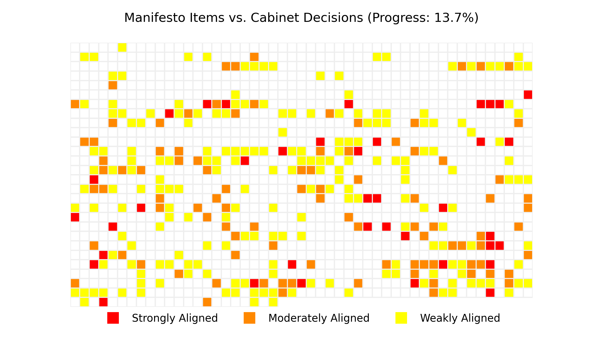

# 🇱🇰 Manifesto Monitoring

This repository contains utility libraries & tools for tracking, analyzing, & visualizing the implementation of the 2024 NPP manifesto — now the **de facto policy framework** of the 🇱🇰 Sri Lankan Government (2025).

🛠️ Built for researchers, developers, journalists, & citizens who want **accountability & transparency** in governance.

🔍 Use this repo to:

- Track progress on key promises
- Analyze policy implementation
- Build visual dashboards & reports

📢 Public Data. Share. Fork. Contribute.

## 🤖 AI Comparison of  1,345 NPP Manifesto Promises & 421 NPP Cabinet Decisions

This section compares the NPP manifesto promises with Cabinet Decisions, using OpenAI's [text-embedding-3-small](https://platform.openai.com/docs/models/text-embedding-3-small) Model.

Group | Threshold | Description
:-- | --: | --:
🔴 High | 70% | Strongly Aligned
🟠 Medium | 60% | Moderately Aligned
🟢 Low | 50% | Weakly Aligned

### Summary

l1 | l1_topic | n | 🔴 High | 🟠 Medium | 🟢 Low
--: | :-- | --: | --: | --: | --:
1 | A fulfilling life - A comfortable country | 337 | - | 4 (1%) | 37 (11%)
2 | An honourable life - A safer country | 181 | - | 5 (3%) | 37 (20%)
3 | A modern life - A wealthy nation | 605 | - | 17 (3%) | 134 (22%)
4 | A dignified life - A strong country | 222 | - | 9 (4%) | 74 (33%)
all | all | 1345 | - | 35 (3%) | 282 (21%)

### Manifesto Items with Best Matching Cabinet Decisions

row | Manifesto | Cabinet Decision (Best Match) | Similarity
--: | :-- | --: | --:
1 | `4.03.A03.01` **Attorney General’s Department**  Introducing a Directorate of Public Prosecution (DPP) as a mechanism to eliminate delays within the judicial system and establishing a main DPP office and sub offices in the provinces which will remain independent of the Attorney General’s Department to conduct cases on behalf of the government. | [2025-05-07-002](https://www.cabinetoffice.gov.lk/cab/index.php?option=com_content&view=article&id=16&Itemid=49&lang=en&dID=13153) **Establishment of the Office of Public Prosecutor** | 🟠 69%
2 | `3.10.A01.16` **NO-TITLE**  Either upgrading / repairing the Sapugaskanda oil refinery or conducting feasibility studies to build a new refinery | [2025-02-09-004](https://www.cabinetoffice.gov.lk/cab/index.php?option=com_content&view=article&id=16&Itemid=49&lang=en&dID=13027) **Developing and Expanding the Sapugaskanda Oil Refining Complex** | 🟠 69%
3 | `2.01.A01.02` **Social protection and Welfare Programmes Prajashakthi: Poverty alleviation programme for low-income earners**  Introduction of a participatory, transparent and efficient beneficiary selection process | [2025-02-24-007](https://www.cabinetoffice.gov.lk/cab/index.php?option=com_content&view=article&id=16&Itemid=49&lang=en&dID=13055) **Implementation of the “Praja Shakthi” programme as an Integrated programme including multiple approaches to alleviate poverty** | 🟠 69%
4 | `3.01.A01.05` **Macroeconomic Stabilization Fiscal Policy:**  Integrate the operations of the Excise Department, Sri Lanka Customs, Department of Motor Traffic, and Land Registry Office with the Inland Revenue Department to ensure tax efficiency and fairness. | [2025-05-26-021](https://www.cabinetoffice.gov.lk/cab/index.php?option=com_content&view=article&id=16&Itemid=49&lang=en&dID=13193) **Establishment of the Revenue Administration Reform and Modernization Bureau** | 🟠 69%
5 | `3.08.A05.12` **Micro, small, and medium-scale industries**  Modernize the Sapugaskanda Refinery to meet domestic demand and capture a significant share of the foreign market for refined oil and related products. | [2025-02-09-004](https://www.cabinetoffice.gov.lk/cab/index.php?option=com_content&view=article&id=16&Itemid=49&lang=en&dID=13027) **Developing and Expanding the Sapugaskanda Oil Refining Complex** | 🟠 68%
6 | `2.01.A01.03` **Social protection and Welfare Programmes Prajashakthi: Poverty alleviation programme for low-income earners**  Introducing a digital platform for identifying eligible beneficiaries using new criteria within a year and providing financial assistance to all qualifying individuals. | [2025-02-24-007](https://www.cabinetoffice.gov.lk/cab/index.php?option=com_content&view=article&id=16&Itemid=49&lang=en&dID=13055) **Implementation of the “Praja Shakthi” programme as an Integrated programme including multiple approaches to alleviate poverty** | 🟠 68%
7 | `2.01.A01.01` **Social protection and Welfare Programmes Prajashakthi: Poverty alleviation programme for low-income earners**  Providing a minimum monthly financial grant from Rs. 10,000 upwards to low- income families | [2025-02-24-007](https://www.cabinetoffice.gov.lk/cab/index.php?option=com_content&view=article&id=16&Itemid=49&lang=en&dID=13055) **Implementation of the “Praja Shakthi” programme as an Integrated programme including multiple approaches to alleviate poverty** | 🟠 67%
8 | `3.11.A06.01` **Roads**  Identification of rural and estate roads in need of immediate repair, preparation of a priority list, and the repairing and sustainable maintenance of the roads according to a prioritised program . | [2025-02-09-007](https://www.cabinetoffice.gov.lk/cab/index.php?option=com_content&view=article&id=16&Itemid=49&lang=en&dID=13030) **Rehabilitation and Improvement of Rural Roads in the Northern and Eastern Provinces in Sri Lanka** | 🟠 66%
9 | `3.04.A02.05` **Seawater fisheries**  Provide a fuel subsidy to the fishing community in order to uplift the collapsed fisheries by reducing the production cost. | [2024-10-14-012](https://www.cabinetoffice.gov.lk/cab/index.php?option=com_content&view=article&id=16&Itemid=49&lang=en&dID=12857) **Programme for the revival of the fishery sector by mitigating the impact caused to the fishery industry due to the economic crisis** | 🟠 65%
10 | `4.07.A09.08` **Economic Diplomacy**  Developing Sri Lanka as a critical service provider to international trade. Bilateral and multilateral trade agreements with main trade partners to promote the Sri Lankan economy. Remaining trade agreements will be analysed and upgraded according to achieve the stipulated targets with the consent of the other signing partners. | [2025-03-24-002](https://www.cabinetoffice.gov.lk/cab/index.php?option=com_content&view=article&id=16&Itemid=49&lang=en&dID=13093) **ASEAN Sectoral Dialogue Partnership (SDP)** | 🟠 64%
11 | `1.08.A01.02` **NO-TITLE**  Amending the 2024 No. 09 Online Safety Act by removing restrictions on freedom of expression. | [2025-05-26-020](https://www.cabinetoffice.gov.lk/cab/index.php?option=com_content&view=article&id=16&Itemid=49&lang=en&dID=13192) **Amendment to the Online Safety Act No.9 of 2024** | 🟠 64%
12 | `2.07.A06.07` **Public Services and Community Support**  Recognize sign language as the language of communication for persons with hearing impairments. | [2025-06-02-018](https://www.cabinetoffice.gov.lk/cab/index.php?option=com_content&view=article&id=16&Itemid=49&lang=en&dID=13211) **Sign Language Bill** | 🟠 63%
13 | `3.13.A06.07` **Broadcasting industry**  Improving and promoting the necessary technical infrastructure to broadcast programs that include entertainment and education. | [2025-06-09-008](https://www.cabinetoffice.gov.lk/cab/index.php?option=com_content&view=article&id=16&Itemid=49&lang=en&dID=13223) **Improving and maintaining the broadcasting activities of the Independent Television Network** | 🟠 63%
14 | `3.14.A01.01` **Land utilization**  A new legal framework and land act that makes effective land administration and management | [2025-01-27-009](https://www.cabinetoffice.gov.lk/cab/index.php?option=com_content&view=article&id=16&Itemid=49&lang=en&dID=13009) **Drafting of the Land Use Policy Planning Department Act** | 🟠 63%
15 | `4.07.A12.01` **Cultural Diplomacy**  Establishing Sri Lanka Directorate of Cultural Relations under the Ministry of Foreign Affairs. | [2025-04-01-008](https://www.cabinetoffice.gov.lk/cab/index.php?option=com_content&view=article&id=16&Itemid=49&lang=en&dID=13110) **Appointment to the Post of Director of the Department of Cultural      Affairs** | 🟠 63%
16 | `4.01.A02.06` **Civil and Political Rights as basic rights**  Abolishing the pensions and special privileges given to retired presidents and their families | [2025-06-16-018](https://www.cabinetoffice.gov.lk/cab/index.php?option=com_content&view=article&id=16&Itemid=49&lang=en&dID=13248) **Repealing of the Presidents' Entitlements Act, No.4 of 1986 and the Parliamentary Pensions Law, No.1 of 1977** | 🟠 63%
17 | `4.02.A01.13` **NO-TITLE**  Revising necessary rules and regulations for appointments and promotions of officers to all types of services in the government service within a particular time frame | [2025-02-03-004](https://www.cabinetoffice.gov.lk/cab/index.php?option=com_content&view=article&id=16&Itemid=49&lang=en&dID=13013) **Reviewing and simplifying the rules and regulations pertaining to the public service** | 🟠 63%
18 | `3.09.A02.05` **Gems and jewellery**  Amendments needed for the Gem and Jewelry Authority Act, aiming for the sustainable development of the mining industry and gem industry. | [2025-04-28-005](https://www.cabinetoffice.gov.lk/cab/index.php?option=com_content&view=article&id=16&Itemid=49&lang=en&dID=13142) **Amendment of Acts falling under the purview of the institutions under the Ministry of Industry and Entrepreneurship Development** | 🟠 63%
19 | `4.08.A01.21` **NO-TITLE**  Establishing a mechanism to ensure and formalize that all investigations take place independently and apolitically to ensure national protection by using modern methods sufficient to prevent any crime that takes place against the citizenry, where Sri Lanka Police receives professionalism, pride, and respect. | [2024-12-30-016](https://www.cabinetoffice.gov.lk/cab/index.php?option=com_content&view=article&id=16&Itemid=49&lang=en&dID=12972) **Establishment of Investigation Units in Ministries to ensure the accountability of Public Institutions to the General Public** | 🟠 63%
20 | `4.09.A01.02` **NO-TITLE**  Provincial councils and local government elections, which are currently postponed indefinitely, will be held within a year to provide an opportunity for the people to join the governance. | [2024-12-02-008](https://www.cabinetoffice.gov.lk/cab/index.php?option=com_content&view=article&id=16&Itemid=49&lang=en&dID=12906) **Making provisions for recalling nominations and for calling fresh nominations for the Local Authorities Election which was due to be held in the year 2023** | 🟠 62%
21 | `3.01.A01.16` **Macroeconomic Stabilization Fiscal Policy:**  Establish a single window service by integrating other state institutions with Sri Lanka Customs to streamline import/export operations. | [2025-05-26-021](https://www.cabinetoffice.gov.lk/cab/index.php?option=com_content&view=article&id=16&Itemid=49&lang=en&dID=13193) **Establishment of the Revenue Administration Reform and Modernization Bureau** | 🟠 62%
22 | `2.01.A03.07` **A healthy and happy retirement for senior c itizens**  An interest rate that is 5% higher than the normal bank rate(s) for senior citizens’ fixed deposits. A Meaningful and Satisfactory Life for Persons with Disabilities | [2025-06-16-019](https://www.cabinetoffice.gov.lk/cab/index.php?option=com_content&view=article&id=16&Itemid=49&lang=en&dID=13249) **The Special Fixed Deposit Scheme for Senior Citizens** | 🟠 62%
23 | `1.07.A11.01` **Sustainable Solid Waste Management**  Updating legal frameworks and improving infrastructure for waste management in residential, agricultural, industrial and service sectors, based on zero waste 3R (Reduce, Reuse, Recycle) principles and circular economic concept | [2024-12-23-006](https://www.cabinetoffice.gov.lk/cab/index.php?option=com_content&view=article&id=16&Itemid=49&lang=en&dID=12949) **Fulfilling the responsibility of Local Authorities in creating a circular economy by streamlining their solid waste management activities** | 🟠 62%
24 | `3.01.A05.01` **Investment Promotion**  Establish a single empowered institution by integrating existing state institutions including the Board of Investment of Sri Lanka that coordinate and promote investments. | [2025-05-26-001](https://www.cabinetoffice.gov.lk/cab/index.php?option=com_content&view=article&id=16&Itemid=49&lang=en&dID=13173) **Appointment of a Technical Evaluation Committee for evaluation of Project Proposals submitted to the National Initiative for Research and Development Commercialization** | 🟠 62%
25 | `3.01.A05.09` **Investment Promotion**  Introduce investment schemes with special benefits for Sri Lankan expatriates to invest their earnings. | [2025-02-09-002](https://www.cabinetoffice.gov.lk/cab/index.php?option=com_content&view=article&id=16&Itemid=49&lang=en&dID=13025) **Proposed Agreement on Promotion and Reciprocal Protection of Investments between Sri Lanka and the United Arab Emirates** | 🟠 61%
26 | `3.01.A01.19` **Macroeconomic Stabilization Fiscal Policy:**  Decentralize Sri Lanka Customs operations to provide more efficient and cost- effective services. | [2025-05-26-021](https://www.cabinetoffice.gov.lk/cab/index.php?option=com_content&view=article&id=16&Itemid=49&lang=en&dID=13193) **Establishment of the Revenue Administration Reform and Modernization Bureau** | 🟠 61%
27 | `4.03.A02.05` **Bribery and corruption**  Investigate complaints received by the Anti-Corruption Commission within six (06) months or submit a report to Parliament every six (06) months on complaints that are not dealt with. | [2024-12-30-015](https://www.cabinetoffice.gov.lk/cab/index.php?option=com_content&view=article&id=16&Itemid=49&lang=en&dID=12971) **Amendment to the Anti-Corruption Act, No.9 of 2023** | 🟠 61%
28 | `1.07.A08.01` **Wetlands**  Identification and documentation of wetlands in Sri Lanka and taking necessary steps for their conservation. | [2024-12-09-005](https://www.cabinetoffice.gov.lk/cab/index.php?option=com_content&view=article&id=16&Itemid=49&lang=en&dID=12917) **Resolution to be submitted to the Conference of Parties of the International Convention on Wetlands (Ramsar) by Sri Lanka** | 🟠 61%
29 | `1.07.A11.03` **Sustainable Solid Waste Management**  Make it mandatory to adopt a waste management programs for residential, high- rise, service, and industrial buildings/ sector developments | [2024-12-23-006](https://www.cabinetoffice.gov.lk/cab/index.php?option=com_content&view=article&id=16&Itemid=49&lang=en&dID=12949) **Fulfilling the responsibility of Local Authorities in creating a circular economy by streamlining their solid waste management activities** | 🟠 61%
30 | `4.07.A09.03` **Economic Diplomacy**  Analyzing and promoting Sri Lankan trade, tourism, and investment, as the country aims to become a hub of the Indian Ocean, it seeks synergies with international partners and friends as it moves towards shared aspirations. | [2025-03-24-002](https://www.cabinetoffice.gov.lk/cab/index.php?option=com_content&view=article&id=16&Itemid=49&lang=en&dID=13093) **ASEAN Sectoral Dialogue Partnership (SDP)** | 🟠 61%
31 | `3.02.A01.06` **National food security**  Establishing storage, cold storage, and processing units for agricultural products as public-private-people partnership projects. | [2024-12-09-001](https://www.cabinetoffice.gov.lk/cab/index.php?option=com_content&view=article&id=16&Itemid=49&lang=en&dID=12913) **Establishment of the Food Policy and Security Committee** | 🟠 61%
32 | `3.11.A09.02` **Using water ways for goods and passenger transport**  Passenger and goods transportation services implementation in waterways identified through feasibility studies | [2025-04-21-001](https://www.cabinetoffice.gov.lk/cab/index.php?option=com_content&view=article&id=16&Itemid=49&lang=en&dID=13129) **Promoting tourism and passenger transportation activities using 	waterways under Public-Private Partnership** | 🟠 60%
33 | `3.10.A01.18` **NO-TITLE**  The agreements that have been entered into so far will be re-examined, and a business model will be formulated to make the twenty-four (24) tanks owned by the Petroleum Corporation and the sixty-one (61) tanks owned by partnering companies beneficial to the national economy | [2025-03-03-004](https://www.cabinetoffice.gov.lk/cab/index.php?option=com_content&view=article&id=16&Itemid=49&lang=en&dID=13063) **Development of twenty-four (24) Nos. of Tanks in the Trincomalee Upper Tank Farm** | 🟠 60%
34 | `3.08.A05.02` **Micro, small, and medium-scale industries**  Implement a collateral-free loan scheme of up to Rs. 10 million, contingent on feasibility and credit score, through the financial sector to provide crucial financial support to micro, small, and medium-scale entrepreneurs. | [2024-12-30-005](https://www.cabinetoffice.gov.lk/cab/index.php?option=com_content&view=article&id=16&Itemid=49&lang=en&dID=12961) **Implementation of the Pledge Loan Scheme carried out previously for the purchase of paddy, as an Annual Programme from the Maha Season - 2024/25** | 🟠 60%
35 | `3.13.A06.08` **Broadcasting industry**  Identifying the terrestrial TV network as the efficient medium for educational services and developing the required technical infrastructure. | [2025-06-09-008](https://www.cabinetoffice.gov.lk/cab/index.php?option=com_content&view=article&id=16&Itemid=49&lang=en&dID=13223) **Improving and maintaining the broadcasting activities of the Independent Television Network** | 🟠 60%
36 | `4.04.A01.13` **NO-TITLE**  Raising the salaries and allowances of the police service in proportion to other public servants | [2025-03-24-011](https://www.cabinetoffice.gov.lk/cab/index.php?option=com_content&view=article&id=16&Itemid=49&lang=en&dID=13102) **Revision of Salaries of the Public Service - 2025** | 🟢 60%
37 | `4.07.A09.06` **Economic Diplomacy**  Modern and comprehensive investment law shall be enacted to improve the business environment for the foreign and local private sector, including, streamlining business procedures, investing in infrastructure, improving access to finance for Small and medium-sized enterprises - SMEs, and raising skilled and quality of human resources. | [2025-04-21-009](https://www.cabinetoffice.gov.lk/cab/index.php?option=com_content&view=article&id=16&Itemid=49&lang=en&dID=13137) **Establishment of the Cabinet Appointed Special Committee on Economic Management** | 🟢 60%
38 | `4.03.A02.02` **Bribery and corruption**  Facilitate the Director General of the Bribery Commission with necessary authority to give effect to the International Convention on the Prevention of Corruption and Coordinating the Recovery of Stolen Assets. | [2025-04-21-007](https://www.cabinetoffice.gov.lk/cab/index.php?option=com_content&view=article&id=16&Itemid=49&lang=en&dID=13135) **Regulations under the provisions of the Anti-Corruption Act, No.9 of 2023** | 🟢 60%
39 | `3.06.A04.02` **Environment, land, water, air, and mineral resources**  Strengthening research and development to characterise Sri Lanka’s biodiversity ‘hot spots’ that need protection. This includes catchment and vegetation mapping and categorizing habitats based on Land use threats. | [2025-06-16-007](https://www.cabinetoffice.gov.lk/cab/index.php?option=com_content&view=article&id=16&Itemid=49&lang=en&dID=13237) **The programme to protect the boundaries and conservation areas of selected major tanks** | 🟢 60%
40 | `3.02.A07.05` **Empowering Farmers**  Providing loan schemes up to Rs. 1 million per hectare for cultivating high- yielding varieties of semi perennial or perennial crops with micro-irrigation. | [2024-12-30-005](https://www.cabinetoffice.gov.lk/cab/index.php?option=com_content&view=article&id=16&Itemid=49&lang=en&dID=12961) **Implementation of the Pledge Loan Scheme carried out previously for the purchase of paddy, as an Annual Programme from the Maha Season - 2024/25** | 🟢 59%
41 | `3.13.A06.03` **Broadcasting industry**  Integrating state-owned radio and television institutes into a consolidated single institute/company in a way that their identities are protected | [2025-06-09-001](https://www.cabinetoffice.gov.lk/cab/index.php?option=com_content&view=article&id=16&Itemid=49&lang=en&dID=13216) **Operating the Sri Lanka Broadcasting Corporation and the Sri Lanka Rupavahini Corporation as separate public enterprises with their own distinct identities** | 🟢 59%
42 | `3.01.A08.04` **Foreign Trade**  Transform Sri Lanka into a maritime service hub that provides naval services including maritime security, fuel, and food. | [2025-04-21-001](https://www.cabinetoffice.gov.lk/cab/index.php?option=com_content&view=article&id=16&Itemid=49&lang=en&dID=13129) **Promoting tourism and passenger transportation activities using 	waterways under Public-Private Partnership** | 🟢 59%
43 | `4.07.A13.05` **Science and Technology Diplomacy**  Encouraging multinational IT companies to invest in Sri Lanka to leverage it as the Digital Gateway to Asia. Appoint dedicated representatives to multilateral agencies like UNESCAP . | [2024-12-18-003](https://www.cabinetoffice.gov.lk/cab/index.php?option=com_content&view=article&id=16&Itemid=49&lang=en&dID=12931) **Memorandum of Understanding (MoU) between the Government of India (GoI) and the Government of Sri Lanka (GoSL) on Cooperation in the field of sharing successful Digital Solutions for Digital Transformation** | 🟢 59%
44 | `4.03.A01.01` **Judicial Process**  Appointing a committee of legal experts to review the existing laws and update the laws as necessary. | [2025-06-02-014](https://www.cabinetoffice.gov.lk/cab/index.php?option=com_content&view=article&id=16&Itemid=49&lang=en&dID=13207) **Appointment of a committee to review the drafted Employment Bill** | 🟢 59%
45 | `4.07.A09.07` **Economic Diplomacy**  Improving access to other markets through new trade agreements and linking Sri Lanka to global production networks to increase exports. | [2025-04-28-011](https://www.cabinetoffice.gov.lk/cab/index.php?option=com_content&view=article&id=16&Itemid=49&lang=en&dID=13148) **Signing of a Memorandum of Understanding between the the Viet Nam Trade Promotion Agency and the Sri Lanka Export Development Board** | 🟢 59%
46 | `1.07.A11.02` **Sustainable Solid Waste Management**  Preparation and Implementation of a National Solid Waste Management Action plan, reviewing the current solid waste management plans and related policies | [2024-12-23-006](https://www.cabinetoffice.gov.lk/cab/index.php?option=com_content&view=article&id=16&Itemid=49&lang=en&dID=12949) **Fulfilling the responsibility of Local Authorities in creating a circular economy by streamlining their solid waste management activities** | 🟢 59%
47 | `4.07.A19.03` **Lanka including on the bonds for development projects Current Foreign Policy Stances**  We shall follow and implement to eliminate the threat of Terrorism, separatism and Extremism. | [2025-05-26-011](https://www.cabinetoffice.gov.lk/cab/index.php?option=com_content&view=article&id=16&Itemid=49&lang=en&dID=13183) **Introducing an effective legal framework for Countering Foreign 	Terrorist Fighters** | 🟢 59%
48 | `3.10.A01.21` **NO-TITLE**  Taking action to quickly enter excavation and new exploration agreements to extract fossil fuel including natural gas that has been identified through explorations so far at the Mannar and Kaveri basin | [2025-05-07-007](https://www.cabinetoffice.gov.lk/cab/index.php?option=com_content&view=article&id=16&Itemid=49&lang=en&dID=13158) **Calling for investment proposals for exploration and production of petroleum and natural gas in four (04) blocks 	within the Mannar Basin and obtaining the service of a Marketing Consultant** | 🟢 59%
49 | `1.02.A12.02` **Provision of essential Drugs**  Expand local pharmaceutical production. | [2024-12-02-003](https://www.cabinetoffice.gov.lk/cab/index.php?option=com_content&view=article&id=16&Itemid=49&lang=en&dID=12901) **Procurement of Essential Medical Supplies from the State Pharmaceuticals Manufacturing Corporation and Local Manufactures** | 🟢 59%
50 | `3.11.A02.01` **Bus passenger service**  Introducing buses manufactured specifically for passenger transport, and providing an easy financial scheme to procure such buses | [2025-06-02-009](https://www.cabinetoffice.gov.lk/cab/index.php?option=com_content&view=article&id=16&Itemid=49&lang=en&dID=13202) **Establishment of a Metro Bus Unit for Urban Transportation** | 🟢 59%
51 | `3.13.A06.06` **Broadcasting industry**  Allocating annual budget for mass communication in each ministry to the institutions maintained as PSB. | [2025-06-09-008](https://www.cabinetoffice.gov.lk/cab/index.php?option=com_content&view=article&id=16&Itemid=49&lang=en&dID=13223) **Improving and maintaining the broadcasting activities of the Independent Television Network** | 🟢 59%
52 | `3.11.A11.02` **Minimising road accidents**  Systematising the process of issuing and renewing of driving licenses | [2024-12-09-008](https://www.cabinetoffice.gov.lk/cab/index.php?option=com_content&view=article&id=16&Itemid=49&lang=en&dID=12920) **Issuance of a New Digital Driving License** | 🟢 59%
53 | `3.03.A02.03` **Dairy Sector**  Establishing 7,500 dairy farms to empower low-income women. | [2025-05-26-009](https://www.cabinetoffice.gov.lk/cab/index.php?option=com_content&view=article&id=16&Itemid=49&lang=en&dID=13181) **Project for organizing and empowering dairy farmers to enhance 	their productivity and improve the Dairy Value Chain** | 🟢 58%
54 | `1.07.A08.02` **Wetlands**  Ensure conservation of existing and future Ramsar wetlands and enhance tourist attractions of them. Restoration of degraded wetlands through multi-stakeholder engagement and community participation. | [2024-12-09-005](https://www.cabinetoffice.gov.lk/cab/index.php?option=com_content&view=article&id=16&Itemid=49&lang=en&dID=12917) **Resolution to be submitted to the Conference of Parties of the International Convention on Wetlands (Ramsar) by Sri Lanka** | 🟢 58%
55 | `2.02.A02.04` **Unemployed graduates:**  Another 3,000 to the Inland Revenue Department, Customs Department, Foreign Service, and tourism industry. | [2025-04-07-014](https://www.cabinetoffice.gov.lk/cab/index.php?option=com_content&view=article&id=16&Itemid=49&lang=en&dID=13127) **Recruitment of 30,000 graduates and youths to fill in essential vacancies in the Public Service** | 🟢 58%
56 | `3.08.A08.04` **Digitalisation and technical usage**  Foster the adoption and integration of Industry 4.0 technologies among Sri Lankan industrial entrepreneurs, enhancing their capacity for digital transformation. | [2025-06-02-002](https://www.cabinetoffice.gov.lk/cab/index.php?option=com_content&view=article&id=16&Itemid=49&lang=en&dID=13195) **Establishment of a Task Force on Digital Transformation of Education** | 🟢 58%
57 | `3.01.A06.01` **State-Owned Enterprises (SOEs):**  Take appropriate strategic decisions on each institution based on its strategic importance, potential for economic growth, capability to stimulate the production economy, impact on financial stability, and relevance to national security. | [2024-12-18-002](https://www.cabinetoffice.gov.lk/cab/index.php?option=com_content&view=article&id=16&Itemid=49&lang=en&dID=12930) **Review on State-Owned Non-commercial Entities** | 🟢 58%
58 | `3.10.A01.04` **NO-TITLE**  Adding 2,000 MW gradually into the national supply using solar power | [2025-04-28-012](https://www.cabinetoffice.gov.lk/cab/index.php?option=com_content&view=article&id=16&Itemid=49&lang=en&dID=13149) **Procurement of 152 MW electricity from Ground-mounted Solar PV Plants under International Competitive Bidding** | 🟢 58%
59 | `3.11.A09.01` **Using water ways for goods and passenger transport**  A technical unit to research and advise on promotion of waterway transportation | [2025-04-21-001](https://www.cabinetoffice.gov.lk/cab/index.php?option=com_content&view=article&id=16&Itemid=49&lang=en&dID=13129) **Promoting tourism and passenger transportation activities using 	waterways under Public-Private Partnership** | 🟢 58%
60 | `4.03.A02.04` **Bribery and corruption**  Establishment of Anti-Corruption Commission office in every district. | [2025-03-24-001](https://www.cabinetoffice.gov.lk/cab/index.php?option=com_content&view=article&id=16&Itemid=49&lang=en&dID=13092) **National Anti-Corruption Action Plan 2025 - 2029** | 🟢 58%
61 | `3.02.A10.01` **Effective Management and Control of Agricultural Operations**  Establishing a national agricultural development council with representatives from all relevant state institutions, private sectors, and universities | [2024-12-09-001](https://www.cabinetoffice.gov.lk/cab/index.php?option=com_content&view=article&id=16&Itemid=49&lang=en&dID=12913) **Establishment of the Food Policy and Security Committee** | 🟢 58%
62 | `3.06.A01.02` **Agriculture, fisheries, livesto ck, and food security**  Enhancing crop resilience to climate change, improving the sustainability and economic potential of main crops, optimizing food preservation for greater economic benefits, and creating value-added products. | [2025-02-03-002](https://www.cabinetoffice.gov.lk/cab/index.php?option=com_content&view=article&id=16&Itemid=49&lang=en&dID=13011) **Integrated Rurban Development and Climate Resilience Project** | 🟢 58%
63 | `3.10.A01.01` **NO-TITLE**  Directing the currently oil-based electricity generation towards low-cost renewable solar and wind sources while implementing competitive procurement and price-calling to make Sri Lanka a country in the region with the lowest electricity bill. | [2025-04-28-012](https://www.cabinetoffice.gov.lk/cab/index.php?option=com_content&view=article&id=16&Itemid=49&lang=en&dID=13149) **Procurement of 152 MW electricity from Ground-mounted Solar PV Plants under International Competitive Bidding** | 🟢 58%
64 | `4.07.A12.03` **Cultural Diplomacy**  Recognizing proper mutual understanding between the peoples of Sri Lanka and other nations is an essential prerequisite for conducting diplomacy. Strengthening international cultural exchanges contributes to building international relations of peace and stability by heightening mutual understanding among nations and creating a more decadent cultural climate. | [2025-03-03-008](https://www.cabinetoffice.gov.lk/cab/index.php?option=com_content&view=article&id=16&Itemid=49&lang=en&dID=13067) **Ratification of UNESCO (2005) Convention on the Protection and Promotion of the Diversity of Cultural Expressions by Sri Lanka** | 🟢 58%
65 | `4.03.A01.09` **Judicial Process**  To introduce mechanisms to prioritize and expedite the disposal of cases related to sexual offences committed against minors and women and bring justice to the victims. | [2025-05-07-002](https://www.cabinetoffice.gov.lk/cab/index.php?option=com_content&view=article&id=16&Itemid=49&lang=en&dID=13153) **Establishment of the Office of Public Prosecutor** | 🟢 58%
66 | `4.01.A02.11` **Civil and Political Rights as basic rights**  Abolishing the pension offered to MPs after 05 years | [2025-06-16-018](https://www.cabinetoffice.gov.lk/cab/index.php?option=com_content&view=article&id=16&Itemid=49&lang=en&dID=13248) **Repealing of the Presidents' Entitlements Act, No.4 of 1986 and the Parliamentary Pensions Law, No.1 of 1977** | 🟢 58%
67 | `2.04.A01.07` **NO-TITLE**  Streamlining coordination between the National Child Protection Authority and agencies such as Probation and Child Protection Services and capacity building of those agencies. | [2025-05-26-006](https://www.cabinetoffice.gov.lk/cab/index.php?option=com_content&view=article&id=16&Itemid=49&lang=en&dID=13178) **Establishing a multi-sectoral mechanism with an integrated approach to protect children from abuse** | 🟢 58%
68 | `3.14.A01.03` **Land utilization**  A National Land Council to coordinate and oversee land management | [2025-01-27-009](https://www.cabinetoffice.gov.lk/cab/index.php?option=com_content&view=article&id=16&Itemid=49&lang=en&dID=13009) **Drafting of the Land Use Policy Planning Department Act** | 🟢 57%
69 | `3.01.A01.07` **Macroeconomic Stabilization Fiscal Policy:**  Increase the annual tax threshold for individual income tax from Rs. 1.2 million to Rs. 2.4 million and revise the tax rates and tax brackets on a fair basis. | [2025-05-19-007](https://www.cabinetoffice.gov.lk/cab/index.php?option=com_content&view=article&id=16&Itemid=49&lang=en&dID=13172) **Amendments to the Inland Revenue Act, No.24 of 2017** | 🟢 57%
70 | `3.01.A05.08` **Investment Promotion**  Promote long-term foreign investments in public-private-people partnerships (PPPP) by prioritizing strategically important sectors. | [2025-06-02-001](https://www.cabinetoffice.gov.lk/cab/index.php?option=com_content&view=article&id=16&Itemid=49&lang=en&dID=13194) **Establishment of a New Unit for Public - Private Partnership** | 🟢 57%
71 | `3.13.A06.04` **Broadcasting industry**  Operating the National Channel (CH-01) and Nethra Channel (CH-02) within the Public Services Broadcast (PSB) domains, while transitioning Channel EYE (CH-03) to the commercial domain. | [2025-06-09-008](https://www.cabinetoffice.gov.lk/cab/index.php?option=com_content&view=article&id=16&Itemid=49&lang=en&dID=13223) **Improving and maintaining the broadcasting activities of the Independent Television Network** | 🟢 57%
72 | `1.07.A11.06` **Sustainable Solid Waste Management**  Developing infrastructure for adopting modern final waste disposal methods like sanitary landfills, waste-to-energy and resource recovery facilities | [2024-12-23-006](https://www.cabinetoffice.gov.lk/cab/index.php?option=com_content&view=article&id=16&Itemid=49&lang=en&dID=12949) **Fulfilling the responsibility of Local Authorities in creating a circular economy by streamlining their solid waste management activities** | 🟢 57%
73 | `3.10.A01.23` **NO-TITLE**  Taking action to update the sections regarding weak and short-term environmental goals, as a mark of Sri Lanka’s commitment towards the UN conventions on climate change that aim towards zero emissions by 2050 | [2024-12-30-004](https://www.cabinetoffice.gov.lk/cab/index.php?option=com_content&view=article&id=16&Itemid=49&lang=en&dID=12960) **Submission of the First Biennial Transparency Report of Sri Lanka to the 	United Nations Framework Convention on Climate Change** | 🟢 57%
74 | `3.02.A08.02` **Management of Climate Risks:**  Establishment of an improved weather forecasting system to guide cultivation and water management. | [2025-06-16-006](https://www.cabinetoffice.gov.lk/cab/index.php?option=com_content&view=article&id=16&Itemid=49&lang=en&dID=13236) **Modernization of the services of the Department of Meteorology under the Climate Resilience Multi-Phase Programmatic Approach (CResMPA)** | 🟢 57%
75 | `3.01.A08.12` **Foreign Trade**  Promote and provide necessary facilities for value-added re-exports and entrepot trading activities without damaging the brand identity and the good image of Sri Lanka. | [2025-04-28-011](https://www.cabinetoffice.gov.lk/cab/index.php?option=com_content&view=article&id=16&Itemid=49&lang=en&dID=13148) **Signing of a Memorandum of Understanding between the the Viet Nam Trade Promotion Agency and the Sri Lanka Export Development Board** | 🟢 57%
76 | `4.07.A10.05` **National Security**  Attract and manage foreign investments without hindering Sri Lanka’s national security and economic interests. | [2025-02-09-002](https://www.cabinetoffice.gov.lk/cab/index.php?option=com_content&view=article&id=16&Itemid=49&lang=en&dID=13025) **Proposed Agreement on Promotion and Reciprocal Protection of Investments between Sri Lanka and the United Arab Emirates** | 🟢 57%
77 | `3.04.A09.02` **Uplifting export potential and earning foreign exchange**  Promote exports and promoting the market by collaborating with relevant institutes, including Sri Lanka Export Development Board and Embassies. | [2025-04-28-011](https://www.cabinetoffice.gov.lk/cab/index.php?option=com_content&view=article&id=16&Itemid=49&lang=en&dID=13148) **Signing of a Memorandum of Understanding between the the Viet Nam Trade Promotion Agency and the Sri Lanka Export Development Board** | 🟢 57%
78 | `3.01.A05.05` **Investment Promotion**  Take measures to raise Sri Lanka’s ranking in the Global Competitive Index (GCI) to attract investors. | [2025-02-09-002](https://www.cabinetoffice.gov.lk/cab/index.php?option=com_content&view=article&id=16&Itemid=49&lang=en&dID=13025) **Proposed Agreement on Promotion and Reciprocal Protection of Investments between Sri Lanka and the United Arab Emirates** | 🟢 57%
79 | `4.07.A08.05` **Political Diplomacy**  Exploring new opportunities and new global and regional platforms which can assist to achieve national interests of Sri Lanka, especially in economic sphere. | [2025-03-24-002](https://www.cabinetoffice.gov.lk/cab/index.php?option=com_content&view=article&id=16&Itemid=49&lang=en&dID=13093) **ASEAN Sectoral Dialogue Partnership (SDP)** | 🟢 57%
80 | `4.03.A02.09` **Bribery and corruption**  Re-visiting the cases withdrawn by the Bribery Commission and the Attorney General and resubmit appropriate cases. | [2024-12-30-015](https://www.cabinetoffice.gov.lk/cab/index.php?option=com_content&view=article&id=16&Itemid=49&lang=en&dID=12971) **Amendment to the Anti-Corruption Act, No.9 of 2023** | 🟢 57%
81 | `4.03.A02.08` **Bribery and corruption**  Establishment of a government-sponsored awareness campaign among the public about corruption, fraud and bribery and to empower the public against them. | [2025-03-24-001](https://www.cabinetoffice.gov.lk/cab/index.php?option=com_content&view=article&id=16&Itemid=49&lang=en&dID=13092) **National Anti-Corruption Action Plan 2025 - 2029** | 🟢 57%
82 | `3.08.A05.11` **Micro, small, and medium-scale industries**  Construct an international oil transmission and cargo storage terminal in Trincomalee following the refurbishment of existing oil terminals. | [2025-02-09-004](https://www.cabinetoffice.gov.lk/cab/index.php?option=com_content&view=article&id=16&Itemid=49&lang=en&dID=13027) **Developing and Expanding the Sapugaskanda Oil Refining Complex** | 🟢 57%
83 | `3.02.A01.01` **National food security**  State support for the local production of all possible food items within the country. | [2024-12-09-001](https://www.cabinetoffice.gov.lk/cab/index.php?option=com_content&view=article&id=16&Itemid=49&lang=en&dID=12913) **Establishment of the Food Policy and Security Committee** | 🟢 57%
84 | `4.07.A02.01` **Diplomatic Missions**  Rationalization of Sri Lanka Overseas Missions and Right Sizing of Missions. | [2024-10-07-007](https://www.cabinetoffice.gov.lk/cab/index.php?option=com_content&view=article&id=16&Itemid=49&lang=en&dID=12842) **Cancellation of Appointments made on the approval of the Cabinet of Ministers** | 🟢 57%
85 | `3.01.A03.01` **External Sector Stabilization:**  Introduce new savings and investment plans, including expatriate Bonds for Sri Lankans living abroad. | [2024-11-25-008](https://www.cabinetoffice.gov.lk/cab/index.php?option=com_content&view=article&id=16&Itemid=49&lang=en&dID=12898) **Implementation of the Restructuring of International Sovereign Bonds to restore Sovereign Debt Sustainability** | 🟢 57%
86 | `3.11.A06.03` **Roads**  Resolving the issues and the completion of construction of the presently stalled central expressway from Kadawatha to Meerigama. | [2025-06-09-005](https://www.cabinetoffice.gov.lk/cab/index.php?option=com_content&view=article&id=16&Itemid=49&lang=en&dID=13220) **Construction of Section IV (from Kurunegala to Dambulla) of the Central 	Expressway** | 🟢 57%
87 | `3.12.A04.01` **(MARPOL) and other environmental protection laws**  Enacting laws on nautical protection in Sri Lanka | [2025-02-24-004](https://www.cabinetoffice.gov.lk/cab/index.php?option=com_content&view=article&id=16&Itemid=49&lang=en&dID=13052) **Enacting laws to give effect to the Convention on the Suppression of Unlawful Acts relating to the International Civil Aviation (Beijing Convention, 2010), in Sri Lanka** | 🟢 57%
88 | `2.05.A01.03` **A Flourishing Youth**  Review the current competitive examination system for government employments and update the selection process. | [2025-04-07-014](https://www.cabinetoffice.gov.lk/cab/index.php?option=com_content&view=article&id=16&Itemid=49&lang=en&dID=13127) **Recruitment of 30,000 graduates and youths to fill in essential vacancies in the Public Service** | 🟢 57%
89 | `3.07.A02.02` **Sustainable usage of natural and cultural resources**  A land bank, including a mechanism for land use in the tourism sector, with the involvement of relevant stakeholders and the state, aimed at future tourism investments. Digital technology should be utilized for this purpose. | [2025-06-02-006](https://www.cabinetoffice.gov.lk/cab/index.php?option=com_content&view=article&id=16&Itemid=49&lang=en&dID=13199) **Providing underutilized lands/properties to suitable investors for optimal use** | 🟢 57%
90 | `3.04.A10.04` **Uplifting financial income surrounding fisheries harbours and developing fisheries harbours**  Expand ports and enhancing facilities in the Northern and Eastern provinces to promote trawler fisheries targeting residents. | [2025-06-02-011](https://www.cabinetoffice.gov.lk/cab/index.php?option=com_content&view=article&id=16&Itemid=49&lang=en&dID=13204) **Development of the Myliddy Fishery Harbour - Phase III** | 🟢 57%
91 | `3.10.A01.15` **NO-TITLE**  Introducing the developing SMR technology to Sri Lanka and entering MOUs with countries and institutions which are leaders in the field in order to develop the human and physical resources needed | [2024-12-23-001](https://www.cabinetoffice.gov.lk/cab/index.php?option=com_content&view=article&id=16&Itemid=49&lang=en&dID=12944) **Memorandum of Understanding on implementation of Multisectoral Grant Assistance between India and Sri Lanka** | 🟢 57%
92 | `3.07.A01.03` **Visionary leadership, strategic management, and holistic economic development**  Establishing the Sri Lanka Tourism Authority as the central institution for tourism development and promotion. | [2025-02-24-010](https://www.cabinetoffice.gov.lk/cab/index.php?option=com_content&view=article&id=16&Itemid=49&lang=en&dID=13058) **Establishment of the Gambling Regulatory Authority** | 🟢 57%
93 | `2.01.A08.01` **Safety: Adequate Care for Children**  Establishment of Childcare Centers at the Gramaniladari level with public and private partnerships based on needs and requests. | [2025-06-16-003](https://www.cabinetoffice.gov.lk/cab/index.php?option=com_content&view=article&id=16&Itemid=49&lang=en&dID=13233) **Programme for providing a cost of living allowance for children in institutional care or guardianship and street children** | 🟢 56%
94 | `4.07.A09.04` **Economic Diplomacy**  Opening up the domestic market within the National Economic Framework pursuing positive economic management and expanding economic cooperation with other countries. | [2025-04-21-009](https://www.cabinetoffice.gov.lk/cab/index.php?option=com_content&view=article&id=16&Itemid=49&lang=en&dID=13137) **Establishment of the Cabinet Appointed Special Committee on Economic Management** | 🟢 56%
95 | `4.03.A02.03` **Bribery and corruption**  Appointment of a permanent bench of three Judges of the High Court to streamline cases of financial crimes, bribery, and corruption. | [2024-12-30-015](https://www.cabinetoffice.gov.lk/cab/index.php?option=com_content&view=article&id=16&Itemid=49&lang=en&dID=12971) **Amendment to the Anti-Corruption Act, No.9 of 2023** | 🟢 56%
96 | `3.10.A01.32` **NO-TITLE**  Formulation and implementing a strategic plan to establish Sri Lanka as an | [2024-12-02-010](https://www.cabinetoffice.gov.lk/cab/index.php?option=com_content&view=article&id=16&Itemid=49&lang=en&dID=12908) **Implementation of the 'Clean Sri Lanka' Programme** | 🟢 56%
97 | `1.01.A12.17` **State University System**  Establish special units in every tertiary education institution to provide basic qualifications, including English language skills, required for obtaining post- graduate education in international universities and fostering relationships that will allow students to secure post-graduate opportunities through these units | [2025-01-27-003](https://www.cabinetoffice.gov.lk/cab/index.php?option=com_content&view=article&id=16&Itemid=49&lang=en&dID=13003) **Entering into Memoranda of Understanding between Sri Lankan Universities and Foreign Universities** | 🟢 56%
98 | `3.04.A10.03` **Uplifting financial income surrounding fisheries harbours and developing fisheries harbours**  Upgrade all major fisheries harbours to meet international standards based on a prioritization plan. | [2025-06-02-011](https://www.cabinetoffice.gov.lk/cab/index.php?option=com_content&view=article&id=16&Itemid=49&lang=en&dID=13204) **Development of the Myliddy Fishery Harbour - Phase III** | 🟢 56%
99 | `3.01.A02.08` **Monetary Policy:**  Strengthen the Financial Intelligence Unit (FIU) of the Central Bank of Sri Lanka through formalization of the coordination among state institutions. | [2025-05-26-021](https://www.cabinetoffice.gov.lk/cab/index.php?option=com_content&view=article&id=16&Itemid=49&lang=en&dID=13193) **Establishment of the Revenue Administration Reform and Modernization Bureau** | 🟢 56%
100 | `2.04.A01.01` **NO-TITLE**  R eviewing, amending, or repealing outdated laws such as the Children and Young Persons Ordinance, Adoption of Children Ordinance, Vagrants Ordinance, and Orphanages Ordinance. | [2025-02-03-004](https://www.cabinetoffice.gov.lk/cab/index.php?option=com_content&view=article&id=16&Itemid=49&lang=en&dID=13013) **Reviewing and simplifying the rules and regulations pertaining to the public service** | 🟢 56%
101 | `3.03.A02.02` **Dairy Sector**  Developing a large-scale dairy farm system to promote milk production. | [2025-05-26-009](https://www.cabinetoffice.gov.lk/cab/index.php?option=com_content&view=article&id=16&Itemid=49&lang=en&dID=13181) **Project for organizing and empowering dairy farmers to enhance 	their productivity and improve the Dairy Value Chain** | 🟢 56%
102 | `3.07.A05.05` **Strategic destination marketing**  A program will be developed to position Sri Lanka as an authentic, eco-friendly, and tourist-friendly destination. | [2024-12-02-010](https://www.cabinetoffice.gov.lk/cab/index.php?option=com_content&view=article&id=16&Itemid=49&lang=en&dID=12908) **Implementation of the 'Clean Sri Lanka' Programme** | 🟢 56%
103 | `3.07.A05.02` **Strategic destination marketing**  In collaboration with the Ministry of Foreign Affairs, the national airline, and state tourism institutions, a long-term global marketing campaign to promote Sri Lanka’s tourism industry will be established. | [2025-01-06-013](https://www.cabinetoffice.gov.lk/cab/index.php?option=com_content&view=article&id=16&Itemid=49&lang=en&dID=12985) **Signing of a Memorandum of Understanding (MoU) between China Media Group (CMG) and Sri Lanka Tourism Promotion Bureau** | 🟢 56%
104 | `4.08.A01.15` **NO-TITLE**  Strengthening and formalizing the laws to prevent corruption and financial crimes and other structure. | [2024-12-30-015](https://www.cabinetoffice.gov.lk/cab/index.php?option=com_content&view=article&id=16&Itemid=49&lang=en&dID=12971) **Amendment to the Anti-Corruption Act, No.9 of 2023** | 🟢 56%
105 | `4.07.A02.03` **Diplomatic Missions**  Appointing professional career diplomats, with a proven track record, to head Sri Lanka’s Missions. Appointing qualified officers for Foreign Service on merit basis with professional excellence, the highest standards of ethical conduct, and diplomatic discretion. | [2025-04-01-008](https://www.cabinetoffice.gov.lk/cab/index.php?option=com_content&view=article&id=16&Itemid=49&lang=en&dID=13110) **Appointment to the Post of Director of the Department of Cultural      Affairs** | 🟢 56%
106 | `2.07.A02.05` **Education**  Provide facilities for sign language interpreters in public and private institutions. | [2025-06-02-018](https://www.cabinetoffice.gov.lk/cab/index.php?option=com_content&view=article&id=16&Itemid=49&lang=en&dID=13211) **Sign Language Bill** | 🟢 56%
107 | `3.06.A05.07` **Human development, arts, history, culture and ancient heritage studies**  Increasing the capacity and accessibility of the National Archive by use of modern technologies such as Block Chain, Cloud and AI to establish an efficient archival system and public record management. | [2025-06-16-012](https://www.cabinetoffice.gov.lk/cab/index.php?option=com_content&view=article&id=16&Itemid=49&lang=en&dID=13242) **Establishment of a Trusted Digital Repository at the National Archives (Phase 01)** | 🟢 56%
108 | `2.01.A04.04` **Social protection for women-headed families, single parent families and women affected by Gender-based/intimate partner violence.**  Establishment of mechanisms for social and psychological support for women affected by violence an d abuse. | [2025-02-19-005](https://www.cabinetoffice.gov.lk/cab/index.php?option=com_content&view=article&id=16&Itemid=49&lang=en&dID=13038) **Administration of temporary shelters for providing protection for female victims of violence** | 🟢 56%
109 | `4.07.A03.01` **Institutional Reforms:**  Decentralization of Diplomatic Initiatives: Empower Embassies to take the initiative in line with the overall foreign policy framework of Sri Lanka while ensuring accountability through regular oversight. | [2024-10-07-007](https://www.cabinetoffice.gov.lk/cab/index.php?option=com_content&view=article&id=16&Itemid=49&lang=en&dID=12842) **Cancellation of Appointments made on the approval of the Cabinet of Ministers** | 🟢 56%
110 | `3.05.A01.10` **NO-TITLE**  Offer tax reliefs, grants, and other incentives to make Sri Lanka an attractive destination for ICT investments and professional opportunities. | [2025-05-26-002](https://www.cabinetoffice.gov.lk/cab/index.php?option=com_content&view=article&id=16&Itemid=49&lang=en&dID=13174) **Establishment of Institutional Framework for acceleration of digital transformation and digital economy development in Sri Lanka** | 🟢 56%
111 | `1.05.A02.07` **Literature**  Modernizing and reorganizing the National Archives by providing latest technological advancements. | [2025-06-16-012](https://www.cabinetoffice.gov.lk/cab/index.php?option=com_content&view=article&id=16&Itemid=49&lang=en&dID=13242) **Establishment of a Trusted Digital Repository at the National Archives (Phase 01)** | 🟢 56%
112 | `3.09.A01.03` **NO-TITLE**  Expanding the production of quality salt aiming at the local market needs and international market. | [2024-12-18-014](https://www.cabinetoffice.gov.lk/cab/index.php?option=com_content&view=article&id=16&Itemid=49&lang=en&dID=12942) **Importation of salt to address the shortage of salt** | 🟢 56%
113 | `3.07.A01.08` **Visionary leadership, strategic management, and holistic economic development**  Introducing domestic airline services to key tourist destinations within Sri Lanka. | [2025-04-21-001](https://www.cabinetoffice.gov.lk/cab/index.php?option=com_content&view=article&id=16&Itemid=49&lang=en&dID=13129) **Promoting tourism and passenger transportation activities using 	waterways under Public-Private Partnership** | 🟢 56%
114 | `4.09.A01.13` **NO-TITLE**  Providing relief to war widows, internally displaced persons, people with disabilities and people with trauma in need of relief and shelter. | [2025-02-19-005](https://www.cabinetoffice.gov.lk/cab/index.php?option=com_content&view=article&id=16&Itemid=49&lang=en&dID=13038) **Administration of temporary shelters for providing protection for female victims of violence** | 🟢 56%
115 | `3.07.A04.04` **Development and standardizing of new tourist products**  Promote Sri Lanka as a destination for MICE (Meetings, Incentives, Conferences, and Exhibitions) and sports tourism. | [2025-04-21-001](https://www.cabinetoffice.gov.lk/cab/index.php?option=com_content&view=article&id=16&Itemid=49&lang=en&dID=13129) **Promoting tourism and passenger transportation activities using 	waterways under Public-Private Partnership** | 🟢 56%
116 | `3.04.A06.03` **Social Welfare for the Fishing Community**  Re-activate the Fisherfolk pension scheme. | [2024-10-14-014](https://www.cabinetoffice.gov.lk/cab/index.php?option=com_content&view=article&id=16&Itemid=49&lang=en&dID=12859) **Providing relief to pensioners, paddy farmers and fishermen** | 🟢 56%
117 | `4.07.A03.04` **Institutional Reforms:**  Restructuring and strengthening of the Diplomatic Training Institute and the Lakshman Kadirgamar Institute of International Relations and Strategic Studies (LKI). | [2025-04-28-009](https://www.cabinetoffice.gov.lk/cab/index.php?option=com_content&view=article&id=16&Itemid=49&lang=en&dID=13146) **Memorandum of Understanding (MoU) between the Bandaranaike International Diplomatic Training Institute of Sri Lanka and the Diplomatic Academy of Viet Nam "** | 🟢 55%
118 | `3.02.A04.03` **Optimal Land Management:**  Utilization of underutilized and marginal lands for agricultural production using new technology. | [2025-06-02-006](https://www.cabinetoffice.gov.lk/cab/index.php?option=com_content&view=article&id=16&Itemid=49&lang=en&dID=13199) **Providing underutilized lands/properties to suitable investors for optimal use** | 🟢 55%
119 | `2.07.A02.04` **Education**  Facilitate the inclusion of sign language-trained teachers in schools. | [2025-06-02-018](https://www.cabinetoffice.gov.lk/cab/index.php?option=com_content&view=article&id=16&Itemid=49&lang=en&dID=13211) **Sign Language Bill** | 🟢 55%
120 | `3.07.A03.03` **Developing human resources for the tourist industry**  Training programs for Sri Lankans to meet both local and international demand for a skilled workforce in the tourism industry. | [2025-02-19-003](https://www.cabinetoffice.gov.lk/cab/index.php?option=com_content&view=article&id=16&Itemid=49&lang=en&dID=13036) **Implementation of the Seasonal Worker Programme of the Republic of Korea as a Pilot Project** | 🟢 55%
121 | `2.02.A01.19` **NO-TITLE**  Amendment of the PAYE tax | [2025-05-19-007](https://www.cabinetoffice.gov.lk/cab/index.php?option=com_content&view=article&id=16&Itemid=49&lang=en&dID=13172) **Amendments to the Inland Revenue Act, No.24 of 2017** | 🟢 55%
122 | `1.03.A03.02` **Rural Housing**  Enhancing access roads to residential areas. | [2025-02-09-007](https://www.cabinetoffice.gov.lk/cab/index.php?option=com_content&view=article&id=16&Itemid=49&lang=en&dID=13030) **Rehabilitation and Improvement of Rural Roads in the Northern and Eastern Provinces in Sri Lanka** | 🟢 55%
123 | `3.14.A04.03` **Land use management**  Local development plans that align with the National landuse Planning policy | [2025-01-27-009](https://www.cabinetoffice.gov.lk/cab/index.php?option=com_content&view=article&id=16&Itemid=49&lang=en&dID=13009) **Drafting of the Land Use Policy Planning Department Act** | 🟢 55%
124 | `4.01.A02.03` **Civil and Political Rights as basic rights**  Abolishing the executive presidency and appointing a president, without executive powers, by the parliament | [2025-06-16-018](https://www.cabinetoffice.gov.lk/cab/index.php?option=com_content&view=article&id=16&Itemid=49&lang=en&dID=13248) **Repealing of the Presidents' Entitlements Act, No.4 of 1986 and the Parliamentary Pensions Law, No.1 of 1977** | 🟢 55%
125 | `4.07.A19.04` **Lanka including on the bonds for development projects Current Foreign Policy Stances**  As a firm policy, Sri Lanka shall oppose foreign military bases and similar military agreements and militarizing initiatives in the Indian Ocean. | [2024-12-23-001](https://www.cabinetoffice.gov.lk/cab/index.php?option=com_content&view=article&id=16&Itemid=49&lang=en&dID=12944) **Memorandum of Understanding on implementation of Multisectoral Grant Assistance between India and Sri Lanka** | 🟢 55%
126 | `3.01.A01.02` **Macroeconomic Stabilization Fiscal Policy:**  Make required legal reforms to enhance efficiency in tax administration. | [2025-05-26-021](https://www.cabinetoffice.gov.lk/cab/index.php?option=com_content&view=article&id=16&Itemid=49&lang=en&dID=13193) **Establishment of the Revenue Administration Reform and Modernization Bureau** | 🟢 55%
127 | `1.02.A12.03` **Provision of essential Drugs**  Eliminate corruption and fraud during the import and distribution of medicines. | [2024-12-02-003](https://www.cabinetoffice.gov.lk/cab/index.php?option=com_content&view=article&id=16&Itemid=49&lang=en&dID=12901) **Procurement of Essential Medical Supplies from the State Pharmaceuticals Manufacturing Corporation and Local Manufactures** | 🟢 55%
128 | `1.07.A10.01` **Forests and Wildlife**  Identification of integrated forest and wildlife conservation zones and establishing new protected areas. | [2025-06-16-007](https://www.cabinetoffice.gov.lk/cab/index.php?option=com_content&view=article&id=16&Itemid=49&lang=en&dID=13237) **The programme to protect the boundaries and conservation areas of selected major tanks** | 🟢 55%
129 | `2.01.A03.09` **A healthy and happy retirement for senior c itizens**  Provision of a monthly financial aid of Rs. 10,000 to persons with disabilities in low-income families. | [2025-03-17-003](https://www.cabinetoffice.gov.lk/cab/index.php?option=com_content&view=article&id=16&Itemid=49&lang=en&dID=13080) **Revising the Aswesuma Welfare Benefits Payment Scheme** | 🟢 55%
130 | `4.07.A14.01` **Parliamentary Diplomacy**  Parliamentary diplomacy shall be strengthened as a top priority area due its global recognition, established institutional structures, multi-party representation and frequent opportunities it enjoys. Ministry of Foreign Affairs will support the Sri Lankan Parliament to establish Parliamentary friendship societies, joint programmes with other Parliaments and speaker level, Members of Parliament level and staff level programmes will be encouraged. | [2025-03-24-002](https://www.cabinetoffice.gov.lk/cab/index.php?option=com_content&view=article&id=16&Itemid=49&lang=en&dID=13093) **ASEAN Sectoral Dialogue Partnership (SDP)** | 🟢 55%
131 | `3.05.A01.12` **NO-TITLE**  Build partnerships with global ICT companies and research institutions to bring advanced technologies and best practices to Sri Lanka. | [2024-12-18-003](https://www.cabinetoffice.gov.lk/cab/index.php?option=com_content&view=article&id=16&Itemid=49&lang=en&dID=12931) **Memorandum of Understanding (MoU) between the Government of India (GoI) and the Government of Sri Lanka (GoSL) on Cooperation in the field of sharing successful Digital Solutions for Digital Transformation** | 🟢 55%
132 | `1.04.A01.03` **NO-TITLE**  Accelerating the implementation of the draft Constitution for Sri Lanka Cricket. | [2025-02-24-010](https://www.cabinetoffice.gov.lk/cab/index.php?option=com_content&view=article&id=16&Itemid=49&lang=en&dID=13058) **Establishment of the Gambling Regulatory Authority** | 🟢 55%
133 | `4.03.A03.04` **Attorney General’s Department**  Appointing a special Parliamentary Ombudsman to address the grievances of the aggrieved party regarding the activities of the Attorney General’s Department. | [2025-05-07-002](https://www.cabinetoffice.gov.lk/cab/index.php?option=com_content&view=article&id=16&Itemid=49&lang=en&dID=13153) **Establishment of the Office of Public Prosecutor** | 🟢 55%
134 | `3.02.A08.01` **Management of Climate Risks:**  Developing climate-resilient crop varieties, and using farming, and irrigation techniques for climate variability. | [2025-02-03-002](https://www.cabinetoffice.gov.lk/cab/index.php?option=com_content&view=article&id=16&Itemid=49&lang=en&dID=13011) **Integrated Rurban Development and Climate Resilience Project** | 🟢 55%
135 | `4.03.A01.10` **Judicial Process**  Establishing provincial branches of the Department of Government Analyst in order to accelerate the judicial process. | [2025-05-07-002](https://www.cabinetoffice.gov.lk/cab/index.php?option=com_content&view=article&id=16&Itemid=49&lang=en&dID=13153) **Establishment of the Office of Public Prosecutor** | 🟢 55%
136 | `2.01.A04.03` **Social protection for women-headed families, single parent families and women affected by Gender-based/intimate partner violence.**  Provision of alternative housing and job support when needed. | [2025-02-19-005](https://www.cabinetoffice.gov.lk/cab/index.php?option=com_content&view=article&id=16&Itemid=49&lang=en&dID=13038) **Administration of temporary shelters for providing protection for female victims of violence** | 🟢 55%
137 | `3.01.A08.11` **Foreign Trade**  Strengthen anti-dumping laws, introduce new fair-trading laws, and update existing regulations. | [2025-05-26-012](https://www.cabinetoffice.gov.lk/cab/index.php?option=com_content&view=article&id=16&Itemid=49&lang=en&dID=13184) **Submission of Regulations made under the Anti-Dumping and Countervailing Duties Act, No.2 of 2018, for approval of Parliament** | 🟢 55%
138 | `1.03.A03.03` **Rural Housing**  Establishing housing loan schemes to support home constructions. | [2025-01-27-005](https://www.cabinetoffice.gov.lk/cab/index.php?option=com_content&view=article&id=16&Itemid=49&lang=en&dID=13005) **Implementation of the “New Comprehensive Rural Credit Scheme - Sarusara” Interest Subsidy Scheme as an annual programme from the year 2025** | 🟢 55%
139 | `3.01.A05.02` **Investment Promotion**  Introduce a legal framework to ensure transparency and fairness in line with internationally accepted principles and practices for accepting and retaining investment. | [2025-02-09-002](https://www.cabinetoffice.gov.lk/cab/index.php?option=com_content&view=article&id=16&Itemid=49&lang=en&dID=13025) **Proposed Agreement on Promotion and Reciprocal Protection of Investments between Sri Lanka and the United Arab Emirates** | 🟢 55%
140 | `3.13.A06.01` **Broadcasting industry**  Turning broadcasting networks into digital, absorbing the latest technology and providing services related to the public | [2025-06-09-008](https://www.cabinetoffice.gov.lk/cab/index.php?option=com_content&view=article&id=16&Itemid=49&lang=en&dID=13223) **Improving and maintaining the broadcasting activities of the Independent Television Network** | 🟢 55%
141 | `2.04.A01.09` **NO-TITLE**  Increasing budgetary allocation to critical areas, including education, health, social services and other essential child welfare sectors with a special focus on marginalised and vulnerable groups. | [2025-06-16-003](https://www.cabinetoffice.gov.lk/cab/index.php?option=com_content&view=article&id=16&Itemid=49&lang=en&dID=13233) **Programme for providing a cost of living allowance for children in institutional care or guardianship and street children** | 🟢 55%
142 | `3.10.A01.20` **NO-TITLE**  Modifying the currently broken-down pipe system between the Colombo harbour and Kolonnawa terminal as an investment of the CPTSL to separately unload and upload petroleum fuel products | [2025-01-06-005](https://www.cabinetoffice.gov.lk/cab/index.php?option=com_content&view=article&id=16&Itemid=49&lang=en&dID=12977) **Time Charter of two Harbour Tugs for the Sri lanka Ports Authority for operations at the Port of Colombo** | 🟢 55%
143 | `4.07.A14.02` **Parliamentary Diplomacy**  Ministry of Foreign Affairs will facilitate the Sri Lankan Parliament to use all regional and global Parliamentary forums to extract the best possible results for the country. | [2024-10-07-002](https://www.cabinetoffice.gov.lk/cab/index.php?option=com_content&view=article&id=16&Itemid=49&lang=en&dID=12837) **57th Session of the United Nations Human Rights Council** | 🟢 55%
144 | `4.03.A02.06` **Bribery and corruption**  Prepare the necessary laws to bring to justice those who facilitate the protection to those are accused of state financial corruption and consider them too be involved in the wrongdoing. | [2024-12-30-015](https://www.cabinetoffice.gov.lk/cab/index.php?option=com_content&view=article&id=16&Itemid=49&lang=en&dID=12971) **Amendment to the Anti-Corruption Act, No.9 of 2023** | 🟢 54%
145 | `4.04.A01.14` **NO-TITLE**  Strengthening the Special Investigation Unit for a police service free of bribery, corruption and fraud | [2024-12-30-016](https://www.cabinetoffice.gov.lk/cab/index.php?option=com_content&view=article&id=16&Itemid=49&lang=en&dID=12972) **Establishment of Investigation Units in Ministries to ensure the accountability of Public Institutions to the General Public** | 🟢 54%
146 | `1.03.A02.04` **Urba n Housing**  Facilitating the provision of affordable housing for residents of low-income settlements in Colombo through government intervention. | [2025-06-02-012](https://www.cabinetoffice.gov.lk/cab/index.php?option=com_content&view=article&id=16&Itemid=49&lang=en&dID=13205) **Project to construct permanent houses for families displaced by conflict in the Northern and Eastern Provinces** | 🟢 54%
147 | `3.06.A01.04` **Agriculture, fisheries, livesto ck, and food security**  Conducting new research on domestic and export crops and the livestock sectors to boost productivity. | [2025-02-03-002](https://www.cabinetoffice.gov.lk/cab/index.php?option=com_content&view=article&id=16&Itemid=49&lang=en&dID=13011) **Integrated Rurban Development and Climate Resilience Project** | 🟢 54%
148 | `2.03.A01.03` **NO-TITLE**  Revising existing labor laws and introduce new regulations to address specific challenges faced by working women and ensure job security. | [2025-06-02-014](https://www.cabinetoffice.gov.lk/cab/index.php?option=com_content&view=article&id=16&Itemid=49&lang=en&dID=13207) **Appointment of a committee to review the drafted Employment Bill** | 🟢 54%
149 | `3.07.A04.02` **Development and standardizing of new tourist products**  Establish a special department/team to develop innovative tourism products for Sri Lanka’s tourism industry. | [2025-04-21-001](https://www.cabinetoffice.gov.lk/cab/index.php?option=com_content&view=article&id=16&Itemid=49&lang=en&dID=13129) **Promoting tourism and passenger transportation activities using 	waterways under Public-Private Partnership** | 🟢 54%
150 | `3.02.A02.06` **High Productivity and Efficiency in Agricultural Systems**  Promotion of technologies like rainwater conservation and micro-irrigation through technical and financial facilities. | [2025-02-03-002](https://www.cabinetoffice.gov.lk/cab/index.php?option=com_content&view=article&id=16&Itemid=49&lang=en&dID=13011) **Integrated Rurban Development and Climate Resilience Project** | 🟢 54%
151 | `4.01.A02.07` **Civil and Political Rights as basic rights**  Appointing 25 ministers and corresponding deputy ministers to 25 logically determined ministries and abolishing State Ministerial posts | [2024-12-02-007](https://www.cabinetoffice.gov.lk/cab/index.php?option=com_content&view=article&id=16&Itemid=49&lang=en&dID=12905) **Identification and resolving of existing issues regarding Development Officers, Officers of Allied Service Categories, and Officers already in various Posts in the Public Service with a degree although the degree is not considered as a basic qualification for entry into the Public Service, and graduates expecting to join the Public Service** | 🟢 54%
152 | `4.07.A15.02` **Public Diplomacy**  Ministry of Foreign Affairs will appreciate Sri Lankan diplomats, academia, security experts and experts on various fields who are ready to strengthen and promote think tanks and platforms which study and engage with regional and global political and economic developments. Ministry of Foreign Affairs will keep continuous constructive dialogue with those organizations. | [2025-04-28-009](https://www.cabinetoffice.gov.lk/cab/index.php?option=com_content&view=article&id=16&Itemid=49&lang=en&dID=13146) **Memorandum of Understanding (MoU) between the Bandaranaike International Diplomatic Training Institute of Sri Lanka and the Diplomatic Academy of Viet Nam "** | 🟢 54%
153 | `4.07.A18.06` **Diaspora engagement**  Appointing NRSLs as Honorary Consuls to further Sri Lankan interests abroad. | [2025-04-01-010](https://www.cabinetoffice.gov.lk/cab/index.php?option=com_content&view=article&id=16&Itemid=49&lang=en&dID=13112) **UK Sanctions on four Sri Lankans** | 🟢 54%
154 | `1.03.A03.01` **Rural Housing**  Revising the relevant laws to address issues related to land ownership for housing development. | [2025-03-03-007](https://www.cabinetoffice.gov.lk/cab/index.php?option=com_content&view=article&id=16&Itemid=49&lang=en&dID=13066) **Legislation Programme of the Government** | 🟢 54%
155 | `3.07.A04.05` **Development and standardizing of new tourist products**  Engage with the private sector to facilitate and provide the necessary infrastructure development to attract cruise tourism. | [2025-04-21-001](https://www.cabinetoffice.gov.lk/cab/index.php?option=com_content&view=article&id=16&Itemid=49&lang=en&dID=13129) **Promoting tourism and passenger transportation activities using 	waterways under Public-Private Partnership** | 🟢 54%
156 | `3.03.A02.04` **Dairy Sector**  Establishing 7,500 dairy farms to strengthen youth entrepreneurship. | [2025-05-26-009](https://www.cabinetoffice.gov.lk/cab/index.php?option=com_content&view=article&id=16&Itemid=49&lang=en&dID=13181) **Project for organizing and empowering dairy farmers to enhance 	their productivity and improve the Dairy Value Chain** | 🟢 54%
157 | `4.08.A01.16` **NO-TITLE**  Establishing a mechanism that is accountable and responsible for the consumption and conservation of national and strategic resources towards the protection of national security. | [2024-12-09-001](https://www.cabinetoffice.gov.lk/cab/index.php?option=com_content&view=article&id=16&Itemid=49&lang=en&dID=12913) **Establishment of the Food Policy and Security Committee** | 🟢 54%
158 | `3.08.A08.06` **Digitalisation and technical usage**  Committed to investing in skills development and retraining programs aimed at enhancing the technological expertise and digital literacy of the workforce. | [2025-06-02-002](https://www.cabinetoffice.gov.lk/cab/index.php?option=com_content&view=article&id=16&Itemid=49&lang=en&dID=13195) **Establishment of a Task Force on Digital Transformation of Education** | 🟢 54%
159 | `4.05.A01.05` **NO-TITLE**  Referral of persons convicted of minor offences to community programs without incarceration | [2025-06-16-002](https://www.cabinetoffice.gov.lk/cab/index.php?option=com_content&view=article&id=16&Itemid=49&lang=en&dID=13232) **Formulation of a National Policy for the Rehabilitation of Child Offenders** | 🟢 54%
160 | `3.07.A01.04` **Visionary leadership, strategic management, and holistic economic development**  Implementing a new tourism act to enhance the productivity and efficiency of the tourism sector as a leading industry in the Sri Lankan economy. | [2025-04-28-005](https://www.cabinetoffice.gov.lk/cab/index.php?option=com_content&view=article&id=16&Itemid=49&lang=en&dID=13142) **Amendment of Acts falling under the purview of the institutions under the Ministry of Industry and Entrepreneurship Development** | 🟢 54%
161 | `3.13.A06.05` **Broadcasting industry**  Implementing SLBC local service and Tamil service as PSB Domains, and maintaining other channels as commercial channels | [2025-06-09-008](https://www.cabinetoffice.gov.lk/cab/index.php?option=com_content&view=article&id=16&Itemid=49&lang=en&dID=13223) **Improving and maintaining the broadcasting activities of the Independent Television Network** | 🟢 54%
162 | `4.08.A01.17` **NO-TITLE**  Technical updating of the Sri Lanka Navy and the Sri Lanka Coastal Guard and the enactment of relevant laws to ensure the security and stability of the EZZ of Sri Lanka. | [2025-04-28-007](https://www.cabinetoffice.gov.lk/cab/index.php?option=com_content&view=article&id=16&Itemid=49&lang=en&dID=13144) **Introducing new Laws and amendments to the existing Acts in respect of the scope of the Ministry of Plantation and Community Infrastructure** | 🟢 54%
163 | `2.02.A01.13` **NO-TITLE**  Recruitment, promotions, and transfers in the public sector based on qualifications and skills without political interference. | [2025-04-07-014](https://www.cabinetoffice.gov.lk/cab/index.php?option=com_content&view=article&id=16&Itemid=49&lang=en&dID=13127) **Recruitment of 30,000 graduates and youths to fill in essential vacancies in the Public Service** | 🟢 54%
164 | `1.01.A12.10` **State University System**  Faculty members who are qualified as Head of Department or Senior Lecturer with at least three years’ experience have the opportunity to be appointed as Dean. | [2025-06-16-016](https://www.cabinetoffice.gov.lk/cab/index.php?option=com_content&view=article&id=16&Itemid=49&lang=en&dID=13246) **Amendment of the Universities Act, No. 16 of 1978** | 🟢 54%
165 | `3.01.A01.03` **Macroeconomic Stabilization Fiscal Policy:**  Provide training and capacity development for the officials of the Inland Revenue Department. | [2025-05-26-021](https://www.cabinetoffice.gov.lk/cab/index.php?option=com_content&view=article&id=16&Itemid=49&lang=en&dID=13193) **Establishment of the Revenue Administration Reform and Modernization Bureau** | 🟢 54%
166 | `3.11.A02.05` **Bus passenger service**  Allocation of bus lanes in populated areas giving priority for public transport and gradually introduce Bus Rapid Transit (BRT) system | [2025-06-02-009](https://www.cabinetoffice.gov.lk/cab/index.php?option=com_content&view=article&id=16&Itemid=49&lang=en&dID=13202) **Establishment of a Metro Bus Unit for Urban Transportation** | 🟢 54%
167 | `3.01.A04.04` **The Programme with the International Monetary Fund (IMF):**  Conduct a detailed debt audit on foreign loans obtained by the governments to ensure transparency and accountability in public financial management and to take legal actions against those who have misappropriated such loans. | [2025-03-24-005](https://www.cabinetoffice.gov.lk/cab/index.php?option=com_content&view=article&id=16&Itemid=49&lang=en&dID=13096) **Repeal of Foreign Loan Act, No.29 of 1957 and its subsequent amendments** | 🟢 54%
168 | `4.01.A02.14` **Civil and Political Rights as basic rights**  Giving only one vehicle for Ministers /Deputy Ministers to be used during their period of office | [2024-09-30-002](https://www.cabinetoffice.gov.lk/cab/index.php?option=com_content&view=article&id=16&Itemid=49&lang=en&dID=12830) **Revisiting the Entitlements, Allowances and Privileges of the Members of Parliament, Ministers and Former Presidents** | 🟢 54%
169 | `3.01.A06.02` **State-Owned Enterprises (SOEs):**  Provide the public with access to comprehensive information on the operations of SOEs to ensure transparency. | [2024-12-18-002](https://www.cabinetoffice.gov.lk/cab/index.php?option=com_content&view=article&id=16&Itemid=49&lang=en&dID=12930) **Review on State-Owned Non-commercial Entities** | 🟢 54%
170 | `3.01.A04.03` **The Programme with the International Monetary Fund (IMF):**  Prepare an alternative Debt Sustainability Analysis (DSA) aiming to maintain debt sustainability and to keep the interest at a bearable level for the purpose of using it as and when necessary, in pursuit of debt restructuring engagements. | [2024-11-25-008](https://www.cabinetoffice.gov.lk/cab/index.php?option=com_content&view=article&id=16&Itemid=49&lang=en&dID=12898) **Implementation of the Restructuring of International Sovereign Bonds to restore Sovereign Debt Sustainability** | 🟢 54%
171 | `2.01.A02.01` **Empowerment**  Under the key poverty alleviation programme, the NPP government will undertake the following ess ential tasks. | [2025-02-24-007](https://www.cabinetoffice.gov.lk/cab/index.php?option=com_content&view=article&id=16&Itemid=49&lang=en&dID=13055) **Implementation of the “Praja Shakthi” programme as an Integrated programme including multiple approaches to alleviate poverty** | 🟢 54%
172 | `4.06.A01.04` **NO-TITLE**  Regularize rehabilitation programmes for drug addicts to free them from drug use | [2025-06-09-010](https://www.cabinetoffice.gov.lk/cab/index.php?option=com_content&view=article&id=16&Itemid=49&lang=en&dID=13225) **Construction of a new residential building at the Treatment and Rehabilitation Centre for young people with drug addiction** | 🟢 54%
173 | `4.07.A09.09` **Economic Diplomacy**  Renewable Energy Diplomacy; Positioning Sri Lanka as a leader in renewable energy by promoting international partnerships and investments in sus tainable energy projects. Participating in global renewable energy initiatives and sharing best practices. | [2025-03-24-002](https://www.cabinetoffice.gov.lk/cab/index.php?option=com_content&view=article&id=16&Itemid=49&lang=en&dID=13093) **ASEAN Sectoral Dialogue Partnership (SDP)** | 🟢 54%
174 | `1.07.A11.04` **Sustainable Solid Waste Management**  Reducing plastic and polythene use through extended producer responsibility schemes | [2024-12-23-006](https://www.cabinetoffice.gov.lk/cab/index.php?option=com_content&view=article&id=16&Itemid=49&lang=en&dID=12949) **Fulfilling the responsibility of Local Authorities in creating a circular economy by streamlining their solid waste management activities** | 🟢 54%
175 | `3.02.A01.02` **National food security**  Maintaining a sufficient stock of essential food items for at least three months. | [2024-12-09-001](https://www.cabinetoffice.gov.lk/cab/index.php?option=com_content&view=article&id=16&Itemid=49&lang=en&dID=12913) **Establishment of the Food Policy and Security Committee** | 🟢 54%
176 | `4.09.A01.20` **NO-TITLE**  To diplomatically solve the challenges posed by foreign fishermen to fishing activities in the North and East and other areas and make room for the necessary infrastructure and marketing facilities. | [2025-06-02-011](https://www.cabinetoffice.gov.lk/cab/index.php?option=com_content&view=article&id=16&Itemid=49&lang=en&dID=13204) **Development of the Myliddy Fishery Harbour - Phase III** | 🟢 54%
177 | `1.02.A06.01` **Elderly Care**  Implement a comprehensive package of activities to promote physical and mental well-being, ensuring a healthy life for the elderly population. | [2025-06-16-015](https://www.cabinetoffice.gov.lk/cab/index.php?option=com_content&view=article&id=16&Itemid=49&lang=en&dID=13245) **Amendment of the Protection of Rights of Elders Act, No. 9 of 2000** | 🟢 54%
178 | `2.02.A02.02` **Unemployed graduates:**  20,000 to the teaching profession. | [2025-04-07-014](https://www.cabinetoffice.gov.lk/cab/index.php?option=com_content&view=article&id=16&Itemid=49&lang=en&dID=13127) **Recruitment of 30,000 graduates and youths to fill in essential vacancies in the Public Service** | 🟢 54%
179 | `4.07.A15.01` **Public Diplomacy**  Promoting Sri Lankan NGOs and other reputed civil organizations in abroad for the common good of the peoples. | [2024-10-28-001](https://www.cabinetoffice.gov.lk/cab/index.php?option=com_content&view=article&id=16&Itemid=49&lang=en&dID=12874) **Introduction of a Dispute Prevention and Resolution Mechanism to the Public Service** | 🟢 53%
180 | `3.01.A01.18` **Macroeconomic Stabilization Fiscal Policy:**  Amend the Foreign Exchange Act to reconcile remittance inflows and improve operational efficiency. | [2024-12-18-011](https://www.cabinetoffice.gov.lk/cab/index.php?option=com_content&view=article&id=16&Itemid=49&lang=en&dID=12939) **Issuance of a New Order under section 22 of the Foreign Exchange Act, No.12 of 2017** | 🟢 53%
181 | `2.01.A03.02` **A healthy and happy retirement for senior c itizens**  Establishment of new elderly care centers at the divisional secretariat level. | [2025-06-16-015](https://www.cabinetoffice.gov.lk/cab/index.php?option=com_content&view=article&id=16&Itemid=49&lang=en&dID=13245) **Amendment of the Protection of Rights of Elders Act, No. 9 of 2000** | 🟢 53%
182 | `2.01.A03.01` **A healthy and happy retirement for senior c itizens**  Providin g a monthly allowance of Rs. 5,000 to senior citizens needing assistance. | [2025-06-16-019](https://www.cabinetoffice.gov.lk/cab/index.php?option=com_content&view=article&id=16&Itemid=49&lang=en&dID=13249) **The Special Fixed Deposit Scheme for Senior Citizens** | 🟢 53%
183 | `4.04.A02.02` **Implementing justice**  Taking prompt legal action against the relevant politicians and officials according to the recommendations of the Presidential Commission regarding the Easter | [2025-05-07-002](https://www.cabinetoffice.gov.lk/cab/index.php?option=com_content&view=article&id=16&Itemid=49&lang=en&dID=13153) **Establishment of the Office of Public Prosecutor** | 🟢 53%
184 | `1.07.A02.01` **Safe Water Consumption**  Studying the all kinds of water sources in Sri Lanka, conduct sensitivity assessments and conservation of sensitive water sources via Gazettes. | [2025-02-19-008](https://www.cabinetoffice.gov.lk/cab/index.php?option=com_content&view=article&id=16&Itemid=49&lang=en&dID=13041) **Implementation of a pilot project for the Non-Revenue Water Reduction and Management of the Galle Water Supply Scheme with the participation of the private sector** | 🟢 53%
185 | `3.08.A08.02` **Digitalisation and technical usage**  Advocate for both public and private sector investments to establish robust digital infrastructure, encompassing high-speed internet connectivity, state-of-the-art data centers, and comprehensive cybersecurity systems. | [2025-05-26-002](https://www.cabinetoffice.gov.lk/cab/index.php?option=com_content&view=article&id=16&Itemid=49&lang=en&dID=13174) **Establishment of Institutional Framework for acceleration of digital transformation and digital economy development in Sri Lanka** | 🟢 53%
186 | `1.01.A10.01` **Government - assisted schools**  Necessary actions will be taken to strengthen the education of the government- assisted schools, including Pirivens, by providing adequate funds and other facilities. | [2025-01-20-006](https://www.cabinetoffice.gov.lk/cab/index.php?option=com_content&view=article&id=16&Itemid=49&lang=en&dID=12995) **Implementation of the Government Nutrition Programme of providing meals for school children in the year 2025** | 🟢 53%
187 | `3.01.A08.07` **Foreign Trade**  Establish a crew member-changing centre for ships navigating across Sri Lanka. | [2025-05-26-005](https://www.cabinetoffice.gov.lk/cab/index.php?option=com_content&view=article&id=16&Itemid=49&lang=en&dID=13177) **Incorporation of a Limited Liability Company to manage the Dedicated Economic Centers** | 🟢 53%
188 | `3.01.A08.10` **Foreign Trade**  Amend the import policy by considering the importance of the protection of local production, assurance of food security, ease of accessing raw materials for production, priority for essential goods and investment goods and competitive access to imports. | [2024-12-09-001](https://www.cabinetoffice.gov.lk/cab/index.php?option=com_content&view=article&id=16&Itemid=49&lang=en&dID=12913) **Establishment of the Food Policy and Security Committee** | 🟢 53%
189 | `4.02.A01.03` **NO-TITLE**  Identifying the subject fields of the state departments and institutions and directing them to new ministries on a logical basis, and building vertical and horizontal connections among these institutions to maintain high efficiency in achieving socio-economic goals | [2024-12-02-007](https://www.cabinetoffice.gov.lk/cab/index.php?option=com_content&view=article&id=16&Itemid=49&lang=en&dID=12905) **Identification and resolving of existing issues regarding Development Officers, Officers of Allied Service Categories, and Officers already in various Posts in the Public Service with a degree although the degree is not considered as a basic qualification for entry into the Public Service, and graduates expecting to join the Public Service** | 🟢 53%
190 | `1.07.A11.07` **Sustainable Solid Waste Management**  Promote industries to adopt the zero-waste method and locate every industry within the industrial zones whenever possible. | [2024-12-23-006](https://www.cabinetoffice.gov.lk/cab/index.php?option=com_content&view=article&id=16&Itemid=49&lang=en&dID=12949) **Fulfilling the responsibility of Local Authorities in creating a circular economy by streamlining their solid waste management activities** | 🟢 53%
191 | `2.04.A01.08` **NO-TITLE**  Establishing an efficient and responsive service for reporting child abuse incidents and ensuring proper follow-up. | [2025-05-26-006](https://www.cabinetoffice.gov.lk/cab/index.php?option=com_content&view=article&id=16&Itemid=49&lang=en&dID=13178) **Establishing a multi-sectoral mechanism with an integrated approach to protect children from abuse** | 🟢 53%
192 | `3.10.A01.24` **NO-TITLE**  Carrying out the necessary restructurings on the field of electricity and energy with the suggestions of relevant stakeholders and the public and specialist recommendations | [2024-12-30-012](https://www.cabinetoffice.gov.lk/cab/index.php?option=com_content&view=article&id=16&Itemid=49&lang=en&dID=12968) **Reconsideration of the Electricity Act, No.36 of 2024** | 🟢 53%
193 | `3.04.A10.02` **Uplifting financial income surrounding fisheries harbours and developing fisheries harbours**  Solve issues related to fuel storage and distribution around fisheries harbours. | [2024-10-14-012](https://www.cabinetoffice.gov.lk/cab/index.php?option=com_content&view=article&id=16&Itemid=49&lang=en&dID=12857) **Programme for the revival of the fishery sector by mitigating the impact caused to the fishery industry due to the economic crisis** | 🟢 53%
194 | `3.05.A01.01` **NO-TITLE**  Launch a global marketing campaign to position Sri Lanka as a hub for high- value ICT products and solutions. | [2025-05-26-002](https://www.cabinetoffice.gov.lk/cab/index.php?option=com_content&view=article&id=16&Itemid=49&lang=en&dID=13174) **Establishment of Institutional Framework for acceleration of digital transformation and digital economy development in Sri Lanka** | 🟢 53%
195 | `3.07.A01.07` **Visionary leadership, strategic management, and holistic economic development**  Attracting airlines and establishing connectivity from major tourism-origin countries to Sri Lanka. | [2025-01-06-002](https://www.cabinetoffice.gov.lk/cab/index.php?option=com_content&view=article&id=16&Itemid=49&lang=en&dID=12974) **Granting of incentives for the promotion of International Airports in the Country** | 🟢 53%
196 | `3.11.A02.03` **Bus passenger service**  Formation of cluster bus companies using new digital technology, established by integrating state and private bus services for regions selected in a manner that income from buses is equitably distributed among the buses | [2025-06-02-009](https://www.cabinetoffice.gov.lk/cab/index.php?option=com_content&view=article&id=16&Itemid=49&lang=en&dID=13202) **Establishment of a Metro Bus Unit for Urban Transportation** | 🟢 53%
197 | `2.01.A09.02` **Pension Scheme for all citizens**  Establishing a government-certified pension fund under the supervision of the Department of Pensions and the Central Bank. | [2025-02-09-005](https://www.cabinetoffice.gov.lk/cab/index.php?option=com_content&view=article&id=16&Itemid=49&lang=en&dID=13028) **Designing and implementation of a new Employees' Provident Fund Management System - Central Bank of Sri Lanka** | 🟢 53%
198 | `3.01.A02.01` **Monetary Policy:**  Establish a new ‘relief bank’ to restore the economic activities of MSMEs and provide relief for outstanding loans. | [2024-12-09-014](https://www.cabinetoffice.gov.lk/cab/index.php?option=com_content&view=article&id=16&Itemid=49&lang=en&dID=12926) **Extension of the Suspension Period of Parate Execution by the Banks** | 🟢 53%
199 | `3.11.A02.02` **Bus passenger service**  A strong passenger bus service development by improving transport at night as well as on the main roads and the roads where passenger bus transport is at an unsatisfactory state | [2025-06-02-009](https://www.cabinetoffice.gov.lk/cab/index.php?option=com_content&view=article&id=16&Itemid=49&lang=en&dID=13202) **Establishment of a Metro Bus Unit for Urban Transportation** | 🟢 53%
200 | `3.02.A03.07` **Strong Agricultural Entrepreneurship and Sustainable Markets:**  Government intervention to enhance the Sri Lankan tea brand (Ceylon Tea) and find high-value markets for it. | [2025-06-16-010](https://www.cabinetoffice.gov.lk/cab/index.php?option=com_content&view=article&id=16&Itemid=49&lang=en&dID=13240) **26th Session of the Intergovernmental Group (IGG) on Tea of the Food and Agriculture Organization (FAO) of the United Nations, 4th Annual Meeting of the Asian Tea Alliance (ATA) and the Centenary Celebration of the Tea Research Institute** | 🟢 53%
201 | `3.11.A02.06` **Bus passenger service**  Gradual introduction of electrically operated buses to the public transport service | [2025-06-02-009](https://www.cabinetoffice.gov.lk/cab/index.php?option=com_content&view=article&id=16&Itemid=49&lang=en&dID=13202) **Establishment of a Metro Bus Unit for Urban Transportation** | 🟢 53%
202 | `4.07.A12.02` **Cultural Diplomacy**  Enhancing cultural exchanges and promoting Sri Lankan culture abroad to build soft power and foster mutual understanding. This includes establishing cultural centers, supporting Sri Lankan artists and performers in international platforms, and participating in global cultural events. | [2025-03-03-008](https://www.cabinetoffice.gov.lk/cab/index.php?option=com_content&view=article&id=16&Itemid=49&lang=en&dID=13067) **Ratification of UNESCO (2005) Convention on the Protection and Promotion of the Diversity of Cultural Expressions by Sri Lanka** | 🟢 53%
203 | `2.01.A04.02` **Social protection for women-headed families, single parent families and women affected by Gender-based/intimate partner violence.**  Legal aid and counseling services are offered based on needs and requests. | [2025-02-19-005](https://www.cabinetoffice.gov.lk/cab/index.php?option=com_content&view=article&id=16&Itemid=49&lang=en&dID=13038) **Administration of temporary shelters for providing protection for female victims of violence** | 🟢 53%
204 | `4.07.A16.01` **Humanitarian Diplomacy**  Enhancing Sri Lanka’s role in global humanitarian efforts by participating in international aid programs and disaster relief missions. Building capacity within Sri Lanka for rapid response to humanitarian crises both domestically and internationally. | [2025-01-06-015](https://www.cabinetoffice.gov.lk/cab/index.php?option=com_content&view=article&id=16&Itemid=49&lang=en&dID=12987) **Signing of Certificate of Handover between Sri Lanka and China on Emergency Humanitarian Assistance Project to Sri Lanka (Rice, Fishing Nets and Housing Facilities)** | 🟢 53%
205 | `4.07.A13.03` **Science and Technology Diplomacy**  Considering to grant citizenship for the scientists and research with excellence who are ready to promote Sri Lanka as an important regional center for science and technology. | [2025-05-26-001](https://www.cabinetoffice.gov.lk/cab/index.php?option=com_content&view=article&id=16&Itemid=49&lang=en&dID=13173) **Appointment of a Technical Evaluation Committee for evaluation of Project Proposals submitted to the National Initiative for Research and Development Commercialization** | 🟢 53%
206 | `3.02.A10.02` **Effective Management and Control of Agricultural Operations**  Regulation and monitoring of all agricultural projects by the Ministry of Agriculture. | [2025-01-27-009](https://www.cabinetoffice.gov.lk/cab/index.php?option=com_content&view=article&id=16&Itemid=49&lang=en&dID=13009) **Drafting of the Land Use Policy Planning Department Act** | 🟢 53%
207 | `4.08.A01.27` **NO-TITLE**  Regulating the private security industry to ensure the professionalism and job security, since a majority who retired from the defence forces and police employed in this field | [2024-12-30-011](https://www.cabinetoffice.gov.lk/cab/index.php?option=com_content&view=article&id=16&Itemid=49&lang=en&dID=12967) **Amendments to the Public Officers' Security Ordinance** | 🟢 53%
208 | `3.02.A01.05` **National food security**  Encouraging cultivation of suitable substitute crops for imported crops. | [2024-12-09-001](https://www.cabinetoffice.gov.lk/cab/index.php?option=com_content&view=article&id=16&Itemid=49&lang=en&dID=12913) **Establishment of the Food Policy and Security Committee** | 🟢 53%
209 | `4.03.A02.07` **Bribery and corruption**  Prioritize legislation to prevent corrupt practices such as financial abuse, bribery, corruption etc. | [2024-12-30-015](https://www.cabinetoffice.gov.lk/cab/index.php?option=com_content&view=article&id=16&Itemid=49&lang=en&dID=12971) **Amendment to the Anti-Corruption Act, No.9 of 2023** | 🟢 53%
210 | `3.07.A03.09` **Developing human resources for the tourist industry**  Establishing a national tourism research institute as a public-private partnership, allowing students and scholars from academic institutions, professional bodies, and universities to engage in practical research on the tourism industry. | [2024-12-23-002](https://www.cabinetoffice.gov.lk/cab/index.php?option=com_content&view=article&id=16&Itemid=49&lang=en&dID=12945) **Memorandum of Understanding between the United Nations Institute for Training and Research and the Ministry of Foreign Affairs, Foreign Employment and Tourism** | 🟢 53%
211 | `3.12.A02.01` **Harbour infrastructure and other services**  Expansion of the harbour, maintenance, data storage, production processes, national vessels, infrastructure, terminals, and implementations | [2025-06-02-011](https://www.cabinetoffice.gov.lk/cab/index.php?option=com_content&view=article&id=16&Itemid=49&lang=en&dID=13204) **Development of the Myliddy Fishery Harbour - Phase III** | 🟢 52%
212 | `3.08.A05.03` **Micro, small, and medium-scale industries**  Enhance the financial support for micro, small, and medium-sized enterprises by reinforcing the cooperative banking system, including Samurdhi Banks and regional development banks. | [2024-12-30-005](https://www.cabinetoffice.gov.lk/cab/index.php?option=com_content&view=article&id=16&Itemid=49&lang=en&dID=12961) **Implementation of the Pledge Loan Scheme carried out previously for the purchase of paddy, as an Annual Programme from the Maha Season - 2024/25** | 🟢 52%
213 | `3.05.A01.05` **NO-TITLE**  Digitalise state institutions to create a responsive government sector that delivers transparent and efficient services to citizens. | [2025-05-26-002](https://www.cabinetoffice.gov.lk/cab/index.php?option=com_content&view=article&id=16&Itemid=49&lang=en&dID=13174) **Establishment of Institutional Framework for acceleration of digital transformation and digital economy development in Sri Lanka** | 🟢 52%
214 | `3.01.A05.03` **Investment Promotion**  Create a conducive environment with economic democracy that ensures ease of entering into new businesses and finding locations on a level playing field, the ability to access utilities conveniently, the availability of required competent labour, efficient financial services, ability to enter into international trade, fair and transparent taxation, efficient conflict resolution & arbitration mechanism, and market competition. | [2025-04-21-009](https://www.cabinetoffice.gov.lk/cab/index.php?option=com_content&view=article&id=16&Itemid=49&lang=en&dID=13137) **Establishment of the Cabinet Appointed Special Committee on Economic Management** | 🟢 52%
215 | `3.08.A04.03` **Industrial zones and infrastructure facilities**  Develop essential infrastructure to support the fisheries, agriculture, and tourism sectors in targeted regions. | [2025-06-02-011](https://www.cabinetoffice.gov.lk/cab/index.php?option=com_content&view=article&id=16&Itemid=49&lang=en&dID=13204) **Development of the Myliddy Fishery Harbour - Phase III** | 🟢 52%
216 | `4.07.A13.01` **Science and Technology Diplomacy**  Making science, technology and innovation as a fundamental tool of Sri Lankan foreign policy. | [2025-01-27-006](https://www.cabinetoffice.gov.lk/cab/index.php?option=com_content&view=article&id=16&Itemid=49&lang=en&dID=13006) **Memorandum of Understanding on the Establishment of a Political Consultations Mechanism between the Ministry of Foreign Affairs, Foreign Employment and Tourism of Sri Lanka and the Ministry of Foreign Affairs and International Cooperation of the Italian Republic** | 🟢 52%
217 | `4.07.A13.02` **Science and Technology Diplomacy**  Attracting global scientific community with the direct involvement of prominent Sri Lankan scientists to establish laborites, research centers, and exhibitions in Sri Lanka with regional and global significance. | [2025-01-27-003](https://www.cabinetoffice.gov.lk/cab/index.php?option=com_content&view=article&id=16&Itemid=49&lang=en&dID=13003) **Entering into Memoranda of Understanding between Sri Lankan Universities and Foreign Universities** | 🟢 52%
218 | `4.01.A02.10` **Civil and Political Rights as basic rights**  Abolishing allowances made to MPs for participating in parliamentary sessions | [2025-06-16-018](https://www.cabinetoffice.gov.lk/cab/index.php?option=com_content&view=article&id=16&Itemid=49&lang=en&dID=13248) **Repealing of the Presidents' Entitlements Act, No.4 of 1986 and the Parliamentary Pensions Law, No.1 of 1977** | 🟢 52%
219 | `2.01.A09.03` **Pension Scheme for all citizens**  Motivating all citizens, who are currently not employed in the Government or Corporate sector such as farmers and fishermen and others to join the pension scheme. | [2024-10-14-014](https://www.cabinetoffice.gov.lk/cab/index.php?option=com_content&view=article&id=16&Itemid=49&lang=en&dID=12859) **Providing relief to pensioners, paddy farmers and fishermen** | 🟢 52%
220 | `1.01.A01.06` **Early Childhood Development Education**  Activities that improve children’s health and nutritional status | [2024-12-18-008](https://www.cabinetoffice.gov.lk/cab/index.php?option=com_content&view=article&id=16&Itemid=49&lang=en&dID=12936) **Programme for providing morning meal to children in Early Childhood Development Centres/Pre-schools** | 🟢 52%
221 | `3.06.A01.07` **Agriculture, fisheries, livesto ck, and food security**  Researching on identifying high-yielding and stress-tolerant crop and forage varieties (climate smart agriculture), developing local agricultural management practices, producing easily available and low-cost seeds and planting materials, and increasing production efficiency and productivity by selecting and integrating crop and forage varieties suitable for different agro-ecological regions. | [2025-02-03-002](https://www.cabinetoffice.gov.lk/cab/index.php?option=com_content&view=article&id=16&Itemid=49&lang=en&dID=13011) **Integrated Rurban Development and Climate Resilience Project** | 🟢 52%
222 | `2.02.A01.03` **NO-TITLE**  Updating and introducing new laws and regulations for an efficient labor force. | [2025-06-02-014](https://www.cabinetoffice.gov.lk/cab/index.php?option=com_content&view=article&id=16&Itemid=49&lang=en&dID=13207) **Appointment of a committee to review the drafted Employment Bill** | 🟢 52%
223 | `4.08.A01.06` **NO-TITLE**  Restoration of the Sri Lanka defense forces under competent leadership as professional forces with developed and technological knowledge, and proper training with knowledge and capabilities relevant to national security. | [2024-12-02-010](https://www.cabinetoffice.gov.lk/cab/index.php?option=com_content&view=article&id=16&Itemid=49&lang=en&dID=12908) **Implementation of the 'Clean Sri Lanka' Programme** | 🟢 52%
224 | `4.02.A01.11` **NO-TITLE**  Encouraging state institutions to prevent the wastage of state resources and introducing scales to measure that | [2024-12-23-006](https://www.cabinetoffice.gov.lk/cab/index.php?option=com_content&view=article&id=16&Itemid=49&lang=en&dID=12949) **Fulfilling the responsibility of Local Authorities in creating a circular economy by streamlining their solid waste management activities** | 🟢 52%
225 | `3.09.A02.10` **Gems and jewellery**  Establishing a ‘Gem Industry Workers Protection Authority’ to uplift the living standards of labourers engaged in the gem industry. | [2025-04-28-005](https://www.cabinetoffice.gov.lk/cab/index.php?option=com_content&view=article&id=16&Itemid=49&lang=en&dID=13142) **Amendment of Acts falling under the purview of the institutions under the Ministry of Industry and Entrepreneurship Development** | 🟢 52%
226 | `1.01.A11.01` **Higher Education**  The national university system will be transformed into centers providing advanced theoretical and experimental education. Efforts will also be made to establish a parallel university system that provides international-level advanced professional education. | [2025-01-27-003](https://www.cabinetoffice.gov.lk/cab/index.php?option=com_content&view=article&id=16&Itemid=49&lang=en&dID=13003) **Entering into Memoranda of Understanding between Sri Lankan Universities and Foreign Universities** | 🟢 52%
227 | `3.08.A09.03` **Promoting the ease of doing business and entrepreneurship**  Invest in digital infrastructure to support business activities and foster technological adoption. | [2025-05-26-002](https://www.cabinetoffice.gov.lk/cab/index.php?option=com_content&view=article&id=16&Itemid=49&lang=en&dID=13174) **Establishment of Institutional Framework for acceleration of digital transformation and digital economy development in Sri Lanka** | 🟢 52%
228 | `3.04.A03.04` **Development of marine and brackish water fish products**  Increase the annual production of prawns above 25,000 tons by providing required facilities including technology. | [2025-06-02-011](https://www.cabinetoffice.gov.lk/cab/index.php?option=com_content&view=article&id=16&Itemid=49&lang=en&dID=13204) **Development of the Myliddy Fishery Harbour - Phase III** | 🟢 52%
229 | `1.02.A12.04` **Provision of essential Drugs**  Ensure the continuous supply of all essential medicines to public health institutions. | [2024-12-02-003](https://www.cabinetoffice.gov.lk/cab/index.php?option=com_content&view=article&id=16&Itemid=49&lang=en&dID=12901) **Procurement of Essential Medical Supplies from the State Pharmaceuticals Manufacturing Corporation and Local Manufactures** | 🟢 52%
230 | `1.02.A12.05` **Provision of essential Drugs**  Ensure the quality and fair pricing of medicines. | [2024-12-02-003](https://www.cabinetoffice.gov.lk/cab/index.php?option=com_content&view=article&id=16&Itemid=49&lang=en&dID=12901) **Procurement of Essential Medical Supplies from the State Pharmaceuticals Manufacturing Corporation and Local Manufactures** | 🟢 52%
231 | `4.07.A19.02` **Lanka including on the bonds for development projects Current Foreign Policy Stances**  We shall support to the UN adopted Two state solution to establish a Free Sovereign Palestinian State. | [2024-12-09-013](https://www.cabinetoffice.gov.lk/cab/index.php?option=com_content&view=article&id=16&Itemid=49&lang=en&dID=12925) **Obtaining support from the OPEC Fund for International Development for the Economic Stabilization and Recovery Programme** | 🟢 52%
232 | `3.08.A07.02` **Interventions needed for sustainable development**  Develop a strategic initiative aimed at ensuring environmental sustainability, addressing climate change challenges, and achieving the essential milestones for long-term resilience and skill development in the industrial sector. | [2025-02-03-002](https://www.cabinetoffice.gov.lk/cab/index.php?option=com_content&view=article&id=16&Itemid=49&lang=en&dID=13011) **Integrated Rurban Development and Climate Resilience Project** | 🟢 52%
233 | `2.05.A06.02` **Future of the Leadership**  Restructuring National Youth Services Council and related institutions such as National Youth Corpse, Youth Clubs to develop knowledgeable, skilled young leaders. | [2025-04-07-014](https://www.cabinetoffice.gov.lk/cab/index.php?option=com_content&view=article&id=16&Itemid=49&lang=en&dID=13127) **Recruitment of 30,000 graduates and youths to fill in essential vacancies in the Public Service** | 🟢 52%
234 | `2.01.A03.08` **A healthy and happy retirement for senior c itizens**  Establishment of a comprehensive data-base, developed by experts, on persons with disabilities | [2025-06-16-015](https://www.cabinetoffice.gov.lk/cab/index.php?option=com_content&view=article&id=16&Itemid=49&lang=en&dID=13245) **Amendment of the Protection of Rights of Elders Act, No. 9 of 2000** | 🟢 52%
235 | `3.06.A03.15` **ICT, communication, engineering, energy, maritime, transportation, tourism, and other industries**  Researching on promoting locally adopted technological solutions to increase the productivity of agricultural products such as tea, rubber, coconut, and paddy, and to ensure the workers’ safety. | [2025-02-03-014](https://www.cabinetoffice.gov.lk/cab/index.php?option=com_content&view=article&id=16&Itemid=49&lang=en&dID=13023) **Taking measures to protect local coconut kernel-related industries and consumers** | 🟢 52%
236 | `3.04.A06.08` **Social Welfare for the Fishing Community**  Implement programs to enhance the financial literacy of fisherfolk and aquaculture producers, for elevating them to a professional level. | [2024-10-14-012](https://www.cabinetoffice.gov.lk/cab/index.php?option=com_content&view=article&id=16&Itemid=49&lang=en&dID=12857) **Programme for the revival of the fishery sector by mitigating the impact caused to the fishery industry due to the economic crisis** | 🟢 52%
237 | `4.07.A01.01` **The role and functions of the Ministry of Foreign Affairs**  Development of Clear Guidelines: Formulating a comprehensive foreign policy document outlining strategic priorities, goals, and expected conduct of Sri Lanka’s representatives abroad. This document shall undergo periodic review to adapt to evolving global dynamics. | [2025-06-02-004](https://www.cabinetoffice.gov.lk/cab/index.php?option=com_content&view=article&id=16&Itemid=49&lang=en&dID=13197) **Memorandum of Understanding on the Establishment of a Political Consultations Mechanism between Guatemala and 	Sri Lanka** | 🟢 52%
238 | `3.02.A01.03` **National food security**  Maintaining a real time database for existing food stocks in the country. | [2024-12-09-001](https://www.cabinetoffice.gov.lk/cab/index.php?option=com_content&view=article&id=16&Itemid=49&lang=en&dID=12913) **Establishment of the Food Policy and Security Committee** | 🟢 52%
239 | `1.03.A02.02` **Urba n Housing**  Promoting investments from Sri Lankans living abroad in affordable housing projects in urban areas. | [2025-06-02-012](https://www.cabinetoffice.gov.lk/cab/index.php?option=com_content&view=article&id=16&Itemid=49&lang=en&dID=13205) **Project to construct permanent houses for families displaced by conflict in the Northern and Eastern Provinces** | 🟢 52%
240 | `2.01.A06.03` **Nourishing Future Generations: Reducing Malnutrition**  Provision of financial assistance through field officers for obtaining nutritious food for families with urgent needs. | [2024-12-18-008](https://www.cabinetoffice.gov.lk/cab/index.php?option=com_content&view=article&id=16&Itemid=49&lang=en&dID=12936) **Programme for providing morning meal to children in Early Childhood Development Centres/Pre-schools** | 🟢 52%
241 | `4.07.A17.01` **Legal Reforms**  Reforming dual citizenship laws and immigration laws to facilitate the economic contributions of overseas Sri Lankans. | [2025-03-03-007](https://www.cabinetoffice.gov.lk/cab/index.php?option=com_content&view=article&id=16&Itemid=49&lang=en&dID=13066) **Legislation Programme of the Government** | 🟢 52%
242 | `1.04.A01.04` **NO-TITLE**  Investigating corruption and malpractice allegations within Sri Lanka Cricket and other sports administrative bodies. | [2025-03-24-001](https://www.cabinetoffice.gov.lk/cab/index.php?option=com_content&view=article&id=16&Itemid=49&lang=en&dID=13092) **National Anti-Corruption Action Plan 2025 - 2029** | 🟢 52%
243 | `4.07.A15.03` **Public Diplomacy**  Provincial Councils, Municipalities, Universities and other major public institutions etc.… shall be requested to facilitate to open Foreign Relations offices (within the stipulated laws of the country) in order to establish cordial and meaningful relations with their counterparts in other countries. | [2025-01-27-003](https://www.cabinetoffice.gov.lk/cab/index.php?option=com_content&view=article&id=16&Itemid=49&lang=en&dID=13003) **Entering into Memoranda of Understanding between Sri Lankan Universities and Foreign Universities** | 🟢 52%
244 | `3.14.A02.01` **Protecting land in sensitive areas**  Action to preserve and protect environmentally and historically sensitive areas | [2025-06-16-007](https://www.cabinetoffice.gov.lk/cab/index.php?option=com_content&view=article&id=16&Itemid=49&lang=en&dID=13237) **The programme to protect the boundaries and conservation areas of selected major tanks** | 🟢 52%
245 | `2.04.A01.12` **NO-TITLE**  Establish a robust mechanism for early identification and intervention of at-risk children, including children with disabilities, street children and out-of-school children. | [2025-06-16-002](https://www.cabinetoffice.gov.lk/cab/index.php?option=com_content&view=article&id=16&Itemid=49&lang=en&dID=13232) **Formulation of a National Policy for the Rehabilitation of Child Offenders** | 🟢 52%
246 | `1.03.A04.01` **Estate Housing**  Providing financial and infrastructural support to enhance housing, water and sanitation facilities for Malayagam communities. | [2025-06-02-012](https://www.cabinetoffice.gov.lk/cab/index.php?option=com_content&view=article&id=16&Itemid=49&lang=en&dID=13205) **Project to construct permanent houses for families displaced by conflict in the Northern and Eastern Provinces** | 🟢 51%
247 | `3.03.A02.01` **Dairy Sector**  Transforming small-scale farms into economically viable medium-scale commercial units through mechanization. | [2025-05-26-009](https://www.cabinetoffice.gov.lk/cab/index.php?option=com_content&view=article&id=16&Itemid=49&lang=en&dID=13181) **Project for organizing and empowering dairy farmers to enhance 	their productivity and improve the Dairy Value Chain** | 🟢 51%
248 | `1.02.A01.01` **Effective Health Service Management**  Gradually increase government expenditure on health to at least 3% of the GDP within a short period. | [2025-04-21-009](https://www.cabinetoffice.gov.lk/cab/index.php?option=com_content&view=article&id=16&Itemid=49&lang=en&dID=13137) **Establishment of the Cabinet Appointed Special Committee on Economic Management** | 🟢 51%
249 | `4.04.A01.09` **NO-TITLE**  Promotions from Sergeant of Police to Assistant Superintendent of Police to be done based solely on merit and performance without politicization | [2024-12-30-013](https://www.cabinetoffice.gov.lk/cab/index.php?option=com_content&view=article&id=16&Itemid=49&lang=en&dID=12969) **Reviewing the Recruitment Process and Cadre Management in the Public Service** | 🟢 51%
250 | `4.07.A10.02` **National Security**  Never allow the deployment of any military force into Sri Lanka intended to perform any activities whatsoever. | [2025-04-01-010](https://www.cabinetoffice.gov.lk/cab/index.php?option=com_content&view=article&id=16&Itemid=49&lang=en&dID=13112) **UK Sanctions on four Sri Lankans** | 🟢 51%
251 | `3.11.A02.08` **Bus passenger service**  Development of parking facilities near bus stands to park private vehicles used by passengers | [2025-06-02-009](https://www.cabinetoffice.gov.lk/cab/index.php?option=com_content&view=article&id=16&Itemid=49&lang=en&dID=13202) **Establishment of a Metro Bus Unit for Urban Transportation** | 🟢 51%
252 | `3.01.A02.02` **Monetary Policy:**  Establish a new national development bank to provide long-term financing, start new businesses, and expand existing businesses for entrepreneurs. | [2025-04-21-009](https://www.cabinetoffice.gov.lk/cab/index.php?option=com_content&view=article&id=16&Itemid=49&lang=en&dID=13137) **Establishment of the Cabinet Appointed Special Committee on Economic Management** | 🟢 51%
253 | `1.07.A08.03` **Wetlands**  Strengthen inter-agency coordination for integrated wetland management activities. | [2025-01-20-004](https://www.cabinetoffice.gov.lk/cab/index.php?option=com_content&view=article&id=16&Itemid=49&lang=en&dID=12993) **Implementation of the Community Asset Management Project by the National Water Supply and Drainage Board (NWSDB) and the IHE-Delft Institute for Water Education** | 🟢 51%
254 | `4.07.A15.04` **Public Diplomacy**  Prominent Sri Lankan individuals with par excellence in their fields shall be employed as Brand Ambassadors or Special Envoys to promote Public Diplomacy when necessary. | [2025-04-01-010](https://www.cabinetoffice.gov.lk/cab/index.php?option=com_content&view=article&id=16&Itemid=49&lang=en&dID=13112) **UK Sanctions on four Sri Lankans** | 🟢 51%
255 | `2.07.A01.01` **Optimal Service Management and Administration**  Amend existing laws related to persons with disabilities, introduce new legislation, and enforce international conventions such as the UNCRDP (UN Convention on the Rights of Persons with Disabilities). | [2025-02-03-004](https://www.cabinetoffice.gov.lk/cab/index.php?option=com_content&view=article&id=16&Itemid=49&lang=en&dID=13013) **Reviewing and simplifying the rules and regulations pertaining to the public service** | 🟢 51%
256 | `2.01.A08.04` **Safety: Adequate Care for Children**  Appointment of social service/development officers to provide professional services and provision of incentives for small and medium scale entrepreneurs to provide such services. | [2025-05-26-006](https://www.cabinetoffice.gov.lk/cab/index.php?option=com_content&view=article&id=16&Itemid=49&lang=en&dID=13178) **Establishing a multi-sectoral mechanism with an integrated approach to protect children from abuse** | 🟢 51%
257 | `3.03.A04.02` **Poultry Meat and Egg Production**  Strengthening the export processes for eggs and poultry meat production. | [2025-01-06-014](https://www.cabinetoffice.gov.lk/cab/index.php?option=com_content&view=article&id=16&Itemid=49&lang=en&dID=12986) **Signing the Agreement related to the Protocol for Exporting Poultry Meat to the Chinese Market** | 🟢 51%
258 | `4.08.A01.23` **NO-TITLE**  Integrating and formalizing the search and rescue region and flight information region (FIR) in Sri Lanka Air Force, to protect the air space within the maritime control region. | [2025-05-26-011](https://www.cabinetoffice.gov.lk/cab/index.php?option=com_content&view=article&id=16&Itemid=49&lang=en&dID=13183) **Introducing an effective legal framework for Countering Foreign 	Terrorist Fighters** | 🟢 51%
259 | `3.04.A06.01` **Social Welfare for the Fishing Community**  Introduce an insurance scheme for the fishing community, covering their families, equipment and tools used in the industry. | [2024-12-09-004](https://www.cabinetoffice.gov.lk/cab/index.php?option=com_content&view=article&id=16&Itemid=49&lang=en&dID=12916) **The Programme for the Revival of Fishery Industry by mitigating the impact caused to it due to the economic crisis** | 🟢 51%
260 | `4.07.A01.04` **The role and functions of the Ministry of Foreign Affairs**  Evaluating the economically developing, emerging countries and areas where Sri Lanka should open its missions which can strengthen the country’s economic capacity | [2025-01-27-006](https://www.cabinetoffice.gov.lk/cab/index.php?option=com_content&view=article&id=16&Itemid=49&lang=en&dID=13006) **Memorandum of Understanding on the Establishment of a Political Consultations Mechanism between the Ministry of Foreign Affairs, Foreign Employment and Tourism of Sri Lanka and the Ministry of Foreign Affairs and International Cooperation of the Italian Republic** | 🟢 51%
261 | `3.01.A03.04` **External Sector Stabilization:**  Expedite proposed and currently stalled Foreign Direct Investments (FDIs) that are aligned with national priorities and development strategies. | [2025-06-09-007](https://www.cabinetoffice.gov.lk/cab/index.php?option=com_content&view=article&id=16&Itemid=49&lang=en&dID=13222) **Allocation of provisions for the projects identified in the industrial and enterprise development sectors** | 🟢 51%
262 | `1.01.A12.12` **State University System**  Abolition of non-academic staff recruitment on the recommendations of the minister in charge. | [2024-10-07-007](https://www.cabinetoffice.gov.lk/cab/index.php?option=com_content&view=article&id=16&Itemid=49&lang=en&dID=12842) **Cancellation of Appointments made on the approval of the Cabinet of Ministers** | 🟢 51%
263 | `3.03.A01.06` **NO-TITLE**  Expanding research and development activities in the livestock sector. | [2025-02-03-002](https://www.cabinetoffice.gov.lk/cab/index.php?option=com_content&view=article&id=16&Itemid=49&lang=en&dID=13011) **Integrated Rurban Development and Climate Resilience Project** | 🟢 51%
264 | `3.04.A01.04` **Sustainable development and management**  Amend the laws & regulations, and processes that hinder the industry, in accordance with international conventions, agreements, and standards. | [2025-04-28-005](https://www.cabinetoffice.gov.lk/cab/index.php?option=com_content&view=article&id=16&Itemid=49&lang=en&dID=13142) **Amendment of Acts falling under the purview of the institutions under the Ministry of Industry and Entrepreneurship Development** | 🟢 51%
265 | `3.10.A03.03` **Colleges**  Encouraging local companies and international partners to work together attracting capital and technology transfer | [2025-01-27-003](https://www.cabinetoffice.gov.lk/cab/index.php?option=com_content&view=article&id=16&Itemid=49&lang=en&dID=13003) **Entering into Memoranda of Understanding between Sri Lankan Universities and Foreign Universities** | 🟢 51%
266 | `2.01.A03.05` **A healthy and happy retirement for senior c itizens**  Investment of retirement Funds, such as the Employee Provident Fund, in safe and high-return investments. | [2025-06-16-019](https://www.cabinetoffice.gov.lk/cab/index.php?option=com_content&view=article&id=16&Itemid=49&lang=en&dID=13249) **The Special Fixed Deposit Scheme for Senior Citizens** | 🟢 51%
267 | `4.02.A01.02` **NO-TITLE**  Preparing a necessary mechanism to address socio-economic issues and needs identified from the ground level, based on the national development programme | [2025-02-24-007](https://www.cabinetoffice.gov.lk/cab/index.php?option=com_content&view=article&id=16&Itemid=49&lang=en&dID=13055) **Implementation of the “Praja Shakthi” programme as an Integrated programme including multiple approaches to alleviate poverty** | 🟢 51%
268 | `2.04.A01.03` **NO-TITLE**  Setting up a more efficient mechanism for collecting child victims’ testimonies and improving the current investigative process to minimize their re-victimization. | [2025-05-26-006](https://www.cabinetoffice.gov.lk/cab/index.php?option=com_content&view=article&id=16&Itemid=49&lang=en&dID=13178) **Establishing a multi-sectoral mechanism with an integrated approach to protect children from abuse** | 🟢 51%
269 | `4.07.A09.02` **Economic Diplomacy**  Interacting with foreign partners to bring in Foreign Direct Investments (FDI), financial assistance, and technology transfer for schemes and programmes. Attempting to diversify sources of FDI. | [2025-04-21-009](https://www.cabinetoffice.gov.lk/cab/index.php?option=com_content&view=article&id=16&Itemid=49&lang=en&dID=13137) **Establishment of the Cabinet Appointed Special Committee on Economic Management** | 🟢 51%
270 | `1.04.A01.25` **NO-TITLE**  Constructing comprehensive sports grounds in each divisional secretariat. | [2024-12-18-010](https://www.cabinetoffice.gov.lk/cab/index.php?option=com_content&view=article&id=16&Itemid=49&lang=en&dID=12938) **Resurfacing of the Synthetic Running Tracks of the Sugathadasa National Sports Complex in keeping with International Standards** | 🟢 51%
271 | `4.07.A12.05` **Cultural Diplomacy**  Initiating specific cultural weeks/month with countries in where considerable Sri Lankan diaspora presence and countries where we get considerable inflow of tourists. | [2025-03-03-008](https://www.cabinetoffice.gov.lk/cab/index.php?option=com_content&view=article&id=16&Itemid=49&lang=en&dID=13067) **Ratification of UNESCO (2005) Convention on the Protection and Promotion of the Diversity of Cultural Expressions by Sri Lanka** | 🟢 51%
272 | `4.07.A19.01` **Lanka including on the bonds for development projects Current Foreign Policy Stances**  We shall not allow any country or institution to use Sri Lanka’s land, Sea and Air spaces to threaten or risk the national security any country in the region including India. | [2025-05-26-011](https://www.cabinetoffice.gov.lk/cab/index.php?option=com_content&view=article&id=16&Itemid=49&lang=en&dID=13183) **Introducing an effective legal framework for Countering Foreign 	Terrorist Fighters** | 🟢 51%
273 | `4.07.A07.03` **Service Efficiency Sri Lankan Missions**  Provide services in an efficient manner with the purpose of encouraging visits of foreigners to Sri Lanka while being vigilant of the National Security aspects. | [2024-12-23-011](https://www.cabinetoffice.gov.lk/cab/index.php?option=com_content&view=article&id=16&Itemid=49&lang=en&dID=12954) **Expediting the container clearance activities at the Sri Lanka Ports Authority** | 🟢 51%
274 | `4.09.A01.18` **NO-TITLE**  Increase the salaries of the upcountry plantation workers compared to the cost of living. | [2025-04-07-010](https://www.cabinetoffice.gov.lk/cab/index.php?option=com_content&view=article&id=16&Itemid=49&lang=en&dID=13123) **Amending the National Minimum Wage of Workers Act, No.3 of  2016** | 🟢 51%
275 | `3.07.A05.06` **Strategic destination marketing**  A marketing campaign will be launched to attract Free Independent Travelers (FITs) and transit travellers passing through Colombo airport. | [2025-04-21-001](https://www.cabinetoffice.gov.lk/cab/index.php?option=com_content&view=article&id=16&Itemid=49&lang=en&dID=13129) **Promoting tourism and passenger transportation activities using 	waterways under Public-Private Partnership** | 🟢 51%
276 | `3.01.A04.02` **The Programme with the International Monetary Fund (IMF):**  Prepare and present new proposals on efficient tax administration and government expenditure management to renegotiate the revenue-based fiscal consolidation proposals of the IMF. | [2025-05-26-021](https://www.cabinetoffice.gov.lk/cab/index.php?option=com_content&view=article&id=16&Itemid=49&lang=en&dID=13193) **Establishment of the Revenue Administration Reform and Modernization Bureau** | 🟢 51%
277 | `3.01.A02.05` **Monetary Policy:**  Encourage microfinance providers to register with the Central Bank of Sri Lanka and standardize the monitoring of such institutions. | [2024-12-30-005](https://www.cabinetoffice.gov.lk/cab/index.php?option=com_content&view=article&id=16&Itemid=49&lang=en&dID=12961) **Implementation of the Pledge Loan Scheme carried out previously for the purchase of paddy, as an Annual Programme from the Maha Season - 2024/25** | 🟢 51%
278 | `3.08.A01.02` **National planning and state intervention**  Enable targeted interventions in key industries, with a strong emphasis on sustainability and the distinct significance of each sector to the national economy and overall stability. | [2025-03-03-010](https://www.cabinetoffice.gov.lk/cab/index.php?option=com_content&view=article&id=16&Itemid=49&lang=en&dID=13069) **Acceptance of the Manifesto 'A Thriving Nation - A Beautiful Life ' as the National Policy Framework of the Government** | 🟢 51%
279 | `2.02.A02.01` **Unemployed graduates:**  Graduates who have been unemployed for a long period will be employed as follows. Thereafter, a mechanism will be developed to create new job opportunities for graduates as the economy expands. | [2025-04-07-014](https://www.cabinetoffice.gov.lk/cab/index.php?option=com_content&view=article&id=16&Itemid=49&lang=en&dID=13127) **Recruitment of 30,000 graduates and youths to fill in essential vacancies in the Public Service** | 🟢 51%
280 | `4.01.A02.13` **Civil and Political Rights as basic rights**  Removing the tax-free vehicle permits for MPs | [2025-06-16-018](https://www.cabinetoffice.gov.lk/cab/index.php?option=com_content&view=article&id=16&Itemid=49&lang=en&dID=13248) **Repealing of the Presidents' Entitlements Act, No.4 of 1986 and the Parliamentary Pensions Law, No.1 of 1977** | 🟢 51%
281 | `2.04.A01.02` **NO-TITLE**  Establishing specialized high courts dedicated solely to handling cases involving children | [2025-05-26-006](https://www.cabinetoffice.gov.lk/cab/index.php?option=com_content&view=article&id=16&Itemid=49&lang=en&dID=13178) **Establishing a multi-sectoral mechanism with an integrated approach to protect children from abuse** | 🟢 51%
282 | `1.07.A11.05` **Sustainable Solid Waste Management**  Proper management and safe disposal of hazardous and electronic waste | [2024-12-23-006](https://www.cabinetoffice.gov.lk/cab/index.php?option=com_content&view=article&id=16&Itemid=49&lang=en&dID=12949) **Fulfilling the responsibility of Local Authorities in creating a circular economy by streamlining their solid waste management activities** | 🟢 51%
283 | `3.10.A03.01` **Colleges**  Building productive partnerships between higher educational institutes, industries in the energy field, and productive institutes in promoting research and development activities and projects | [2025-01-27-003](https://www.cabinetoffice.gov.lk/cab/index.php?option=com_content&view=article&id=16&Itemid=49&lang=en&dID=13003) **Entering into Memoranda of Understanding between Sri Lankan Universities and Foreign Universities** | 🟢 51%
284 | `2.01.A06.02` **Nourishing Future Generations: Reducing Malnutrition**  Educating parents about measures to combat malnutrition. | [2024-12-18-008](https://www.cabinetoffice.gov.lk/cab/index.php?option=com_content&view=article&id=16&Itemid=49&lang=en&dID=12936) **Programme for providing morning meal to children in Early Childhood Development Centres/Pre-schools** | 🟢 51%
285 | `2.01.A07.02` **Nutritional Program for Pregnant Women**  Provision of financial support for nutritious food packages during pregnancy and the first year of childbirth for low-income families. | [2024-12-18-008](https://www.cabinetoffice.gov.lk/cab/index.php?option=com_content&view=article&id=16&Itemid=49&lang=en&dID=12936) **Programme for providing morning meal to children in Early Childhood Development Centres/Pre-schools** | 🟢 51%
286 | `3.01.A01.01` **Macroeconomic Stabilization Fiscal Policy:**  Establish a new dedicated unit for designing and implementing tax policies with a special section on international transactions. | [2025-05-26-021](https://www.cabinetoffice.gov.lk/cab/index.php?option=com_content&view=article&id=16&Itemid=49&lang=en&dID=13193) **Establishment of the Revenue Administration Reform and Modernization Bureau** | 🟢 51%
287 | `2.04.A01.04` **NO-TITLE**  Direct children accused of minor offenses to intervention and community-based rehabilitation programs instead of the court system. | [2025-06-16-002](https://www.cabinetoffice.gov.lk/cab/index.php?option=com_content&view=article&id=16&Itemid=49&lang=en&dID=13232) **Formulation of a National Policy for the Rehabilitation of Child Offenders** | 🟢 51%
288 | `3.04.A10.05` **Uplifting financial income surrounding fisheries harbours and developing fisheries harbours**  Develop fisheries harbours and management methods, based on the green port concept. | [2025-06-02-011](https://www.cabinetoffice.gov.lk/cab/index.php?option=com_content&view=article&id=16&Itemid=49&lang=en&dID=13204) **Development of the Myliddy Fishery Harbour - Phase III** | 🟢 51%
289 | `3.02.A02.07` **High Productivity and Efficiency in Agricultural Systems**  Technical, financial, and other facilities to double the production of tea within three years. | [2025-06-16-010](https://www.cabinetoffice.gov.lk/cab/index.php?option=com_content&view=article&id=16&Itemid=49&lang=en&dID=13240) **26th Session of the Intergovernmental Group (IGG) on Tea of the Food and Agriculture Organization (FAO) of the United Nations, 4th Annual Meeting of the Asian Tea Alliance (ATA) and the Centenary Celebration of the Tea Research Institute** | 🟢 51%
290 | `1.02.A12.06` **Provision of essential Drugs**  Prevent drug shortages by maintaining adequate stock levels. | [2024-12-02-003](https://www.cabinetoffice.gov.lk/cab/index.php?option=com_content&view=article&id=16&Itemid=49&lang=en&dID=12901) **Procurement of Essential Medical Supplies from the State Pharmaceuticals Manufacturing Corporation and Local Manufactures** | 🟢 51%
291 | `1.01.A12.21` **State University System**  Increasing Mahapola and other bursaries in line with cost of living. | [2024-12-02-013](https://www.cabinetoffice.gov.lk/cab/index.php?option=com_content&view=article&id=16&Itemid=49&lang=en&dID=12911) **Provision of an allowance for School- Age Children to purchase stationery** | 🟢 51%
292 | `2.01.A03.10` **A healthy and happy retirement for senior c itizens**  Facilitating education, training, employment, and livelihoods opportunities for persons with disabilities. | [2025-06-16-015](https://www.cabinetoffice.gov.lk/cab/index.php?option=com_content&view=article&id=16&Itemid=49&lang=en&dID=13245) **Amendment of the Protection of Rights of Elders Act, No. 9 of 2000** | 🟢 50%
293 | `3.13.A06.02` **Broadcasting industry**  A regulatory body for the transmission industry under the CRC-SL | [2025-06-09-008](https://www.cabinetoffice.gov.lk/cab/index.php?option=com_content&view=article&id=16&Itemid=49&lang=en&dID=13223) **Improving and maintaining the broadcasting activities of the Independent Television Network** | 🟢 50%
294 | `3.02.A07.04` **Empowering Farmers**  Financial facilities to encourage the use of rain guards for rubber plantations and to identify rubber lands not currently used for tapping and redirect them for rubber tapping. | [2025-06-02-006](https://www.cabinetoffice.gov.lk/cab/index.php?option=com_content&view=article&id=16&Itemid=49&lang=en&dID=13199) **Providing underutilized lands/properties to suitable investors for optimal use** | 🟢 50%
295 | `3.07.A03.04` **Developing human resources for the tourist industry**  Providing facilities to universities that offer degrees related to the tourism industry. | [2024-12-23-002](https://www.cabinetoffice.gov.lk/cab/index.php?option=com_content&view=article&id=16&Itemid=49&lang=en&dID=12945) **Memorandum of Understanding between the United Nations Institute for Training and Research and the Ministry of Foreign Affairs, Foreign Employment and Tourism** | 🟢 50%
296 | `3.14.A01.02` **Land utilization**  National landuse plan | [2025-06-02-006](https://www.cabinetoffice.gov.lk/cab/index.php?option=com_content&view=article&id=16&Itemid=49&lang=en&dID=13199) **Providing underutilized lands/properties to suitable investors for optimal use** | 🟢 50%
297 | `3.03.A02.06` **Dairy Sector**  Improving efficiency of farm systems through regional veterinary divisions. | [2025-05-26-009](https://www.cabinetoffice.gov.lk/cab/index.php?option=com_content&view=article&id=16&Itemid=49&lang=en&dID=13181) **Project for organizing and empowering dairy farmers to enhance 	their productivity and improve the Dairy Value Chain** | 🟢 50%
298 | `3.11.A13.02` **Organising passengers and beneficiaries**  Residents of the areas will be taken in as active participants in assessing and auditing the construction and repairing activities for transport infrastructure such as roads and bridges in their respective areas | [2025-02-09-007](https://www.cabinetoffice.gov.lk/cab/index.php?option=com_content&view=article&id=16&Itemid=49&lang=en&dID=13030) **Rehabilitation and Improvement of Rural Roads in the Northern and Eastern Provinces in Sri Lanka** | 🟢 50%
299 | `3.01.A05.07` **Investment Promotion**  Restructure the state institutional system to maintain the capital market efficient & productive, build investor confidence and prevent inside trading and corruption. | [2025-04-28-014](https://www.cabinetoffice.gov.lk/cab/index.php?option=com_content&view=article&id=16&Itemid=49&lang=en&dID=13151) **Public Commercial Business Management Bill** | 🟢 50%
300 | `4.07.A18.05` **Diaspora engagement**  Establishing a Consultative body with the Sri Lankan diaspora in every country where a considerable number of Sri Lankans is present. This Consultative body will be mandated to engage with the Sri Lankan foreign mission in a permanent and routine manner with the respective foreign mission as well as the Ministry of Foreign Affairs to continuously upgrade the services for the Sri Lankan diaspora. Encouraging entering active domestic social and economic spheres in their countries of residence. | [2025-06-02-004](https://www.cabinetoffice.gov.lk/cab/index.php?option=com_content&view=article&id=16&Itemid=49&lang=en&dID=13197) **Memorandum of Understanding on the Establishment of a Political Consultations Mechanism between Guatemala and 	Sri Lanka** | 🟢 50%
301 | `4.07.A09.01` **Economic Diplomacy**  Engaging with the international economy and positioning its domestic economy to provide economic wealth and security. | [2025-04-21-009](https://www.cabinetoffice.gov.lk/cab/index.php?option=com_content&view=article&id=16&Itemid=49&lang=en&dID=13137) **Establishment of the Cabinet Appointed Special Committee on Economic Management** | 🟢 50%
302 | `1.07.A03.06` **Sustainability of Marine and Coastal Zone**  Implementation of laws as per the international Conventions and Treaties to ensure sustainable use of marine resources including fish and prevention of marine waters. | [2024-12-23-003](https://www.cabinetoffice.gov.lk/cab/index.php?option=com_content&view=article&id=16&Itemid=49&lang=en&dID=12946) **Agreement on Biodiversity of the areas beyond the National Jurisdiction** | 🟢 50%
303 | `3.12.A02.03` **Harbour infrastructure and other services**  Integrating the nautical field with the tourist industry | [2025-04-21-001](https://www.cabinetoffice.gov.lk/cab/index.php?option=com_content&view=article&id=16&Itemid=49&lang=en&dID=13129) **Promoting tourism and passenger transportation activities using 	waterways under Public-Private Partnership** | 🟢 50%
304 | `1.04.A01.27` **NO-TITLE**  Establishing a National Sports Regulatory Authority. | [2025-02-24-010](https://www.cabinetoffice.gov.lk/cab/index.php?option=com_content&view=article&id=16&Itemid=49&lang=en&dID=13058) **Establishment of the Gambling Regulatory Authority** | 🟢 50%
305 | `1.07.A10.08` **Forests and Wildlife**  Enhancing in-situ conservation facilities for plant and animal species | [2025-06-16-007](https://www.cabinetoffice.gov.lk/cab/index.php?option=com_content&view=article&id=16&Itemid=49&lang=en&dID=13237) **The programme to protect the boundaries and conservation areas of selected major tanks** | 🟢 50%
306 | `1.01.A17.01` **Distance Education**  While recognizing that open and distance education is a crucial part of tertiary education, providing opportunities for those unable to complete tertiary education due to different circumstances and those engaged in various professions to complete their tertiary education is essential. Open and distance education will be expanded to ensure access to higher education without barriers based on employment status or geographical factors. To achieve this, the facilities of the Open University of Sri Lanka will be expanded. | [2025-04-28-001](https://www.cabinetoffice.gov.lk/cab/index.php?option=com_content&view=article&id=16&Itemid=49&lang=en&dID=13138) **Memorandum of Understanding between the Ministry of Education, Higher Education and Vocational Education and the National University of Singapore for Higher Education Collaboration** | 🟢 50%
307 | `3.01.A03.06` **External Sector Stabilization:**  Execute an expedited program to increase foreign exchange earnings from tourism and IT industries. | [2025-06-09-007](https://www.cabinetoffice.gov.lk/cab/index.php?option=com_content&view=article&id=16&Itemid=49&lang=en&dID=13222) **Allocation of provisions for the projects identified in the industrial and enterprise development sectors** | 🟢 50%
308 | `4.07.A18.08` **Diaspora engagement**  Facilitate the possibility of foreign employed Sri Lankan citizens to invest in Sri | [2025-02-09-002](https://www.cabinetoffice.gov.lk/cab/index.php?option=com_content&view=article&id=16&Itemid=49&lang=en&dID=13025) **Proposed Agreement on Promotion and Reciprocal Protection of Investments between Sri Lanka and the United Arab Emirates** | 🟢 50%
309 | `3.02.A07.02` **Empowering Farmers**  Providing technical, financial, and other facilities for intercropping and diversification in perennial crops like tea, rubber, and coconut. | [2025-02-03-002](https://www.cabinetoffice.gov.lk/cab/index.php?option=com_content&view=article&id=16&Itemid=49&lang=en&dID=13011) **Integrated Rurban Development and Climate Resilience Project** | 🟢 50%
310 | `3.13.A07.02` **Cinema and entertainment industry**  Establishing a regulatory body for the cinema, entertainment, digital, and new media industries. | [2025-04-07-011](https://www.cabinetoffice.gov.lk/cab/index.php?option=com_content&view=article&id=16&Itemid=49&lang=en&dID=13124) **Bill to establish the Chartered Institute of Media Professionals of Sri Lanka** | 🟢 50%
311 | `4.07.A07.01` **Service Efficiency Sri Lankan Missions**  Increase the e-services provided by the Sri Lankan missions to reduce the time consumption for the services | [2024-12-23-011](https://www.cabinetoffice.gov.lk/cab/index.php?option=com_content&view=article&id=16&Itemid=49&lang=en&dID=12954) **Expediting the container clearance activities at the Sri Lanka Ports Authority** | 🟢 50%
312 | `3.07.A03.06` **Developing human resources for the tourist industry**  Updating the syllabi of educational and training programs in the tourism industry to align with global trends and demand. | [2024-12-23-002](https://www.cabinetoffice.gov.lk/cab/index.php?option=com_content&view=article&id=16&Itemid=49&lang=en&dID=12945) **Memorandum of Understanding between the United Nations Institute for Training and Research and the Ministry of Foreign Affairs, Foreign Employment and Tourism** | 🟢 50%
313 | `3.06.A01.05` **Agriculture, fisheries, livesto ck, and food security**  Researching on crop diversification, improved management practices, integrated local-modern technology (genetic engineering and biosafety certification), efficient agricultural inputs (such as water, organic and inorganic fertilizer, and other agro-chemicals), and greenhouse and vertical planting in suitable places/ regions. | [2025-02-03-002](https://www.cabinetoffice.gov.lk/cab/index.php?option=com_content&view=article&id=16&Itemid=49&lang=en&dID=13011) **Integrated Rurban Development and Climate Resilience Project** | 🟢 50%
314 | `3.01.A06.03` **State-Owned Enterprises (SOEs):**  Promote research and development activities to explore new opportunities in economic trends, potentials, and developments prevailing at the national and international levels. | [2024-12-18-002](https://www.cabinetoffice.gov.lk/cab/index.php?option=com_content&view=article&id=16&Itemid=49&lang=en&dID=12930) **Review on State-Owned Non-commercial Entities** | 🟢 50%
315 | `3.05.A01.04` **NO-TITLE**  Establish a fund for new ventures, research, and development to encourage local innovation and entrepreneurship in the ICT sector. | [2025-05-26-001](https://www.cabinetoffice.gov.lk/cab/index.php?option=com_content&view=article&id=16&Itemid=49&lang=en&dID=13173) **Appointment of a Technical Evaluation Committee for evaluation of Project Proposals submitted to the National Initiative for Research and Development Commercialization** | 🟢 50%
316 | `3.01.A04.01` **The Programme with the International Monetary Fund (IMF):**  Renegotiate with the IMF on the content of a more palatable and strengthened programme and how it is implemented for salvaging the poor and deprived people from that painful condition. | [2024-12-09-013](https://www.cabinetoffice.gov.lk/cab/index.php?option=com_content&view=article&id=16&Itemid=49&lang=en&dID=12925) **Obtaining support from the OPEC Fund for International Development for the Economic Stabilization and Recovery Programme** | 🟢 50%
317 | `3.05.A01.03` **NO-TITLE**  Leverage Sri Lankan foreign missions to actively promote the ICT industry to international clients, with specific targets for each mission. | [2025-04-28-011](https://www.cabinetoffice.gov.lk/cab/index.php?option=com_content&view=article&id=16&Itemid=49&lang=en&dID=13148) **Signing of a Memorandum of Understanding between the the Viet Nam Trade Promotion Agency and the Sri Lanka Export Development Board** | 🟢 50%
318 | `3.01.A07.02` **Domestic Trade**  Establish large-scale economic and exchange centres at the district level. | [2025-05-26-005](https://www.cabinetoffice.gov.lk/cab/index.php?option=com_content&view=article&id=16&Itemid=49&lang=en&dID=13177) **Incorporation of a Limited Liability Company to manage the Dedicated Economic Centers** | ⚪️ 50%
319 | `3.11.A05.02` **Rural transport**  Special encouragements when needed to continue the bus service in rural roads | [2025-02-09-007](https://www.cabinetoffice.gov.lk/cab/index.php?option=com_content&view=article&id=16&Itemid=49&lang=en&dID=13030) **Rehabilitation and Improvement of Rural Roads in the Northern and Eastern Provinces in Sri Lanka** | ⚪️ 50%
320 | `1.02.A12.07` **Provision of essential Drugs**  Establish government-owned pharmacies in every town. | [2024-12-02-003](https://www.cabinetoffice.gov.lk/cab/index.php?option=com_content&view=article&id=16&Itemid=49&lang=en&dID=12901) **Procurement of Essential Medical Supplies from the State Pharmaceuticals Manufacturing Corporation and Local Manufactures** | ⚪️ 50%
321 | `3.14.A03.03` **Land registration**  An efficient, transparent, and accountable land-related public service. | [2025-01-27-009](https://www.cabinetoffice.gov.lk/cab/index.php?option=com_content&view=article&id=16&Itemid=49&lang=en&dID=13009) **Drafting of the Land Use Policy Planning Department Act** | ⚪️ 50%
322 | `1.04.A01.01` **NO-TITLE**  Amending sports legislation. | [2025-02-24-011](https://www.cabinetoffice.gov.lk/cab/index.php?option=com_content&view=article&id=16&Itemid=49&lang=en&dID=13059) **Amending the Convention against Doping in Sports Act, No.33 of 2013** | ⚪️ 50%
323 | `3.05.A01.13` **NO-TITLE**  Establish Research and Development centers and ICT parks in the Western, Northern, Eastern, and Southern provinces to promote regional development and innovation. | [2025-02-09-007](https://www.cabinetoffice.gov.lk/cab/index.php?option=com_content&view=article&id=16&Itemid=49&lang=en&dID=13030) **Rehabilitation and Improvement of Rural Roads in the Northern and Eastern Provinces in Sri Lanka** | ⚪️ 50%
324 | `3.15.A01.01` **NO-TITLE**  Analysing and proposing amendments to the Construction Industry Development | [2025-03-10-004](https://www.cabinetoffice.gov.lk/cab/index.php?option=com_content&view=article&id=16&Itemid=49&lang=en&dID=13073) **Amendment to the Industrial Promotion Act No.46 of 1990** | ⚪️ 50%
325 | `1.01.A08.08` **Development and maintenance of human resources**  Establish a strong structure within the school system to address sexual or other forms of violence faced by all communities. | [2025-05-26-006](https://www.cabinetoffice.gov.lk/cab/index.php?option=com_content&view=article&id=16&Itemid=49&lang=en&dID=13178) **Establishing a multi-sectoral mechanism with an integrated approach to protect children from abuse** | ⚪️ 50%
326 | `1.03.A02.01` **Urba n Housing**  Encouraging the private sector to develop affordable housing projects in urban areas and providing appropriate land for these initiatives. | [2025-06-16-001](https://www.cabinetoffice.gov.lk/cab/index.php?option=com_content&view=article&id=16&Itemid=49&lang=en&dID=13231) **Calling for Investment Proposals for a plot of land owned by the Urban Development Authority** | ⚪️ 50%
327 | `4.07.A06.01` **Strengthening Centralized Oversight and Coordination:**  Centralized Monitoring and Evaluation: Establish a robust mechanism for monitoring and evaluating the performance of Sri Lankan diplomats. Regular reviews should be conducted to assess the alignment of their actions with national foreign policy objectives. | [2024-10-07-007](https://www.cabinetoffice.gov.lk/cab/index.php?option=com_content&view=article&id=16&Itemid=49&lang=en&dID=12842) **Cancellation of Appointments made on the approval of the Cabinet of Ministers** | ⚪️ 50%
328 | `3.06.A03.13` **ICT, communication, engineering, energy, maritime, transportation, tourism, and other industries**  Establishing “Technology Development Centers” in selected districts to promote local innovators to build technical solutions for local and national needs. | [2025-05-26-001](https://www.cabinetoffice.gov.lk/cab/index.php?option=com_content&view=article&id=16&Itemid=49&lang=en&dID=13173) **Appointment of a Technical Evaluation Committee for evaluation of Project Proposals submitted to the National Initiative for Research and Development Commercialization** | ⚪️ 50%
329 | `3.07.A05.08` **Strategic destination marketing**  Foreign missions and embassies will be used productively and efficiently for Sri Lanka’s destination marketing programs. | [2025-04-21-001](https://www.cabinetoffice.gov.lk/cab/index.php?option=com_content&view=article&id=16&Itemid=49&lang=en&dID=13129) **Promoting tourism and passenger transportation activities using 	waterways under Public-Private Partnership** | ⚪️ 50%
330 | `2.03.A01.14` **NO-TITLE**  Revising laws and procedures to guarantee protection from gender-based violence and harassment in workplaces, public transport, and other places. | [2024-12-30-011](https://www.cabinetoffice.gov.lk/cab/index.php?option=com_content&view=article&id=16&Itemid=49&lang=en&dID=12967) **Amendments to the Public Officers' Security Ordinance** | ⚪️ 50%
331 | `2.01.A08.02` **Safety: Adequate Care for Children**  Registration of existing institutions with adequate qualifications for childcare. | [2025-05-26-006](https://www.cabinetoffice.gov.lk/cab/index.php?option=com_content&view=article&id=16&Itemid=49&lang=en&dID=13178) **Establishing a multi-sectoral mechanism with an integrated approach to protect children from abuse** | ⚪️ 50%
332 | `3.01.A02.04` **Monetary Policy:**  Provide relief to deprived parties after reviewing microfinance loans provided in violation of legal provisions and guidelines given. | [2024-12-09-014](https://www.cabinetoffice.gov.lk/cab/index.php?option=com_content&view=article&id=16&Itemid=49&lang=en&dID=12926) **Extension of the Suspension Period of Parate Execution by the Banks** | ⚪️ 50%
333 | `3.14.A01.08` **Land utilization**  Land usage and development permits will be made simple and efficient through scientific and technological methods | [2025-06-02-006](https://www.cabinetoffice.gov.lk/cab/index.php?option=com_content&view=article&id=16&Itemid=49&lang=en&dID=13199) **Providing underutilized lands/properties to suitable investors for optimal use** | ⚪️ 50%
334 | `3.01.A04.05` **The Programme with the International Monetary Fund (IMF):**  Enhance public financial management and financial discipline to upgrade the credit rating of the country and the banking system. | [2024-12-09-013](https://www.cabinetoffice.gov.lk/cab/index.php?option=com_content&view=article&id=16&Itemid=49&lang=en&dID=12925) **Obtaining support from the OPEC Fund for International Development for the Economic Stabilization and Recovery Programme** | ⚪️ 50%
335 | `3.04.A02.04` **Seawater fisheries**  Provide financial and technical support to revitalize ocean fisheries which has currently faced a huge decline. | [2024-12-09-004](https://www.cabinetoffice.gov.lk/cab/index.php?option=com_content&view=article&id=16&Itemid=49&lang=en&dID=12916) **The Programme for the Revival of Fishery Industry by mitigating the impact caused to it due to the economic crisis** | ⚪️ 50%
336 | `3.01.A01.23` **Macroeconomic Stabilization Fiscal Policy:**  Improve public finance efficiency, transparency, governance and accountability, and eliminate unnecessary public expenditure through digital-based governance including e-procurement and a strong public oversight mechanism. | [2024-12-30-003](https://www.cabinetoffice.gov.lk/cab/index.php?option=com_content&view=article&id=16&Itemid=49&lang=en&dID=12959) **Appointment of an Officials' Committee for expeditious strategic decision?making on the implementation of public investment projects** | ⚪️ 50%
337 | `4.07.A01.03` **The role and functions of the Ministry of Foreign Affairs**  Focused and coordinated guidance on Sri Lanka Foreign Service (SLFS). | [2025-01-27-006](https://www.cabinetoffice.gov.lk/cab/index.php?option=com_content&view=article&id=16&Itemid=49&lang=en&dID=13006) **Memorandum of Understanding on the Establishment of a Political Consultations Mechanism between the Ministry of Foreign Affairs, Foreign Employment and Tourism of Sri Lanka and the Ministry of Foreign Affairs and International Cooperation of the Italian Republic** | ⚪️ 50%
338 | `4.04.A02.01` **Implementing justice**  According to the pledge announced by the National People’s Power on 17-04- , appropriate legal actions will be taken against the politicians and public officials who were found guilty by the verdicts of the Supreme Court for the Easter Sunday attack. | [2025-05-07-002](https://www.cabinetoffice.gov.lk/cab/index.php?option=com_content&view=article&id=16&Itemid=49&lang=en&dID=13153) **Establishment of the Office of Public Prosecutor** | ⚪️ 50%
339 | `3.11.A10.01` **Protection for women, elderly, and disabled passengers and improvements to required infrastructure**  Development of the mentality within the community about the special transport needs of women, elderly, and disabled people | [2025-03-10-001](https://www.cabinetoffice.gov.lk/cab/index.php?option=com_content&view=article&id=16&Itemid=49&lang=en&dID=13070) **Legal status regarding changing the design and modification of buses** | ⚪️ 50%
340 | `4.07.A07.04` **Service Efficiency Sri Lankan Missions**  Provide necessary funds, technology and technical know-how to the Sri Lankan Missions to provide services efficiently. | [2024-12-02-010](https://www.cabinetoffice.gov.lk/cab/index.php?option=com_content&view=article&id=16&Itemid=49&lang=en&dID=12908) **Implementation of the 'Clean Sri Lanka' Programme** | ⚪️ 50%
341 | `1.02.A12.01` **Provision of essential Drugs**  Establish an efficient pharmaceutical testing laboratory to ensure drug safety. | [2024-10-14-004](https://www.cabinetoffice.gov.lk/cab/index.php?option=com_content&view=article&id=16&Itemid=49&lang=en&dID=12849) **Procurement of Medical Supplies from Local Manufacturers** | ⚪️ 49%
342 | `1.02.A06.02` **Elderly Care**  Provide guidance and conduct counselling programs before retirement to maintain physical and mental health. | [2025-06-16-015](https://www.cabinetoffice.gov.lk/cab/index.php?option=com_content&view=article&id=16&Itemid=49&lang=en&dID=13245) **Amendment of the Protection of Rights of Elders Act, No. 9 of 2000** | ⚪️ 49%
343 | `3.10.A01.07` **NO-TITLE**  Adding sustainable energy to the electricity system and making way for demand response through smart grids | [2025-04-28-012](https://www.cabinetoffice.gov.lk/cab/index.php?option=com_content&view=article&id=16&Itemid=49&lang=en&dID=13149) **Procurement of 152 MW electricity from Ground-mounted Solar PV Plants under International Competitive Bidding** | ⚪️ 49%
344 | `1.07.A01.01` **Proper Land Use**  Designation and protection of ecologically sensitive areas | [2025-06-16-007](https://www.cabinetoffice.gov.lk/cab/index.php?option=com_content&view=article&id=16&Itemid=49&lang=en&dID=13237) **The programme to protect the boundaries and conservation areas of selected major tanks** | ⚪️ 49%
345 | `1.07.A01.03` **Proper Land Use**  Development and implementation of scientifically developed sustainable land- use plans in agricultural, industrial and residential uses | [2025-06-02-006](https://www.cabinetoffice.gov.lk/cab/index.php?option=com_content&view=article&id=16&Itemid=49&lang=en&dID=13199) **Providing underutilized lands/properties to suitable investors for optimal use** | ⚪️ 49%
346 | `1.01.A12.15` **State University System**  Gradually expanding the tertiary education system so that minimum qualifications for each course are identified and those who meet these qualifications are given opportunities | [2025-01-27-003](https://www.cabinetoffice.gov.lk/cab/index.php?option=com_content&view=article&id=16&Itemid=49&lang=en&dID=13003) **Entering into Memoranda of Understanding between Sri Lankan Universities and Foreign Universities** | ⚪️ 49%
347 | `4.09.A01.14` **NO-TITLE**  Settlement of existing land related issues by a National Commission on Lands and Settlements. | [2025-01-27-009](https://www.cabinetoffice.gov.lk/cab/index.php?option=com_content&view=article&id=16&Itemid=49&lang=en&dID=13009) **Drafting of the Land Use Policy Planning Department Act** | ⚪️ 49%
348 | `4.09.A01.17` **NO-TITLE**  Taking steps to develop facilities such as land, housing, education, and health of the upcountry Tamil community by recognizing their identity and rights, as mentioned in the Haton Declaration made on 2023.10.15 by the National People’s Power | [2025-06-02-012](https://www.cabinetoffice.gov.lk/cab/index.php?option=com_content&view=article&id=16&Itemid=49&lang=en&dID=13205) **Project to construct permanent houses for families displaced by conflict in the Northern and Eastern Provinces** | ⚪️ 49%
349 | `3.02.A02.08` **High Productivity and Efficiency in Agricultural Systems**  Restarting the Kantale sugar factory and improving sugarcane cultivation. | [2025-05-26-009](https://www.cabinetoffice.gov.lk/cab/index.php?option=com_content&view=article&id=16&Itemid=49&lang=en&dID=13181) **Project for organizing and empowering dairy farmers to enhance 	their productivity and improve the Dairy Value Chain** | ⚪️ 49%
350 | `3.06.A04.03` **Environment, land, water, air, and mineral resources**  Managing agricultural, maritime, and freshwater resources efficiently and introduce necessary technologies to minimize post-harvest damage and increase diversification of products. | [2025-02-03-002](https://www.cabinetoffice.gov.lk/cab/index.php?option=com_content&view=article&id=16&Itemid=49&lang=en&dID=13011) **Integrated Rurban Development and Climate Resilience Project** | ⚪️ 49%
351 | `3.03.A02.05` **Dairy Sector**  Doubling the current artificial insemination rates and increasing the number of dairy cattle through advanced technologies | [2025-05-26-009](https://www.cabinetoffice.gov.lk/cab/index.php?option=com_content&view=article&id=16&Itemid=49&lang=en&dID=13181) **Project for organizing and empowering dairy farmers to enhance 	their productivity and improve the Dairy Value Chain** | ⚪️ 49%
352 | `3.03.A02.07` **Dairy Sector**  Implementing successful vaccination programs to eradicate major epidemics. | [2025-05-26-009](https://www.cabinetoffice.gov.lk/cab/index.php?option=com_content&view=article&id=16&Itemid=49&lang=en&dID=13181) **Project for organizing and empowering dairy farmers to enhance 	their productivity and improve the Dairy Value Chain** | ⚪️ 49%
353 | `3.07.A03.01` **Developing human resources for the tourist industry**  A national human resource development plan for the tourism and hospitality sectors. | [2024-12-23-002](https://www.cabinetoffice.gov.lk/cab/index.php?option=com_content&view=article&id=16&Itemid=49&lang=en&dID=12945) **Memorandum of Understanding between the United Nations Institute for Training and Research and the Ministry of Foreign Affairs, Foreign Employment and Tourism** | ⚪️ 49%
354 | `2.05.A04.02` **Sex Education)**  Revising and improving existing rehabilitation programs to offer medical-based rehabilitation approach for substance abuse. | [2025-06-09-010](https://www.cabinetoffice.gov.lk/cab/index.php?option=com_content&view=article&id=16&Itemid=49&lang=en&dID=13225) **Construction of a new residential building at the Treatment and Rehabilitation Centre for young people with drug addiction** | ⚪️ 49%
355 | `4.09.A01.16` **NO-TITLE**  Implementation of the National Language Policy recognized under the 16th Amendment of the Constitution by providing necessary resources and technical facilities. | [2025-06-02-018](https://www.cabinetoffice.gov.lk/cab/index.php?option=com_content&view=article&id=16&Itemid=49&lang=en&dID=13211) **Sign Language Bill** | ⚪️ 49%
356 | `3.11.A11.01` **Minimising road accidents**  Introducing improvements to identified problem creating points in road infrastructure to avoid possible accidents, directing all drivers and riders to more disciplined driving, and making it compulsory to abide by road rules | [2025-05-19-004](https://www.cabinetoffice.gov.lk/cab/index.php?option=com_content&view=article&id=16&Itemid=49&lang=en&dID=13169) **Implementation of the "Take Care - Surekemu Magathota" Project** | ⚪️ 49%
357 | `4.03.A02.01` **Bribery and corruption**  Establishment of a stolen public asset recovery agency with the technical and advisory support of international organizations such as Stolen Asset Recovery (STAR) and United Nations Office on Drugs and Crime (UNODC) to recover the stolen state assets. | [2025-04-21-007](https://www.cabinetoffice.gov.lk/cab/index.php?option=com_content&view=article&id=16&Itemid=49&lang=en&dID=13135) **Regulations under the provisions of the Anti-Corruption Act, No.9 of 2023** | ⚪️ 49%
358 | `2.01.A05.02` **Health: Social Protection for Persons with Chronic Illnesses**  A minimum monthly financial grant of Rs. 10,000 to persons with chronic illnesses on a needs basis. | [2025-03-17-003](https://www.cabinetoffice.gov.lk/cab/index.php?option=com_content&view=article&id=16&Itemid=49&lang=en&dID=13080) **Revising the Aswesuma Welfare Benefits Payment Scheme** | ⚪️ 49%
359 | `4.07.A15.05` **Public Diplomacy**  Encourage Sri Lankan Diaspora to engage with other communities in country they reside. | [2024-10-28-001](https://www.cabinetoffice.gov.lk/cab/index.php?option=com_content&view=article&id=16&Itemid=49&lang=en&dID=12874) **Introduction of a Dispute Prevention and Resolution Mechanism to the Public Service** | ⚪️ 49%
360 | `4.08.A01.05` **NO-TITLE**  Establishment of a National Security Advisory Board consisting of experts in relevant fields of national security. | [2024-12-09-001](https://www.cabinetoffice.gov.lk/cab/index.php?option=com_content&view=article&id=16&Itemid=49&lang=en&dID=12913) **Establishment of the Food Policy and Security Committee** | ⚪️ 49%
361 | `2.06.A01.05` **NO-TITLE**  Implement a social protection scheme for those employed in the private and informal sectors, including farmers and fishermen. | [2024-10-14-014](https://www.cabinetoffice.gov.lk/cab/index.php?option=com_content&view=article&id=16&Itemid=49&lang=en&dID=12859) **Providing relief to pensioners, paddy farmers and fishermen** | ⚪️ 49%
362 | `3.02.A09.03` **Agricultural Research, and Knowledge Management:**  Provision of professional training and direct them for employment to alleviate poverty of the rural communities and economically vulnerable groups. | [2025-02-03-002](https://www.cabinetoffice.gov.lk/cab/index.php?option=com_content&view=article&id=16&Itemid=49&lang=en&dID=13011) **Integrated Rurban Development and Climate Resilience Project** | ⚪️ 49%
363 | `4.06.A01.07` **NO-TITLE**  Expanding the functions of the Dangerous Drugs Control Board, and establishing monitoring committees to involve people in the fight against drugs | [2025-05-26-014](https://www.cabinetoffice.gov.lk/cab/index.php?option=com_content&view=article&id=16&Itemid=49&lang=en&dID=13186) **Submission of Regulations made under the Convention against Doping in Sport Act No.33 of 2013 to Parliament** | ⚪️ 49%
364 | `2.04.A01.11` **NO-TITLE**  Train field officers related to child affairs in Divisional Secretariats and direct them to provide direct services to families whose children are at risk. | [2025-05-26-006](https://www.cabinetoffice.gov.lk/cab/index.php?option=com_content&view=article&id=16&Itemid=49&lang=en&dID=13178) **Establishing a multi-sectoral mechanism with an integrated approach to protect children from abuse** | ⚪️ 49%
365 | `3.08.A05.08` **Micro, small, and medium-scale industries**  Design and execute a comprehensive program to achieve self-sufficiency in milk and milk-related products, engaging all relevant stakeholders in the field. | [2025-05-26-009](https://www.cabinetoffice.gov.lk/cab/index.php?option=com_content&view=article&id=16&Itemid=49&lang=en&dID=13181) **Project for organizing and empowering dairy farmers to enhance 	their productivity and improve the Dairy Value Chain** | ⚪️ 49%
366 | `2.01.A04.01` **Social protection for women-headed families, single parent families and women affected by Gender-based/intimate partner violence.**  Financial assistance for affected individuals (of the above categories) based on needs and income levels. | [2025-02-19-005](https://www.cabinetoffice.gov.lk/cab/index.php?option=com_content&view=article&id=16&Itemid=49&lang=en&dID=13038) **Administration of temporary shelters for providing protection for female victims of violence** | ⚪️ 49%
367 | `2.03.A01.18` **NO-TITLE**  Implementing legal and institutional reforms in relevant bodies, such as the Human Rights Commission and Legal Aid Commission, to safeguard the rights of marginalized groups. | [2024-12-30-015](https://www.cabinetoffice.gov.lk/cab/index.php?option=com_content&view=article&id=16&Itemid=49&lang=en&dID=12971) **Amendment to the Anti-Corruption Act, No.9 of 2023** | ⚪️ 49%
368 | `1.04.A01.28` **NO-TITLE**  Updating existing codes of conduct and sports laws. | [2025-02-24-011](https://www.cabinetoffice.gov.lk/cab/index.php?option=com_content&view=article&id=16&Itemid=49&lang=en&dID=13059) **Amending the Convention against Doping in Sports Act, No.33 of 2013** | ⚪️ 49%
369 | `4.08.A01.11` **NO-TITLE**  Establishing a trustworthy and efficient integrated intelligence mechanism along with a proper procedure that certifies the responsibility and accountability in fulfilling duties for the country’s future prosperity, wellbeing, social security, and public security to achieve the national security aims and good governance. | [2024-12-09-001](https://www.cabinetoffice.gov.lk/cab/index.php?option=com_content&view=article&id=16&Itemid=49&lang=en&dID=12913) **Establishment of the Food Policy and Security Committee** | ⚪️ 49%
370 | `3.08.A05.06` **Micro, small, and medium-scale industries**  Focus on promoting industries such as agro-based value-added, mineral-based, packaging, power and energy, export-led sectors, marine services, aircraft maintenance and service delivery, telecommunications, IT and related services, construction, and transportation. | [2025-06-09-007](https://www.cabinetoffice.gov.lk/cab/index.php?option=com_content&view=article&id=16&Itemid=49&lang=en&dID=13222) **Allocation of provisions for the projects identified in the industrial and enterprise development sectors** | ⚪️ 49%
371 | `2.01.A06.01` **Nourishing Future Generations: Reducing Malnutrition**  Identifying low-income families with malnourished children. | [2024-12-18-008](https://www.cabinetoffice.gov.lk/cab/index.php?option=com_content&view=article&id=16&Itemid=49&lang=en&dID=12936) **Programme for providing morning meal to children in Early Childhood Development Centres/Pre-schools** | ⚪️ 49%
372 | `3.01.A01.11` **Macroeconomic Stabilization Fiscal Policy:**  Introduce a 0% V AT rate for essential food items including locally produced milk & eggs, infant milk, drugs, schoolbooks, stationeries & equipment, magazines & journals, library services, agricultural equipment, fertilizer, solar panels & accessories, machinery for renewable energy generation, motor vehicle and equipment used by a disabled person, locally manufactured software and IT related services, and computers, research and development services, computers | [2024-12-02-013](https://www.cabinetoffice.gov.lk/cab/index.php?option=com_content&view=article&id=16&Itemid=49&lang=en&dID=12911) **Provision of an allowance for School- Age Children to purchase stationery** | ⚪️ 49%
373 | `3.04.A01.03` **Sustainable development and management**  A consultation council to manage fisheries and aquaculture activities. | [2024-12-23-010](https://www.cabinetoffice.gov.lk/cab/index.php?option=com_content&view=article&id=16&Itemid=49&lang=en&dID=12953) **Repealing the Fisheries and Aquatic Resources Act No.2 of 1996** | ⚪️ 49%
374 | `3.01.A05.04` **Investment Promotion**  Establish a single window to facilitate business registration, issuance of licenses, certifications, granting of permission for land use, and provision of electricity, water, communication services and other facilities through an integrated system. | [2025-06-02-001](https://www.cabinetoffice.gov.lk/cab/index.php?option=com_content&view=article&id=16&Itemid=49&lang=en&dID=13194) **Establishment of a New Unit for Public - Private Partnership** | ⚪️ 49%
375 | `3.11.A01.08` **Railway service**  Gradually introducing monorail and light railway transport to strengthen public transport in populated areas, whilst prioritising the programs to develop railway and bus services | [2025-06-02-009](https://www.cabinetoffice.gov.lk/cab/index.php?option=com_content&view=article&id=16&Itemid=49&lang=en&dID=13202) **Establishment of a Metro Bus Unit for Urban Transportation** | ⚪️ 49%
376 | `3.07.A01.02` **Visionary leadership, strategic management, and holistic economic development**  Establishing the Tourism Policy Formulation Council (TPFC) for developing policies for the industry. | [2025-03-03-010](https://www.cabinetoffice.gov.lk/cab/index.php?option=com_content&view=article&id=16&Itemid=49&lang=en&dID=13069) **Acceptance of the Manifesto 'A Thriving Nation - A Beautiful Life ' as the National Policy Framework of the Government** | ⚪️ 49%
377 | `3.02.A05.01` **Proper Management of Agricultural Practices**  Establishing agricultural machinery supply centers at the local level to provide agricultural machinery at concessional rates. | [2025-05-26-005](https://www.cabinetoffice.gov.lk/cab/index.php?option=com_content&view=article&id=16&Itemid=49&lang=en&dID=13177) **Incorporation of a Limited Liability Company to manage the Dedicated Economic Centers** | ⚪️ 49%
378 | `3.01.A03.02` **External Sector Stabilization:**  Issue new development bonds to finance regional development projects which with sustainable development goals. | [2024-11-25-008](https://www.cabinetoffice.gov.lk/cab/index.php?option=com_content&view=article&id=16&Itemid=49&lang=en&dID=12898) **Implementation of the Restructuring of International Sovereign Bonds to restore Sovereign Debt Sustainability** | ⚪️ 49%
379 | `3.08.A04.02` **Industrial zones and infrastructure facilities**  Establish new industrial zones aligned with identified growth potentials, fostering innovation and promoting industrial diversification. | [2025-06-02-005](https://www.cabinetoffice.gov.lk/cab/index.php?option=com_content&view=article&id=16&Itemid=49&lang=en&dID=13198) **Establishment of the Ingiriya Industrial Estate and implementation of the Second Phase of the Raigama, Millaniya Industrial Estate** | ⚪️ 49%
380 | `4.07.A02.04` **Diplomatic Missions**  Immediate remedial action must be taken to de-politicize the Foreign Service and make appointments on merit. | [2024-10-07-007](https://www.cabinetoffice.gov.lk/cab/index.php?option=com_content&view=article&id=16&Itemid=49&lang=en&dID=12842) **Cancellation of Appointments made on the approval of the Cabinet of Ministers** | ⚪️ 49%
381 | `3.07.A03.02` **Developing human resources for the tourist industry**  An analysis of tourism training needs for training and educational institutions in both the public and private sectors of the tourism industry. | [2024-12-23-002](https://www.cabinetoffice.gov.lk/cab/index.php?option=com_content&view=article&id=16&Itemid=49&lang=en&dID=12945) **Memorandum of Understanding between the United Nations Institute for Training and Research and the Ministry of Foreign Affairs, Foreign Employment and Tourism** | ⚪️ 49%
382 | `1.01.A08.05` **Development and maintenance of human resources**  Establish a National University of Education by merging all Colleges of Education and Teacher Training Colleges. | [2025-06-16-016](https://www.cabinetoffice.gov.lk/cab/index.php?option=com_content&view=article&id=16&Itemid=49&lang=en&dID=13246) **Amendment of the Universities Act, No. 16 of 1978** | ⚪️ 49%
383 | `3.08.A08.09` **Digitalisation and technical usage**  Implement a comprehensive legal framework that promotes innovation, safeguards intellectual property rights, and ensures data privacy and protection and cyber security. | [2025-02-09-003](https://www.cabinetoffice.gov.lk/cab/index.php?option=com_content&view=article&id=16&Itemid=49&lang=en&dID=13026) **Digitization of the documents of the National Intellectual Property Office of Sri Lanka** | ⚪️ 49%
384 | `3.04.A06.10` **Social Welfare for the Fishing Community**  Develop programs aimed at livelihood enhancement and technical skill development for fisherwomen and other vulnerable family members. | [2024-10-14-012](https://www.cabinetoffice.gov.lk/cab/index.php?option=com_content&view=article&id=16&Itemid=49&lang=en&dID=12857) **Programme for the revival of the fishery sector by mitigating the impact caused to the fishery industry due to the economic crisis** | ⚪️ 49%
385 | `3.10.A01.25` **NO-TITLE**  A special bureau to be established to call for private and global investments, provide facilities for, manage risks, and analyse the progress of generation and projects according to a long-term energy supply plan | [2025-04-28-012](https://www.cabinetoffice.gov.lk/cab/index.php?option=com_content&view=article&id=16&Itemid=49&lang=en&dID=13149) **Procurement of 152 MW electricity from Ground-mounted Solar PV Plants under International Competitive Bidding** | ⚪️ 49%
386 | `3.11.A05.01` **Rural transport**  Introducing public bus services for rural areas without public transport at present | [2025-06-02-009](https://www.cabinetoffice.gov.lk/cab/index.php?option=com_content&view=article&id=16&Itemid=49&lang=en&dID=13202) **Establishment of a Metro Bus Unit for Urban Transportation** | ⚪️ 49%
387 | `3.02.A05.06` **Proper Management of Agricultural Practices**  Providing technical and financial facilities for processing and transportation of agricultural produce. | [2025-02-03-002](https://www.cabinetoffice.gov.lk/cab/index.php?option=com_content&view=article&id=16&Itemid=49&lang=en&dID=13011) **Integrated Rurban Development and Climate Resilience Project** | ⚪️ 49%
388 | `3.08.A05.01` **Micro, small, and medium-scale industries**  Create a specialized division to support micro, small, and medium-sized entrepreneurs at both national and regional levels, offering streamlined, single- window services to meet their business needs effectively. | [2025-06-09-007](https://www.cabinetoffice.gov.lk/cab/index.php?option=com_content&view=article&id=16&Itemid=49&lang=en&dID=13222) **Allocation of provisions for the projects identified in the industrial and enterprise development sectors** | ⚪️ 49%
389 | `1.01.A12.03` **State University System**  Instead of appointing vice-chancellors based on political connections, a new method will be implemented to uphold the honour of universities | [2025-06-16-016](https://www.cabinetoffice.gov.lk/cab/index.php?option=com_content&view=article&id=16&Itemid=49&lang=en&dID=13246) **Amendment of the Universities Act, No. 16 of 1978** | ⚪️ 49%
390 | `4.08.A01.19` **NO-TITLE**  Introducing an integrated management mechanism with regional partnership to productively control the international maritime boundaries under the UN Convention on the Law of the Sea. | [2024-12-23-003](https://www.cabinetoffice.gov.lk/cab/index.php?option=com_content&view=article&id=16&Itemid=49&lang=en&dID=12946) **Agreement on Biodiversity of the areas beyond the National Jurisdiction** | ⚪️ 49%
391 | `3.02.A03.02` **Strong Agricultural Entrepreneurship and Sustainable Markets:**  Financial support to establish 50,000 agricultural entrepreneurs within five years. | [2025-02-03-002](https://www.cabinetoffice.gov.lk/cab/index.php?option=com_content&view=article&id=16&Itemid=49&lang=en&dID=13011) **Integrated Rurban Development and Climate Resilience Project** | ⚪️ 49%
392 | `1.01.A12.19` **State University System**  Implement an integrated mechanism to prevent sexual or other forms of harassment of youth in tertiary education institutions. | [2025-05-26-006](https://www.cabinetoffice.gov.lk/cab/index.php?option=com_content&view=article&id=16&Itemid=49&lang=en&dID=13178) **Establishing a multi-sectoral mechanism with an integrated approach to protect children from abuse** | ⚪️ 49%
393 | `3.06.A04.05` **Environment, land, water, air, and mineral resources**  Conducting research and explore the potentials of mineral resources in Sri Lanka, such as rare minerals (e.g. monazite in Beruwala), development of titanium dioxide using ilmenite, and the production of copper and gold using the iron ore deposit in Seruvila, etc. | [2025-06-09-007](https://www.cabinetoffice.gov.lk/cab/index.php?option=com_content&view=article&id=16&Itemid=49&lang=en&dID=13222) **Allocation of provisions for the projects identified in the industrial and enterprise development sectors** | ⚪️ 49%
394 | `2.01.A02.03` **Empowerment**  Identification, analysis and developing remedies for poverty and vulnerabilities at the household level through community-based projects. | [2025-02-24-007](https://www.cabinetoffice.gov.lk/cab/index.php?option=com_content&view=article&id=16&Itemid=49&lang=en&dID=13055) **Implementation of the “Praja Shakthi” programme as an Integrated programme including multiple approaches to alleviate poverty** | ⚪️ 49%
395 | `3.07.A01.01` **Visionary leadership, strategic management, and holistic economic development**  Establishing the National Tourism Council (NTC) as the main institution responsible for coordinating and managing tourism-related activities. | [2025-03-03-010](https://www.cabinetoffice.gov.lk/cab/index.php?option=com_content&view=article&id=16&Itemid=49&lang=en&dID=13069) **Acceptance of the Manifesto 'A Thriving Nation - A Beautiful Life ' as the National Policy Framework of the Government** | ⚪️ 49%
396 | `3.08.A08.10` **Digitalisation and technical usage**  Develop a robust mechanism to monitor and evaluate the progress of digital transformation initiatives, ensuring alignment with established quality standards and objectives. | [2025-06-02-002](https://www.cabinetoffice.gov.lk/cab/index.php?option=com_content&view=article&id=16&Itemid=49&lang=en&dID=13195) **Establishment of a Task Force on Digital Transformation of Education** | ⚪️ 49%
397 | `3.10.A01.17` **NO-TITLE**  Using refinery by-products as raw material for other industries and chemical productions, and making the refinery a specialized Training Centre for human resources for high skilled overseas job opportunities | [2025-02-09-004](https://www.cabinetoffice.gov.lk/cab/index.php?option=com_content&view=article&id=16&Itemid=49&lang=en&dID=13027) **Developing and Expanding the Sapugaskanda Oil Refining Complex** | ⚪️ 49%
398 | `4.03.A03.03` **Attorney General’s Department**  Inform the complainants/aggrieved parties about the reasons, in the event the Attorney General’s Department decides not to prosecute after the investigation process. | [2025-05-07-002](https://www.cabinetoffice.gov.lk/cab/index.php?option=com_content&view=article&id=16&Itemid=49&lang=en&dID=13153) **Establishment of the Office of Public Prosecutor** | ⚪️ 49%
399 | `4.02.A01.09` **NO-TITLE**  Introducing a process to obtain public feedback to assess officers on providing the public service in an efficient, well-mannered, and corruption-free manner, preventing the waste of public money that occurs both actively and passively in the decision-making process | [2024-12-30-016](https://www.cabinetoffice.gov.lk/cab/index.php?option=com_content&view=article&id=16&Itemid=49&lang=en&dID=12972) **Establishment of Investigation Units in Ministries to ensure the accountability of Public Institutions to the General Public** | ⚪️ 49%
400 | `3.01.A08.01` **Foreign Trade**  Promote the diversification of export of goods and services and provide required infrastructure facilities. | [2025-04-21-001](https://www.cabinetoffice.gov.lk/cab/index.php?option=com_content&view=article&id=16&Itemid=49&lang=en&dID=13129) **Promoting tourism and passenger transportation activities using 	waterways under Public-Private Partnership** | ⚪️ 49%
401 | `3.11.A06.02` **Roads**  Effective periodic maintenance of express roads (E), highways (A, B), and provincial roads (C,D). | [2025-02-09-007](https://www.cabinetoffice.gov.lk/cab/index.php?option=com_content&view=article&id=16&Itemid=49&lang=en&dID=13030) **Rehabilitation and Improvement of Rural Roads in the Northern and Eastern Provinces in Sri Lanka** | ⚪️ 49%
402 | `3.06.A02.08` **Research on health, education and scien ce**  Broadening of research and development units in higher educational institutes with the participation of state and private sectors. | [2025-01-27-003](https://www.cabinetoffice.gov.lk/cab/index.php?option=com_content&view=article&id=16&Itemid=49&lang=en&dID=13003) **Entering into Memoranda of Understanding between Sri Lankan Universities and Foreign Universities** | ⚪️ 49%
403 | `3.08.A03.01` **Expansion of international and local market and efficiency**  Implement necessary legislative reforms to enhance the efficiency and transparency of the local market. | [2025-02-03-004](https://www.cabinetoffice.gov.lk/cab/index.php?option=com_content&view=article&id=16&Itemid=49&lang=en&dID=13013) **Reviewing and simplifying the rules and regulations pertaining to the public service** | ⚪️ 49%
404 | `4.08.A01.07` **NO-TITLE**  Streamline the procedures followed for appointment and promotion to higher posts, and selection for special and foreign training in the armed forces, with accepted military procedures and based solely on merit, professional skills, and unblemished professional history. | [2024-12-30-013](https://www.cabinetoffice.gov.lk/cab/index.php?option=com_content&view=article&id=16&Itemid=49&lang=en&dID=12969) **Reviewing the Recruitment Process and Cadre Management in the Public Service** | ⚪️ 49%
405 | `1.01.A15.01` **Private Education**  Due to the limited capacity of the public education system to accommodate students meeting the basic qualifications for higher education, there is significant demand for private educational institutions, including universities and other private tertiary education institutions. However, there is no regulation of the quality or fees of programs these private institutions offer. An independent regulatory unit will be established under the Ministry of Education to regulate the programs of existing private educational institutions. | [2025-06-02-001](https://www.cabinetoffice.gov.lk/cab/index.php?option=com_content&view=article&id=16&Itemid=49&lang=en&dID=13194) **Establishment of a New Unit for Public - Private Partnership** | ⚪️ 49%
406 | `4.06.A01.06` **NO-TITLE**  Implementation of continuous programmes to educate school children | [2025-01-20-006](https://www.cabinetoffice.gov.lk/cab/index.php?option=com_content&view=article&id=16&Itemid=49&lang=en&dID=12995) **Implementation of the Government Nutrition Programme of providing meals for school children in the year 2025** | ⚪️ 49%
407 | `2.01.A03.06` **A healthy and happy retirement for senior c itizens**  Provision of incentives for financial and insurance services to ensure the safety of pension funds and continuous benefits. | [2025-06-16-019](https://www.cabinetoffice.gov.lk/cab/index.php?option=com_content&view=article&id=16&Itemid=49&lang=en&dID=13249) **The Special Fixed Deposit Scheme for Senior Citizens** | ⚪️ 49%
408 | `3.04.A10.01` **Uplifting financial income surrounding fisheries harbours and developing fisheries harbours**  Allocate service-based regions around fisheries harbours for docking vessels. | [2025-06-02-011](https://www.cabinetoffice.gov.lk/cab/index.php?option=com_content&view=article&id=16&Itemid=49&lang=en&dID=13204) **Development of the Myliddy Fishery Harbour - Phase III** | ⚪️ 49%
409 | `3.11.A10.04` **Protection for women, elderly, and disabled passengers and improvements to required infrastructure**  Modifying train stations and bus stops for easy accessibility and use by disabled and elderly | [2025-03-10-001](https://www.cabinetoffice.gov.lk/cab/index.php?option=com_content&view=article&id=16&Itemid=49&lang=en&dID=13070) **Legal status regarding changing the design and modification of buses** | ⚪️ 49%
410 | `3.09.A02.16` **Gems and jewellery**  Introducing a taxation system that is favourable to the development of industry. | [2025-04-28-005](https://www.cabinetoffice.gov.lk/cab/index.php?option=com_content&view=article&id=16&Itemid=49&lang=en&dID=13142) **Amendment of Acts falling under the purview of the institutions under the Ministry of Industry and Entrepreneurship Development** | ⚪️ 49%
411 | `3.04.A02.03` **Seawater fisheries**  Ensure ownership and access to traditional fishing grounds, including fishing harbors and mesh ports, and develop their infrastructure. | [2025-06-02-011](https://www.cabinetoffice.gov.lk/cab/index.php?option=com_content&view=article&id=16&Itemid=49&lang=en&dID=13204) **Development of the Myliddy Fishery Harbour - Phase III** | ⚪️ 49%
412 | `2.01.A03.03` **A healthy and happy retirement for senior c itizens**  Government support and regulation of private care centers. | [2025-06-16-015](https://www.cabinetoffice.gov.lk/cab/index.php?option=com_content&view=article&id=16&Itemid=49&lang=en&dID=13245) **Amendment of the Protection of Rights of Elders Act, No. 9 of 2000** | ⚪️ 49%
413 | `3.06.A03.09` **ICT, communication, engineering, energy, maritime, transportation, tourism, and other industries**  Providing research and development facilities and required skills for local manufacturers to build modern low-cost machinery and tools as are necessary for our country. | [2025-06-09-007](https://www.cabinetoffice.gov.lk/cab/index.php?option=com_content&view=article&id=16&Itemid=49&lang=en&dID=13222) **Allocation of provisions for the projects identified in the industrial and enterprise development sectors** | ⚪️ 49%
414 | `1.02.A03.04` **Health Promotion and Disease prevention**  Develop programs to identify and address behaviors of school children who may lead to anti-social activities and are vulnerable to risks. | [2025-05-19-004](https://www.cabinetoffice.gov.lk/cab/index.php?option=com_content&view=article&id=16&Itemid=49&lang=en&dID=13169) **Implementation of the "Take Care - Surekemu Magathota" Project** | ⚪️ 49%
415 | `1.07.A10.04` **Forests and Wildlife**  Introduce electric fences to prevent elephant movement to villages and maintain them with the help of community participation. | [2025-06-16-007](https://www.cabinetoffice.gov.lk/cab/index.php?option=com_content&view=article&id=16&Itemid=49&lang=en&dID=13237) **The programme to protect the boundaries and conservation areas of selected major tanks** | ⚪️ 48%
416 | `1.03.A04.02` **Estate Housing**  Allocating lands for Malayagam communities to construct permanent homes. | [2025-06-02-012](https://www.cabinetoffice.gov.lk/cab/index.php?option=com_content&view=article&id=16&Itemid=49&lang=en&dID=13205) **Project to construct permanent houses for families displaced by conflict in the Northern and Eastern Provinces** | ⚪️ 48%
417 | `3.07.A03.07` **Developing human resources for the tourist industry**  A special tourism training structure to provide training for micro-entrepreneurs. | [2024-12-23-002](https://www.cabinetoffice.gov.lk/cab/index.php?option=com_content&view=article&id=16&Itemid=49&lang=en&dID=12945) **Memorandum of Understanding between the United Nations Institute for Training and Research and the Ministry of Foreign Affairs, Foreign Employment and Tourism** | ⚪️ 48%
418 | `3.10.A01.13` **NO-TITLE**  Renewing small-scale hydropower plant agreements to encourage re-investments in the profitable energy field and to not cause loss to electricity consumers | [2024-10-21-014](https://www.cabinetoffice.gov.lk/cab/index.php?option=com_content&view=article&id=16&Itemid=49&lang=en&dID=12873) **Securing Funds through the Small Expenditure Financing Facility for Large Scale projects financed by the Asian Development Bank** | ⚪️ 48%
419 | `4.08.A01.13` **NO-TITLE**  Reformation and formalizing of the monitoring system with the productive integration of the National Intelligence Service by certifying the complete accountability of the law enactment institutes (Police, customs, prison). | [2024-12-30-016](https://www.cabinetoffice.gov.lk/cab/index.php?option=com_content&view=article&id=16&Itemid=49&lang=en&dID=12972) **Establishment of Investigation Units in Ministries to ensure the accountability of Public Institutions to the General Public** | ⚪️ 48%
420 | `3.03.A01.02` **NO-TITLE**  Livestock Development Societies where the farm owners are directly involved in the planning and development of the sector | [2025-05-26-009](https://www.cabinetoffice.gov.lk/cab/index.php?option=com_content&view=article&id=16&Itemid=49&lang=en&dID=13181) **Project for organizing and empowering dairy farmers to enhance 	their productivity and improve the Dairy Value Chain** | ⚪️ 48%
421 | `3.06.A03.17` **ICT, communication, engineering, energy, maritime, transportation, tourism, and other industries**  Establishing a technical task force with specialist knowledge of Information Technology (IT), Big Data, Machine Learning, AI, Communication & Networking, and social media to analyze and approach local entrepreneurs and innovators and encourage them to start business ventures locally. | [2025-05-26-001](https://www.cabinetoffice.gov.lk/cab/index.php?option=com_content&view=article&id=16&Itemid=49&lang=en&dID=13173) **Appointment of a Technical Evaluation Committee for evaluation of Project Proposals submitted to the National Initiative for Research and Development Commercialization** | ⚪️ 48%
422 | `3.02.A04.04` **Optimal Land Management:**  Restricting the use of fertile lands for nonagricultural purposes. | [2025-06-02-006](https://www.cabinetoffice.gov.lk/cab/index.php?option=com_content&view=article&id=16&Itemid=49&lang=en&dID=13199) **Providing underutilized lands/properties to suitable investors for optimal use** | ⚪️ 48%
423 | `4.09.A01.10` **NO-TITLE**  Abolition of all oppressive acts including the Prevention of Terrorism Act (PTA) and ensuring civil rights of people in all parts of the country | [2025-02-19-013](https://www.cabinetoffice.gov.lk/cab/index.php?option=com_content&view=article&id=16&Itemid=49&lang=en&dID=13046) **Introduction of a Comprehensive Legislation for Counter Terrorism** | ⚪️ 48%
424 | `3.06.A03.01` **ICT, communication, engineering, energy, maritime, transportation, tourism, and other industries**  Researching on establishing multilingual communication systems powered by Artificial Intelligence (AI) in government institutions, and public places to minimize language barriers among different ethnic groups in Sri Lanka. | [2025-06-09-007](https://www.cabinetoffice.gov.lk/cab/index.php?option=com_content&view=article&id=16&Itemid=49&lang=en&dID=13222) **Allocation of provisions for the projects identified in the industrial and enterprise development sectors** | ⚪️ 48%
425 | `2.01.A09.01` **Pension Scheme for all citizens**  Development and implementation of a broad pension policy applicable to all workers in the country. | [2024-10-14-014](https://www.cabinetoffice.gov.lk/cab/index.php?option=com_content&view=article&id=16&Itemid=49&lang=en&dID=12859) **Providing relief to pensioners, paddy farmers and fishermen** | ⚪️ 48%
426 | `3.08.A05.09` **Micro, small, and medium-scale industries**  Support the promotion of indigenous products within districts or regions as part of the district development plan, considering the availability of resources, market opportunities, and growth potential. | [2025-06-09-007](https://www.cabinetoffice.gov.lk/cab/index.php?option=com_content&view=article&id=16&Itemid=49&lang=en&dID=13222) **Allocation of provisions for the projects identified in the industrial and enterprise development sectors** | ⚪️ 48%
427 | `4.07.A08.03` **Political Diplomacy**  Promoting an open, inclusive and prosperous South Asian region in which the rights of all States are respected. Ensuring maintaining a secure and peaceful environment in and around South Asia. | [2025-03-24-002](https://www.cabinetoffice.gov.lk/cab/index.php?option=com_content&view=article&id=16&Itemid=49&lang=en&dID=13093) **ASEAN Sectoral Dialogue Partnership (SDP)** | ⚪️ 48%
428 | `3.08.A02.02` **Taxes, law, and productive development**  Enhance investment protection legislation to mitigate potential losses arising from actions taken in the national needs. | [2025-05-19-007](https://www.cabinetoffice.gov.lk/cab/index.php?option=com_content&view=article&id=16&Itemid=49&lang=en&dID=13172) **Amendments to the Inland Revenue Act, No.24 of 2017** | ⚪️ 48%
429 | `3.07.A01.12` **Visionary leadership, strategic management, and holistic economic development**  Developing infrastructure facilities needed to advance the local tourism industry as a leading and alternative tourism mechanism and encouraging private sector participation in this task. | [2025-04-21-001](https://www.cabinetoffice.gov.lk/cab/index.php?option=com_content&view=article&id=16&Itemid=49&lang=en&dID=13129) **Promoting tourism and passenger transportation activities using 	waterways under Public-Private Partnership** | ⚪️ 48%
430 | `1.07.A03.02` **Sustainability of Marine and Coastal Zone**  Identification and protection of sensitive environmental systems in coastal zones. | [2025-06-16-007](https://www.cabinetoffice.gov.lk/cab/index.php?option=com_content&view=article&id=16&Itemid=49&lang=en&dID=13237) **The programme to protect the boundaries and conservation areas of selected major tanks** | ⚪️ 48%
431 | `2.01.A02.02` **Empowerment**  A comprehensive participatory study on the causes of poverty and family dynamics in low-income households. | [2025-02-24-007](https://www.cabinetoffice.gov.lk/cab/index.php?option=com_content&view=article&id=16&Itemid=49&lang=en&dID=13055) **Implementation of the “Praja Shakthi” programme as an Integrated programme including multiple approaches to alleviate poverty** | ⚪️ 48%
432 | `3.12.A03.01` **Nautical laws, environmental protection, and administration**  Analysing and amending laws related to vessel registration | [2024-12-23-010](https://www.cabinetoffice.gov.lk/cab/index.php?option=com_content&view=article&id=16&Itemid=49&lang=en&dID=12953) **Repealing the Fisheries and Aquatic Resources Act No.2 of 1996** | ⚪️ 48%
433 | `4.02.A01.06` **NO-TITLE**  Conducting an immediate census to identify information such as the skills and qualifications of workers to re-position them to achieve new socio-economic goals to increase the efficiency of the government service instead of the popular option of laying workers off | [2025-04-07-014](https://www.cabinetoffice.gov.lk/cab/index.php?option=com_content&view=article&id=16&Itemid=49&lang=en&dID=13127) **Recruitment of 30,000 graduates and youths to fill in essential vacancies in the Public Service** | ⚪️ 48%
434 | `4.07.A09.05` **Economic Diplomacy**  Full priority s hall be given to promote and strengthen the Diplomatic, economic and cultural relations with G20 countries, BRICS+ countries, ASEAN, Middle East and African Continent. | [2025-04-21-009](https://www.cabinetoffice.gov.lk/cab/index.php?option=com_content&view=article&id=16&Itemid=49&lang=en&dID=13137) **Establishment of the Cabinet Appointed Special Committee on Economic Management** | ⚪️ 48%
435 | `4.09.A01.03` **NO-TITLE**  A Commission Against Discrimination, with a legal mandate will be established. | [2024-12-30-015](https://www.cabinetoffice.gov.lk/cab/index.php?option=com_content&view=article&id=16&Itemid=49&lang=en&dID=12971) **Amendment to the Anti-Corruption Act, No.9 of 2023** | ⚪️ 48%
436 | `3.04.A03.05` **Development of marine and brackish water fish products**  Establish a formal system to prevent and control diseases in the prawn industry. | [2025-06-02-021](https://www.cabinetoffice.gov.lk/cab/index.php?option=com_content&view=article&id=16&Itemid=49&lang=en&dID=13214) **Appointment of a Task Force to restore the Swine Industry severely impacted by the African Swine Fever Viral Disease** | ⚪️ 48%
437 | `3.14.A04.02` **Land use management**  Disaster mitigation, climatic resilience and adaptation mechanisms through land use plans. | [2025-02-03-002](https://www.cabinetoffice.gov.lk/cab/index.php?option=com_content&view=article&id=16&Itemid=49&lang=en&dID=13011) **Integrated Rurban Development and Climate Resilience Project** | ⚪️ 48%
438 | `3.04.A05.01` **Ornamental fish and ornamental aquatic plants industry**  Build a Sri Lankan brand name by aiming to increase income from ornamental fish and aquatic plant exports by 25% by 2028. | [2024-12-18-014](https://www.cabinetoffice.gov.lk/cab/index.php?option=com_content&view=article&id=16&Itemid=49&lang=en&dID=12942) **Importation of salt to address the shortage of salt** | ⚪️ 48%
439 | `1.07.A09.02` **Mangroves**  Taking legal measures for the protection of mangrove ecosystems due to their ecological importance. | [2025-06-16-007](https://www.cabinetoffice.gov.lk/cab/index.php?option=com_content&view=article&id=16&Itemid=49&lang=en&dID=13237) **The programme to protect the boundaries and conservation areas of selected major tanks** | ⚪️ 48%
440 | `2.01.A02.06` **Empowerment**  Efficient use of the Samurdhi Banking system and staff to empower poor families. | [2025-02-24-007](https://www.cabinetoffice.gov.lk/cab/index.php?option=com_content&view=article&id=16&Itemid=49&lang=en&dID=13055) **Implementation of the “Praja Shakthi” programme as an Integrated programme including multiple approaches to alleviate poverty** | ⚪️ 48%
441 | `2.07.A05.02` **Security, Rights and Justice**  Promote positive attitudes among transport staff and the public towards persons with disabilities in public transportation. | [2025-03-10-001](https://www.cabinetoffice.gov.lk/cab/index.php?option=com_content&view=article&id=16&Itemid=49&lang=en&dID=13070) **Legal status regarding changing the design and modification of buses** | ⚪️ 48%
442 | `3.13.A01.04` **Wired communication**  Building a centralized backbone network with the transmission network of the electricity board, to expand the communication facilities for rural areas. | [2025-05-07-006](https://www.cabinetoffice.gov.lk/cab/index.php?option=com_content&view=article&id=16&Itemid=49&lang=en&dID=13157) **Implementation of High Priority Transmission Development Projects under Full Mutual Reliance Framework of the World Bank and the Asian Development Bank** | ⚪️ 48%
443 | `3.01.A01.20` **Macroeconomic Stabilization Fiscal Policy:**  Facilitate temporary import facilities for raw materials and machinery under the TIEP scheme to assist Micro Small and Medium Enterprises (MSMEs) in export preparation. | [2025-04-21-009](https://www.cabinetoffice.gov.lk/cab/index.php?option=com_content&view=article&id=16&Itemid=49&lang=en&dID=13137) **Establishment of the Cabinet Appointed Special Committee on Economic Management** | ⚪️ 48%
444 | `1.01.A12.04` **State University System**  Appoint independent individuals as external governing council members of universities by the University Grants Commission. | [2025-06-16-016](https://www.cabinetoffice.gov.lk/cab/index.php?option=com_content&view=article&id=16&Itemid=49&lang=en&dID=13246) **Amendment of the Universities Act, No. 16 of 1978** | ⚪️ 48%
445 | `2.06.A01.06` **NO-TITLE**  Establishing a fund to implement an insurance coverage system that ensures protection for all senior citizens | [2025-06-16-015](https://www.cabinetoffice.gov.lk/cab/index.php?option=com_content&view=article&id=16&Itemid=49&lang=en&dID=13245) **Amendment of the Protection of Rights of Elders Act, No. 9 of 2000** | ⚪️ 48%
446 | `3.03.A01.05` **NO-TITLE**  A Public Animal Health Division to control diseases transmitted from animals to humans as well as to ensure food security of animal products. | [2025-06-02-021](https://www.cabinetoffice.gov.lk/cab/index.php?option=com_content&view=article&id=16&Itemid=49&lang=en&dID=13214) **Appointment of a Task Force to restore the Swine Industry severely impacted by the African Swine Fever Viral Disease** | ⚪️ 48%
447 | `3.01.A02.03` **Monetary Policy:**  Direct cooperative banks, Samurddhi banks and regional development banks efficiently to provide financial facilities for small-scale farmers, entrepreneurs, and investors. | [2024-12-30-005](https://www.cabinetoffice.gov.lk/cab/index.php?option=com_content&view=article&id=16&Itemid=49&lang=en&dID=12961) **Implementation of the Pledge Loan Scheme carried out previously for the purchase of paddy, as an Annual Programme from the Maha Season - 2024/25** | ⚪️ 48%
448 | `1.07.A10.07` **Forests and Wildlife**  Improving facilities for ex-situ conservation and promoting public engagement and educational research | [2025-06-16-007](https://www.cabinetoffice.gov.lk/cab/index.php?option=com_content&view=article&id=16&Itemid=49&lang=en&dID=13237) **The programme to protect the boundaries and conservation areas of selected major tanks** | ⚪️ 48%
449 | `3.06.A01.01` **Agriculture, fisheries, livesto ck, and food security**  Conducting socio-economic research to identify resources and optimum utilization, develop agricultural infrastructure, and find solutions to sustainable marketing strategies. | [2025-02-03-002](https://www.cabinetoffice.gov.lk/cab/index.php?option=com_content&view=article&id=16&Itemid=49&lang=en&dID=13011) **Integrated Rurban Development and Climate Resilience Project** | ⚪️ 48%
450 | `3.01.A08.05` **Foreign Trade**  Develop port facilities to serve as an efficient regional logistic management hub with all facilities to provide services of transshipment, transloading, ship-to-ship cargo transfer, and cross-docking. | [2024-12-23-011](https://www.cabinetoffice.gov.lk/cab/index.php?option=com_content&view=article&id=16&Itemid=49&lang=en&dID=12954) **Expediting the container clearance activities at the Sri Lanka Ports Authority** | ⚪️ 48%
451 | `3.08.A08.11` **Digitalisation and technical usage**  Deploy a state-of-the-art single window platform to streamline industry operations and enhance service efficiency and transparency through the e-government initiative. | [2024-12-18-003](https://www.cabinetoffice.gov.lk/cab/index.php?option=com_content&view=article&id=16&Itemid=49&lang=en&dID=12931) **Memorandum of Understanding (MoU) between the Government of India (GoI) and the Government of Sri Lanka (GoSL) on Cooperation in the field of sharing successful Digital Solutions for Digital Transformation** | ⚪️ 48%
452 | `3.11.A10.05` **Protection for women, elderly, and disabled passengers and improvements to required infrastructure**  Making it compulsory to reserve seats for elderly and disabled in public transport vehicles | [2025-03-10-001](https://www.cabinetoffice.gov.lk/cab/index.php?option=com_content&view=article&id=16&Itemid=49&lang=en&dID=13070) **Legal status regarding changing the design and modification of buses** | ⚪️ 48%
453 | `1.01.A08.02` **Development and maintenance of human resources**  Establish a teacher service constitution and a teacher council. | [2024-12-02-007](https://www.cabinetoffice.gov.lk/cab/index.php?option=com_content&view=article&id=16&Itemid=49&lang=en&dID=12905) **Identification and resolving of existing issues regarding Development Officers, Officers of Allied Service Categories, and Officers already in various Posts in the Public Service with a degree although the degree is not considered as a basic qualification for entry into the Public Service, and graduates expecting to join the Public Service** | ⚪️ 48%
454 | `3.04.A09.04` **Uplifting export potential and earning foreign exchange**  Promote foreign investors to invest in production sectors with high export potential. | [2025-04-21-009](https://www.cabinetoffice.gov.lk/cab/index.php?option=com_content&view=article&id=16&Itemid=49&lang=en&dID=13137) **Establishment of the Cabinet Appointed Special Committee on Economic Management** | ⚪️ 48%
455 | `3.01.A03.03` **External Sector Stabilization:**  Issue bonds to access funds for sustainable development projects by the global green and blue agendas. | [2024-11-25-008](https://www.cabinetoffice.gov.lk/cab/index.php?option=com_content&view=article&id=16&Itemid=49&lang=en&dID=12898) **Implementation of the Restructuring of International Sovereign Bonds to restore Sovereign Debt Sustainability** | ⚪️ 48%
456 | `3.02.A09.05` **Agricultural Research, and Knowledge Management:**  Enhancing funding for agricultural research and development. | [2025-02-03-002](https://www.cabinetoffice.gov.lk/cab/index.php?option=com_content&view=article&id=16&Itemid=49&lang=en&dID=13011) **Integrated Rurban Development and Climate Resilience Project** | ⚪️ 48%
457 | `1.07.A03.08` **Sustainability of Marine and Coastal Zone**  Identification and protection of areas where marine life is naturally abundant and ensure maintaining the water quality parameters. | [2025-06-16-007](https://www.cabinetoffice.gov.lk/cab/index.php?option=com_content&view=article&id=16&Itemid=49&lang=en&dID=13237) **The programme to protect the boundaries and conservation areas of selected major tanks** | ⚪️ 48%
458 | `4.09.A01.19` **NO-TITLE**  Providing officials, employees and translators who can work in Tamil to civil services such as police stations and government offices in the Northern and Eastern provinces and Upcountry areas. | [2025-04-01-001](https://www.cabinetoffice.gov.lk/cab/index.php?option=com_content&view=article&id=16&Itemid=49&lang=en&dID=13103) **Establishment of a Regional Office of the Department of Immigration and Immigration in the Jaffna District** | ⚪️ 48%
459 | `1.04.A01.02` **NO-TITLE**  Establishing a National Sports Commission mandated to develop a national policy ensuring standards and equity in sports. | [2024-12-09-001](https://www.cabinetoffice.gov.lk/cab/index.php?option=com_content&view=article&id=16&Itemid=49&lang=en&dID=12913) **Establishment of the Food Policy and Security Committee** | ⚪️ 48%
460 | `4.07.A10.01` **National Security**  Safeguard Sri Lanka’s Sovereignty and territorial integrity including the rights of the territorial waters | [2025-04-01-010](https://www.cabinetoffice.gov.lk/cab/index.php?option=com_content&view=article&id=16&Itemid=49&lang=en&dID=13112) **UK Sanctions on four Sri Lankans** | ⚪️ 48%
461 | `3.06.A04.06` **Environment, land, water, air, and mineral resources**  Taking necessary steps to use modern engineering technology to save the mangroves and coastal environmental systems, reducing coastal erosion. | [2025-06-16-005](https://www.cabinetoffice.gov.lk/cab/index.php?option=com_content&view=article&id=16&Itemid=49&lang=en&dID=13235) **Preparation of the Watershed Management Plan for the Kelani River Basin** | ⚪️ 48%
462 | `4.04.A01.08` **NO-TITLE**  Introducing a formal promotion procedure for promotions from Police Constable to Chief Inspector | [2024-12-30-013](https://www.cabinetoffice.gov.lk/cab/index.php?option=com_content&view=article&id=16&Itemid=49&lang=en&dID=12969) **Reviewing the Recruitment Process and Cadre Management in the Public Service** | ⚪️ 48%
463 | `3.01.A07.03` **Domestic Trade**  Establish a monitoring mechanism and an online information management system to ensure the continuation of trade of goods and services in a fair and high-quality manner, protection of consumer rights and transparency in trade- related information. | [2025-05-26-012](https://www.cabinetoffice.gov.lk/cab/index.php?option=com_content&view=article&id=16&Itemid=49&lang=en&dID=13184) **Submission of Regulations made under the Anti-Dumping and Countervailing Duties Act, No.2 of 2018, for approval of Parliament** | ⚪️ 48%
464 | `3.09.A02.13` **Gems and jewellery**  A social protection programme along with a pension for labourers engaged in the gem and jewelry industry, by formalizing the existing fund through state intervention. | [2025-04-28-005](https://www.cabinetoffice.gov.lk/cab/index.php?option=com_content&view=article&id=16&Itemid=49&lang=en&dID=13142) **Amendment of Acts falling under the purview of the institutions under the Ministry of Industry and Entrepreneurship Development** | ⚪️ 48%
465 | `3.05.A01.08` **NO-TITLE**  Implement training and educational programs to expand the ICT workforce to ,000 by 2030. | [2024-12-23-002](https://www.cabinetoffice.gov.lk/cab/index.php?option=com_content&view=article&id=16&Itemid=49&lang=en&dID=12945) **Memorandum of Understanding between the United Nations Institute for Training and Research and the Ministry of Foreign Affairs, Foreign Employment and Tourism** | ⚪️ 48%
466 | `1.07.A03.07` **Sustainability of Marine and Coastal Zone**  Development of coastal areas and tourist attractions that are culturally significant, into well-developed beautiful ecological belts. | [2025-05-26-004](https://www.cabinetoffice.gov.lk/cab/index.php?option=com_content&view=article&id=16&Itemid=49&lang=en&dID=13176) **“Marine Nights :Awakening Colombo” Project** | ⚪️ 48%
467 | `2.07.A02.01` **Education**  Provide high-quality, affordable, inclusive, and accessible early childhood education. | [2024-12-18-008](https://www.cabinetoffice.gov.lk/cab/index.php?option=com_content&view=article&id=16&Itemid=49&lang=en&dID=12936) **Programme for providing morning meal to children in Early Childhood Development Centres/Pre-schools** | ⚪️ 48%
468 | `1.07.A01.04` **Proper Land Use**  Conservation of areas with mineral resources for sustainable economic operations | [2025-06-02-006](https://www.cabinetoffice.gov.lk/cab/index.php?option=com_content&view=article&id=16&Itemid=49&lang=en&dID=13199) **Providing underutilized lands/properties to suitable investors for optimal use** | ⚪️ 48%
469 | `3.07.A03.05` **Developing human resources for the tourist industry**  Practical training and work-integrated learning opportunities for postgraduate students in the tourism industry. | [2024-12-23-002](https://www.cabinetoffice.gov.lk/cab/index.php?option=com_content&view=article&id=16&Itemid=49&lang=en&dID=12945) **Memorandum of Understanding between the United Nations Institute for Training and Research and the Ministry of Foreign Affairs, Foreign Employment and Tourism** | ⚪️ 48%
470 | `3.04.A06.09` **Social Welfare for the Fishing Community**  Create a formal process for providing technical counselling services, foreign tours, and training programmes for field officers. | [2024-10-14-014](https://www.cabinetoffice.gov.lk/cab/index.php?option=com_content&view=article&id=16&Itemid=49&lang=en&dID=12859) **Providing relief to pensioners, paddy farmers and fishermen** | ⚪️ 48%
471 | `3.04.A01.02` **Sustainable development and management**  An effective online mechanism to obtain permits & licenses, and do registrations related to the fisheries field. | [2024-12-23-010](https://www.cabinetoffice.gov.lk/cab/index.php?option=com_content&view=article&id=16&Itemid=49&lang=en&dID=12953) **Repealing the Fisheries and Aquatic Resources Act No.2 of 1996** | ⚪️ 48%
472 | `3.11.A10.03` **Protection for women, elderly, and disabled passengers and improvements to required infrastructure**  Special accessibility facilities for disabled and elderly in trains and buses | [2025-03-10-001](https://www.cabinetoffice.gov.lk/cab/index.php?option=com_content&view=article&id=16&Itemid=49&lang=en&dID=13070) **Legal status regarding changing the design and modification of buses** | ⚪️ 48%
473 | `1.03.A02.03` **Urba n Housing**  Implementing programs to provide official residences for government employees close to their workplaces. | [2024-12-09-012](https://www.cabinetoffice.gov.lk/cab/index.php?option=com_content&view=article&id=16&Itemid=49&lang=en&dID=12924) **Introducing an appropriate methodology to utilize the Government Bungalows, Visumpaya and President’s Houses located in various areas, under the purview of the Ministry of Public Administration, Provincial Councils and Local Government** | ⚪️ 48%
474 | `3.10.A02.01` **Energy Trading Hub**  An effective procurement process using modern digital technology carryout tendering process in a transparent and competitive manner | [2025-04-28-012](https://www.cabinetoffice.gov.lk/cab/index.php?option=com_content&view=article&id=16&Itemid=49&lang=en&dID=13149) **Procurement of 152 MW electricity from Ground-mounted Solar PV Plants under International Competitive Bidding** | ⚪️ 48%
475 | `1.01.A07.04` **National level assessments**  Regularize and broaden the scope of the National Institute of Education for curriculum development, professional development of teachers and educational research & policy formulations. | [2025-04-07-001](https://www.cabinetoffice.gov.lk/cab/index.php?option=com_content&view=article&id=16&Itemid=49&lang=en&dID=13114) **Signing of a Tripartite Memorandum of Understanding among 	the South Asian Centre for Teacher Development (SACTD), 	UNESCO South Asia Regional Office (SARO) and Indira Gandhi 	National Open University (IGNOU)** | ⚪️ 48%
476 | `1.05.A04.03` **Theatre**  Organizing grants and tax relief for theatre production and exhibition. | [2025-03-24-009](https://www.cabinetoffice.gov.lk/cab/index.php?option=com_content&view=article&id=16&Itemid=49&lang=en&dID=13100) **Amendment of the Tower Hall Theatre Foundation Act, No.01 of 1978** | ⚪️ 48%
477 | `1.07.A02.04` **Safe Water Consumption**  Activation of river systems for restoration and conservation of traditional water management practices. | [2025-03-03-002](https://www.cabinetoffice.gov.lk/cab/index.php?option=com_content&view=article&id=16&Itemid=49&lang=en&dID=13061) **Conducting the International Water Conference (IWC) and 9th Research Symposium and Celebration of the World Water Day 2025** | ⚪️ 48%
478 | `4.03.A01.04` **Judicial Process**  Appointment of research officers to assist Judges of Appellate and Original Courts to get accurate, eloquent and prompt results. | [2025-05-07-002](https://www.cabinetoffice.gov.lk/cab/index.php?option=com_content&view=article&id=16&Itemid=49&lang=en&dID=13153) **Establishment of the Office of Public Prosecutor** | ⚪️ 48%
479 | `3.09.A02.11` **Gems and jewellery**  Legally and digitally coordinating all state institutes connected to the gem and jewelry industry. | [2025-04-28-005](https://www.cabinetoffice.gov.lk/cab/index.php?option=com_content&view=article&id=16&Itemid=49&lang=en&dID=13142) **Amendment of Acts falling under the purview of the institutions under the Ministry of Industry and Entrepreneurship Development** | ⚪️ 48%
480 | `4.08.A01.04` **NO-TITLE**  Strengthening and streamlining the National Security Council, ensuring responsibility and accountability for national security. | [2024-12-09-001](https://www.cabinetoffice.gov.lk/cab/index.php?option=com_content&view=article&id=16&Itemid=49&lang=en&dID=12913) **Establishment of the Food Policy and Security Committee** | ⚪️ 48%
481 | `3.14.A01.04` **Land utilization**  Up-to-date state land inventory | [2025-06-02-006](https://www.cabinetoffice.gov.lk/cab/index.php?option=com_content&view=article&id=16&Itemid=49&lang=en&dID=13199) **Providing underutilized lands/properties to suitable investors for optimal use** | ⚪️ 48%
482 | `3.06.A03.07` **ICT, communication, engineering, energy, maritime, transportation, tourism, and other industries**  Deploying proper waste disposal bins & facilities to reduce environmental pollution by e-waste and promote recycling them. | [2024-12-23-006](https://www.cabinetoffice.gov.lk/cab/index.php?option=com_content&view=article&id=16&Itemid=49&lang=en&dID=12949) **Fulfilling the responsibility of Local Authorities in creating a circular economy by streamlining their solid waste management activities** | ⚪️ 48%
483 | `3.06.A03.19` **ICT, communication, engineering, energy, maritime, transportation, tourism, and other industries**  Researching to identify value-added opportunities and leveraging local resources for sustainable growth in the tourism industry. | [2025-04-21-001](https://www.cabinetoffice.gov.lk/cab/index.php?option=com_content&view=article&id=16&Itemid=49&lang=en&dID=13129) **Promoting tourism and passenger transportation activities using 	waterways under Public-Private Partnership** | ⚪️ 48%
484 | `2.06.A01.07` **NO-TITLE**  Encouraging the building of walkways and rest homes near religious sites, and government intervention to ensure that the senior citizens can enjoy their daily lives in a peaceful and happy environment | [2025-06-16-015](https://www.cabinetoffice.gov.lk/cab/index.php?option=com_content&view=article&id=16&Itemid=49&lang=en&dID=13245) **Amendment of the Protection of Rights of Elders Act, No. 9 of 2000** | ⚪️ 48%
485 | `2.02.A01.05` **NO-TITLE**  Establishment of a national salary structure that minimizes wage disparities and motivates employees. | [2025-03-24-011](https://www.cabinetoffice.gov.lk/cab/index.php?option=com_content&view=article&id=16&Itemid=49&lang=en&dID=13102) **Revision of Salaries of the Public Service - 2025** | ⚪️ 48%
486 | `4.01.A02.09` **Civil and Political Rights as basic rights**  Introducing a code of ethics, including not allowing members of parliament (MPs) and ministers to appoint their immediate family members to their personal staff | [2024-09-30-002](https://www.cabinetoffice.gov.lk/cab/index.php?option=com_content&view=article&id=16&Itemid=49&lang=en&dID=12830) **Revisiting the Entitlements, Allowances and Privileges of the Members of Parliament, Ministers and Former Presidents** | ⚪️ 48%
487 | `3.06.A03.03` **ICT, communication, engineering, energy, maritime, transportation, tourism, and other industries**  Researching on establishing efficient public transportation management system (Buses & Trains) using IoT & GPS technology to minimize delays and improve passenger safety and comfort. | [2025-06-02-009](https://www.cabinetoffice.gov.lk/cab/index.php?option=com_content&view=article&id=16&Itemid=49&lang=en&dID=13202) **Establishment of a Metro Bus Unit for Urban Transportation** | ⚪️ 47%
488 | `3.01.A01.13` **Macroeconomic Stabilization Fiscal Policy:**  Expedite providing Export Development Tax rebate on Input V AT for exporters. | [2025-04-21-009](https://www.cabinetoffice.gov.lk/cab/index.php?option=com_content&view=article&id=16&Itemid=49&lang=en&dID=13137) **Establishment of the Cabinet Appointed Special Committee on Economic Management** | ⚪️ 47%
489 | `4.07.A07.02` **Service Efficiency Sri Lankan Missions**  Enhance the quality of the services provided to the Sri Lankan diaspora with a people oriented attitude at a reduced the cost. | [2024-12-23-011](https://www.cabinetoffice.gov.lk/cab/index.php?option=com_content&view=article&id=16&Itemid=49&lang=en&dID=12954) **Expediting the container clearance activities at the Sri Lanka Ports Authority** | ⚪️ 47%
490 | `3.09.A02.07` **Gems and jewellery**  Formal registration of all stakeholders in the gem industry, and an updated data system. | [2025-04-28-005](https://www.cabinetoffice.gov.lk/cab/index.php?option=com_content&view=article&id=16&Itemid=49&lang=en&dID=13142) **Amendment of Acts falling under the purview of the institutions under the Ministry of Industry and Entrepreneurship Development** | ⚪️ 47%
491 | `3.12.A02.02` **Harbour infrastructure and other services**  Improving the nautical industrial services and maintenance, operations, representatives, supply networks, special technical services, banks, ship recycling, services for the ships and other activities | [2025-06-02-011](https://www.cabinetoffice.gov.lk/cab/index.php?option=com_content&view=article&id=16&Itemid=49&lang=en&dID=13204) **Development of the Myliddy Fishery Harbour - Phase III** | ⚪️ 47%
492 | `3.08.A09.04` **Promoting the ease of doing business and entrepreneurship**  Enable market access at both local and international levels through strategic trade agreements, export promotion initiatives, and networking opportunities. | [2025-04-28-011](https://www.cabinetoffice.gov.lk/cab/index.php?option=com_content&view=article&id=16&Itemid=49&lang=en&dID=13148) **Signing of a Memorandum of Understanding between the the Viet Nam Trade Promotion Agency and the Sri Lanka Export Development Board** | ⚪️ 47%
493 | `3.01.A07.06` **Domestic Trade**  Introduce necessary legal reforms and new laws to remove information asymmetry prevailing in the market. | [2025-03-10-004](https://www.cabinetoffice.gov.lk/cab/index.php?option=com_content&view=article&id=16&Itemid=49&lang=en&dID=13073) **Amendment to the Industrial Promotion Act No.46 of 1990** | ⚪️ 47%
494 | `2.02.A01.18` **NO-TITLE**  Strengthening of gratuity insurance benefits (AGRAHARA). | [2025-03-17-003](https://www.cabinetoffice.gov.lk/cab/index.php?option=com_content&view=article&id=16&Itemid=49&lang=en&dID=13080) **Revising the Aswesuma Welfare Benefits Payment Scheme** | ⚪️ 47%
495 | `2.02.A01.16` **NO-TITLE**  A maximum of one year of leave with 25% of the basic salary for those taking care of children under the age of 5 or those taking care of sick parents over the age of | [2025-02-03-012](https://www.cabinetoffice.gov.lk/cab/index.php?option=com_content&view=article&id=16&Itemid=49&lang=en&dID=13021) **Revision of the sub-section 8:5, Chapter XII, Volume I of the Establishments Code** | ⚪️ 47%
496 | `3.03.A01.04` **NO-TITLE**  National program for the control and prevention of widespread animal diseases. | [2025-06-02-021](https://www.cabinetoffice.gov.lk/cab/index.php?option=com_content&view=article&id=16&Itemid=49&lang=en&dID=13214) **Appointment of a Task Force to restore the Swine Industry severely impacted by the African Swine Fever Viral Disease** | ⚪️ 47%
497 | `1.07.A02.07` **Safe Water Consumption**  Introduction and regulation of scientific methods for treating wastewater from domestic and industrial activities. | [2025-03-03-002](https://www.cabinetoffice.gov.lk/cab/index.php?option=com_content&view=article&id=16&Itemid=49&lang=en&dID=13061) **Conducting the International Water Conference (IWC) and 9th Research Symposium and Celebration of the World Water Day 2025** | ⚪️ 47%
498 | `4.07.A17.02` **Legal Reforms**  Pursuing litigation under the UN Convention on the Law of the Sea (UNCLOS) is an option that has been successfully used. | [2024-12-23-010](https://www.cabinetoffice.gov.lk/cab/index.php?option=com_content&view=article&id=16&Itemid=49&lang=en&dID=12953) **Repealing the Fisheries and Aquatic Resources Act No.2 of 1996** | ⚪️ 47%
499 | `3.08.A03.06` **Expansion of international and local market and efficiency**  Strengthen support for MSMEs by offering EXIM bank services, essential financial services, and export consolidation assistance. | [2025-06-09-007](https://www.cabinetoffice.gov.lk/cab/index.php?option=com_content&view=article&id=16&Itemid=49&lang=en&dID=13222) **Allocation of provisions for the projects identified in the industrial and enterprise development sectors** | ⚪️ 47%
500 | `3.14.A01.07` **Land utilization**  A network of quasi-judicial institutes to resolve land-related issues quickly and fairly | [2025-01-27-009](https://www.cabinetoffice.gov.lk/cab/index.php?option=com_content&view=article&id=16&Itemid=49&lang=en&dID=13009) **Drafting of the Land Use Policy Planning Department Act** | ⚪️ 47%
501 | `1.01.A01.02` **Early Childhood Development Education**  An Early Childhood Development Education Centre for every child within 2 km from their home or parent’s workplace | [2024-12-18-008](https://www.cabinetoffice.gov.lk/cab/index.php?option=com_content&view=article&id=16&Itemid=49&lang=en&dID=12936) **Programme for providing morning meal to children in Early Childhood Development Centres/Pre-schools** | ⚪️ 47%
502 | `1.04.A01.24` **NO-TITLE**  Establishing modern sports complexes with residential facilities and access for people with disabilities in every province. | [2024-12-18-010](https://www.cabinetoffice.gov.lk/cab/index.php?option=com_content&view=article&id=16&Itemid=49&lang=en&dID=12938) **Resurfacing of the Synthetic Running Tracks of the Sugathadasa National Sports Complex in keeping with International Standards** | ⚪️ 47%
503 | `4.09.A01.01` **NO-TITLE**  Introduce a new constitution that strengthens democracy and ensures equality of all citizens. This initiative will build on the constitutional reform process started in 2015 which remains incomplete. The proposed constitutional reforms will guarantee equality and democracy and the devolution of political and administrative power to every local government, district and province so that all people can be involved in governance within one country. | [2024-12-02-008](https://www.cabinetoffice.gov.lk/cab/index.php?option=com_content&view=article&id=16&Itemid=49&lang=en&dID=12906) **Making provisions for recalling nominations and for calling fresh nominations for the Local Authorities Election which was due to be held in the year 2023** | ⚪️ 47%
504 | `3.05.A01.06` **NO-TITLE**  Introduce and strengthen legal frameworks to attract foreign direct investment and address key areas within the ICT field, including intellectual property rights, data privacy, labor laws, and bankruptcy. | [2025-05-26-002](https://www.cabinetoffice.gov.lk/cab/index.php?option=com_content&view=article&id=16&Itemid=49&lang=en&dID=13174) **Establishment of Institutional Framework for acceleration of digital transformation and digital economy development in Sri Lanka** | ⚪️ 47%
505 | `1.07.A10.06` **Forests and Wildlife**  Conducting studies on harmful wildlife such as monkeys and wild boar, and implementing necessary biological control methods. | [2025-06-16-007](https://www.cabinetoffice.gov.lk/cab/index.php?option=com_content&view=article&id=16&Itemid=49&lang=en&dID=13237) **The programme to protect the boundaries and conservation areas of selected major tanks** | ⚪️ 47%
506 | `3.02.A01.04` **National food security**  A transport system that can use cold chain management technology as per the requirement for distribution of agricultural products and food. | [2024-12-09-001](https://www.cabinetoffice.gov.lk/cab/index.php?option=com_content&view=article&id=16&Itemid=49&lang=en&dID=12913) **Establishment of the Food Policy and Security Committee** | ⚪️ 47%
507 | `3.06.A03.08` **ICT, communication, engineering, energy, maritime, transportation, tourism, and other industries**  Conducting research and development to promote locally produced roof-top solar systems, equipment, and connectivity devices to the national grid. | [2025-04-28-012](https://www.cabinetoffice.gov.lk/cab/index.php?option=com_content&view=article&id=16&Itemid=49&lang=en&dID=13149) **Procurement of 152 MW electricity from Ground-mounted Solar PV Plants under International Competitive Bidding** | ⚪️ 47%
508 | `4.02.A01.08` **NO-TITLE**  Establishing Divisional Secretariat offices as multi-service provision centers using digital technology. | [2025-05-26-002](https://www.cabinetoffice.gov.lk/cab/index.php?option=com_content&view=article&id=16&Itemid=49&lang=en&dID=13174) **Establishment of Institutional Framework for acceleration of digital transformation and digital economy development in Sri Lanka** | ⚪️ 47%
509 | `4.07.A03.02` **Institutional Reforms:**  Streamlined Processes: Simplify and streamline diplomatic processes to make them more efficient and responsive to the needs of the citizen and the State. | [2025-02-03-004](https://www.cabinetoffice.gov.lk/cab/index.php?option=com_content&view=article&id=16&Itemid=49&lang=en&dID=13013) **Reviewing and simplifying the rules and regulations pertaining to the public service** | ⚪️ 47%
510 | `1.02.A01.02` **Effective Health Service Management**  Utilize funds efficiently and transparently while actively combating corruption in the health sector. | [2025-03-03-006](https://www.cabinetoffice.gov.lk/cab/index.php?option=com_content&view=article&id=16&Itemid=49&lang=en&dID=13065) **Extension of the validity period of the Asian Development Bank Loan and Grant for the Health System Enhancement Project** | ⚪️ 47%
511 | `3.13.A06.09` **Broadcasting industry**  Acting competitively in the international outside broadcasting industry as an external broadcasting engineering institute which covers and transmits external broadcastings of international ceremonies and competitions which are connected to sports, entertainment, and tourist industry in this region. | [2025-06-09-008](https://www.cabinetoffice.gov.lk/cab/index.php?option=com_content&view=article&id=16&Itemid=49&lang=en&dID=13223) **Improving and maintaining the broadcasting activities of the Independent Television Network** | ⚪️ 47%
512 | `4.07.A04.01` **Enhancing Diplom atic Training and Capacity Building:**  Improved Training Programs: Develop comprehensive training programs for diplomats focusing on negotiation skills, cultural diplomacy, economic diplomacy, and international law. | [2025-04-28-009](https://www.cabinetoffice.gov.lk/cab/index.php?option=com_content&view=article&id=16&Itemid=49&lang=en&dID=13146) **Memorandum of Understanding (MoU) between the Bandaranaike International Diplomatic Training Institute of Sri Lanka and the Diplomatic Academy of Viet Nam "** | ⚪️ 47%
513 | `3.04.A06.06` **Social Welfare for the Fishing Community**  Offer comprehensive facilities to meet the needs of the fishing community, including health services, housing, day-care centers for their children and the elderly, and cultural events. | [2024-10-14-014](https://www.cabinetoffice.gov.lk/cab/index.php?option=com_content&view=article&id=16&Itemid=49&lang=en&dID=12859) **Providing relief to pensioners, paddy farmers and fishermen** | ⚪️ 47%
514 | `3.01.A02.07` **Monetary Policy:**  Introduce new financing schemes to formally invest bank money and savings in production economic activities. | [2025-04-21-009](https://www.cabinetoffice.gov.lk/cab/index.php?option=com_content&view=article&id=16&Itemid=49&lang=en&dID=13137) **Establishment of the Cabinet Appointed Special Committee on Economic Management** | ⚪️ 47%
515 | `3.11.A12.01` **Para-transit operations**  Formalising taxi services including three-wheel service, staff transport, and school transport services to improve their quality and efficiency | [2025-06-02-009](https://www.cabinetoffice.gov.lk/cab/index.php?option=com_content&view=article&id=16&Itemid=49&lang=en&dID=13202) **Establishment of a Metro Bus Unit for Urban Transportation** | ⚪️ 47%
516 | `1.01.A12.02` **State University System**  Appointing the Chairman and other members of the UGC ensuring representation of social diversity. | [2025-06-16-016](https://www.cabinetoffice.gov.lk/cab/index.php?option=com_content&view=article&id=16&Itemid=49&lang=en&dID=13246) **Amendment of the Universities Act, No. 16 of 1978** | ⚪️ 47%
517 | `3.07.A03.08` **Developing human resources for the tourist industry**  A special social protection program for individuals in the private, public, and semi-public sectors, including tourist service providers and related workers, to secure their futures in the tourism industry. | [2024-12-23-002](https://www.cabinetoffice.gov.lk/cab/index.php?option=com_content&view=article&id=16&Itemid=49&lang=en&dID=12945) **Memorandum of Understanding between the United Nations Institute for Training and Research and the Ministry of Foreign Affairs, Foreign Employment and Tourism** | ⚪️ 47%
518 | `1.02.A18.02` **Indigenous Health care services**  Enhance Ayurvedic/Unani/Siddha laboratories to ensure uninterrupted production of medicines. | [2024-10-14-004](https://www.cabinetoffice.gov.lk/cab/index.php?option=com_content&view=article&id=16&Itemid=49&lang=en&dID=12849) **Procurement of Medical Supplies from Local Manufacturers** | ⚪️ 47%
519 | `3.04.A01.08` **Sustainable development and management**  Provide financial and technical support for the use of renewable and hybrid energy and sale of such products. | [2025-04-28-012](https://www.cabinetoffice.gov.lk/cab/index.php?option=com_content&view=article&id=16&Itemid=49&lang=en&dID=13149) **Procurement of 152 MW electricity from Ground-mounted Solar PV Plants under International Competitive Bidding** | ⚪️ 47%
520 | `3.08.A08.08` **Digitalisation and technical usage**  Establish innovation centers, technology parks, and incubators to provide platforms for knowledge sharing, technical collaboration, and entrepreneurial growth. | [2025-05-26-002](https://www.cabinetoffice.gov.lk/cab/index.php?option=com_content&view=article&id=16&Itemid=49&lang=en&dID=13174) **Establishment of Institutional Framework for acceleration of digital transformation and digital economy development in Sri Lanka** | ⚪️ 47%
521 | `3.08.A09.01` **Promoting the ease of doing business and entrepreneurship**  Facilitate access to funding by encouraging investments through venture capital, business capital funds, and development banks. | [2025-06-02-001](https://www.cabinetoffice.gov.lk/cab/index.php?option=com_content&view=article&id=16&Itemid=49&lang=en&dID=13194) **Establishment of a New Unit for Public - Private Partnership** | ⚪️ 47%
522 | `2.01.A03.04` **A healthy and happy retirement for senior c itizens**  Professional training for care workers and incentives for small and medium institutions involved in elderly care. | [2025-06-16-015](https://www.cabinetoffice.gov.lk/cab/index.php?option=com_content&view=article&id=16&Itemid=49&lang=en&dID=13245) **Amendment of the Protection of Rights of Elders Act, No. 9 of 2000** | ⚪️ 47%
523 | `3.08.A08.07` **Digitalisation and technical usage**  Create a dynamic digital start-up ecosystem to promote collaboration among industry stakeholders, academia, research institutions, and emerging entrepreneurs. | [2025-05-26-002](https://www.cabinetoffice.gov.lk/cab/index.php?option=com_content&view=article&id=16&Itemid=49&lang=en&dID=13174) **Establishment of Institutional Framework for acceleration of digital transformation and digital economy development in Sri Lanka** | ⚪️ 47%
524 | `4.04.A01.01` **NO-TITLE**  ‘Police Public Relations Committees’ to establish a close and formal relationship between the police and the public | [2024-12-30-016](https://www.cabinetoffice.gov.lk/cab/index.php?option=com_content&view=article&id=16&Itemid=49&lang=en&dID=12972) **Establishment of Investigation Units in Ministries to ensure the accountability of Public Institutions to the General Public** | ⚪️ 47%
525 | `3.08.A05.07` **Micro, small, and medium-scale industries**  Develop a coordinated approach to advance the fisheries sector, particularly in fish farming, by integrating technology-driven fishing methods, production of fishing equipment and vessels, product preservation, packaging, and exploring local and international markets, while addressing the socio-economic concerns of the fishing community. | [2025-06-02-011](https://www.cabinetoffice.gov.lk/cab/index.php?option=com_content&view=article&id=16&Itemid=49&lang=en&dID=13204) **Development of the Myliddy Fishery Harbour - Phase III** | ⚪️ 47%
526 | `1.07.A01.05` **Proper Land Use**  Implementation of existing guidelines for soil conservation and development of new recommendations as needed | [2025-01-27-009](https://www.cabinetoffice.gov.lk/cab/index.php?option=com_content&view=article&id=16&Itemid=49&lang=en&dID=13009) **Drafting of the Land Use Policy Planning Department Act** | ⚪️ 47%
527 | `3.11.A01.01` **Railway service**  Repairing railway tracks which are in a delipidated state, introducing a formal maintenance programme, and establishing an automatic signal system with new technology | [2025-02-09-007](https://www.cabinetoffice.gov.lk/cab/index.php?option=com_content&view=article&id=16&Itemid=49&lang=en&dID=13030) **Rehabilitation and Improvement of Rural Roads in the Northern and Eastern Provinces in Sri Lanka** | ⚪️ 47%
528 | `1.03.A01.01` **NO-TITLE**  Offering financial support to newly married couples for purchasing or constructing their homes. | [2025-06-02-012](https://www.cabinetoffice.gov.lk/cab/index.php?option=com_content&view=article&id=16&Itemid=49&lang=en&dID=13205) **Project to construct permanent houses for families displaced by conflict in the Northern and Eastern Provinces** | ⚪️ 47%
529 | `4.05.A01.03` **NO-TITLE**  Expanding facilities within prisons, including special facilities according to international standards | [2025-06-02-007](https://www.cabinetoffice.gov.lk/cab/index.php?option=com_content&view=article&id=16&Itemid=49&lang=en&dID=13200) **Calling for Expressions of Interest to set apart the old Bogambara Prison Land located in Kandy, on 50 year lease basis** | ⚪️ 47%
530 | `1.02.A08.02` **Hospital care**  Enhance ward management and nursing care plans regularly and improve nursing care for all patients in each ward. | [2025-01-27-008](https://www.cabinetoffice.gov.lk/cab/index.php?option=com_content&view=article&id=16&Itemid=49&lang=en&dID=13008) **Extension of the project period of the Project for Upgrading of Health Facilities in Selected Hospitals** | ⚪️ 47%
531 | `1.01.A01.08` **Early Childhood Development Education**  Mandatory professional training with minimum educational qualifications and a minimum salary for Early Childhood Development Centre Wardens and teachers. | [2025-06-16-003](https://www.cabinetoffice.gov.lk/cab/index.php?option=com_content&view=article&id=16&Itemid=49&lang=en&dID=13233) **Programme for providing a cost of living allowance for children in institutional care or guardianship and street children** | ⚪️ 47%
532 | `3.01.A05.14` **Investment Promotion**  Set up a mechanism to resolve conflicts and issues in production relations through stakeholder engagement. | [2024-10-28-001](https://www.cabinetoffice.gov.lk/cab/index.php?option=com_content&view=article&id=16&Itemid=49&lang=en&dID=12874) **Introduction of a Dispute Prevention and Resolution Mechanism to the Public Service** | ⚪️ 47%
533 | `4.07.A18.07` **Diaspora engagement**  Providing solutions with regard to the problems occur at remitting money to Sri Lankan accounts such as higher service charges, difficulties of opening and continuing multi-currency accounts from the country of residence and much needed insurances for such accounts. | [2025-02-09-005](https://www.cabinetoffice.gov.lk/cab/index.php?option=com_content&view=article&id=16&Itemid=49&lang=en&dID=13028) **Designing and implementation of a new Employees' Provident Fund Management System - Central Bank of Sri Lanka** | ⚪️ 47%
534 | `4.07.A18.04` **Diaspora engagement**  Entrepreneur Promotion Unit shall be established within the Ministry of Foreign Affairs to facilitate capable Sri Lankan entrepreneurs living in foreign countries along with the possibilities of financial facilities as well. | [2025-02-09-002](https://www.cabinetoffice.gov.lk/cab/index.php?option=com_content&view=article&id=16&Itemid=49&lang=en&dID=13025) **Proposed Agreement on Promotion and Reciprocal Protection of Investments between Sri Lanka and the United Arab Emirates** | ⚪️ 47%
535 | `3.15.A02.05` **Act**  Recommending the priority of main construction projects according to the national development plans | [2024-12-30-003](https://www.cabinetoffice.gov.lk/cab/index.php?option=com_content&view=article&id=16&Itemid=49&lang=en&dID=12959) **Appointment of an Officials' Committee for expeditious strategic decision?making on the implementation of public investment projects** | ⚪️ 47%
536 | `4.07.A18.01` **Diaspora engagement**  Foreign Employment Bureau will be attached to the Ministry of Foreign Affairs for a better coordination, efficient use of available human and financial resources for the purpose of providing better welfare of the Sri Lankan employees in foreign countries. | [2025-02-19-003](https://www.cabinetoffice.gov.lk/cab/index.php?option=com_content&view=article&id=16&Itemid=49&lang=en&dID=13036) **Implementation of the Seasonal Worker Programme of the Republic of Korea as a Pilot Project** | ⚪️ 47%
537 | `2.01.A09.04` **Pension Scheme for all citizens**  Using the pension fund as an insurance scheme during emergencies/disability. | [2025-03-17-003](https://www.cabinetoffice.gov.lk/cab/index.php?option=com_content&view=article&id=16&Itemid=49&lang=en&dID=13080) **Revising the Aswesuma Welfare Benefits Payment Scheme** | ⚪️ 47%
538 | `3.06.A01.09` **Agriculture, fisheries, livesto ck, and food security**  Increasing the accuracy of the methods used to identify fish-rich areas, use solar and LNG-powered vessels, provide larger vessels with storage facilities and modernize vessels and fishing equipment. | [2025-06-02-011](https://www.cabinetoffice.gov.lk/cab/index.php?option=com_content&view=article&id=16&Itemid=49&lang=en&dID=13204) **Development of the Myliddy Fishery Harbour - Phase III** | ⚪️ 47%
539 | `3.04.A01.06` **Sustainable development and management**  Identify fish breeding regions, take measures to grow their spread, and identify and conserve breeding areas of endangered aquatic species. | [2025-06-16-007](https://www.cabinetoffice.gov.lk/cab/index.php?option=com_content&view=article&id=16&Itemid=49&lang=en&dID=13237) **The programme to protect the boundaries and conservation areas of selected major tanks** | ⚪️ 47%
540 | `1.08.A01.15` **NO-TITLE**  Establishing an independent media commission to oversee the optimal functioning of journalism process.   02. An honourable life A safe country | [2024-12-30-016](https://www.cabinetoffice.gov.lk/cab/index.php?option=com_content&view=article&id=16&Itemid=49&lang=en&dID=12972) **Establishment of Investigation Units in Ministries to ensure the accountability of Public Institutions to the General Public** | ⚪️ 47%
541 | `3.02.A02.09` **High Productivity and Efficiency in Agricultural Systems**  Directing farmers to systematically cultivate commercial crops like coconut, rubber, and cinnamon in unconventional areas | [2025-02-03-014](https://www.cabinetoffice.gov.lk/cab/index.php?option=com_content&view=article&id=16&Itemid=49&lang=en&dID=13023) **Taking measures to protect local coconut kernel-related industries and consumers** | ⚪️ 47%
542 | `1.07.A03.03` **Sustainability of Marine and Coastal Zone**  Scientifically determining and preserving the conservation zones of beaches and lagoons. | [2025-06-16-007](https://www.cabinetoffice.gov.lk/cab/index.php?option=com_content&view=article&id=16&Itemid=49&lang=en&dID=13237) **The programme to protect the boundaries and conservation areas of selected major tanks** | ⚪️ 47%
543 | `4.07.A10.04` **National Security**  Strengthening the engagement with Southeast Asian and ASEAN to combat terrorism, separatism, extremism, piracy, and other non-traditional security threats. | [2025-03-24-002](https://www.cabinetoffice.gov.lk/cab/index.php?option=com_content&view=article&id=16&Itemid=49&lang=en&dID=13093) **ASEAN Sectoral Dialogue Partnership (SDP)** | ⚪️ 47%
544 | `3.08.A08.05` **Digitalisation and technical usage**  Offer technical support and financial incentives to facilitate companies in embedding digital technologies into their operational frameworks. | [2025-05-26-002](https://www.cabinetoffice.gov.lk/cab/index.php?option=com_content&view=article&id=16&Itemid=49&lang=en&dID=13174) **Establishment of Institutional Framework for acceleration of digital transformation and digital economy development in Sri Lanka** | ⚪️ 47%
545 | `2.03.A01.15` **NO-TITLE**  Revising discriminatory laws, including panel code 365 and 365 (a) that oppress women, children and other marginalized groups. | [2025-02-03-004](https://www.cabinetoffice.gov.lk/cab/index.php?option=com_content&view=article&id=16&Itemid=49&lang=en&dID=13013) **Reviewing and simplifying the rules and regulations pertaining to the public service** | ⚪️ 47%
546 | `4.07.A03.03` **Institutional Reforms:**  Creation of data bases of human resources (of all categories) and physical assets. | [2025-02-09-005](https://www.cabinetoffice.gov.lk/cab/index.php?option=com_content&view=article&id=16&Itemid=49&lang=en&dID=13028) **Designing and implementation of a new Employees' Provident Fund Management System - Central Bank of Sri Lanka** | ⚪️ 47%
547 | `1.02.A03.05` **Health Promotion and Disease prevention**  Establish health promotion programs to control severe and chronic malnutrition and obesity. | [2024-12-18-008](https://www.cabinetoffice.gov.lk/cab/index.php?option=com_content&view=article&id=16&Itemid=49&lang=en&dID=12936) **Programme for providing morning meal to children in Early Childhood Development Centres/Pre-schools** | ⚪️ 47%
548 | `1.04.A01.19` **NO-TITLE**  Establishing mechanisms to eliminate all forms of fraud and corruption, including illegal drug use, match-fixing, and other malpractices. | [2024-12-30-015](https://www.cabinetoffice.gov.lk/cab/index.php?option=com_content&view=article&id=16&Itemid=49&lang=en&dID=12971) **Amendment to the Anti-Corruption Act, No.9 of 2023** | ⚪️ 47%
549 | `2.06.A01.03` **NO-TITLE**  Establishing a system of elderly care centres that meet international standards. | [2025-06-16-015](https://www.cabinetoffice.gov.lk/cab/index.php?option=com_content&view=article&id=16&Itemid=49&lang=en&dID=13245) **Amendment of the Protection of Rights of Elders Act, No. 9 of 2000** | ⚪️ 47%
550 | `3.04.A02.08` **Seawater fisheries**  Ensure efficient and systematic diplomatic interventions in cases of emergencies where fishing boat crews and vessels encounter issues in foreign waters. | [2024-12-23-010](https://www.cabinetoffice.gov.lk/cab/index.php?option=com_content&view=article&id=16&Itemid=49&lang=en&dID=12953) **Repealing the Fisheries and Aquatic Resources Act No.2 of 1996** | ⚪️ 47%
551 | `3.06.A03.11` **ICT, communication, engineering, energy, maritime, transportation, tourism, and other industries**  Expediting research activities on efficient cleansing and usage of sea sand for the construction industry. | [2025-06-09-007](https://www.cabinetoffice.gov.lk/cab/index.php?option=com_content&view=article&id=16&Itemid=49&lang=en&dID=13222) **Allocation of provisions for the projects identified in the industrial and enterprise development sectors** | ⚪️ 47%
552 | `1.02.A02.01` **Digital Health**  Digitize patient records and information to enhance the effectiveness and efficiency of the health services information system. | [2025-02-09-003](https://www.cabinetoffice.gov.lk/cab/index.php?option=com_content&view=article&id=16&Itemid=49&lang=en&dID=13026) **Digitization of the documents of the National Intellectual Property Office of Sri Lanka** | ⚪️ 47%
553 | `1.04.A01.12` **NO-TITLE**  Expanding university degree programs to produce professionals for physical education with international-level expertise. | [2025-01-27-003](https://www.cabinetoffice.gov.lk/cab/index.php?option=com_content&view=article&id=16&Itemid=49&lang=en&dID=13003) **Entering into Memoranda of Understanding between Sri Lankan Universities and Foreign Universities** | ⚪️ 47%
554 | `2.07.A02.03` **Education**  Expand the knowledge and awareness of inclusive education among schoolteachers, NGO representatives, and university lecturers. | [2025-04-07-001](https://www.cabinetoffice.gov.lk/cab/index.php?option=com_content&view=article&id=16&Itemid=49&lang=en&dID=13114) **Signing of a Tripartite Memorandum of Understanding among 	the South Asian Centre for Teacher Development (SACTD), 	UNESCO South Asia Regional Office (SARO) and Indira Gandhi 	National Open University (IGNOU)** | ⚪️ 47%
555 | `2.02.A01.01` **NO-TITLE**  Formulation and implementation of a labor policy. | [2025-06-02-014](https://www.cabinetoffice.gov.lk/cab/index.php?option=com_content&view=article&id=16&Itemid=49&lang=en&dID=13207) **Appointment of a committee to review the drafted Employment Bill** | ⚪️ 47%
556 | `1.02.A19.01` **Medical tourism in Sri Lanka**  Offering exceptional healthcare services with state-of-the-art facilities and well- trained medical specialists in selected hospitals (both Western and Ayurveda). Providing a whole range of medical care and treatments including Ayurvedic therapy. | [2025-02-03-003](https://www.cabinetoffice.gov.lk/cab/index.php?option=com_content&view=article&id=16&Itemid=49&lang=en&dID=13012) **Construction of the Accident and Emergency Unit of the District General Hospital, Mannar and supply of Medical Equipment** | ⚪️ 47%
557 | `1.07.A10.03` **Forests and Wildlife**  Improve natural habitats of wild animals to provide food and water for all wildlife to minimize their intrusion into villages. | [2025-06-16-007](https://www.cabinetoffice.gov.lk/cab/index.php?option=com_content&view=article&id=16&Itemid=49&lang=en&dID=13237) **The programme to protect the boundaries and conservation areas of selected major tanks** | ⚪️ 47%
558 | `2.01.A02.04` **Empowerment**  Facilitating the implementation of these projects through public-private partnerships and the involvement of the cooperative sector. | [2024-12-23-006](https://www.cabinetoffice.gov.lk/cab/index.php?option=com_content&view=article&id=16&Itemid=49&lang=en&dID=12949) **Fulfilling the responsibility of Local Authorities in creating a circular economy by streamlining their solid waste management activities** | ⚪️ 47%
559 | `3.06.A04.01` **Environment, land, water, air, and mineral resources**  Implementing the most suitable methods to minimise human-animal conflicts, identified by research and development-based pilot projects. | [2025-06-16-007](https://www.cabinetoffice.gov.lk/cab/index.php?option=com_content&view=article&id=16&Itemid=49&lang=en&dID=13237) **The programme to protect the boundaries and conservation areas of selected major tanks** | ⚪️ 47%
560 | `3.11.A02.07` **Bus passenger service**  Awareness creation and training among passengers and workers to instil a mindset change needed to create an environment where passengers can travel in buses with dignity without any harassment | [2025-03-10-001](https://www.cabinetoffice.gov.lk/cab/index.php?option=com_content&view=article&id=16&Itemid=49&lang=en&dID=13070) **Legal status regarding changing the design and modification of buses** | ⚪️ 47%
561 | `1.05.A03.01` **Film and Tele Drama**  Reforming the National Film Corporation and establishing a National Film Institute. | [2025-06-09-008](https://www.cabinetoffice.gov.lk/cab/index.php?option=com_content&view=article&id=16&Itemid=49&lang=en&dID=13223) **Improving and maintaining the broadcasting activities of the Independent Television Network** | ⚪️ 47%
562 | `3.02.A05.02` **Proper Management of Agricultural Practices**  Providing agricultural inputs, including fertilizers, at fair prices. | [2025-05-26-008](https://www.cabinetoffice.gov.lk/cab/index.php?option=com_content&view=article&id=16&Itemid=49&lang=en&dID=13180) **Procurement of 15,000 MT of Urea by State Fertilizer Company Limited** | ⚪️ 47%
563 | `3.14.A01.06` **Land utilization**  Making the land valuation process formal and efficient | [2025-06-02-006](https://www.cabinetoffice.gov.lk/cab/index.php?option=com_content&view=article&id=16&Itemid=49&lang=en&dID=13199) **Providing underutilized lands/properties to suitable investors for optimal use** | ⚪️ 47%
564 | `3.04.A05.04` **Ornamental fish and ornamental aquatic plants industry**  Implement a program that combines institutes such as regional veterinary centers and labs to identify, prevent, and conduct site-specific testing for fish diseases and pandemics. | [2025-06-02-021](https://www.cabinetoffice.gov.lk/cab/index.php?option=com_content&view=article&id=16&Itemid=49&lang=en&dID=13214) **Appointment of a Task Force to restore the Swine Industry severely impacted by the African Swine Fever Viral Disease** | ⚪️ 47%
565 | `3.07.A01.13` **Visionary leadership, strategic management, and holistic economic development**  Establishing international partnerships with non-governmental organizations, donor organizations, and institutions, and obtaining technical, financial support, and know-how as a key approach in developing the tourism sector. | [2024-12-23-002](https://www.cabinetoffice.gov.lk/cab/index.php?option=com_content&view=article&id=16&Itemid=49&lang=en&dID=12945) **Memorandum of Understanding between the United Nations Institute for Training and Research and the Ministry of Foreign Affairs, Foreign Employment and Tourism** | ⚪️ 47%
566 | `3.02.A02.05` **High Productivity and Efficiency in Agricultural Systems**  Timely renovation of major irrigation systems like tanks, canals, and river diversions. | [2025-02-03-002](https://www.cabinetoffice.gov.lk/cab/index.php?option=com_content&view=article&id=16&Itemid=49&lang=en&dID=13011) **Integrated Rurban Development and Climate Resilience Project** | ⚪️ 47%
567 | `3.06.A02.01` **Research on health, education and scien ce**  Applying modern scientific methods such as genetics, metabolomics, proteomics, biochemistry, nanotechnology, and AI etc., to find solutions for dengue, chronic kidney disease, infectious diseases, and other special health issues related to Sri Lanka. | [2025-03-03-003](https://www.cabinetoffice.gov.lk/cab/index.php?option=com_content&view=article&id=16&Itemid=49&lang=en&dID=13062) **The Project for Strengthening Surveillance of Cancer through Population Based Cancer Registry (PBCR) Programme in selected districts** | ⚪️ 46%
568 | `2.02.A01.20` **NO-TITLE**  Ensure fair salaries and job security of Manpower workers | [2025-03-24-011](https://www.cabinetoffice.gov.lk/cab/index.php?option=com_content&view=article&id=16&Itemid=49&lang=en&dID=13102) **Revision of Salaries of the Public Service - 2025** | ⚪️ 46%
569 | `3.01.A01.04` **Macroeconomic Stabilization Fiscal Policy:**  Implement measures to expedite the collection of taxes in arrears. | [2025-05-26-021](https://www.cabinetoffice.gov.lk/cab/index.php?option=com_content&view=article&id=16&Itemid=49&lang=en&dID=13193) **Establishment of the Revenue Administration Reform and Modernization Bureau** | ⚪️ 46%
570 | `3.07.A02.03` **Sustainable usage of natural and cultural resources**  Formulating a program to safeguard tourist attractions that are under significant threat due to over-visitation, by identifying their carrying capacity using scientific methods. | [2025-06-16-007](https://www.cabinetoffice.gov.lk/cab/index.php?option=com_content&view=article&id=16&Itemid=49&lang=en&dID=13237) **The programme to protect the boundaries and conservation areas of selected major tanks** | ⚪️ 46%
571 | `1.05.A03.11` **Film and Tele Drama**  Updating intellectual property laws related to film and television in line with international standards. | [2025-02-03-008](https://www.cabinetoffice.gov.lk/cab/index.php?option=com_content&view=article&id=16&Itemid=49&lang=en&dID=13017) **Amendment to the Intellectual Property Act No. 36 of 2003** | ⚪️ 46%
572 | `4.03.A01.03` **Judicial Process**  Taking steps to establish Smart courthouses and maintaining soft copies of the judicial reports. | [2025-05-07-002](https://www.cabinetoffice.gov.lk/cab/index.php?option=com_content&view=article&id=16&Itemid=49&lang=en&dID=13153) **Establishment of the Office of Public Prosecutor** | ⚪️ 46%
573 | `3.08.A03.04` **Expansion of international and local market and efficiency**  Support industries in accessing international markets by developing harbors and airports into key supply chain hubs. | [2025-04-21-001](https://www.cabinetoffice.gov.lk/cab/index.php?option=com_content&view=article&id=16&Itemid=49&lang=en&dID=13129) **Promoting tourism and passenger transportation activities using 	waterways under Public-Private Partnership** | ⚪️ 46%
574 | `4.05.A01.06` **NO-TITLE**  Launching vocational counselling service to reform prisoners | [2025-06-16-002](https://www.cabinetoffice.gov.lk/cab/index.php?option=com_content&view=article&id=16&Itemid=49&lang=en&dID=13232) **Formulation of a National Policy for the Rehabilitation of Child Offenders** | ⚪️ 46%
575 | `2.04.A01.10` **NO-TITLE**  Implementing community, family, and school-based cooperative programs with the support of international and local organizations to improve overall child health, including providing nutritious food. | [2024-12-18-008](https://www.cabinetoffice.gov.lk/cab/index.php?option=com_content&view=article&id=16&Itemid=49&lang=en&dID=12936) **Programme for providing morning meal to children in Early Childhood Development Centres/Pre-schools** | ⚪️ 46%
576 | `2.02.A02.03` **Unemployed graduates:**  3,000 STEM graduates and 9,000 non-STEM graduates to the information technology sector. | [2025-04-07-014](https://www.cabinetoffice.gov.lk/cab/index.php?option=com_content&view=article&id=16&Itemid=49&lang=en&dID=13127) **Recruitment of 30,000 graduates and youths to fill in essential vacancies in the Public Service** | ⚪️ 46%
577 | `1.01.A12.01` **State University System**  While respecting the freedom of universities, University Grants Commission (UGC) guides the preparations of academic courses in line with national policies. | [2025-01-27-003](https://www.cabinetoffice.gov.lk/cab/index.php?option=com_content&view=article&id=16&Itemid=49&lang=en&dID=13003) **Entering into Memoranda of Understanding between Sri Lankan Universities and Foreign Universities** | ⚪️ 46%
578 | `3.04.A03.07` **Development of marine and brackish water fish products**  Increase women’s participation by promoting homebased production that uses sea plants and aquatic resources. | [2025-02-03-002](https://www.cabinetoffice.gov.lk/cab/index.php?option=com_content&view=article&id=16&Itemid=49&lang=en&dID=13011) **Integrated Rurban Development and Climate Resilience Project** | ⚪️ 46%
579 | `3.06.A03.10` **ICT, communication, engineering, energy, maritime, transportation, tourism, and other industries**  Conducting research and development to improve/update local standards for building materials such as soil, sand, stone, bricks, tar, and others aiming to reduce construction cost, and resource wastage and promote sustainable engineering practices. | [2025-06-09-007](https://www.cabinetoffice.gov.lk/cab/index.php?option=com_content&view=article&id=16&Itemid=49&lang=en&dID=13222) **Allocation of provisions for the projects identified in the industrial and enterprise development sectors** | ⚪️ 46%
580 | `2.05.A07.03` **Together with Nature**  Establishing youth environmental committees at local government levels. | [2024-12-23-006](https://www.cabinetoffice.gov.lk/cab/index.php?option=com_content&view=article&id=16&Itemid=49&lang=en&dID=12949) **Fulfilling the responsibility of Local Authorities in creating a circular economy by streamlining their solid waste management activities** | ⚪️ 46%
581 | `1.07.A09.01` **Mangroves**  Reviewing and implementing national policies on mangrove ecosystems. | [2025-06-16-005](https://www.cabinetoffice.gov.lk/cab/index.php?option=com_content&view=article&id=16&Itemid=49&lang=en&dID=13235) **Preparation of the Watershed Management Plan for the Kelani River Basin** | ⚪️ 46%
582 | `3.08.A03.05` **Expansion of international and local market and efficiency**  Streamline the business registration process and expand certification facilities for emerging export industries. | [2025-05-26-005](https://www.cabinetoffice.gov.lk/cab/index.php?option=com_content&view=article&id=16&Itemid=49&lang=en&dID=13177) **Incorporation of a Limited Liability Company to manage the Dedicated Economic Centers** | ⚪️ 46%
583 | `3.06.A02.03` **Research on health, education and scien ce**  Developing alternative local food products to increase the nutrition levels of children. | [2024-12-18-008](https://www.cabinetoffice.gov.lk/cab/index.php?option=com_content&view=article&id=16&Itemid=49&lang=en&dID=12936) **Programme for providing morning meal to children in Early Childhood Development Centres/Pre-schools** | ⚪️ 46%
584 | `3.04.A06.02` **Social Welfare for the Fishing Community**  Establish treatment centers for decompression sickness faced by divers. | [2024-12-09-004](https://www.cabinetoffice.gov.lk/cab/index.php?option=com_content&view=article&id=16&Itemid=49&lang=en&dID=12916) **The Programme for the Revival of Fishery Industry by mitigating the impact caused to it due to the economic crisis** | ⚪️ 46%
585 | `3.07.A01.10` **Visionary leadership, strategic management, and holistic economic development**  Implementing an international-level standardization program to enhance the quality of all sectors in the tourism services. | [2024-12-23-002](https://www.cabinetoffice.gov.lk/cab/index.php?option=com_content&view=article&id=16&Itemid=49&lang=en&dID=12945) **Memorandum of Understanding between the United Nations Institute for Training and Research and the Ministry of Foreign Affairs, Foreign Employment and Tourism** | ⚪️ 46%
586 | `3.04.A09.05` **Uplifting export potential and earning foreign exchange**  Establish an efficient and streamlined process to remove barriers in exporting fish products. | [2024-10-14-012](https://www.cabinetoffice.gov.lk/cab/index.php?option=com_content&view=article&id=16&Itemid=49&lang=en&dID=12857) **Programme for the revival of the fishery sector by mitigating the impact caused to the fishery industry due to the economic crisis** | ⚪️ 46%
587 | `4.07.A02.02` **Diplomatic Missions**  Having performance indicators for each Mission aligned with trade enhancement, tourism promotion, professional and vocational training and employment opportunities. | [2024-12-23-002](https://www.cabinetoffice.gov.lk/cab/index.php?option=com_content&view=article&id=16&Itemid=49&lang=en&dID=12945) **Memorandum of Understanding between the United Nations Institute for Training and Research and the Ministry of Foreign Affairs, Foreign Employment and Tourism** | ⚪️ 46%
588 | `2.04.A01.14` **NO-TITLE**  Broad reforms to the foster care system to ensure that every child in need of alternative care receives care and stability in family-based environments. | [2025-06-16-002](https://www.cabinetoffice.gov.lk/cab/index.php?option=com_content&view=article&id=16&Itemid=49&lang=en&dID=13232) **Formulation of a National Policy for the Rehabilitation of Child Offenders** | ⚪️ 46%
589 | `1.02.A11.01` **Emergency care**  Deploy trained emergency medical response teams for ambulance services, including Suwasariya. | [2025-04-01-011](https://www.cabinetoffice.gov.lk/cab/index.php?option=com_content&view=article&id=16&Itemid=49&lang=en&dID=13113) **Providing relief to the people affected by the earthquake in Myanmar** | ⚪️ 46%
590 | `3.07.A04.01` **Development and standardizing of new tourist products**  Identify and improve the critical infrastructure of all tourism destinations across the country. | [2025-04-21-001](https://www.cabinetoffice.gov.lk/cab/index.php?option=com_content&view=article&id=16&Itemid=49&lang=en&dID=13129) **Promoting tourism and passenger transportation activities using 	waterways under Public-Private Partnership** | ⚪️ 46%
591 | `3.04.A05.03` **Ornamental fish and ornamental aquatic plants industry**  Establish a transparent mechanism to determine the minimum selling price for exporting ornamental fish products. | [2024-10-14-012](https://www.cabinetoffice.gov.lk/cab/index.php?option=com_content&view=article&id=16&Itemid=49&lang=en&dID=12857) **Programme for the revival of the fishery sector by mitigating the impact caused to the fishery industry due to the economic crisis** | ⚪️ 46%
592 | `1.02.A04.01` **Food Safety**  Establish an organization to regulate food-related advertisements and implement a code of ethics to ensure advertisements provide accurate information to consumers. | [2024-12-09-001](https://www.cabinetoffice.gov.lk/cab/index.php?option=com_content&view=article&id=16&Itemid=49&lang=en&dID=12913) **Establishment of the Food Policy and Security Committee** | ⚪️ 46%
593 | `2.01.A08.03` **Safety: Adequate Care for Children**  Training of staff for the effective management of Childcare Centers and monitoring their performance. | [2025-05-26-006](https://www.cabinetoffice.gov.lk/cab/index.php?option=com_content&view=article&id=16&Itemid=49&lang=en&dID=13178) **Establishing a multi-sectoral mechanism with an integrated approach to protect children from abuse** | ⚪️ 46%
594 | `3.04.A03.01` **Development of marine and brackish water fish products**  Provide modern technology for harvesting and breeding species with high market values such as sea cucumber, crabs, barramundi, oyster, prawns, lobsters, and aquatic plants. | [2025-06-02-011](https://www.cabinetoffice.gov.lk/cab/index.php?option=com_content&view=article&id=16&Itemid=49&lang=en&dID=13204) **Development of the Myliddy Fishery Harbour - Phase III** | ⚪️ 46%
595 | `4.09.A01.11` **NO-TITLE**  Regularization of civil administration in a way that the civil rights of the people in all parts of the country including the North and East are guaranteed. | [2025-02-03-004](https://www.cabinetoffice.gov.lk/cab/index.php?option=com_content&view=article&id=16&Itemid=49&lang=en&dID=13013) **Reviewing and simplifying the rules and regulations pertaining to the public service** | ⚪️ 46%
596 | `1.07.A07.03` **Lowlands**  Promotion of community-based agroforestry, and agricultural plantation practices. | [2025-06-02-006](https://www.cabinetoffice.gov.lk/cab/index.php?option=com_content&view=article&id=16&Itemid=49&lang=en&dID=13199) **Providing underutilized lands/properties to suitable investors for optimal use** | ⚪️ 46%
597 | `4.03.A01.08` **Judicial Process**  Update the laws related to bail by looking at the present issues in the bail law and bail process. | [2025-01-06-008](https://www.cabinetoffice.gov.lk/cab/index.php?option=com_content&view=article&id=16&Itemid=49&lang=en&dID=12980) **Amendment to the Criminal Procedure Act, No.15 of 1979** | ⚪️ 46%
598 | `3.11.A01.03` **Railway service**  Gradually expanding railway lines on a priority basis to cover the regions which are not covered by the railway network at present, and thereby giving railway access to all main cities | [2025-02-09-007](https://www.cabinetoffice.gov.lk/cab/index.php?option=com_content&view=article&id=16&Itemid=49&lang=en&dID=13030) **Rehabilitation and Improvement of Rural Roads in the Northern and Eastern Provinces in Sri Lanka** | ⚪️ 46%
599 | `1.01.A04.03` **Primary education**  It is the responsibility of the government to provide physical and human resources to schools to maintain minimum facilities. | [2025-01-20-006](https://www.cabinetoffice.gov.lk/cab/index.php?option=com_content&view=article&id=16&Itemid=49&lang=en&dID=12995) **Implementation of the Government Nutrition Programme of providing meals for school children in the year 2025** | ⚪️ 46%
600 | `3.10.A01.11` **NO-TITLE**  Conducting quick studies on the ability to establish hybrid systems as well as battery systems and power plants that pump and store water using solar power, and introducing the project models to call suitable investors | [2025-04-28-012](https://www.cabinetoffice.gov.lk/cab/index.php?option=com_content&view=article&id=16&Itemid=49&lang=en&dID=13149) **Procurement of 152 MW electricity from Ground-mounted Solar PV Plants under International Competitive Bidding** | ⚪️ 46%
601 | `1.02.A14.01` **Rehabilitation Care**  Rehabilitation centers in every district. | [2025-02-09-007](https://www.cabinetoffice.gov.lk/cab/index.php?option=com_content&view=article&id=16&Itemid=49&lang=en&dID=13030) **Rehabilitation and Improvement of Rural Roads in the Northern and Eastern Provinces in Sri Lanka** | ⚪️ 46%
602 | `4.03.A01.02` **Judicial Process**  Making the judicial process smoother and more efficient by taking steps to introduce modern technology to the judicial process and providing proper training to the judges and staff. | [2025-05-07-002](https://www.cabinetoffice.gov.lk/cab/index.php?option=com_content&view=article&id=16&Itemid=49&lang=en&dID=13153) **Establishment of the Office of Public Prosecutor** | ⚪️ 46%
603 | `2.05.A01.04` **A Flourishing Youth**  Providing vocational and technical education for youth who have passed A/L examinations but could not gain admission to state universities. | [2025-01-20-005](https://www.cabinetoffice.gov.lk/cab/index.php?option=com_content&view=article&id=16&Itemid=49&lang=en&dID=12994) **Implementation of the programme for providing a pair of footwear to the selected school students, lay and clergy students and Seelamathas in Pirivenas - 2025** | ⚪️ 46%
604 | `3.04.A01.09` **Sustainable development and management**  Discourage illegal fishing activities, minimize ocean pollution, and establish a mechanism for emergency responses and minimization of ocean disasters. | [2024-12-23-010](https://www.cabinetoffice.gov.lk/cab/index.php?option=com_content&view=article&id=16&Itemid=49&lang=en&dID=12953) **Repealing the Fisheries and Aquatic Resources Act No.2 of 1996** | ⚪️ 46%
605 | `4.07.A01.02` **The role and functions of the Ministry of Foreign Affairs**  Internal restructuring the Ministry of Foreign Affairs to meet with new foreign policy objectives after comprehensive analysis. | [2024-10-14-013](https://www.cabinetoffice.gov.lk/cab/index.php?option=com_content&view=article&id=16&Itemid=49&lang=en&dID=12858) **Food Policy Committee - Meeting No.01** | ⚪️ 46%
606 | `2.01.A02.05` **Empowerment**  Establishment of training, technical assistance and financial assistance for low- income families to initiate income generation and livelihood projects | [2025-02-24-007](https://www.cabinetoffice.gov.lk/cab/index.php?option=com_content&view=article&id=16&Itemid=49&lang=en&dID=13055) **Implementation of the “Praja Shakthi” programme as an Integrated programme including multiple approaches to alleviate poverty** | ⚪️ 46%
607 | `1.05.A08.05` **Intangible Cultural Heritage and Traditional Arts**  Fostering relationships with international universities and research institutions related to this field and facilitating postgraduate studies. | [2025-01-27-003](https://www.cabinetoffice.gov.lk/cab/index.php?option=com_content&view=article&id=16&Itemid=49&lang=en&dID=13003) **Entering into Memoranda of Understanding between Sri Lankan Universities and Foreign Universities** | ⚪️ 46%
608 | `4.04.A01.03` **NO-TITLE**  Informing the magistrate and following a formal procedure to protect the life of the suspect if they are taken out of a police station for any investigations | [2025-02-19-012](https://www.cabinetoffice.gov.lk/cab/index.php?option=com_content&view=article&id=16&Itemid=49&lang=en&dID=13045) **Order imposed under the Code of Criminal Procedure (Special Provisions) Act, No.2 of 2013** | ⚪️ 46%
609 | `1.05.A01.03` **NO-TITLE**  Recognizing the educational sector as the foundation for building a culturally aware society, and integrating arts and cultural subjects into the formal education system and providing systematic training for teachers to make these subjects more attractive and intellectually stimulating for students | [2025-06-02-002](https://www.cabinetoffice.gov.lk/cab/index.php?option=com_content&view=article&id=16&Itemid=49&lang=en&dID=13195) **Establishment of a Task Force on Digital Transformation of Education** | ⚪️ 46%
610 | `2.05.A06.06` **Future of the Leadership**  Addressing unresolved and unprosecuted cases related to the 2022 protests and expedite legal proceedings with proper protocols. | [2025-05-07-002](https://www.cabinetoffice.gov.lk/cab/index.php?option=com_content&view=article&id=16&Itemid=49&lang=en&dID=13153) **Establishment of the Office of Public Prosecutor** | ⚪️ 46%
611 | `4.08.A01.14` **NO-TITLE**  Creating a strategic security environment and permanent foundation for economic stability. | [2024-12-09-001](https://www.cabinetoffice.gov.lk/cab/index.php?option=com_content&view=article&id=16&Itemid=49&lang=en&dID=12913) **Establishment of the Food Policy and Security Committee** | ⚪️ 46%
612 | `3.06.A02.02` **Research on health, education and scien ce**  Producing medicines needed for the country through research and development. | [2024-12-02-003](https://www.cabinetoffice.gov.lk/cab/index.php?option=com_content&view=article&id=16&Itemid=49&lang=en&dID=12901) **Procurement of Essential Medical Supplies from the State Pharmaceuticals Manufacturing Corporation and Local Manufactures** | ⚪️ 46%
613 | `2.05.A02.02` **Prospects for Future (Education, Science, and Technology, and Innovation)**  Allowing young people to present proposals for new educational and developmental projects through the “We for the Renaissance - V4R Digital platform” directly to the government. | [2025-06-02-002](https://www.cabinetoffice.gov.lk/cab/index.php?option=com_content&view=article&id=16&Itemid=49&lang=en&dID=13195) **Establishment of a Task Force on Digital Transformation of Education** | ⚪️ 46%
614 | `4.04.A01.07` **NO-TITLE**  Empower the Police Commission to make all appointments, promotions, and transfers in the police service without politicization | [2024-12-30-013](https://www.cabinetoffice.gov.lk/cab/index.php?option=com_content&view=article&id=16&Itemid=49&lang=en&dID=12969) **Reviewing the Recruitment Process and Cadre Management in the Public Service** | ⚪️ 46%
615 | `1.03.A02.05` **Urba n Housing**  Developing comprehensive housing projects in urban and semi-urban areas, including essential facilities such as healthcare, education, sports, transportation, and parks. | [2024-11-05-006](https://www.cabinetoffice.gov.lk/cab/index.php?option=com_content&view=article&id=16&Itemid=49&lang=en&dID=12885) **Construction of 1,996 Housing Units under the Chinese Government's Aid Programme for Low-Income earners** | ⚪️ 46%
616 | `1.07.A07.01` **Lowlands**  Management and conservation of all lands according to land-use policies and principles. | [2025-01-27-009](https://www.cabinetoffice.gov.lk/cab/index.php?option=com_content&view=article&id=16&Itemid=49&lang=en&dID=13009) **Drafting of the Land Use Policy Planning Department Act** | ⚪️ 46%
617 | `3.04.A01.10` **Sustainable development and management**  A fund to promote the development of research on fishing and market activities. | [2025-06-09-002](https://www.cabinetoffice.gov.lk/cab/index.php?option=com_content&view=article&id=16&Itemid=49&lang=en&dID=13217) **Ratification of the First Phase of the Agreement on Fisheries Subsidies 	of 	the World Trade Organization** | ⚪️ 46%
618 | `3.04.A05.02` **Ornamental fish and ornamental aquatic plants industry**  Provide financial and technical support to encourage ornamental fish harvesting. | [2024-12-09-004](https://www.cabinetoffice.gov.lk/cab/index.php?option=com_content&view=article&id=16&Itemid=49&lang=en&dID=12916) **The Programme for the Revival of Fishery Industry by mitigating the impact caused to it due to the economic crisis** | ⚪️ 46%
619 | `1.01.A01.07` **Early Childhood Development Education**  An Early Childhood Development Regulatory Agency to regulate Early Childhood Development Centres | [2024-12-18-008](https://www.cabinetoffice.gov.lk/cab/index.php?option=com_content&view=article&id=16&Itemid=49&lang=en&dID=12936) **Programme for providing morning meal to children in Early Childhood Development Centres/Pre-schools** | ⚪️ 46%
620 | `4.03.A01.05` **Judicial Process**  Establishing an International Arbitration and Conciliation Center for arbitration and conciliation of disputes arising in international commercial transactions within the South Asian region. | [2025-05-26-013](https://www.cabinetoffice.gov.lk/cab/index.php?option=com_content&view=article&id=16&Itemid=49&lang=en&dID=13185) **Submission of Order made under the Reciprocal Recognition, Registration and Enforcement of Foreign Judgments Act, No.49 of 2024, for approval of Parliament** | ⚪️ 45%
621 | `2.03.A01.06` **NO-TITLE**  Institutionalizing national labor force surveys to recognize and account for unpaid care work, including childcare, elderly care, and support for the people with disabilities. | [2025-06-16-003](https://www.cabinetoffice.gov.lk/cab/index.php?option=com_content&view=article&id=16&Itemid=49&lang=en&dID=13233) **Programme for providing a cost of living allowance for children in institutional care or guardianship and street children** | ⚪️ 45%
622 | `3.04.A04.06` **Freshwater fisheries and aquaculture**  Provide financial support to promote entrepreneurs to establish large scale farms with modern technology for harvesting commercial freshwater fish. | [2025-06-02-006](https://www.cabinetoffice.gov.lk/cab/index.php?option=com_content&view=article&id=16&Itemid=49&lang=en&dID=13199) **Providing underutilized lands/properties to suitable investors for optimal use** | ⚪️ 45%
623 | `3.11.A10.02` **Protection for women, elderly, and disabled passengers and improvements to required infrastructure**  An app to immediately inform of harassment and issues faced by women in transport services, and a unit dedicated to act on it | [2025-02-19-005](https://www.cabinetoffice.gov.lk/cab/index.php?option=com_content&view=article&id=16&Itemid=49&lang=en&dID=13038) **Administration of temporary shelters for providing protection for female victims of violence** | ⚪️ 45%
624 | `4.07.A11.02` **Maritime Diplomacy**  Securing a safe, stable, secure maritime domain, free and open sea lanes of communication based on UN adopted law of the Sea. | [2024-12-23-003](https://www.cabinetoffice.gov.lk/cab/index.php?option=com_content&view=article&id=16&Itemid=49&lang=en&dID=12946) **Agreement on Biodiversity of the areas beyond the National Jurisdiction** | ⚪️ 45%
625 | `1.04.A01.09` **NO-TITLE**  Equitably distributing necessary sports equipment and facilities to all schools through government intervention. | [2024-12-02-013](https://www.cabinetoffice.gov.lk/cab/index.php?option=com_content&view=article&id=16&Itemid=49&lang=en&dID=12911) **Provision of an allowance for School- Age Children to purchase stationery** | ⚪️ 45%
626 | `1.01.A13.02` **Research and Post-graduate Education**  Provision of necessary financial and physical resources to strengthen postgraduate education and research. | [2025-06-09-004](https://www.cabinetoffice.gov.lk/cab/index.php?option=com_content&view=article&id=16&Itemid=49&lang=en&dID=13219) **Establishment of the Faculty of Medicine of the Uva Wellassa University** | ⚪️ 45%
627 | `3.12.A03.04` **Nautical laws, environmental protection, and administration**  Enacting the International Convention for the Prevention of Pollution from Ships | [2024-12-23-003](https://www.cabinetoffice.gov.lk/cab/index.php?option=com_content&view=article&id=16&Itemid=49&lang=en&dID=12946) **Agreement on Biodiversity of the areas beyond the National Jurisdiction** | ⚪️ 45%
628 | `1.01.A13.03` **Research and Post-graduate Education**  Encourage private sector contributions to strengthen research related to industries and service sectors. | [2025-06-09-007](https://www.cabinetoffice.gov.lk/cab/index.php?option=com_content&view=article&id=16&Itemid=49&lang=en&dID=13222) **Allocation of provisions for the projects identified in the industrial and enterprise development sectors** | ⚪️ 45%
629 | `3.10.A03.02` **Colleges**  Ensuring that local companies get equal opportunities in investments on national renewable energy projects | [2025-04-28-012](https://www.cabinetoffice.gov.lk/cab/index.php?option=com_content&view=article&id=16&Itemid=49&lang=en&dID=13149) **Procurement of 152 MW electricity from Ground-mounted Solar PV Plants under International Competitive Bidding** | ⚪️ 45%
630 | `3.01.A07.04` **Domestic Trade**  Implement a coordinated service management mechanism to provide auxiliary services such as finance, banking, transportation, insurance, communications, packaging, and warehousing for the smooth functioning of trade and distribution. | [2025-05-26-005](https://www.cabinetoffice.gov.lk/cab/index.php?option=com_content&view=article&id=16&Itemid=49&lang=en&dID=13177) **Incorporation of a Limited Liability Company to manage the Dedicated Economic Centers** | ⚪️ 45%
631 | `3.08.A09.02` **Promoting the ease of doing business and entrepreneurship**  Enhance entrepreneurship by integrating education and training into professional programs and the school curriculum, while formally recognizing digital freelancing as a profession and offering essential resources. | [2025-06-02-002](https://www.cabinetoffice.gov.lk/cab/index.php?option=com_content&view=article&id=16&Itemid=49&lang=en&dID=13195) **Establishment of a Task Force on Digital Transformation of Education** | ⚪️ 45%
632 | `3.01.A01.15` **Macroeconomic Stabilization Fiscal Policy:**  Introduce an online system for tax assessment, filing, paying, and refunding of excess tax incorporated with a mobile application. | [2025-05-19-007](https://www.cabinetoffice.gov.lk/cab/index.php?option=com_content&view=article&id=16&Itemid=49&lang=en&dID=13172) **Amendments to the Inland Revenue Act, No.24 of 2017** | ⚪️ 45%
633 | `3.05.A01.15` **NO-TITLE**  Continuously enhance ICT infrastructure to support industry growth and competitiveness, including high-speed internet, data centers, reliable and affordable energy supply, public transport, and smart villages. | [2025-05-26-002](https://www.cabinetoffice.gov.lk/cab/index.php?option=com_content&view=article&id=16&Itemid=49&lang=en&dID=13174) **Establishment of Institutional Framework for acceleration of digital transformation and digital economy development in Sri Lanka** | ⚪️ 45%
634 | `4.02.A01.07` **NO-TITLE**  Introducing a performance management procedure to ensure that departments and their staff are achieving targets | [2024-12-30-013](https://www.cabinetoffice.gov.lk/cab/index.php?option=com_content&view=article&id=16&Itemid=49&lang=en&dID=12969) **Reviewing the Recruitment Process and Cadre Management in the Public Service** | ⚪️ 45%
635 | `1.05.A03.08` **Film and Tele Drama**  Establishing a National Film and Television Study Institute for emerging filmmakers and creating a National Film Archive. | [2025-06-09-008](https://www.cabinetoffice.gov.lk/cab/index.php?option=com_content&view=article&id=16&Itemid=49&lang=en&dID=13223) **Improving and maintaining the broadcasting activities of the Independent Television Network** | ⚪️ 45%
636 | `4.03.A01.07` **Judicial Process**  Introducing new laws to expedite the disposal of productions to relevant aggrieved parties before diminishing the market values of the productions. | [2025-01-06-008](https://www.cabinetoffice.gov.lk/cab/index.php?option=com_content&view=article&id=16&Itemid=49&lang=en&dID=12980) **Amendment to the Criminal Procedure Act, No.15 of 1979** | ⚪️ 45%
637 | `1.05.A07.05` **Music and Song**  Revising and updating intellectual property laws related to music and song creation. | [2025-02-03-008](https://www.cabinetoffice.gov.lk/cab/index.php?option=com_content&view=article&id=16&Itemid=49&lang=en&dID=13017) **Amendment to the Intellectual Property Act No. 36 of 2003** | ⚪️ 45%
638 | `1.02.A08.05` **Hospital care**  Reorganize hospital development committees involving professionals and all community groups. | [2025-01-27-008](https://www.cabinetoffice.gov.lk/cab/index.php?option=com_content&view=article&id=16&Itemid=49&lang=en&dID=13008) **Extension of the project period of the Project for Upgrading of Health Facilities in Selected Hospitals** | ⚪️ 45%
639 | `4.07.A08.01` **Political Diplomacy**  Priority shall be given to promote and strengthen the Diplomatic, economic and cultural relations with G20 countries, BRICS+ countries, ASEAN, Middle East and African Continent. After a comprehensive study, statuses of our foreign missions will be upgraded and opening new embassies shall be considered according to the recommendations of the study. | [2025-05-19-001](https://www.cabinetoffice.gov.lk/cab/index.php?option=com_content&view=article&id=16&Itemid=49&lang=en&dID=13166) **Memorandum of Understanding on Cooperation between the 	Bandaranaike International Diplomatic Training Institute and the Rio 	Branco Institute of the Ministry of Foreign Affairs of the Federative 	Republic of 	Brazil** | ⚪️ 45%
640 | `1.01.A09.03` **Vocational Education**  A Vocational Education Regulatory Department consisting of professionals to advise on the qualitative and quantitative changes needed in the vocational education sector, considering job market demands and global trends. | [2024-12-02-007](https://www.cabinetoffice.gov.lk/cab/index.php?option=com_content&view=article&id=16&Itemid=49&lang=en&dID=12905) **Identification and resolving of existing issues regarding Development Officers, Officers of Allied Service Categories, and Officers already in various Posts in the Public Service with a degree although the degree is not considered as a basic qualification for entry into the Public Service, and graduates expecting to join the Public Service** | ⚪️ 45%
641 | `1.02.A18.03` **Indigenous Health care services**  Increase the treatment capacity of Ayurvedic hospitals, including the number of available beds. | [2025-01-27-008](https://www.cabinetoffice.gov.lk/cab/index.php?option=com_content&view=article&id=16&Itemid=49&lang=en&dID=13008) **Extension of the project period of the Project for Upgrading of Health Facilities in Selected Hospitals** | ⚪️ 45%
642 | `3.03.A03.01` **Marketing of Milk and Dairy Products**  Expanding the network of regional distribution centers for pasteurized and fresh milk. | [2025-05-26-009](https://www.cabinetoffice.gov.lk/cab/index.php?option=com_content&view=article&id=16&Itemid=49&lang=en&dID=13181) **Project for organizing and empowering dairy farmers to enhance 	their productivity and improve the Dairy Value Chain** | ⚪️ 45%
643 | `4.03.A01.06` **Judicial Process**  Development of infrastructure for safe storage of evidence related to criminal law cases. | [2025-05-07-002](https://www.cabinetoffice.gov.lk/cab/index.php?option=com_content&view=article&id=16&Itemid=49&lang=en&dID=13153) **Establishment of the Office of Public Prosecutor** | ⚪️ 45%
644 | `3.09.A02.15` **Gems and jewellery**  Mechanization of the gem industry by securing the traditional gem mining industry. | [2025-04-28-005](https://www.cabinetoffice.gov.lk/cab/index.php?option=com_content&view=article&id=16&Itemid=49&lang=en&dID=13142) **Amendment of Acts falling under the purview of the institutions under the Ministry of Industry and Entrepreneurship Development** | ⚪️ 45%
645 | `1.04.A01.20` **NO-TITLE**  Developing a strategic investment plan to support and upgrade sports and recreational facilities nationwide, ensuring proper regulation. | [2024-12-18-010](https://www.cabinetoffice.gov.lk/cab/index.php?option=com_content&view=article&id=16&Itemid=49&lang=en&dID=12938) **Resurfacing of the Synthetic Running Tracks of the Sugathadasa National Sports Complex in keeping with International Standards** | ⚪️ 45%
646 | `4.08.A01.18` **NO-TITLE**  Protection and conservation of a stable marine environment in the sea, and the ensuring of the maritime judiciary powers which enacts the maritime law against challenges to the development of the maritime industry. | [2024-12-23-003](https://www.cabinetoffice.gov.lk/cab/index.php?option=com_content&view=article&id=16&Itemid=49&lang=en&dID=12946) **Agreement on Biodiversity of the areas beyond the National Jurisdiction** | ⚪️ 45%
647 | `3.04.A11.01` **Blue economy**  Promote the sustainable use of living and non-living ocean resources and the establishment of modern oceanic industries through a blue economy approach. | [2024-12-23-003](https://www.cabinetoffice.gov.lk/cab/index.php?option=com_content&view=article&id=16&Itemid=49&lang=en&dID=12946) **Agreement on Biodiversity of the areas beyond the National Jurisdiction** | ⚪️ 45%
648 | `3.10.A01.12` **NO-TITLE**  Turning the 1,500 MW thermal power plants which are under construction into liquified natural gas plants | [2025-04-28-012](https://www.cabinetoffice.gov.lk/cab/index.php?option=com_content&view=article&id=16&Itemid=49&lang=en&dID=13149) **Procurement of 152 MW electricity from Ground-mounted Solar PV Plants under International Competitive Bidding** | ⚪️ 45%
649 | `2.01.A05.01` **Health: Social Protection for Persons with Chronic Illnesses**  Creating a digital data repository of individuals with chronic illnesses such as cancer and kidney disease. | [2025-03-03-003](https://www.cabinetoffice.gov.lk/cab/index.php?option=com_content&view=article&id=16&Itemid=49&lang=en&dID=13062) **The Project for Strengthening Surveillance of Cancer through Population Based Cancer Registry (PBCR) Programme in selected districts** | ⚪️ 45%
650 | `3.04.A02.06` **Seawater fisheries**  Introduce novel, eco-friendly, and effective fishing technologies such as vessel monitoring and identification systems, electronic notebooks, and identification of fish grounds through drones and satellites, mother vessels & hybrid vessels, and smart selling. | [2024-12-23-010](https://www.cabinetoffice.gov.lk/cab/index.php?option=com_content&view=article&id=16&Itemid=49&lang=en&dID=12953) **Repealing the Fisheries and Aquatic Resources Act No.2 of 1996** | ⚪️ 45%
651 | `3.06.A01.06` **Agriculture, fisheries, livesto ck, and food security**  Conducting research to develop high-yielding animal breeds, produce high- quality feed, investigating low-cost alternative housing and their management, and select/use suitable lands for small and medium scale livestock farms (milk, chicken, and pork). | [2025-05-26-009](https://www.cabinetoffice.gov.lk/cab/index.php?option=com_content&view=article&id=16&Itemid=49&lang=en&dID=13181) **Project for organizing and empowering dairy farmers to enhance 	their productivity and improve the Dairy Value Chain** | ⚪️ 45%
652 | `4.07.A17.03` **Legal Reforms**  Strengthening trade rules through bilateral and regional free trade agreements (FTAs) to advance our commercial interests in overseas markets. | [2025-04-28-005](https://www.cabinetoffice.gov.lk/cab/index.php?option=com_content&view=article&id=16&Itemid=49&lang=en&dID=13142) **Amendment of Acts falling under the purview of the institutions under the Ministry of Industry and Entrepreneurship Development** | ⚪️ 45%
653 | `3.07.A02.01` **Sustainable usage of natural and cultural resources**  A resource utilization plan to develop the tourism industry and protect natural resources. | [2025-06-02-006](https://www.cabinetoffice.gov.lk/cab/index.php?option=com_content&view=article&id=16&Itemid=49&lang=en&dID=13199) **Providing underutilized lands/properties to suitable investors for optimal use** | ⚪️ 45%
654 | `1.04.A01.07` **NO-TITLE**  Providing all government schools with sports teachers and coaches. | [2025-01-20-006](https://www.cabinetoffice.gov.lk/cab/index.php?option=com_content&view=article&id=16&Itemid=49&lang=en&dID=12995) **Implementation of the Government Nutrition Programme of providing meals for school children in the year 2025** | ⚪️ 45%
655 | `3.07.A01.11` **Visionary leadership, strategic management, and holistic economic development**  Providing necessary facilities to convert informal sector tourism operators into the formal sector. | [2025-06-02-006](https://www.cabinetoffice.gov.lk/cab/index.php?option=com_content&view=article&id=16&Itemid=49&lang=en&dID=13199) **Providing underutilized lands/properties to suitable investors for optimal use** | ⚪️ 45%
656 | `3.01.A01.21` **Macroeconomic Stabilization Fiscal Policy:**  Implement measures to prevent leakages and tax evasion on international transactions and transfer pricing and Automatic Exchange of Information (AEoI) among countries. | [2025-05-26-021](https://www.cabinetoffice.gov.lk/cab/index.php?option=com_content&view=article&id=16&Itemid=49&lang=en&dID=13193) **Establishment of the Revenue Administration Reform and Modernization Bureau** | ⚪️ 45%
657 | `3.02.A02.01` **High Productivity and Efficiency in Agricultural Systems**  An updated real time national agricultural database. | [2025-02-03-002](https://www.cabinetoffice.gov.lk/cab/index.php?option=com_content&view=article&id=16&Itemid=49&lang=en&dID=13011) **Integrated Rurban Development and Climate Resilience Project** | ⚪️ 45%
658 | `2.03.A01.11` **NO-TITLE**  Implementing the Law Commission’s 2012 recommendations to ensure safe termination of pregnancy. | [2025-05-19-005](https://www.cabinetoffice.gov.lk/cab/index.php?option=com_content&view=article&id=16&Itemid=49&lang=en&dID=13170) **Amendment to the Code of Criminal Procedure Act, No.15 of 1979 	(Conduct of Inquest of Death)** | ⚪️ 45%
659 | `3.02.A05.05` **Proper Management of Agricultural Practices**  Promoting the production, processing, and marketing of seeds and planting materials through state and private sector support. | [2025-06-02-006](https://www.cabinetoffice.gov.lk/cab/index.php?option=com_content&view=article&id=16&Itemid=49&lang=en&dID=13199) **Providing underutilized lands/properties to suitable investors for optimal use** | ⚪️ 45%
660 | `3.01.A05.13` **Investment Promotion**  Enhance labour and production relations through collective efforts that empower employees via collaboration and cooperation, increase productivity, and assign responsibilities democratically to each party. | [2024-10-28-001](https://www.cabinetoffice.gov.lk/cab/index.php?option=com_content&view=article&id=16&Itemid=49&lang=en&dID=12874) **Introduction of a Dispute Prevention and Resolution Mechanism to the Public Service** | ⚪️ 45%
661 | `3.02.A02.03` **High Productivity and Efficiency in Agricultural Systems**  A systematic agricultural insurance system for farmers. | [2025-02-03-002](https://www.cabinetoffice.gov.lk/cab/index.php?option=com_content&view=article&id=16&Itemid=49&lang=en&dID=13011) **Integrated Rurban Development and Climate Resilience Project** | ⚪️ 45%
662 | `3.08.A05.05` **Micro, small, and medium-scale industries**  Offer tax incentives for business startup incubator programs to facilitate the market entry of selected startups. | [2025-06-09-007](https://www.cabinetoffice.gov.lk/cab/index.php?option=com_content&view=article&id=16&Itemid=49&lang=en&dID=13222) **Allocation of provisions for the projects identified in the industrial and enterprise development sectors** | ⚪️ 45%
663 | `4.07.A10.06` **National Security**  Cyber security cooperation, while strictly adhering to the national security policy international collaborations shall be established to enhance cyber security infrastructure and strategies. | [2024-12-09-001](https://www.cabinetoffice.gov.lk/cab/index.php?option=com_content&view=article&id=16&Itemid=49&lang=en&dID=12913) **Establishment of the Food Policy and Security Committee** | ⚪️ 45%
664 | `1.04.A01.21` **NO-TITLE**  Developing and maintaining a national database of sports facilities. | [2024-12-18-010](https://www.cabinetoffice.gov.lk/cab/index.php?option=com_content&view=article&id=16&Itemid=49&lang=en&dID=12938) **Resurfacing of the Synthetic Running Tracks of the Sugathadasa National Sports Complex in keeping with International Standards** | ⚪️ 45%
665 | `3.01.A01.09` **Macroeconomic Stabilization Fiscal Policy:**  Increase the tax depreciation allowance for deductible expenses on the purchase of machinery and equipment up to 120% of capital expenditure for companies to stimulate production. | [2025-04-21-009](https://www.cabinetoffice.gov.lk/cab/index.php?option=com_content&view=article&id=16&Itemid=49&lang=en&dID=13137) **Establishment of the Cabinet Appointed Special Committee on Economic Management** | ⚪️ 45%
666 | `4.07.A17.04` **Legal Reforms**  Establish Regional Comprehensive Economic Partnerships (RCEP) either bilaterally or multilaterally. | [2025-05-26-005](https://www.cabinetoffice.gov.lk/cab/index.php?option=com_content&view=article&id=16&Itemid=49&lang=en&dID=13177) **Incorporation of a Limited Liability Company to manage the Dedicated Economic Centers** | ⚪️ 45%
667 | `3.01.A07.08` **Domestic Trade**  Implement a mechanism to resolve, by investigating, trade-related issues faced by micro, small and medium-scale business communities | [2025-05-26-012](https://www.cabinetoffice.gov.lk/cab/index.php?option=com_content&view=article&id=16&Itemid=49&lang=en&dID=13184) **Submission of Regulations made under the Anti-Dumping and Countervailing Duties Act, No.2 of 2018, for approval of Parliament** | ⚪️ 45%
668 | `1.05.A03.09` **Film and Tele Drama**  Facilitating the reformation and integration of existing private film archives into a national archive network. | [2025-06-16-012](https://www.cabinetoffice.gov.lk/cab/index.php?option=com_content&view=article&id=16&Itemid=49&lang=en&dID=13242) **Establishment of a Trusted Digital Repository at the National Archives (Phase 01)** | ⚪️ 45%
669 | `2.07.A06.05` **Public Services and Community Support**  Encourage innovations that will benefit persons with disabilities. | [2025-03-17-003](https://www.cabinetoffice.gov.lk/cab/index.php?option=com_content&view=article&id=16&Itemid=49&lang=en&dID=13080) **Revising the Aswesuma Welfare Benefits Payment Scheme** | ⚪️ 45%
670 | `1.02.A08.01` **Hospital care**  Ensure every hospital-admitted patient has a bed and necessary facilities. | [2025-01-27-008](https://www.cabinetoffice.gov.lk/cab/index.php?option=com_content&view=article&id=16&Itemid=49&lang=en&dID=13008) **Extension of the project period of the Project for Upgrading of Health Facilities in Selected Hospitals** | ⚪️ 45%
671 | `3.07.A01.06` **Visionary leadership, strategic management, and holistic economic development**  Adopting an ICT-based approach to prevent crimes and illegal activities in the tourism industry. | [2024-12-23-002](https://www.cabinetoffice.gov.lk/cab/index.php?option=com_content&view=article&id=16&Itemid=49&lang=en&dID=12945) **Memorandum of Understanding between the United Nations Institute for Training and Research and the Ministry of Foreign Affairs, Foreign Employment and Tourism** | ⚪️ 45%
672 | `2.05.A01.01` **A Flourishing Youth**  Protecting the right of young people to secure suitable employment by the State. | [2025-06-02-014](https://www.cabinetoffice.gov.lk/cab/index.php?option=com_content&view=article&id=16&Itemid=49&lang=en&dID=13207) **Appointment of a committee to review the drafted Employment Bill** | ⚪️ 45%
673 | `3.02.A03.03` **Strong Agricultural Entrepreneurship and Sustainable Markets:**  Development of agro-industrial zones through organized farmer organizations and private sector contributions. | [2025-02-03-002](https://www.cabinetoffice.gov.lk/cab/index.php?option=com_content&view=article&id=16&Itemid=49&lang=en&dID=13011) **Integrated Rurban Development and Climate Resilience Project** | ⚪️ 45%
674 | `3.04.A03.03` **Development of marine and brackish water fish products**  Introduce measures to obtain higher values and share in foreign markets by standardizing processes for prawn farms. | [2025-02-03-014](https://www.cabinetoffice.gov.lk/cab/index.php?option=com_content&view=article&id=16&Itemid=49&lang=en&dID=13023) **Taking measures to protect local coconut kernel-related industries and consumers** | ⚪️ 45%
675 | `3.06.A03.12` **ICT, communication, engineering, energy, maritime, transportation, tourism, and other industries**  Expanding research on renewable energy (hydropower, solar, and wind) and prioritization of the Akwerala wind power project to reduce the dependency on fossil fuels consumption and reach renewable energy goals. | [2025-06-02-006](https://www.cabinetoffice.gov.lk/cab/index.php?option=com_content&view=article&id=16&Itemid=49&lang=en&dID=13199) **Providing underutilized lands/properties to suitable investors for optimal use** | ⚪️ 45%
676 | `3.02.A03.05` **Strong Agricultural Entrepreneurship and Sustainable Markets:**  Providing technical and financial facilities and market opportunities for small and medium-sized agricultural exporters. | [2025-02-03-002](https://www.cabinetoffice.gov.lk/cab/index.php?option=com_content&view=article&id=16&Itemid=49&lang=en&dID=13011) **Integrated Rurban Development and Climate Resilience Project** | ⚪️ 45%
677 | `1.02.A20.01` **Private medical service**  Regulate all health services, including private medical services, to ensure the delivery of high-quality healthcare to patients. | [2025-02-03-004](https://www.cabinetoffice.gov.lk/cab/index.php?option=com_content&view=article&id=16&Itemid=49&lang=en&dID=13013) **Reviewing and simplifying the rules and regulations pertaining to the public service** | ⚪️ 45%
678 | `3.03.A03.02` **Marketing of Milk and Dairy Products**  Implementing a payment system for dairy farmers based on proper standards | [2025-05-26-009](https://www.cabinetoffice.gov.lk/cab/index.php?option=com_content&view=article&id=16&Itemid=49&lang=en&dID=13181) **Project for organizing and empowering dairy farmers to enhance 	their productivity and improve the Dairy Value Chain** | ⚪️ 45%
679 | `1.07.A10.09` **Forests and Wildlife**  Managing and conserving natural forest cover to maintain environmental services | [2025-06-16-007](https://www.cabinetoffice.gov.lk/cab/index.php?option=com_content&view=article&id=16&Itemid=49&lang=en&dID=13237) **The programme to protect the boundaries and conservation areas of selected major tanks** | ⚪️ 45%
680 | `3.04.A07.01` **Promoting the production of tools and equipment**  Facilitate producing material used in the fishing industry, including living and non-living food, vessels and nets, cage equipment and machinery required for harvesting aquatic species. | [2025-06-02-011](https://www.cabinetoffice.gov.lk/cab/index.php?option=com_content&view=article&id=16&Itemid=49&lang=en&dID=13204) **Development of the Myliddy Fishery Harbour - Phase III** | ⚪️ 45%
681 | `3.02.A07.03` **Empowering Farmers**  Initiation of value-added manufacturing industries related to the export of agricultural crops to branded export products. | [2025-05-26-009](https://www.cabinetoffice.gov.lk/cab/index.php?option=com_content&view=article&id=16&Itemid=49&lang=en&dID=13181) **Project for organizing and empowering dairy farmers to enhance 	their productivity and improve the Dairy Value Chain** | ⚪️ 45%
682 | `2.04.A01.06` **NO-TITLE**  Implementing a child-friendly transportation system to ensure safe and dignified transportation of children for legal purposes. | [2025-05-19-004](https://www.cabinetoffice.gov.lk/cab/index.php?option=com_content&view=article&id=16&Itemid=49&lang=en&dID=13169) **Implementation of the "Take Care - Surekemu Magathota" Project** | ⚪️ 45%
683 | `3.01.A02.06` **Monetary Policy:**  Stabilize the policy interest rates to ensure stability of the financial markets, including the foreign exchange market. | [2024-12-18-011](https://www.cabinetoffice.gov.lk/cab/index.php?option=com_content&view=article&id=16&Itemid=49&lang=en&dID=12939) **Issuance of a New Order under section 22 of the Foreign Exchange Act, No.12 of 2017** | ⚪️ 45%
684 | `1.04.A01.29` **NO-TITLE**  Implementing a pension and insurance scheme for athletes, coaches, and technical officials registered in the National Sports Pool. | [2025-02-09-005](https://www.cabinetoffice.gov.lk/cab/index.php?option=com_content&view=article&id=16&Itemid=49&lang=en&dID=13028) **Designing and implementation of a new Employees' Provident Fund Management System - Central Bank of Sri Lanka** | ⚪️ 45%
685 | `2.07.A06.06` **Public Services and Community Support**  Offer tax exemptions to import assistive devices used by persons with disabilities. | [2025-03-17-003](https://www.cabinetoffice.gov.lk/cab/index.php?option=com_content&view=article&id=16&Itemid=49&lang=en&dID=13080) **Revising the Aswesuma Welfare Benefits Payment Scheme** | ⚪️ 45%
686 | `3.04.A06.07` **Social Welfare for the Fishing Community**  Facilitate building cooperatives and banks as community-based organizations located around fishing villages and ports. | [2024-12-09-004](https://www.cabinetoffice.gov.lk/cab/index.php?option=com_content&view=article&id=16&Itemid=49&lang=en&dID=12916) **The Programme for the Revival of Fishery Industry by mitigating the impact caused to it due to the economic crisis** | ⚪️ 45%
687 | `3.04.A05.09` **Ornamental fish and ornamental aquatic plants industry**  Establish facilities to educate those who collect ornamental fish using diving techniques on the use of diving equipment, sustainable harvesting methods, minimizing post-harvesting damage, and first aid, and introduce alternative livelihoods such as setting up fish breeding centres and becoming diving guides. | [2025-06-16-007](https://www.cabinetoffice.gov.lk/cab/index.php?option=com_content&view=article&id=16&Itemid=49&lang=en&dID=13237) **The programme to protect the boundaries and conservation areas of selected major tanks** | ⚪️ 45%
688 | `1.07.A10.10` **Forests and Wildlife**  Controlling and preventing the spread of invasive species | [2025-06-16-007](https://www.cabinetoffice.gov.lk/cab/index.php?option=com_content&view=article&id=16&Itemid=49&lang=en&dID=13237) **The programme to protect the boundaries and conservation areas of selected major tanks** | ⚪️ 45%
689 | `3.04.A02.07` **Seawater fisheries**  Introduce a GPS-based warning system to prevent local fishing vessels from entering the territorial waters of other countries. | [2024-12-23-010](https://www.cabinetoffice.gov.lk/cab/index.php?option=com_content&view=article&id=16&Itemid=49&lang=en&dID=12953) **Repealing the Fisheries and Aquatic Resources Act No.2 of 1996** | ⚪️ 44%
690 | `3.01.A05.06` **Investment Promotion**  Promote venture capital funds for new investment opportunities. | [2025-05-26-001](https://www.cabinetoffice.gov.lk/cab/index.php?option=com_content&view=article&id=16&Itemid=49&lang=en&dID=13173) **Appointment of a Technical Evaluation Committee for evaluation of Project Proposals submitted to the National Initiative for Research and Development Commercialization** | ⚪️ 44%
691 | `3.10.A01.14` **NO-TITLE**  Increasing the forest cover in waterbeds around hydropower plants | [2025-06-16-007](https://www.cabinetoffice.gov.lk/cab/index.php?option=com_content&view=article&id=16&Itemid=49&lang=en&dID=13237) **The programme to protect the boundaries and conservation areas of selected major tanks** | ⚪️ 44%
692 | `3.06.A02.05` **Research on health, education and scien ce**  Conducting island-wide research and surveys to identify quality and resource disparities among schools and recommend research and development-based solutions. | [2025-03-03-002](https://www.cabinetoffice.gov.lk/cab/index.php?option=com_content&view=article&id=16&Itemid=49&lang=en&dID=13061) **Conducting the International Water Conference (IWC) and 9th Research Symposium and Celebration of the World Water Day 2025** | ⚪️ 44%
693 | `3.01.A08.09` **Foreign Trade**  Promote production and exports of non-traditional and value-added products. | [2025-04-28-011](https://www.cabinetoffice.gov.lk/cab/index.php?option=com_content&view=article&id=16&Itemid=49&lang=en&dID=13148) **Signing of a Memorandum of Understanding between the the Viet Nam Trade Promotion Agency and the Sri Lanka Export Development Board** | ⚪️ 44%
694 | `3.12.A03.03` **Nautical laws, environmental protection, and administration**  A transparent PSC service based on goals | [2025-02-03-004](https://www.cabinetoffice.gov.lk/cab/index.php?option=com_content&view=article&id=16&Itemid=49&lang=en&dID=13013) **Reviewing and simplifying the rules and regulations pertaining to the public service** | ⚪️ 44%
695 | `3.04.A06.04` **Social Welfare for the Fishing Community**  Provide training and technical guidance for the younger fishing community, by focusing on professional fishing and nautical fields. | [2024-12-09-004](https://www.cabinetoffice.gov.lk/cab/index.php?option=com_content&view=article&id=16&Itemid=49&lang=en&dID=12916) **The Programme for the Revival of Fishery Industry by mitigating the impact caused to it due to the economic crisis** | ⚪️ 44%
696 | `3.01.A05.10` **Investment Promotion**  Provide appropriate tax concessions for initial public offerings (IPOs) for capital formation. | [2025-06-02-001](https://www.cabinetoffice.gov.lk/cab/index.php?option=com_content&view=article&id=16&Itemid=49&lang=en&dID=13194) **Establishment of a New Unit for Public - Private Partnership** | ⚪️ 44%
697 | `4.01.A02.08` **Civil and Political Rights as basic rights**  An advisory council consisting of specialists on the subject will be appointed to each ministry | [2024-09-30-002](https://www.cabinetoffice.gov.lk/cab/index.php?option=com_content&view=article&id=16&Itemid=49&lang=en&dID=12830) **Revisiting the Entitlements, Allowances and Privileges of the Members of Parliament, Ministers and Former Presidents** | ⚪️ 44%
698 | `1.02.A16.01` **Oral Health Services**  Implement special oral health promotion programs aimed at reducing Early Childhood Caries (ECC) among preschool children. | [2024-12-18-008](https://www.cabinetoffice.gov.lk/cab/index.php?option=com_content&view=article&id=16&Itemid=49&lang=en&dID=12936) **Programme for providing morning meal to children in Early Childhood Development Centres/Pre-schools** | ⚪️ 44%
699 | `1.02.A06.03` **Elderly Care**  Introduce specialized geriatric clinics in disease prevention institutions for elderly care. | [2025-06-16-015](https://www.cabinetoffice.gov.lk/cab/index.php?option=com_content&view=article&id=16&Itemid=49&lang=en&dID=13245) **Amendment of the Protection of Rights of Elders Act, No. 9 of 2000** | ⚪️ 44%
700 | `3.03.A01.07` **NO-TITLE**  Innovating livestock research institutions and district veterinary research institutes | [2025-05-26-009](https://www.cabinetoffice.gov.lk/cab/index.php?option=com_content&view=article&id=16&Itemid=49&lang=en&dID=13181) **Project for organizing and empowering dairy farmers to enhance 	their productivity and improve the Dairy Value Chain** | ⚪️ 44%
701 | `4.06.A01.05` **NO-TITLE**  Strengthening penalties for drug offences and taking measures for the speedy resolution of cases | [2024-12-09-010](https://www.cabinetoffice.gov.lk/cab/index.php?option=com_content&view=article&id=16&Itemid=49&lang=en&dID=12922) **Proceeds of Crime Bill** | ⚪️ 44%
702 | `3.10.A01.26` **NO-TITLE**  Taking necessary steps through the Public Utilities Commission to reduce the losses at the institutional management level and technical damages that occur to the electricity generation and distribution system | [2024-12-30-012](https://www.cabinetoffice.gov.lk/cab/index.php?option=com_content&view=article&id=16&Itemid=49&lang=en&dID=12968) **Reconsideration of the Electricity Act, No.36 of 2024** | ⚪️ 44%
703 | `4.02.A01.04` **NO-TITLE**  Establishing new institutions as per the need, methodically integrating institutions with similar subject matter, and abolishing unnecessary institutes | [2025-01-27-003](https://www.cabinetoffice.gov.lk/cab/index.php?option=com_content&view=article&id=16&Itemid=49&lang=en&dID=13003) **Entering into Memoranda of Understanding between Sri Lankan Universities and Foreign Universities** | ⚪️ 44%
704 | `4.05.A01.11` **NO-TITLE**  Improving the efficiency of institutions involved in the criminal justice system to avoid prolonged detention as remand prisoners | [2025-04-07-012](https://www.cabinetoffice.gov.lk/cab/index.php?option=com_content&view=article&id=16&Itemid=49&lang=en&dID=13125) **Amendment to the Community Based Corrections Act, No.46 of 1999** | ⚪️ 44%
705 | `3.01.A01.17` **Macroeconomic Stabilization Fiscal Policy:**  Simplify the complex tariff structure to increase customs revenue on a fair basis. | [2025-05-26-021](https://www.cabinetoffice.gov.lk/cab/index.php?option=com_content&view=article&id=16&Itemid=49&lang=en&dID=13193) **Establishment of the Revenue Administration Reform and Modernization Bureau** | ⚪️ 44%
706 | `2.05.A06.04` **Future of the Leadership**  Ensuring youth representation in ministerial advisory councils. | [2024-12-02-007](https://www.cabinetoffice.gov.lk/cab/index.php?option=com_content&view=article&id=16&Itemid=49&lang=en&dID=12905) **Identification and resolving of existing issues regarding Development Officers, Officers of Allied Service Categories, and Officers already in various Posts in the Public Service with a degree although the degree is not considered as a basic qualification for entry into the Public Service, and graduates expecting to join the Public Service** | ⚪️ 44%
707 | `3.06.A01.03` **Agriculture, fisheries, livesto ck, and food security**  Researching on finding solutions to generate sustainable income and ensure competitiveness and maintain sustainability in the international markets through ornamental aquatic resources, ornamental horticultural crops, and organic agriculture as a niche market. | [2025-02-03-002](https://www.cabinetoffice.gov.lk/cab/index.php?option=com_content&view=article&id=16&Itemid=49&lang=en&dID=13011) **Integrated Rurban Development and Climate Resilience Project** | ⚪️ 44%
708 | `3.01.A05.12` **Investment Promotion**  Protect employee rights including fair treatment, fair wages, and secured working conditions in compliance with the principles International Labour Organization (ILO). | [2025-02-09-002](https://www.cabinetoffice.gov.lk/cab/index.php?option=com_content&view=article&id=16&Itemid=49&lang=en&dID=13025) **Proposed Agreement on Promotion and Reciprocal Protection of Investments between Sri Lanka and the United Arab Emirates** | ⚪️ 44%
709 | `3.05.A01.16` **NO-TITLE**  Formalize the adoption of ICT to advance the industry to Industry 4.0/5.0, incorporating cutting-edge digital technology and automation. | [2025-05-26-002](https://www.cabinetoffice.gov.lk/cab/index.php?option=com_content&view=article&id=16&Itemid=49&lang=en&dID=13174) **Establishment of Institutional Framework for acceleration of digital transformation and digital economy development in Sri Lanka** | ⚪️ 44%
710 | `4.01.A02.04` **Civil and Political Rights as basic rights**  Introducing a new parliamentary electoral system | [2025-06-16-018](https://www.cabinetoffice.gov.lk/cab/index.php?option=com_content&view=article&id=16&Itemid=49&lang=en&dID=13248) **Repealing of the Presidents' Entitlements Act, No.4 of 1986 and the Parliamentary Pensions Law, No.1 of 1977** | ⚪️ 44%
711 | `1.02.A18.01` **Indigenous Health care services**  Strengthen the administration and management of Ayurvedic hospitals to expand medical treatments in Ayurveda, Siddha Ayurveda, and Unani. | [2025-01-27-008](https://www.cabinetoffice.gov.lk/cab/index.php?option=com_content&view=article&id=16&Itemid=49&lang=en&dID=13008) **Extension of the project period of the Project for Upgrading of Health Facilities in Selected Hospitals** | ⚪️ 44%
712 | `3.06.A02.09` **Research on health, education and scien ce**  Establishing a national commission to manage and conduct proper research and development in indigenous medicine. | [2025-05-26-001](https://www.cabinetoffice.gov.lk/cab/index.php?option=com_content&view=article&id=16&Itemid=49&lang=en&dID=13173) **Appointment of a Technical Evaluation Committee for evaluation of Project Proposals submitted to the National Initiative for Research and Development Commercialization** | ⚪️ 44%
713 | `3.08.A08.03` **Digitalisation and technical usage**  Lay the foundation for advanced technologies such as IoT, AI, cloud computing, and data analytics to drive industrial innovation and competitiveness. | [2025-05-26-002](https://www.cabinetoffice.gov.lk/cab/index.php?option=com_content&view=article&id=16&Itemid=49&lang=en&dID=13174) **Establishment of Institutional Framework for acceleration of digital transformation and digital economy development in Sri Lanka** | ⚪️ 44%
714 | `3.10.A03.04` **Colleges**  Providing diplomatic support for local companies to engage in transactions in the international markets | [2025-01-27-003](https://www.cabinetoffice.gov.lk/cab/index.php?option=com_content&view=article&id=16&Itemid=49&lang=en&dID=13003) **Entering into Memoranda of Understanding between Sri Lankan Universities and Foreign Universities** | ⚪️ 44%
715 | `1.01.A13.01` **Research and Post-graduate Education**  A university for postgraduate research and development. | [2025-01-27-003](https://www.cabinetoffice.gov.lk/cab/index.php?option=com_content&view=article&id=16&Itemid=49&lang=en&dID=13003) **Entering into Memoranda of Understanding between Sri Lankan Universities and Foreign Universities** | ⚪️ 44%
716 | `3.07.A01.05` **Visionary leadership, strategic management, and holistic economic development**  Identifying new tourism destinations and products based on research and studies and providing facilities for stakeholders to develop them. | [2025-04-21-001](https://www.cabinetoffice.gov.lk/cab/index.php?option=com_content&view=article&id=16&Itemid=49&lang=en&dID=13129) **Promoting tourism and passenger transportation activities using 	waterways under Public-Private Partnership** | ⚪️ 44%
717 | `3.01.A07.07` **Domestic Trade**  Establish, enhance and modernize marketplaces for potential products including gems, jewelry, precious stones, textiles, and handicrafts targeting foreign buyers. | [2025-04-28-005](https://www.cabinetoffice.gov.lk/cab/index.php?option=com_content&view=article&id=16&Itemid=49&lang=en&dID=13142) **Amendment of Acts falling under the purview of the institutions under the Ministry of Industry and Entrepreneurship Development** | ⚪️ 44%
718 | `3.02.A04.02` **Optimal Land Management:**  Promoting integrated farming systems as crop-animal farming systems to increase land productivity. | [2025-06-02-006](https://www.cabinetoffice.gov.lk/cab/index.php?option=com_content&view=article&id=16&Itemid=49&lang=en&dID=13199) **Providing underutilized lands/properties to suitable investors for optimal use** | ⚪️ 44%
719 | `4.04.A01.10` **NO-TITLE**  Providing the necessary knowledge and training to make the police service a professional police service, providing opportunities to follow graduate programmes in areas such as criminology and criminal justice, police public relations, counselling, and psychology | [2025-04-07-014](https://www.cabinetoffice.gov.lk/cab/index.php?option=com_content&view=article&id=16&Itemid=49&lang=en&dID=13127) **Recruitment of 30,000 graduates and youths to fill in essential vacancies in the Public Service** | ⚪️ 44%
720 | `3.06.A05.01` **Human development, arts, history, culture and ancient heritage studies**  Updating higher education degree programmes including leadership, collaborative, and communication skill development plans, that are designed based on research and development data. | [2025-01-27-003](https://www.cabinetoffice.gov.lk/cab/index.php?option=com_content&view=article&id=16&Itemid=49&lang=en&dID=13003) **Entering into Memoranda of Understanding between Sri Lankan Universities and Foreign Universities** | ⚪️ 44%
721 | `4.08.A01.12` **NO-TITLE**  Developing the security policy in the national information systems efficiently and productively and empowering the responsible institutes. Here, a strong, energetic, well- networked, and safe IT network will be enacted by recognizing cyber security challenges for a productive national information network. | [2024-12-09-001](https://www.cabinetoffice.gov.lk/cab/index.php?option=com_content&view=article&id=16&Itemid=49&lang=en&dID=12913) **Establishment of the Food Policy and Security Committee** | ⚪️ 44%
722 | `4.01.A02.12` **Civil and Political Rights as basic rights**  Preventing MPs or their close family members from directly or indirectly engaging in businesses or contracts with the government | [2025-06-16-018](https://www.cabinetoffice.gov.lk/cab/index.php?option=com_content&view=article&id=16&Itemid=49&lang=en&dID=13248) **Repealing of the Presidents' Entitlements Act, No.4 of 1986 and the Parliamentary Pensions Law, No.1 of 1977** | ⚪️ 44%
723 | `4.07.A11.04` **Maritime Diplomacy**  Becoming a net security provider and first responder working closely with countries who share maritime borders with Indian Ocean on anti-piracy patrols, pollution control, marine eco system and biodiversity conservation, maritime search, maritime security, resilient and reliable supply chains, data, and counter terrorism and rescue operations, joint exercises, etc. | [2024-12-23-002](https://www.cabinetoffice.gov.lk/cab/index.php?option=com_content&view=article&id=16&Itemid=49&lang=en&dID=12945) **Memorandum of Understanding between the United Nations Institute for Training and Research and the Ministry of Foreign Affairs, Foreign Employment and Tourism** | ⚪️ 44%
724 | `3.08.A06.03` **Traditional arts and crafts industry**  Establish a specialized task force by integrating state institutions and non- governmental organizations to address the challenges faced by the carpentry industry. | [2025-04-28-005](https://www.cabinetoffice.gov.lk/cab/index.php?option=com_content&view=article&id=16&Itemid=49&lang=en&dID=13142) **Amendment of Acts falling under the purview of the institutions under the Ministry of Industry and Entrepreneurship Development** | ⚪️ 44%
725 | `3.02.A03.09` **Strong Agricultural Entrepreneurship and Sustainable Markets:**  A comprehensive farmers’ pension scheme with more benefits. | [2025-01-27-005](https://www.cabinetoffice.gov.lk/cab/index.php?option=com_content&view=article&id=16&Itemid=49&lang=en&dID=13005) **Implementation of the “New Comprehensive Rural Credit Scheme - Sarusara” Interest Subsidy Scheme as an annual programme from the year 2025** | ⚪️ 44%
726 | `3.08.A05.10` **Micro, small, and medium-scale industries**  Stimulate the production of agriculture, industry, service outputs, and the manufacture of tools, equipment, and machinery necessary for domestic consumption. | [2025-06-09-007](https://www.cabinetoffice.gov.lk/cab/index.php?option=com_content&view=article&id=16&Itemid=49&lang=en&dID=13222) **Allocation of provisions for the projects identified in the industrial and enterprise development sectors** | ⚪️ 44%
727 | `3.15.A02.08` **Act**  Protecting local industrialists by involving international companies in the construction sector under specific conditions | [2025-03-10-004](https://www.cabinetoffice.gov.lk/cab/index.php?option=com_content&view=article&id=16&Itemid=49&lang=en&dID=13073) **Amendment to the Industrial Promotion Act No.46 of 1990** | ⚪️ 44%
728 | `1.07.A02.06` **Safe Water Consumption**  Maintaining minimum environmental flow in rivers during domestic, agricultural, and industrial water usage. | [2025-06-16-005](https://www.cabinetoffice.gov.lk/cab/index.php?option=com_content&view=article&id=16&Itemid=49&lang=en&dID=13235) **Preparation of the Watershed Management Plan for the Kelani River Basin** | ⚪️ 44%
729 | `2.05.A01.02` **A Flourishing Youth**  Establishing a database to collect information on unemployed youth, setting up a job bank for placements, and managing the process through an online platform, to reduce unemployment systematically. | [2025-04-07-014](https://www.cabinetoffice.gov.lk/cab/index.php?option=com_content&view=article&id=16&Itemid=49&lang=en&dID=13127) **Recruitment of 30,000 graduates and youths to fill in essential vacancies in the Public Service** | ⚪️ 44%
730 | `3.10.A01.08` **NO-TITLE**  Brin ging suitable investments to take wind power sources to the local and foreign markets | [2025-04-28-012](https://www.cabinetoffice.gov.lk/cab/index.php?option=com_content&view=article&id=16&Itemid=49&lang=en&dID=13149) **Procurement of 152 MW electricity from Ground-mounted Solar PV Plants under International Competitive Bidding** | ⚪️ 44%
731 | `3.04.A04.02` **Freshwater fisheries and aquaculture**  Implement a suitable program to stock fingerlings in regular reservoirs, seasonal reservoirs, estate reservoirs, and ponds through various aquaculture methods. | [2025-06-16-005](https://www.cabinetoffice.gov.lk/cab/index.php?option=com_content&view=article&id=16&Itemid=49&lang=en&dID=13235) **Preparation of the Watershed Management Plan for the Kelani River Basin** | ⚪️ 44%
732 | `3.11.A05.03` **Rural transport**  Transport services with the appropriate technologies to transport the produce of rural public in a safe manner | [2025-02-09-007](https://www.cabinetoffice.gov.lk/cab/index.php?option=com_content&view=article&id=16&Itemid=49&lang=en&dID=13030) **Rehabilitation and Improvement of Rural Roads in the Northern and Eastern Provinces in Sri Lanka** | ⚪️ 44%
733 | `3.10.A01.31` **NO-TITLE**  Establishing a special bureau to advise on energy related investments, energy trade, future trends in energy etc. based on global research and commercial data. | [2025-05-26-001](https://www.cabinetoffice.gov.lk/cab/index.php?option=com_content&view=article&id=16&Itemid=49&lang=en&dID=13173) **Appointment of a Technical Evaluation Committee for evaluation of Project Proposals submitted to the National Initiative for Research and Development Commercialization** | ⚪️ 44%
734 | `2.07.A01.02` **Optimal Service Management and Administration**  Develop a national plan for persons with disabilities. | [2025-02-03-004](https://www.cabinetoffice.gov.lk/cab/index.php?option=com_content&view=article&id=16&Itemid=49&lang=en&dID=13013) **Reviewing and simplifying the rules and regulations pertaining to the public service** | ⚪️ 44%
735 | `3.08.A04.01` **Industrial zones and infrastructure facilities**  Enhance and optimize existing industrial zones by leveraging previously underutilized resources. | [2025-06-02-005](https://www.cabinetoffice.gov.lk/cab/index.php?option=com_content&view=article&id=16&Itemid=49&lang=en&dID=13198) **Establishment of the Ingiriya Industrial Estate and implementation of the Second Phase of the Raigama, Millaniya Industrial Estate** | ⚪️ 44%
736 | `3.15.A02.18` **Act**  Making environmental accountability essential for all construction projects, with a deep assessment of environmental risks   A dignified life A strong country | [2024-12-23-006](https://www.cabinetoffice.gov.lk/cab/index.php?option=com_content&view=article&id=16&Itemid=49&lang=en&dID=12949) **Fulfilling the responsibility of Local Authorities in creating a circular economy by streamlining their solid waste management activities** | ⚪️ 44%
737 | `1.01.A07.01` **National level assessments**  A National Examination Evaluation Center with all technological and physical facilities. | [2025-05-26-001](https://www.cabinetoffice.gov.lk/cab/index.php?option=com_content&view=article&id=16&Itemid=49&lang=en&dID=13173) **Appointment of a Technical Evaluation Committee for evaluation of Project Proposals submitted to the National Initiative for Research and Development Commercialization** | ⚪️ 44%
738 | `3.04.A03.02` **Development of marine and brackish water fish products**  Promote eco-friendly aquaculture by identifying new fish grounds and species suitable for marine and brackish water aquaculture. | [2025-06-02-011](https://www.cabinetoffice.gov.lk/cab/index.php?option=com_content&view=article&id=16&Itemid=49&lang=en&dID=13204) **Development of the Myliddy Fishery Harbour - Phase III** | ⚪️ 44%
739 | `3.02.A07.01` **Empowering Farmers**  Promoting farmer-administered cooperatives and farm companies. | [2025-05-26-005](https://www.cabinetoffice.gov.lk/cab/index.php?option=com_content&view=article&id=16&Itemid=49&lang=en&dID=13177) **Incorporation of a Limited Liability Company to manage the Dedicated Economic Centers** | ⚪️ 44%
740 | `4.07.A06.02` **Strengthening Centralized Oversight and Coordination:**  Standardized Reporting: Implement standardized reporting procedures where missions are required to regularly update the Foreign Ministry on their activities, challenges, and achievements. | [2024-12-30-016](https://www.cabinetoffice.gov.lk/cab/index.php?option=com_content&view=article&id=16&Itemid=49&lang=en&dID=12972) **Establishment of Investigation Units in Ministries to ensure the accountability of Public Institutions to the General Public** | ⚪️ 44%
741 | `3.14.A01.05` **Land utilization**  An electronic system for land registration and digitalizing land reports | [2025-02-09-003](https://www.cabinetoffice.gov.lk/cab/index.php?option=com_content&view=article&id=16&Itemid=49&lang=en&dID=13026) **Digitization of the documents of the National Intellectual Property Office of Sri Lanka** | ⚪️ 44%
742 | `3.08.A09.05` **Promoting the ease of doing business and entrepreneurship**  Create a nurturing ecosystem for entrepreneurship by establishing incubators, accelerator programs, co-working spaces, and networking platforms. | [2025-05-26-005](https://www.cabinetoffice.gov.lk/cab/index.php?option=com_content&view=article&id=16&Itemid=49&lang=en&dID=13177) **Incorporation of a Limited Liability Company to manage the Dedicated Economic Centers** | ⚪️ 44%
743 | `1.02.A03.01` **Health Promotion and Disease prevention**  Implement community-based mechanisms to identify, manage, and treat chronic non-communicable diseases. | [2025-03-03-003](https://www.cabinetoffice.gov.lk/cab/index.php?option=com_content&view=article&id=16&Itemid=49&lang=en&dID=13062) **The Project for Strengthening Surveillance of Cancer through Population Based Cancer Registry (PBCR) Programme in selected districts** | ⚪️ 44%
744 | `4.07.A04.03` **Enhancing Diplom atic Training and Capacity Building:**  Continuous Professional Development: compulsory ongoing learning and professional development for diplomats. | [2025-04-28-009](https://www.cabinetoffice.gov.lk/cab/index.php?option=com_content&view=article&id=16&Itemid=49&lang=en&dID=13146) **Memorandum of Understanding (MoU) between the Bandaranaike International Diplomatic Training Institute of Sri Lanka and the Diplomatic Academy of Viet Nam "** | ⚪️ 44%
745 | `3.02.A03.08` **Strong Agricultural Entrepreneurship and Sustainable Markets:**  Establishing 1,000 export villages. | [2025-05-26-005](https://www.cabinetoffice.gov.lk/cab/index.php?option=com_content&view=article&id=16&Itemid=49&lang=en&dID=13177) **Incorporation of a Limited Liability Company to manage the Dedicated Economic Centers** | ⚪️ 44%
746 | `3.01.A07.01` **Domestic Trade**  Ensure continuous supply of high-quality goods and services to the public at fair prices through promoting market competitiveness, directing monitoring institutions efficiently, organizing market activities and representing government stake in operations. | [2025-05-26-012](https://www.cabinetoffice.gov.lk/cab/index.php?option=com_content&view=article&id=16&Itemid=49&lang=en&dID=13184) **Submission of Regulations made under the Anti-Dumping and Countervailing Duties Act, No.2 of 2018, for approval of Parliament** | ⚪️ 44%
747 | `4.03.A03.02` **Attorney General’s Department**  Documenting the prosecution guidelines that must be followed by the Attorney General’s Department when prosecuting. | [2025-01-20-008](https://www.cabinetoffice.gov.lk/cab/index.php?option=com_content&view=article&id=16&Itemid=49&lang=en&dID=12997) **Proceeds of Crime Bill** | ⚪️ 44%
748 | `3.04.A01.07` **Sustainable development and management**  Encourage the fishing community to produce high-quality, eco-friendly, and safe products. | [2024-12-23-006](https://www.cabinetoffice.gov.lk/cab/index.php?option=com_content&view=article&id=16&Itemid=49&lang=en&dID=12949) **Fulfilling the responsibility of Local Authorities in creating a circular economy by streamlining their solid waste management activities** | ⚪️ 44%
749 | `3.07.A04.03` **Development and standardizing of new tourist products**  Conduct special promotional programs for selected markets to address the gap during the low tourist season. | [2025-04-21-001](https://www.cabinetoffice.gov.lk/cab/index.php?option=com_content&view=article&id=16&Itemid=49&lang=en&dID=13129) **Promoting tourism and passenger transportation activities using 	waterways under Public-Private Partnership** | ⚪️ 44%
750 | `3.04.A01.05` **Sustainable development and management**  Assess the oceanic fish resources, and the maximum capacities of seawater & freshwater aquatic systems, and develop the industry based on such assessments. | [2025-06-16-005](https://www.cabinetoffice.gov.lk/cab/index.php?option=com_content&view=article&id=16&Itemid=49&lang=en&dID=13235) **Preparation of the Watershed Management Plan for the Kelani River Basin** | ⚪️ 44%
751 | `3.14.A03.02` **Land registration**  An Integrated Land Information Infrastructure (ILII) connecting all local government authorities and land management institution | [2025-01-27-009](https://www.cabinetoffice.gov.lk/cab/index.php?option=com_content&view=article&id=16&Itemid=49&lang=en&dID=13009) **Drafting of the Land Use Policy Planning Department Act** | ⚪️ 44%
752 | `2.02.A01.08` **NO-TITLE**  Eliminating disparities in the current pension schemes. | [2025-03-17-003](https://www.cabinetoffice.gov.lk/cab/index.php?option=com_content&view=article&id=16&Itemid=49&lang=en&dID=13080) **Revising the Aswesuma Welfare Benefits Payment Scheme** | ⚪️ 44%
753 | `2.02.A01.15` **NO-TITLE**  Interim allowances for those unable to enter the labor force due to special reasons. | [2025-03-17-003](https://www.cabinetoffice.gov.lk/cab/index.php?option=com_content&view=article&id=16&Itemid=49&lang=en&dID=13080) **Revising the Aswesuma Welfare Benefits Payment Scheme** | ⚪️ 44%
754 | `1.01.A07.05` **National level assessments**  A fully equipped Curriculum Development Unit for curriculum development within the National Institute of Education. | [2025-02-24-008](https://www.cabinetoffice.gov.lk/cab/index.php?option=com_content&view=article&id=16&Itemid=49&lang=en&dID=13056) **Construction of Hostels for the National College of Education for the Technology Stream to be established in Narangalla, Kuliyapitiya** | ⚪️ 44%
755 | `2.07.A04.05` **Health and Well-being**  Promotion of community-based rehabilitation services through rehabilitation hospitals at the Medical Officer of Health (MOH) level and district level | [2025-01-27-008](https://www.cabinetoffice.gov.lk/cab/index.php?option=com_content&view=article&id=16&Itemid=49&lang=en&dID=13008) **Extension of the project period of the Project for Upgrading of Health Facilities in Selected Hospitals** | ⚪️ 44%
756 | `3.09.A01.04` **NO-TITLE**  Technical and infrastructure facilities needed to start production industries from salt excavation. | [2024-12-18-014](https://www.cabinetoffice.gov.lk/cab/index.php?option=com_content&view=article&id=16&Itemid=49&lang=en&dID=12942) **Importation of salt to address the shortage of salt** | ⚪️ 44%
757 | `2.05.A02.01` **Prospects for Future (Education, Science, and Technology, and Innovation)**  Revising and upgrading outdated industrial, technical, and advanced technological courses, progressing them to degree and postgraduate levels. | [2025-01-27-003](https://www.cabinetoffice.gov.lk/cab/index.php?option=com_content&view=article&id=16&Itemid=49&lang=en&dID=13003) **Entering into Memoranda of Understanding between Sri Lankan Universities and Foreign Universities** | ⚪️ 44%
758 | `1.01.A01.01` **Early Childhood Development Education**  Formal early childhood development education for all children aged 03 to 05 years | [2024-12-18-008](https://www.cabinetoffice.gov.lk/cab/index.php?option=com_content&view=article&id=16&Itemid=49&lang=en&dID=12936) **Programme for providing morning meal to children in Early Childhood Development Centres/Pre-schools** | ⚪️ 44%
759 | `3.05.A01.09` **NO-TITLE**  Provide specialized training for engineers in collaboration with foreign experts. | [2024-12-23-002](https://www.cabinetoffice.gov.lk/cab/index.php?option=com_content&view=article&id=16&Itemid=49&lang=en&dID=12945) **Memorandum of Understanding between the United Nations Institute for Training and Research and the Ministry of Foreign Affairs, Foreign Employment and Tourism** | ⚪️ 44%
760 | `3.08.A08.01` **Digitalisation and technical usage**  Facilitate industries for Industry 4.0/5.0 Maturity Index to expedite the realization of benefits from the Fourth Industrial Revolution and strategically position our industries for the forthcoming Fifth Industrial Revolution. | [2025-06-02-002](https://www.cabinetoffice.gov.lk/cab/index.php?option=com_content&view=article&id=16&Itemid=49&lang=en&dID=13195) **Establishment of a Task Force on Digital Transformation of Education** | ⚪️ 44%
761 | `3.05.A01.14` **NO-TITLE**  Set up ICT R&D centers in four major universities located in the Western, Northern, Southern, and Eastern provinces, equipped with modern technologies and skilled staff. | [2025-01-27-003](https://www.cabinetoffice.gov.lk/cab/index.php?option=com_content&view=article&id=16&Itemid=49&lang=en&dID=13003) **Entering into Memoranda of Understanding between Sri Lankan Universities and Foreign Universities** | ⚪️ 44%
762 | `3.12.A01.04` **Training of sailors**  Appointing a third-party evaluation committee to certify that the ministry’s examination unit is working according to the Quality Management System | [2024-12-30-013](https://www.cabinetoffice.gov.lk/cab/index.php?option=com_content&view=article&id=16&Itemid=49&lang=en&dID=12969) **Reviewing the Recruitment Process and Cadre Management in the Public Service** | ⚪️ 44%
763 | `3.04.A02.02` **Seawater fisheries**  Expand artificial habitats and methods such as FAD to facilitate fishing and breeding. | [2024-12-23-010](https://www.cabinetoffice.gov.lk/cab/index.php?option=com_content&view=article&id=16&Itemid=49&lang=en&dID=12953) **Repealing the Fisheries and Aquatic Resources Act No.2 of 1996** | ⚪️ 44%
764 | `1.01.A12.11` **State University System**  Limiting the term of a dean to a maximum of two consecutive terms. | [2025-06-16-016](https://www.cabinetoffice.gov.lk/cab/index.php?option=com_content&view=article&id=16&Itemid=49&lang=en&dID=13246) **Amendment of the Universities Act, No. 16 of 1978** | ⚪️ 44%
765 | `1.04.A01.17` **NO-TITLE**  Promoting sports-tourism industry. | [2025-04-21-001](https://www.cabinetoffice.gov.lk/cab/index.php?option=com_content&view=article&id=16&Itemid=49&lang=en&dID=13129) **Promoting tourism and passenger transportation activities using 	waterways under Public-Private Partnership** | ⚪️ 44%
766 | `1.02.A09.01` **Specialized care**  An extended cardiology unit, oncology unit, ophthalmic unit and nephrology unit with facilities in each district/province. | [2025-01-27-008](https://www.cabinetoffice.gov.lk/cab/index.php?option=com_content&view=article&id=16&Itemid=49&lang=en&dID=13008) **Extension of the project period of the Project for Upgrading of Health Facilities in Selected Hospitals** | ⚪️ 44%
767 | `2.07.A06.04` **Public Services and Community Support**  Improve accessibility to online services for persons with disabilities. | [2025-02-03-004](https://www.cabinetoffice.gov.lk/cab/index.php?option=com_content&view=article&id=16&Itemid=49&lang=en&dID=13013) **Reviewing and simplifying the rules and regulations pertaining to the public service** | ⚪️ 44%
768 | `1.05.A01.04` **NO-TITLE**  Establishing a ‘National Fund’ for literature, cinema, drama, and other arts, supported continuously by both the government and the private sector. | [2025-06-02-001](https://www.cabinetoffice.gov.lk/cab/index.php?option=com_content&view=article&id=16&Itemid=49&lang=en&dID=13194) **Establishment of a New Unit for Public - Private Partnership** | ⚪️ 44%
769 | `1.07.A03.04` **Sustainability of Marine and Coastal Zone**  Emergency preparedness plans with institutional leadership and community involvement to minimize the accidental marine environmental damages. | [2025-06-16-005](https://www.cabinetoffice.gov.lk/cab/index.php?option=com_content&view=article&id=16&Itemid=49&lang=en&dID=13235) **Preparation of the Watershed Management Plan for the Kelani River Basin** | ⚪️ 44%
770 | `2.07.A05.01` **Security, Rights and Justice**  Assist persons with disabilities when applying for government positions. | [2024-12-30-011](https://www.cabinetoffice.gov.lk/cab/index.php?option=com_content&view=article&id=16&Itemid=49&lang=en&dID=12967) **Amendments to the Public Officers' Security Ordinance** | ⚪️ 43%
771 | `2.04.A01.13` **NO-TITLE**  Educational reforms in line with international standards aimed at fostering life skills and knowledge in a child-friendly educational environment. | [2025-06-02-002](https://www.cabinetoffice.gov.lk/cab/index.php?option=com_content&view=article&id=16&Itemid=49&lang=en&dID=13195) **Establishment of a Task Force on Digital Transformation of Education** | ⚪️ 43%
772 | `2.07.A06.01` **Public Services and Community Support**  Ensure the safety and accessibility of persons with disabilities when designing buildings. | [2025-02-03-004](https://www.cabinetoffice.gov.lk/cab/index.php?option=com_content&view=article&id=16&Itemid=49&lang=en&dID=13013) **Reviewing and simplifying the rules and regulations pertaining to the public service** | ⚪️ 43%
773 | `3.04.A03.06` **Development of marine and brackish water fish products**  Provide technical assistance to diversify the production of sea plants with high demand and under consumption and mediate to find markets for these products. | [2025-02-03-002](https://www.cabinetoffice.gov.lk/cab/index.php?option=com_content&view=article&id=16&Itemid=49&lang=en&dID=13011) **Integrated Rurban Development and Climate Resilience Project** | ⚪️ 43%
774 | `1.05.A01.09` **NO-TITLE**  Enforcing a strong intellectual property law in line with World Intellectual Propery Organization to protect intellectual rights, including artists’ creative rights. | [2025-02-03-008](https://www.cabinetoffice.gov.lk/cab/index.php?option=com_content&view=article&id=16&Itemid=49&lang=en&dID=13017) **Amendment to the Intellectual Property Act No. 36 of 2003** | ⚪️ 43%
775 | `3.04.A08.01` **Post harvesting management a nd value-added products**  Provide the necessary technical support to develop the infrastructure, and raise awareness to harvest, handle, store, and sell fish with minimal post-harvest damages. | [2025-02-03-002](https://www.cabinetoffice.gov.lk/cab/index.php?option=com_content&view=article&id=16&Itemid=49&lang=en&dID=13011) **Integrated Rurban Development and Climate Resilience Project** | ⚪️ 43%
776 | `4.01.A02.05` **Civil and Political Rights as basic rights**  Limiting official presidential residences to one | [2025-06-16-018](https://www.cabinetoffice.gov.lk/cab/index.php?option=com_content&view=article&id=16&Itemid=49&lang=en&dID=13248) **Repealing of the Presidents' Entitlements Act, No.4 of 1986 and the Parliamentary Pensions Law, No.1 of 1977** | ⚪️ 43%
777 | `1.04.A01.30` **NO-TITLE**  Developing sports as an industry through a coordinated approach between the state and private sector. | [2025-04-28-014](https://www.cabinetoffice.gov.lk/cab/index.php?option=com_content&view=article&id=16&Itemid=49&lang=en&dID=13151) **Public Commercial Business Management Bill** | ⚪️ 43%
778 | `3.04.A09.03` **Uplifting export potential and earning foreign exchange**  Promote high quality local products and conserving foreign exchange by limiting imports. | [2024-10-28-003](https://www.cabinetoffice.gov.lk/cab/index.php?option=com_content&view=article&id=16&Itemid=49&lang=en&dID=12876) **Submission of a Joint Application by Sri Lanka and Indonesia to obtain 	benefits under the 'Inter Regional Cumulation' included in the Developing 	Countries Trading Scheme of the United Kingdom** | ⚪️ 43%
779 | `3.11.A07.02` **Encouraging cycling**  Including required cycling infrastructure for the newly constructed roads wherever possible | [2025-02-09-007](https://www.cabinetoffice.gov.lk/cab/index.php?option=com_content&view=article&id=16&Itemid=49&lang=en&dID=13030) **Rehabilitation and Improvement of Rural Roads in the Northern and Eastern Provinces in Sri Lanka** | ⚪️ 43%
780 | `2.07.A01.03` **Optimal Service Management and Administration**  Establish an evaluation framework to measure the effectiveness of services provided to persons with disabilities. | [2025-02-03-004](https://www.cabinetoffice.gov.lk/cab/index.php?option=com_content&view=article&id=16&Itemid=49&lang=en&dID=13013) **Reviewing and simplifying the rules and regulations pertaining to the public service** | ⚪️ 43%
781 | `3.10.A01.05` **NO-TITLE**  Popularizing rooftop solar panels and domestic energy storage units through new business models, methods, and competitiveness | [2025-04-28-012](https://www.cabinetoffice.gov.lk/cab/index.php?option=com_content&view=article&id=16&Itemid=49&lang=en&dID=13149) **Procurement of 152 MW electricity from Ground-mounted Solar PV Plants under International Competitive Bidding** | ⚪️ 43%
782 | `3.01.A08.06` **Foreign Trade**  Establish an international trading hub that facilitates to reduce transaction costs and to increase operational efficiency for merchants to trade goods including crude oil, fuel, gas, mineral products, and spices. | [2025-05-26-018](https://www.cabinetoffice.gov.lk/cab/index.php?option=com_content&view=article&id=16&Itemid=49&lang=en&dID=13190) **Term contract for the Procurement of 05 shipments of Gas Oil  (0.05% M.S.) during the period from 2025.06.01 to 2025.11.30** | ⚪️ 43%
783 | `3.15.A02.09` **Act**  Certifying that state institutes follow similar procurement rules | [2024-12-18-001](https://www.cabinetoffice.gov.lk/cab/index.php?option=com_content&view=article&id=16&Itemid=49&lang=en&dID=12929) **The Procurement Guidelines on Goods, Works and Non-Consulting Services - 2024** | ⚪️ 43%
784 | `4.05.A01.09` **NO-TITLE**  Streamlining the process to detain prisoners with good behaviour in open-air prisons and or send them home under regular supervision | [2025-06-16-002](https://www.cabinetoffice.gov.lk/cab/index.php?option=com_content&view=article&id=16&Itemid=49&lang=en&dID=13232) **Formulation of a National Policy for the Rehabilitation of Child Offenders** | ⚪️ 43%
785 | `3.07.A04.06` **Development and standardizing of new tourist products**  Develop the infrastructure and human resources needed to cater to elderly tourists and tourists with disabilities. | [2025-04-21-001](https://www.cabinetoffice.gov.lk/cab/index.php?option=com_content&view=article&id=16&Itemid=49&lang=en&dID=13129) **Promoting tourism and passenger transportation activities using 	waterways under Public-Private Partnership** | ⚪️ 43%
786 | `4.07.A13.04` **Science and Technology Diplomacy**  Improving the quality of human capital by promoting the so-called STEAM combination of science, technology, engineering, arts and mathematics at all levels of learning and accelerating domestic economic reform. | [2025-06-02-002](https://www.cabinetoffice.gov.lk/cab/index.php?option=com_content&view=article&id=16&Itemid=49&lang=en&dID=13195) **Establishment of a Task Force on Digital Transformation of Education** | ⚪️ 43%
787 | `1.02.A17.01` **Estate sector Health services**  Develop special programs targeting nutrition, oral health, tuberculosis control, and the prevention of alcohol, tobacco, and other substance abuse, along with health promotion for youth in plantation communities. | [2025-06-02-006](https://www.cabinetoffice.gov.lk/cab/index.php?option=com_content&view=article&id=16&Itemid=49&lang=en&dID=13199) **Providing underutilized lands/properties to suitable investors for optimal use** | ⚪️ 43%
788 | `3.15.A02.02` **Act**  Coordination of all construction training institutes in the country and the regulation of construction technology education | [2025-05-07-010](https://www.cabinetoffice.gov.lk/cab/index.php?option=com_content&view=article&id=16&Itemid=49&lang=en&dID=13161) **The Act of Parliament for the Establishment of the Institute of Food Science and Technology Sri Lanka** | ⚪️ 43%
789 | `3.06.A03.16` **ICT, communication, engineering, energy, maritime, transportation, tourism, and other industries**  Establishing necessary systems, mechanisms, and tools to integrate the elderly community and people with disabilities into the national workforce. | [2025-06-09-007](https://www.cabinetoffice.gov.lk/cab/index.php?option=com_content&view=article&id=16&Itemid=49&lang=en&dID=13222) **Allocation of provisions for the projects identified in the industrial and enterprise development sectors** | ⚪️ 43%
790 | `1.01.A12.20` **State University System**  Provide facilities for students with disabilities to receive education by recognized international standards. | [2025-01-27-003](https://www.cabinetoffice.gov.lk/cab/index.php?option=com_content&view=article&id=16&Itemid=49&lang=en&dID=13003) **Entering into Memoranda of Understanding between Sri Lankan Universities and Foreign Universities** | ⚪️ 43%
791 | `3.14.A05.04` **Surveying and Mapping**  A mechanism to obtain the optimum service of new survey graduates | [2025-05-07-013](https://www.cabinetoffice.gov.lk/cab/index.php?option=com_content&view=article&id=16&Itemid=49&lang=en&dID=13164) **Appointment to the Post of Surveyor General** | ⚪️ 43%
792 | `4.06.A01.01` **NO-TITLE**  An integrated operation to prevent drugs and organized crime in the country | [2025-06-09-003](https://www.cabinetoffice.gov.lk/cab/index.php?option=com_content&view=article&id=16&Itemid=49&lang=en&dID=13218) **Entering into a Memorandum of Understanding between the Australian Federal Police and the Sri Lanka Police on Combating Transnational Crime and Police Cooperation** | ⚪️ 43%
793 | `3.06.A03.14` **ICT, communication, engineering, energy, maritime, transportation, tourism, and other industries**  Leveraging local talent, manufacturers, and innovators to build consumer materials, office supplies, hospital supplies, and equipment (beds, chairs, syringes, etc). | [2025-06-09-007](https://www.cabinetoffice.gov.lk/cab/index.php?option=com_content&view=article&id=16&Itemid=49&lang=en&dID=13222) **Allocation of provisions for the projects identified in the industrial and enterprise development sectors** | ⚪️ 43%
794 | `3.08.A06.02` **Traditional arts and crafts industry**  Develop a program to ensure the availability of raw materials for traditional industries, such as carpentry, and initiate the planting of selected tree species. | [2025-02-03-014](https://www.cabinetoffice.gov.lk/cab/index.php?option=com_content&view=article&id=16&Itemid=49&lang=en&dID=13023) **Taking measures to protect local coconut kernel-related industries and consumers** | ⚪️ 43%
795 | `3.03.A04.03` **Poultry Meat and Egg Production**  Establishing 5,000 small-scale poultry farms to empower low-income women | [2025-05-26-009](https://www.cabinetoffice.gov.lk/cab/index.php?option=com_content&view=article&id=16&Itemid=49&lang=en&dID=13181) **Project for organizing and empowering dairy farmers to enhance 	their productivity and improve the Dairy Value Chain** | ⚪️ 43%
796 | `2.03.A01.04` **NO-TITLE**  Taking measures to alleviate the burden of predatory microfinance loans with high interest rates on women. | [2024-12-30-005](https://www.cabinetoffice.gov.lk/cab/index.php?option=com_content&view=article&id=16&Itemid=49&lang=en&dID=12961) **Implementation of the Pledge Loan Scheme carried out previously for the purchase of paddy, as an Annual Programme from the Maha Season - 2024/25** | ⚪️ 43%
797 | `2.03.A01.13` **NO-TITLE**  Combating period poverty by providing women and girls tax relief, financial support, and other essential resources. | [2024-12-02-013](https://www.cabinetoffice.gov.lk/cab/index.php?option=com_content&view=article&id=16&Itemid=49&lang=en&dID=12911) **Provision of an allowance for School- Age Children to purchase stationery** | ⚪️ 43%
798 | `3.04.A07.02` **Promoting the production of tools and equipment**  Provide tax relief for imported tools until sufficient domestic production is developed. | [2025-03-10-004](https://www.cabinetoffice.gov.lk/cab/index.php?option=com_content&view=article&id=16&Itemid=49&lang=en&dID=13073) **Amendment to the Industrial Promotion Act No.46 of 1990** | ⚪️ 43%
799 | `1.01.A04.04` **Primary education**  A school transport system following requirements and accepted standards. | [2025-01-20-006](https://www.cabinetoffice.gov.lk/cab/index.php?option=com_content&view=article&id=16&Itemid=49&lang=en&dID=12995) **Implementation of the Government Nutrition Programme of providing meals for school children in the year 2025** | ⚪️ 43%
800 | `1.08.A01.13` **NO-TITLE**  Implementing a systematic archival process for media creators and their works. | [2025-06-16-012](https://www.cabinetoffice.gov.lk/cab/index.php?option=com_content&view=article&id=16&Itemid=49&lang=en&dID=13242) **Establishment of a Trusted Digital Repository at the National Archives (Phase 01)** | ⚪️ 43%
801 | `3.06.A02.10` **Research on health, education and scien ce**  Developing high quality marketable products such as herbal medicines, nutraceuticals, food supplements, cosmeceuticals etc., by encouraging medicinal plant cultivation, establishing tissue culture and genetic engineering centres, and laboratories to target local and international markets. | [2025-05-26-001](https://www.cabinetoffice.gov.lk/cab/index.php?option=com_content&view=article&id=16&Itemid=49&lang=en&dID=13173) **Appointment of a Technical Evaluation Committee for evaluation of Project Proposals submitted to the National Initiative for Research and Development Commercialization** | ⚪️ 43%
802 | `3.02.A03.06` **Strong Agricultural Entrepreneurship and Sustainable Markets:**  Facilitating the development of agriculture-based tourism. | [2025-02-03-002](https://www.cabinetoffice.gov.lk/cab/index.php?option=com_content&view=article&id=16&Itemid=49&lang=en&dID=13011) **Integrated Rurban Development and Climate Resilience Project** | ⚪️ 43%
803 | `2.06.A01.01` **NO-TITLE**  Providing basic facilities needed for the care of the elderly within homes. | [2025-06-16-015](https://www.cabinetoffice.gov.lk/cab/index.php?option=com_content&view=article&id=16&Itemid=49&lang=en&dID=13245) **Amendment of the Protection of Rights of Elders Act, No. 9 of 2000** | ⚪️ 43%
804 | `3.01.A01.08` **Macroeconomic Stabilization Fiscal Policy:**  Broaden the tax base in line with tax principles. | [2025-05-26-021](https://www.cabinetoffice.gov.lk/cab/index.php?option=com_content&view=article&id=16&Itemid=49&lang=en&dID=13193) **Establishment of the Revenue Administration Reform and Modernization Bureau** | ⚪️ 43%
805 | `1.02.A07.01` **Primary Care:**  Appointing a family physician and health staff for 5,000 to 10,000 population. | [2025-02-09-010](https://www.cabinetoffice.gov.lk/cab/index.php?option=com_content&view=article&id=16&Itemid=49&lang=en&dID=13033) **Implementation of the recommendations of the Committee appointed to review the recruitment process and cadre management of the Public Service** | ⚪️ 43%
806 | `4.02.A01.12` **NO-TITLE**  Developing digital tools to improve the efficiency of internal activities of the governmental service, including procurement, financing, auditing, planning, and administration | [2024-10-14-011](https://www.cabinetoffice.gov.lk/cab/index.php?option=com_content&view=article&id=16&Itemid=49&lang=en&dID=12856) **Purchase of a Debt Management Software System required for the Public Debt Management in Sri Lanka** | ⚪️ 43%
807 | `3.11.A04.01` **Transit cities**  Identify and develop facilities to establish Transit Cities where the bus and train station is located at the same place, for passengers coming from long distances to suburban cities | [2025-06-02-009](https://www.cabinetoffice.gov.lk/cab/index.php?option=com_content&view=article&id=16&Itemid=49&lang=en&dID=13202) **Establishment of a Metro Bus Unit for Urban Transportation** | ⚪️ 43%
808 | `3.02.A04.01` **Optimal Land Management:**  Digital land mapping with an agricultural data system using modern technology for proper land use. | [2025-06-02-006](https://www.cabinetoffice.gov.lk/cab/index.php?option=com_content&view=article&id=16&Itemid=49&lang=en&dID=13199) **Providing underutilized lands/properties to suitable investors for optimal use** | ⚪️ 43%
809 | `1.03.A04.03` **Estate Housing**  Developing affordable housing schemes in areas surrounding estates. | [2025-06-02-012](https://www.cabinetoffice.gov.lk/cab/index.php?option=com_content&view=article&id=16&Itemid=49&lang=en&dID=13205) **Project to construct permanent houses for families displaced by conflict in the Northern and Eastern Provinces** | ⚪️ 43%
810 | `1.05.A02.06` **Literature**  Promoting the translation of outstanding world literature into Sinhala and Tamil and supporting those involved in such translations. | [2025-01-27-003](https://www.cabinetoffice.gov.lk/cab/index.php?option=com_content&view=article&id=16&Itemid=49&lang=en&dID=13003) **Entering into Memoranda of Understanding between Sri Lankan Universities and Foreign Universities** | ⚪️ 43%
811 | `3.04.A04.01` **Freshwater fisheries and aquaculture**  Increase freshwater fisheries by connecting aquaculture around freshwater lakes, breeding fingerlings, and establishing breeding centers on a developed management system. | [2025-06-02-011](https://www.cabinetoffice.gov.lk/cab/index.php?option=com_content&view=article&id=16&Itemid=49&lang=en&dID=13204) **Development of the Myliddy Fishery Harbour - Phase III** | ⚪️ 43%
812 | `2.01.A07.03` **Nutritional Program for Pregnant Women**  Continuous awareness and monitoring by family health officers. | [2024-12-18-008](https://www.cabinetoffice.gov.lk/cab/index.php?option=com_content&view=article&id=16&Itemid=49&lang=en&dID=12936) **Programme for providing morning meal to children in Early Childhood Development Centres/Pre-schools** | ⚪️ 43%
813 | `1.01.A16.01` **Adult Education**  Community educatio nal centres in each divisional secretariat area, integrated with local educational institutions, libraries, and cultural centres. | [2025-04-07-001](https://www.cabinetoffice.gov.lk/cab/index.php?option=com_content&view=article&id=16&Itemid=49&lang=en&dID=13114) **Signing of a Tripartite Memorandum of Understanding among 	the South Asian Centre for Teacher Development (SACTD), 	UNESCO South Asia Regional Office (SARO) and Indira Gandhi 	National Open University (IGNOU)** | ⚪️ 43%
814 | `3.06.A03.18` **ICT, communication, engineering, energy, maritime, transportation, tourism, and other industries**  Conducting research to identify capacity gaps in the maritime area including emergency disaster responses and prioritizing the future vision. | [2025-04-21-001](https://www.cabinetoffice.gov.lk/cab/index.php?option=com_content&view=article&id=16&Itemid=49&lang=en&dID=13129) **Promoting tourism and passenger transportation activities using 	waterways under Public-Private Partnership** | ⚪️ 43%
815 | `3.14.A03.01` **Land registration**  Deeds to the people who have been living in state lands for a long period | [2025-01-27-009](https://www.cabinetoffice.gov.lk/cab/index.php?option=com_content&view=article&id=16&Itemid=49&lang=en&dID=13009) **Drafting of the Land Use Policy Planning Department Act** | ⚪️ 43%
816 | `4.07.A16.02` **Humanitarian Diplomacy**  Obtaining UN peacekeeping and peace enforcement opportunities for tri forces and police to support the genuine grievances of people of other nations. | [2024-12-23-002](https://www.cabinetoffice.gov.lk/cab/index.php?option=com_content&view=article&id=16&Itemid=49&lang=en&dID=12945) **Memorandum of Understanding between the United Nations Institute for Training and Research and the Ministry of Foreign Affairs, Foreign Employment and Tourism** | ⚪️ 43%
817 | `1.05.A01.07` **NO-TITLE**  Providing scholarships to eligible individuals and sending them to international institutions to acquire new knowledge and training in all fields of art. | [2025-01-27-003](https://www.cabinetoffice.gov.lk/cab/index.php?option=com_content&view=article&id=16&Itemid=49&lang=en&dID=13003) **Entering into Memoranda of Understanding between Sri Lankan Universities and Foreign Universities** | ⚪️ 43%
818 | `1.02.A08.03` **Hospital care**  Establish daily treatment centers in every hospital. | [2025-01-27-008](https://www.cabinetoffice.gov.lk/cab/index.php?option=com_content&view=article&id=16&Itemid=49&lang=en&dID=13008) **Extension of the project period of the Project for Upgrading of Health Facilities in Selected Hospitals** | ⚪️ 43%
819 | `3.14.A04.01` **Land use management**  An integrated land use map | [2025-01-27-009](https://www.cabinetoffice.gov.lk/cab/index.php?option=com_content&view=article&id=16&Itemid=49&lang=en&dID=13009) **Drafting of the Land Use Policy Planning Department Act** | ⚪️ 43%
820 | `2.07.A03.01` **Economic Independence**  Enforce the allocation of 3% of jobs in public and private sectors for the disabled community, and gradually increase this quota to 5%. | [2025-04-07-014](https://www.cabinetoffice.gov.lk/cab/index.php?option=com_content&view=article&id=16&Itemid=49&lang=en&dID=13127) **Recruitment of 30,000 graduates and youths to fill in essential vacancies in the Public Service** | ⚪️ 43%
821 | `2.05.A01.05` **A Flourishing Youth**  Facilitating financial support for entrepreneurial development through proposed Development Banks. | [2025-06-09-007](https://www.cabinetoffice.gov.lk/cab/index.php?option=com_content&view=article&id=16&Itemid=49&lang=en&dID=13222) **Allocation of provisions for the projects identified in the industrial and enterprise development sectors** | ⚪️ 43%
822 | `1.05.A04.01` **Theatre**  Establishing a National Institute for Research and Training in contemporary theatre arts. | [2025-03-24-009](https://www.cabinetoffice.gov.lk/cab/index.php?option=com_content&view=article&id=16&Itemid=49&lang=en&dID=13100) **Amendment of the Tower Hall Theatre Foundation Act, No.01 of 1978** | ⚪️ 43%
823 | `3.13.A07.03` **Cinema and entertainment industry**  Creating state-of-the-art studios and post-production facilities, promoting private sector investment in advanced technology and imported equipment through tax incentives and other forms of support. | [2025-06-09-008](https://www.cabinetoffice.gov.lk/cab/index.php?option=com_content&view=article&id=16&Itemid=49&lang=en&dID=13223) **Improving and maintaining the broadcasting activities of the Independent Television Network** | ⚪️ 43%
824 | `3.08.A06.06` **Traditional arts and crafts industry**  Launch a program to streamline the export process, reducing costs through an integrated system. | [2025-06-09-007](https://www.cabinetoffice.gov.lk/cab/index.php?option=com_content&view=article&id=16&Itemid=49&lang=en&dID=13222) **Allocation of provisions for the projects identified in the industrial and enterprise development sectors** | ⚪️ 43%
825 | `2.07.A02.07` **Education**  Ensure communication and IT facilities in primary and secondary schools for students with disabilities. | [2025-06-02-002](https://www.cabinetoffice.gov.lk/cab/index.php?option=com_content&view=article&id=16&Itemid=49&lang=en&dID=13195) **Establishment of a Task Force on Digital Transformation of Education** | ⚪️ 43%
826 | `4.04.A01.12` **NO-TITLE**  A programme to provide housing to police officers who do not own a house | [2025-04-21-002](https://www.cabinetoffice.gov.lk/cab/index.php?option=com_content&view=article&id=16&Itemid=49&lang=en&dID=13130) **Increasing the grant provided for a Housing Unit under "Obata Geyak - Ratata Hetak" Housing Programme** | ⚪️ 43%
827 | `3.03.A04.01` **Poultry Meat and Egg Production**  Providing tax relief for livestock and other raw materials to ensure fair prices for eggs and poultry meat. | [2024-10-14-014](https://www.cabinetoffice.gov.lk/cab/index.php?option=com_content&view=article&id=16&Itemid=49&lang=en&dID=12859) **Providing relief to pensioners, paddy farmers and fishermen** | ⚪️ 43%
828 | `1.05.A01.15` **NO-TITLE**  Transforming cultural centres at the divisional secretariat level into multifunctional cultural hubs equipped with stages, training, lighting, and sound facilities and organizing cultural experiences like book readings, workshops, discussions, and exhibitions centred around these hubs. | [2025-06-09-007](https://www.cabinetoffice.gov.lk/cab/index.php?option=com_content&view=article&id=16&Itemid=49&lang=en&dID=13222) **Allocation of provisions for the projects identified in the industrial and enterprise development sectors** | ⚪️ 43%
829 | `1.07.A03.05` **Sustainability of Marine and Coastal Zone**  Development of legal frameworks and procedures for assessing and compensating environmental damage caused by marine pollution. | [2024-12-23-003](https://www.cabinetoffice.gov.lk/cab/index.php?option=com_content&view=article&id=16&Itemid=49&lang=en&dID=12946) **Agreement on Biodiversity of the areas beyond the National Jurisdiction** | ⚪️ 43%
830 | `3.01.A05.11` **Investment Promotion**  Enhance and expand the capital market as an efficient and developed security exchange that facilitates SME listing conveniently, and ensures responsible reporting &compliance, transparency and governance. | [2025-02-09-002](https://www.cabinetoffice.gov.lk/cab/index.php?option=com_content&view=article&id=16&Itemid=49&lang=en&dID=13025) **Proposed Agreement on Promotion and Reciprocal Protection of Investments between Sri Lanka and the United Arab Emirates** | ⚪️ 43%
831 | `1.02.A10.03` **Patients Safety**  Establish a service feedback unit to investigate complaints from patients and caregivers independently. | [2024-12-30-016](https://www.cabinetoffice.gov.lk/cab/index.php?option=com_content&view=article&id=16&Itemid=49&lang=en&dID=12972) **Establishment of Investigation Units in Ministries to ensure the accountability of Public Institutions to the General Public** | ⚪️ 43%
832 | `1.02.A13.03` **Mental Health Care**  Implement programs to promote mental health among children and adolescents, focusing on preventing substance abuse and violence. | [2025-05-19-004](https://www.cabinetoffice.gov.lk/cab/index.php?option=com_content&view=article&id=16&Itemid=49&lang=en&dID=13169) **Implementation of the "Take Care - Surekemu Magathota" Project** | ⚪️ 43%
833 | `3.03.A03.03` **Marketing of Milk and Dairy Products**  Promoting liquid milk consumption through targeted dairy promotion programs. | [2025-05-26-009](https://www.cabinetoffice.gov.lk/cab/index.php?option=com_content&view=article&id=16&Itemid=49&lang=en&dID=13181) **Project for organizing and empowering dairy farmers to enhance 	their productivity and improve the Dairy Value Chain** | ⚪️ 43%
834 | `2.07.A06.03` **Public Services and Community Support**  Enforce standards and provide specialized transport services to facilitate the use of public and private transportation for persons with disabilities. | [2025-02-03-004](https://www.cabinetoffice.gov.lk/cab/index.php?option=com_content&view=article&id=16&Itemid=49&lang=en&dID=13013) **Reviewing and simplifying the rules and regulations pertaining to the public service** | ⚪️ 43%
835 | `2.04.A01.05` **NO-TITLE**  Providing family-based care and support to identify at-risk children and prevent unnecessary separation from their families. | [2025-06-16-002](https://www.cabinetoffice.gov.lk/cab/index.php?option=com_content&view=article&id=16&Itemid=49&lang=en&dID=13232) **Formulation of a National Policy for the Rehabilitation of Child Offenders** | ⚪️ 43%
836 | `4.05.A01.13` **NO-TITLE**  Expanding education, health, and other services to children who live in prisons with their mothers | [2025-06-16-002](https://www.cabinetoffice.gov.lk/cab/index.php?option=com_content&view=article&id=16&Itemid=49&lang=en&dID=13232) **Formulation of a National Policy for the Rehabilitation of Child Offenders** | ⚪️ 43%
837 | `1.07.A06.03` **Various Ecosystems Hilly areas**  Conducting cost-benefit analysis and environmental assessment to determine whether to maintain, replace, or restore plantations in hilly areas. | [2024-10-21-008](https://www.cabinetoffice.gov.lk/cab/index.php?option=com_content&view=article&id=16&Itemid=49&lang=en&dID=12867) **Renovation of the Ekgaloya Circuit Bungalow, Ampara and the Riverstone  Circuit Bungalow (Dumbara Forest Resort)** | ⚪️ 43%
838 | `3.04.A02.01` **Seawater fisheries**  Provide technical support for fisher folk to harvest fish resources in different temperatures and depths. | [2024-12-23-010](https://www.cabinetoffice.gov.lk/cab/index.php?option=com_content&view=article&id=16&Itemid=49&lang=en&dID=12953) **Repealing the Fisheries and Aquatic Resources Act No.2 of 1996** | ⚪️ 43%
839 | `3.06.A01.08` **Agriculture, fisheries, livesto ck, and food security**  Performing research regarding sales, modern markets and their predictions, social welfare, and extension services and needs. | [2025-02-03-002](https://www.cabinetoffice.gov.lk/cab/index.php?option=com_content&view=article&id=16&Itemid=49&lang=en&dID=13011) **Integrated Rurban Development and Climate Resilience Project** | ⚪️ 43%
840 | `1.05.A08.01` **Intangible Cultural Heritage and Traditional Arts**  Establishing a National Research Institute for intangible heritage and traditional arts, identifying and preserving existing heritage. | [2025-06-16-012](https://www.cabinetoffice.gov.lk/cab/index.php?option=com_content&view=article&id=16&Itemid=49&lang=en&dID=13242) **Establishment of a Trusted Digital Repository at the National Archives (Phase 01)** | ⚪️ 43%
841 | `3.01.A02.09` **Monetary Policy:**  Recapitalize state banks to enhance the stability and efficiency. | [2024-12-18-002](https://www.cabinetoffice.gov.lk/cab/index.php?option=com_content&view=article&id=16&Itemid=49&lang=en&dID=12930) **Review on State-Owned Non-commercial Entities** | ⚪️ 43%
842 | `3.08.A03.07` **Expansion of international and local market and efficiency**  Enhance international business opportunities by leveraging digital technology and e-commerce platforms. | [2024-12-18-003](https://www.cabinetoffice.gov.lk/cab/index.php?option=com_content&view=article&id=16&Itemid=49&lang=en&dID=12931) **Memorandum of Understanding (MoU) between the Government of India (GoI) and the Government of Sri Lanka (GoSL) on Cooperation in the field of sharing successful Digital Solutions for Digital Transformation** | ⚪️ 43%
843 | `3.07.A01.14` **Visionary leadership, strategic management, and holistic economic development**  Organizing an annual national tourism award ceremony to encourage and recognize entrepreneurs and stakeholders in the tourism industry. | [2025-02-19-004](https://www.cabinetoffice.gov.lk/cab/index.php?option=com_content&view=article&id=16&Itemid=49&lang=en&dID=13037) **National Productivity Awards Competition** | ⚪️ 43%
844 | `3.06.A03.02` **ICT, communication, engineering, energy, maritime, transportation, tourism, and other industries**  Developing proactive and real-time alert systems to warn against natural disasters (For example Floods, wildfires, and landslides). | [2025-06-16-006](https://www.cabinetoffice.gov.lk/cab/index.php?option=com_content&view=article&id=16&Itemid=49&lang=en&dID=13236) **Modernization of the services of the Department of Meteorology under the Climate Resilience Multi-Phase Programmatic Approach (CResMPA)** | ⚪️ 42%
845 | `2.02.A01.04` **NO-TITLE**  Incorporation of vocational education extending up to the degree level in the school curriculum. | [2025-04-28-001](https://www.cabinetoffice.gov.lk/cab/index.php?option=com_content&view=article&id=16&Itemid=49&lang=en&dID=13138) **Memorandum of Understanding between the Ministry of Education, Higher Education and Vocational Education and the National University of Singapore for Higher Education Collaboration** | ⚪️ 42%
846 | `2.05.A07.05` **Together with Nature**  Engaging young environmental activists in managing human-wildlife conflicts, especially elephant-human interactions. | [2025-06-16-007](https://www.cabinetoffice.gov.lk/cab/index.php?option=com_content&view=article&id=16&Itemid=49&lang=en&dID=13237) **The programme to protect the boundaries and conservation areas of selected major tanks** | ⚪️ 42%
847 | `1.01.A08.07` **Development and maintenance of human resources**  Create a coordination structure between institutions to ensure that curriculum development, textbook development, and assessment processes are linked and maintained. | [2024-12-02-007](https://www.cabinetoffice.gov.lk/cab/index.php?option=com_content&view=article&id=16&Itemid=49&lang=en&dID=12905) **Identification and resolving of existing issues regarding Development Officers, Officers of Allied Service Categories, and Officers already in various Posts in the Public Service with a degree although the degree is not considered as a basic qualification for entry into the Public Service, and graduates expecting to join the Public Service** | ⚪️ 42%
848 | `3.13.A05.01` **Public procedures for the electronic communication industry**  Providing goals for electronic communication service providers to make their networks accessible to all public | [2025-02-03-004](https://www.cabinetoffice.gov.lk/cab/index.php?option=com_content&view=article&id=16&Itemid=49&lang=en&dID=13013) **Reviewing and simplifying the rules and regulations pertaining to the public service** | ⚪️ 42%
849 | `1.01.A12.05` **State University System**  Members of governing councils of universities to ensure diverse professional fields and gender representation. | [2025-06-16-016](https://www.cabinetoffice.gov.lk/cab/index.php?option=com_content&view=article&id=16&Itemid=49&lang=en&dID=13246) **Amendment of the Universities Act, No. 16 of 1978** | ⚪️ 42%
850 | `3.01.A08.03` **Foreign Trade**  Promote trade of goods and services by focusing on India, China, sub-Saharan Africa, the Middle East, and Europe and especially focusing on global supply and value chains. | [2024-10-28-003](https://www.cabinetoffice.gov.lk/cab/index.php?option=com_content&view=article&id=16&Itemid=49&lang=en&dID=12876) **Submission of a Joint Application by Sri Lanka and Indonesia to obtain 	benefits under the 'Inter Regional Cumulation' included in the Developing 	Countries Trading Scheme of the United Kingdom** | ⚪️ 42%
851 | `4.06.A01.03` **NO-TITLE**  Development of naval and air surveillance facilities and provide modern equipment and training to officials to prevent the entry of drugs into the country | [2025-06-09-010](https://www.cabinetoffice.gov.lk/cab/index.php?option=com_content&view=article&id=16&Itemid=49&lang=en&dID=13225) **Construction of a new residential building at the Treatment and Rehabilitation Centre for young people with drug addiction** | ⚪️ 42%
852 | `3.06.A02.11` **Research on health, education and scien ce**  Applying nanotechnology-based research and development to produce solar cells, electronics, medicine, energy efficient new inventions, environmental remediation components, futuristic vehicles, and spare parts etc. | [2025-05-07-003](https://www.cabinetoffice.gov.lk/cab/index.php?option=com_content&view=article&id=16&Itemid=49&lang=en&dID=13154) **Review the functioning of Sri Lanka Institute of Nanotechnology Private Limited (SLINTEC) and Sri Lanka Institute of Biotechnology Private Limited (SLIBTEC)** | ⚪️ 42%
853 | `3.06.A03.06` **ICT, communication, engineering, energy, maritime, transportation, tourism, and other industries**  Leveraging the latest satellite technology and equipment to accurately forecast the weather and calculate energy demand for the country and maximize the utilization of hydroelectricity, wind, and solar-generated electricity. | [2025-05-19-003](https://www.cabinetoffice.gov.lk/cab/index.php?option=com_content&view=article&id=16&Itemid=49&lang=en&dID=13168) **Obtaining the service of a Consulting Company for improvement of infrastructure facilities of the Head Office and Regional Centres of the Meteorology Department under the Climatic Resilience Multi-Phase Programme Approach** | ⚪️ 42%
854 | `3.02.A02.02` **High Productivity and Efficiency in Agricultural Systems**  Encouraging the transformation of small-scale farming organizations into medium and large-scale farming units while maintaining land ownership | [2025-02-03-002](https://www.cabinetoffice.gov.lk/cab/index.php?option=com_content&view=article&id=16&Itemid=49&lang=en&dID=13011) **Integrated Rurban Development and Climate Resilience Project** | ⚪️ 42%
855 | `3.01.A03.05` **External Sector Stabilization:**  Review existing trade agreements and enter into new ones to increase the share of foreign trade through export diversification. | [2025-04-21-009](https://www.cabinetoffice.gov.lk/cab/index.php?option=com_content&view=article&id=16&Itemid=49&lang=en&dID=13137) **Establishment of the Cabinet Appointed Special Committee on Economic Management** | ⚪️ 42%
856 | `1.07.A10.05` **Forests and Wildlife**  Studying and managing human-wildlife conflicts, such as elephant-human interactions, with appropriate techniques and public involvement. | [2025-06-16-007](https://www.cabinetoffice.gov.lk/cab/index.php?option=com_content&view=article&id=16&Itemid=49&lang=en&dID=13237) **The programme to protect the boundaries and conservation areas of selected major tanks** | ⚪️ 42%
857 | `1.01.A12.16` **State University System**  Provide necessary provisions to prepare internet facilities in tertiary education institutes, lecture halls, laboratories, libraries, and cafeterias according to proper standards. | [2025-02-03-006](https://www.cabinetoffice.gov.lk/cab/index.php?option=com_content&view=article&id=16&Itemid=49&lang=en&dID=13015) **Completion of the midway stopped construction works of the Universities of Moratuwa, Peradeniya, Buddhist and Pali, Sabaragamuwa, Kelaniya and Sri Jayewardenepura** | ⚪️ 42%
858 | `3.01.A08.08` **Foreign Trade**  Improve technology and infrastructure for ship & vessel building and repairs. | [2025-06-02-011](https://www.cabinetoffice.gov.lk/cab/index.php?option=com_content&view=article&id=16&Itemid=49&lang=en&dID=13204) **Development of the Myliddy Fishery Harbour - Phase III** | ⚪️ 42%
859 | `3.11.A13.01` **Organising passengers and beneficiaries**  The government will recognise passenger organisations as stakeholders in the field, and make them part of the decision making process | [2025-03-10-001](https://www.cabinetoffice.gov.lk/cab/index.php?option=com_content&view=article&id=16&Itemid=49&lang=en&dID=13070) **Legal status regarding changing the design and modification of buses** | ⚪️ 42%
860 | `3.12.A03.02` **Nautical laws, environmental protection, and administration**  A productive and cautious Port State Control (PSC) system | [2024-12-23-011](https://www.cabinetoffice.gov.lk/cab/index.php?option=com_content&view=article&id=16&Itemid=49&lang=en&dID=12954) **Expediting the container clearance activities at the Sri Lanka Ports Authority** | ⚪️ 42%
861 | `3.02.A02.04` **High Productivity and Efficiency in Agricultural Systems**  Solutions to minimize crop damage from wildlife (e.g., modern technological methods, electric fence rehabilitation and maintenance, provision of food and water for animals within reserves, elephant traps, and maintaining tree density). | [2025-06-16-007](https://www.cabinetoffice.gov.lk/cab/index.php?option=com_content&view=article&id=16&Itemid=49&lang=en&dID=13237) **The programme to protect the boundaries and conservation areas of selected major tanks** | ⚪️ 42%
862 | `2.06.A01.09` **NO-TITLE**  Providing financial assistance to elderly individuals facing financial difficulties. | [2025-03-17-003](https://www.cabinetoffice.gov.lk/cab/index.php?option=com_content&view=article&id=16&Itemid=49&lang=en&dID=13080) **Revising the Aswesuma Welfare Benefits Payment Scheme** | ⚪️ 42%
863 | `3.15.A02.16` **Act**  Preparing plans and specifications to update and modify the industry according to global developments and international standards | [2025-04-28-005](https://www.cabinetoffice.gov.lk/cab/index.php?option=com_content&view=article&id=16&Itemid=49&lang=en&dID=13142) **Amendment of Acts falling under the purview of the institutions under the Ministry of Industry and Entrepreneurship Development** | ⚪️ 42%
864 | `3.08.A01.01` **National planning and state intervention**  Create national industrial think tanks for all industrial sectors dedicated to strategic planning and foresight analysis. | [2025-04-28-014](https://www.cabinetoffice.gov.lk/cab/index.php?option=com_content&view=article&id=16&Itemid=49&lang=en&dID=13151) **Public Commercial Business Management Bill** | ⚪️ 42%
865 | `3.04.A08.04` **Post harvesting management a nd value-added products**  Reduce post-harvest damage through initiatives such as repairing fishing vessels, produce high-quality ice, use enclosed containers, and establish an online mechanism. | [2025-02-03-014](https://www.cabinetoffice.gov.lk/cab/index.php?option=com_content&view=article&id=16&Itemid=49&lang=en&dID=13023) **Taking measures to protect local coconut kernel-related industries and consumers** | ⚪️ 42%
866 | `3.10.A01.28` **NO-TITLE**  A process to encourage state schools, hospitals, and religious institutions to use solar power systems with energy conservation | [2025-04-28-012](https://www.cabinetoffice.gov.lk/cab/index.php?option=com_content&view=article&id=16&Itemid=49&lang=en&dID=13149) **Procurement of 152 MW electricity from Ground-mounted Solar PV Plants under International Competitive Bidding** | ⚪️ 42%
867 | `1.08.A01.09` **NO-TITLE**  Guiding state media institutions in upholding high standards of media ethics and excellence. | [2025-04-07-011](https://www.cabinetoffice.gov.lk/cab/index.php?option=com_content&view=article&id=16&Itemid=49&lang=en&dID=13124) **Bill to establish the Chartered Institute of Media Professionals of Sri Lanka** | ⚪️ 42%
868 | `3.04.A08.03` **Post harvesting management a nd value-added products**  Establish a mechanism for people to buy quality fish products at a reasonable price by systematic distribution systems. | [2025-02-09-009](https://www.cabinetoffice.gov.lk/cab/index.php?option=com_content&view=article&id=16&Itemid=49&lang=en&dID=13032) **Amending the Paddy Marketing Board Act, No.14 of 1971** | ⚪️ 42%
869 | `4.08.A01.22` **NO-TITLE**  Introducing a mechanism to raise awareness among the maritime areas, by establishing an absolute control, on air, sea, and land independence with regional partnership. | [2024-12-23-003](https://www.cabinetoffice.gov.lk/cab/index.php?option=com_content&view=article&id=16&Itemid=49&lang=en&dID=12946) **Agreement on Biodiversity of the areas beyond the National Jurisdiction** | ⚪️ 42%
870 | `3.02.A05.04` **Proper Management of Agricultural Practices**  Produce chemical fertilizers, organic fertilizers, and other agrochemicals in an environmentally friendly manner using local natural raw materials and manufactured wastes. | [2025-05-26-008](https://www.cabinetoffice.gov.lk/cab/index.php?option=com_content&view=article&id=16&Itemid=49&lang=en&dID=13180) **Procurement of 15,000 MT of Urea by State Fertilizer Company Limited** | ⚪️ 42%
871 | `2.03.A01.05` **NO-TITLE**  Enhancing the access to banking and financial services to support women’s entrepreneurship. | [2025-01-27-005](https://www.cabinetoffice.gov.lk/cab/index.php?option=com_content&view=article&id=16&Itemid=49&lang=en&dID=13005) **Implementation of the “New Comprehensive Rural Credit Scheme - Sarusara” Interest Subsidy Scheme as an annual programme from the year 2025** | ⚪️ 42%
872 | `3.04.A11.02` **Blue economy**  Introduce measure to effectively utilize fisheries aquaculture, and aquatic resources well to enter the blue carbon finance field. | [2024-12-09-004](https://www.cabinetoffice.gov.lk/cab/index.php?option=com_content&view=article&id=16&Itemid=49&lang=en&dID=12916) **The Programme for the Revival of Fishery Industry by mitigating the impact caused to it due to the economic crisis** | ⚪️ 42%
873 | `2.02.A01.14` **NO-TITLE**  Necessary measures to send skilled and trained workers abroad instead of untrained workers. | [2025-02-19-003](https://www.cabinetoffice.gov.lk/cab/index.php?option=com_content&view=article&id=16&Itemid=49&lang=en&dID=13036) **Implementation of the Seasonal Worker Programme of the Republic of Korea as a Pilot Project** | ⚪️ 42%
874 | `2.05.A02.05` **Prospects for Future (Education, Science, and Technology, and Innovation)**  Creating youth exchange programs to foster understanding among different ethnicities and religions. | [2025-01-27-003](https://www.cabinetoffice.gov.lk/cab/index.php?option=com_content&view=article&id=16&Itemid=49&lang=en&dID=13003) **Entering into Memoranda of Understanding between Sri Lankan Universities and Foreign Universities** | ⚪️ 42%
875 | `4.01.A02.01` **Civil and Political Rights as basic rights**  Broadening the constitutional law about the rights of children, women, and people with disabilities according to international conventions | [2025-05-26-006](https://www.cabinetoffice.gov.lk/cab/index.php?option=com_content&view=article&id=16&Itemid=49&lang=en&dID=13178) **Establishing a multi-sectoral mechanism with an integrated approach to protect children from abuse** | ⚪️ 42%
876 | `3.01.A01.12` **Macroeconomic Stabilization Fiscal Policy:**  Categorize goods applicable for V AT and introduce a different tax rate for each category. | [2024-12-18-015](https://www.cabinetoffice.gov.lk/cab/index.php?option=com_content&view=article&id=16&Itemid=49&lang=en&dID=12943) **Continuation of the implementation of the Special Commodity Levy Act, No.48 of 2007** | ⚪️ 42%
877 | `3.04.A04.03` **Freshwater fisheries and aquaculture**  Introduce local or new specialized breeding methods, and develop human resources, technology, and infrastructure in breeding centers. | [2025-06-02-011](https://www.cabinetoffice.gov.lk/cab/index.php?option=com_content&view=article&id=16&Itemid=49&lang=en&dID=13204) **Development of the Myliddy Fishery Harbour - Phase III** | ⚪️ 42%
878 | `1.01.A12.18` **State University System**  Offer 200 scholarships per year for high school graduates to pursue degrees at internationally ranked universities. | [2025-01-27-003](https://www.cabinetoffice.gov.lk/cab/index.php?option=com_content&view=article&id=16&Itemid=49&lang=en&dID=13003) **Entering into Memoranda of Understanding between Sri Lankan Universities and Foreign Universities** | ⚪️ 42%
879 | `3.08.A02.04` **Taxes, law, and productive development**  Reinforce the conflict resolution framework to accelerate the resolution of commercial disputes through courts and arbitration. | [2025-06-02-017](https://www.cabinetoffice.gov.lk/cab/index.php?option=com_content&view=article&id=16&Itemid=49&lang=en&dID=13210) **Mediation (Civil and Commercial Disputes) Bill** | ⚪️ 42%
880 | `4.02.A01.14` **NO-TITLE**  Increasing the capacity of SLIDA to support formulating state policies and develop the skills of officers in implementing the policies | [2024-12-02-007](https://www.cabinetoffice.gov.lk/cab/index.php?option=com_content&view=article&id=16&Itemid=49&lang=en&dID=12905) **Identification and resolving of existing issues regarding Development Officers, Officers of Allied Service Categories, and Officers already in various Posts in the Public Service with a degree although the degree is not considered as a basic qualification for entry into the Public Service, and graduates expecting to join the Public Service** | ⚪️ 42%
881 | `4.04.A01.05` **NO-TITLE**  Expeditiously investigating and finalizing all complaints received by the police and reporting to the Police Commission when it is not possible to do so | [2024-12-30-016](https://www.cabinetoffice.gov.lk/cab/index.php?option=com_content&view=article&id=16&Itemid=49&lang=en&dID=12972) **Establishment of Investigation Units in Ministries to ensure the accountability of Public Institutions to the General Public** | ⚪️ 42%
882 | `2.01.A07.01` **Nutritional Program for Pregnant Women**  Identifying pregnant women needing additional nutrition through community health services. | [2024-12-18-008](https://www.cabinetoffice.gov.lk/cab/index.php?option=com_content&view=article&id=16&Itemid=49&lang=en&dID=12936) **Programme for providing morning meal to children in Early Childhood Development Centres/Pre-schools** | ⚪️ 42%
883 | `3.08.A02.01` **Taxes, law, and productive development**  Introduce tailored taxation frameworks for various industrial sectors, based on specific risks, strategic goals, and state priorities associated with each industry. | [2025-04-28-005](https://www.cabinetoffice.gov.lk/cab/index.php?option=com_content&view=article&id=16&Itemid=49&lang=en&dID=13142) **Amendment of Acts falling under the purview of the institutions under the Ministry of Industry and Entrepreneurship Development** | ⚪️ 42%
884 | `3.02.A03.04` **Strong Agricultural Entrepreneurship and Sustainable Markets:**  Expanding opportunities for small and medium-sized enterprises based on agriculture. | [2025-02-03-002](https://www.cabinetoffice.gov.lk/cab/index.php?option=com_content&view=article&id=16&Itemid=49&lang=en&dID=13011) **Integrated Rurban Development and Climate Resilience Project** | ⚪️ 42%
885 | `3.04.A01.01` **Sustainable development and management**  A real-time information system to capture, store, analyse, and distribute all data and information related to the fisheries sector. | [2025-02-03-002](https://www.cabinetoffice.gov.lk/cab/index.php?option=com_content&view=article&id=16&Itemid=49&lang=en&dID=13011) **Integrated Rurban Development and Climate Resilience Project** | ⚪️ 42%
886 | `3.07.A01.09` **Visionary leadership, strategic management, and holistic economic development**  Providing necessary encouragement and facilities to micro, small, and medium- scale entrepreneurs who make a significant contribution to the tourism industry, to improve the quality of their services. | [2025-06-02-006](https://www.cabinetoffice.gov.lk/cab/index.php?option=com_content&view=article&id=16&Itemid=49&lang=en&dID=13199) **Providing underutilized lands/properties to suitable investors for optimal use** | ⚪️ 42%
887 | `3.04.A05.08` **Ornamental fish and ornamental aquatic plants industry**  Provide facilities for producing non-living ornamental aquatic material such as dead plants, roots, and pieces of stones and for breeding local ornamental fish using modern techniques for the protection of the environment. | [2025-06-16-007](https://www.cabinetoffice.gov.lk/cab/index.php?option=com_content&view=article&id=16&Itemid=49&lang=en&dID=13237) **The programme to protect the boundaries and conservation areas of selected major tanks** | ⚪️ 42%
888 | `3.11.A01.06` **Railway service**  Efficiently using the railway service to safely transport production raw material, consumer goods, and agricultural and fisheries produce | [2024-10-21-004](https://www.cabinetoffice.gov.lk/cab/index.php?option=com_content&view=article&id=16&Itemid=49&lang=en&dID=12863) **Disposal of scrap metals available in the Department of Sri Lanka Railways and the Sri Lanka Transport Board** | ⚪️ 42%
889 | `1.01.A14.02` **Vocational Education Universities**  Merge nursing schools into a national nursing university. | [2025-04-28-001](https://www.cabinetoffice.gov.lk/cab/index.php?option=com_content&view=article&id=16&Itemid=49&lang=en&dID=13138) **Memorandum of Understanding between the Ministry of Education, Higher Education and Vocational Education and the National University of Singapore for Higher Education Collaboration** | ⚪️ 42%
890 | `4.07.A11.03` **Maritime Diplomacy**  Ensuring to play an essential role in regional security in the Indian Ocean because of its strategic location proximity to major shipping lines and high-quality logistics services. | [2025-04-21-001](https://www.cabinetoffice.gov.lk/cab/index.php?option=com_content&view=article&id=16&Itemid=49&lang=en&dID=13129) **Promoting tourism and passenger transportation activities using 	waterways under Public-Private Partnership** | ⚪️ 42%
891 | `3.14.A05.07` **Surveying and Mapping**  A National Spatial Data Integration treaty to facilitate comprehensive data management | [2025-01-20-004](https://www.cabinetoffice.gov.lk/cab/index.php?option=com_content&view=article&id=16&Itemid=49&lang=en&dID=12993) **Implementation of the Community Asset Management Project by the National Water Supply and Drainage Board (NWSDB) and the IHE-Delft Institute for Water Education** | ⚪️ 42%
892 | `4.08.A01.25` **NO-TITLE**  Ensuring that the retired defence force members who sacrificed their lives for the motherland, disabled members and members currently serving in the forces spend a life with respect and pride, while respecting the memory of the deceased and missing soldiers. | [2024-09-30-002](https://www.cabinetoffice.gov.lk/cab/index.php?option=com_content&view=article&id=16&Itemid=49&lang=en&dID=12830) **Revisiting the Entitlements, Allowances and Privileges of the Members of Parliament, Ministers and Former Presidents** | ⚪️ 42%
893 | `1.01.A05.05` **Junior Secondary Education**  Educational programs about major religions in Sri Lanka, as well as education about the student’s own religion. | [2025-01-20-005](https://www.cabinetoffice.gov.lk/cab/index.php?option=com_content&view=article&id=16&Itemid=49&lang=en&dID=12994) **Implementation of the programme for providing a pair of footwear to the selected school students, lay and clergy students and Seelamathas in Pirivenas - 2025** | ⚪️ 42%
894 | `2.07.A02.02` **Education**  Ensure inclusive education for school students with disabilities. | [2025-01-20-005](https://www.cabinetoffice.gov.lk/cab/index.php?option=com_content&view=article&id=16&Itemid=49&lang=en&dID=12994) **Implementation of the programme for providing a pair of footwear to the selected school students, lay and clergy students and Seelamathas in Pirivenas - 2025** | ⚪️ 42%
895 | `2.05.A06.01` **Future of the Leadership**  Increasing youth representation in political institutions through suitable quotas. | [2024-12-02-008](https://www.cabinetoffice.gov.lk/cab/index.php?option=com_content&view=article&id=16&Itemid=49&lang=en&dID=12906) **Making provisions for recalling nominations and for calling fresh nominations for the Local Authorities Election which was due to be held in the year 2023** | ⚪️ 42%
896 | `2.05.A02.03` **Prospects for Future (Education, Science, and Technology, and Innovation)**  Conducting ITES program, the theme of IT English and Soft Skills for Youth in the afternoons throughout the island, with the aim of developing technical and language literacy. | [2025-06-02-002](https://www.cabinetoffice.gov.lk/cab/index.php?option=com_content&view=article&id=16&Itemid=49&lang=en&dID=13195) **Establishment of a Task Force on Digital Transformation of Education** | ⚪️ 42%
897 | `3.01.A01.06` **Macroeconomic Stabilization Fiscal Policy:**  Introduce a unique digital identification code (UDI) to every citizen to liaise with the government to access public services. | [2025-04-21-009](https://www.cabinetoffice.gov.lk/cab/index.php?option=com_content&view=article&id=16&Itemid=49&lang=en&dID=13137) **Establishment of the Cabinet Appointed Special Committee on Economic Management** | ⚪️ 42%
898 | `1.01.A16.02` **Adult Education**  Educational programs for citizens on fundamental laws in Sinhala, Tamil, and English, as well as on information technology and the use of technological tools. | [2025-06-02-002](https://www.cabinetoffice.gov.lk/cab/index.php?option=com_content&view=article&id=16&Itemid=49&lang=en&dID=13195) **Establishment of a Task Force on Digital Transformation of Education** | ⚪️ 42%
899 | `3.08.A05.13` **Micro, small, and medium-scale industries**  Establish an aircraft service and maintenance hub to cater to the aviation requirements of the Asian region. | [2025-06-09-007](https://www.cabinetoffice.gov.lk/cab/index.php?option=com_content&view=article&id=16&Itemid=49&lang=en&dID=13222) **Allocation of provisions for the projects identified in the industrial and enterprise development sectors** | ⚪️ 42%
900 | `3.04.A06.05` **Social Welfare for the Fishing Community**  Leverage a broad contribution of the Ocean University, faculties and technical colleges to produce professionals in the field. | [2024-12-09-004](https://www.cabinetoffice.gov.lk/cab/index.php?option=com_content&view=article&id=16&Itemid=49&lang=en&dID=12916) **The Programme for the Revival of Fishery Industry by mitigating the impact caused to it due to the economic crisis** | ⚪️ 42%
901 | `4.04.A01.11` **NO-TITLE**  Appreciation of talented police officers through the awarding of prizes and certificates, providing foreign training programmes for them | [2025-06-09-003](https://www.cabinetoffice.gov.lk/cab/index.php?option=com_content&view=article&id=16&Itemid=49&lang=en&dID=13218) **Entering into a Memorandum of Understanding between the Australian Federal Police and the Sri Lanka Police on Combating Transnational Crime and Police Cooperation** | ⚪️ 42%
902 | `3.03.A02.08` **Dairy Sector**  Providing health insurance coverage for registered dairy cattle. | [2025-05-26-009](https://www.cabinetoffice.gov.lk/cab/index.php?option=com_content&view=article&id=16&Itemid=49&lang=en&dID=13181) **Project for organizing and empowering dairy farmers to enhance 	their productivity and improve the Dairy Value Chain** | ⚪️ 42%
903 | `4.07.A17.05` **Legal Reforms**  Promoting and protecting the international rules that support stability and prosperity and enable cooperation to tackle global challenges. | [2024-10-28-001](https://www.cabinetoffice.gov.lk/cab/index.php?option=com_content&view=article&id=16&Itemid=49&lang=en&dID=12874) **Introduction of a Dispute Prevention and Resolution Mechanism to the Public Service** | ⚪️ 42%
904 | `1.05.A05.08` **Dance**  Printing trilingual academic texts on dance and encouraging international knowledge translation into Sinhala and Tamil. | [2025-01-27-003](https://www.cabinetoffice.gov.lk/cab/index.php?option=com_content&view=article&id=16&Itemid=49&lang=en&dID=13003) **Entering into Memoranda of Understanding between Sri Lankan Universities and Foreign Universities** | ⚪️ 42%
905 | `3.08.A03.03` **Expansion of international and local market and efficiency**  Revise existing trade agreements and actively pursue the formation of new ones. | [2025-05-26-005](https://www.cabinetoffice.gov.lk/cab/index.php?option=com_content&view=article&id=16&Itemid=49&lang=en&dID=13177) **Incorporation of a Limited Liability Company to manage the Dedicated Economic Centers** | ⚪️ 42%
906 | `4.07.A18.02` **Diaspora engagement**  Facilitate the foreign employed Sri Lankan citizens to exercise their votes from the country they reside. | [2025-02-19-003](https://www.cabinetoffice.gov.lk/cab/index.php?option=com_content&view=article&id=16&Itemid=49&lang=en&dID=13036) **Implementation of the Seasonal Worker Programme of the Republic of Korea as a Pilot Project** | ⚪️ 42%
907 | `1.01.A06.07` **Senior secondary education**  Sexual and reproductive health education tailored for youth | [2025-05-19-004](https://www.cabinetoffice.gov.lk/cab/index.php?option=com_content&view=article&id=16&Itemid=49&lang=en&dID=13169) **Implementation of the "Take Care - Surekemu Magathota" Project** | ⚪️ 42%
908 | `2.07.A02.06` **Education**  Establish special education and child development resource centers in every educational zone. | [2024-12-02-013](https://www.cabinetoffice.gov.lk/cab/index.php?option=com_content&view=article&id=16&Itemid=49&lang=en&dID=12911) **Provision of an allowance for School- Age Children to purchase stationery** | ⚪️ 42%
909 | `1.05.A03.02` **Film and Tele Drama**  Modernizing cinema halls with an organized plan and ensuring that each district has three cinemas. | [2024-10-07-006](https://www.cabinetoffice.gov.lk/cab/index.php?option=com_content&view=article&id=16&Itemid=49&lang=en&dID=12841) **Digitization of Terrestrial Television Broadcasting Project to be implemented under the Japanese Loan Facility** | ⚪️ 42%
910 | `1.07.A05.01` **Legal and Ethical framework for Environmental Conventions**  Reviewing and update addressing weaknesses, deficiencies, and gaps in existing environmental regulations also aligning with international agreements and local environmental laws. | [2025-02-03-004](https://www.cabinetoffice.gov.lk/cab/index.php?option=com_content&view=article&id=16&Itemid=49&lang=en&dID=13013) **Reviewing and simplifying the rules and regulations pertaining to the public service** | ⚪️ 42%
911 | `2.03.A01.20` **NO-TITLE**  Creating a dedicated secretariat to protect the rights of marginalized groups. | [2024-10-28-001](https://www.cabinetoffice.gov.lk/cab/index.php?option=com_content&view=article&id=16&Itemid=49&lang=en&dID=12874) **Introduction of a Dispute Prevention and Resolution Mechanism to the Public Service** | ⚪️ 42%
912 | `4.07.A11.01` **Maritime Diplomacy**  Acting to preserve a world in which all countries enjoy sea and air access as provided for under international law. | [2024-12-23-003](https://www.cabinetoffice.gov.lk/cab/index.php?option=com_content&view=article&id=16&Itemid=49&lang=en&dID=12946) **Agreement on Biodiversity of the areas beyond the National Jurisdiction** | ⚪️ 42%
913 | `1.02.A04.02` **Food Safety**  Control substandard food and beverage production, import, distribution, and sale. | [2024-12-09-001](https://www.cabinetoffice.gov.lk/cab/index.php?option=com_content&view=article&id=16&Itemid=49&lang=en&dID=12913) **Establishment of the Food Policy and Security Committee** | ⚪️ 41%
914 | `3.10.A01.30` **NO-TITLE**  Establishing a network of island-wide battery charging centres to charge electric vehicles | [2025-04-21-006](https://www.cabinetoffice.gov.lk/cab/index.php?option=com_content&view=article&id=16&Itemid=49&lang=en&dID=13134) **Making provisions for the registration of electric motor tricycles (three-wheelers)** | ⚪️ 41%
915 | `3.01.A07.09` **Domestic Trade**  Eliminate price gouging, prevent the creation of shortages of goods, and the formation of monopolies, oligopolies and cartels in the market. | [2025-05-26-012](https://www.cabinetoffice.gov.lk/cab/index.php?option=com_content&view=article&id=16&Itemid=49&lang=en&dID=13184) **Submission of Regulations made under the Anti-Dumping and Countervailing Duties Act, No.2 of 2018, for approval of Parliament** | ⚪️ 41%
916 | `1.07.A12.01` **Management of home garden-related resources**  Granting permits for non-commercial activities such as clearing extra land, obtaining soil to build foundations for home construction | [2025-06-02-006](https://www.cabinetoffice.gov.lk/cab/index.php?option=com_content&view=article&id=16&Itemid=49&lang=en&dID=13199) **Providing underutilized lands/properties to suitable investors for optimal use** | ⚪️ 41%
917 | `1.07.A05.02` **Legal and Ethical framework for Environmental Conventions**  Public Consultation will be made mandatory in conducting feasibility studies for development projects. | [2024-12-23-006](https://www.cabinetoffice.gov.lk/cab/index.php?option=com_content&view=article&id=16&Itemid=49&lang=en&dID=12949) **Fulfilling the responsibility of Local Authorities in creating a circular economy by streamlining their solid waste management activities** | ⚪️ 41%
918 | `4.08.A01.26` **NO-TITLE**  Considering the fair, compassionate and humane details regarding the soldiers who have left the defense services and releasing them and empowering them to live as respected and productive citizens. | [2024-09-30-002](https://www.cabinetoffice.gov.lk/cab/index.php?option=com_content&view=article&id=16&Itemid=49&lang=en&dID=12830) **Revisiting the Entitlements, Allowances and Privileges of the Members of Parliament, Ministers and Former Presidents** | ⚪️ 41%
919 | `3.09.A01.20` **NO-TITLE**  Promoting small and medium scale industries around mica and felspar ores. | [2025-06-09-007](https://www.cabinetoffice.gov.lk/cab/index.php?option=com_content&view=article&id=16&Itemid=49&lang=en&dID=13222) **Allocation of provisions for the projects identified in the industrial and enterprise development sectors** | ⚪️ 41%
920 | `4.08.A01.02` **NO-TITLE**  Ensuring regional security and peaceful coexistence, strengthening national security through safe international relations. | [2024-12-09-001](https://www.cabinetoffice.gov.lk/cab/index.php?option=com_content&view=article&id=16&Itemid=49&lang=en&dID=12913) **Establishment of the Food Policy and Security Committee** | ⚪️ 41%
921 | `1.02.A08.04` **Hospital care**  Certify all laboratory tests and procedures in government health institutions according to ISO standards and provide 24/7 phone access to medical professionals and nurses. | [2024-10-14-005](https://www.cabinetoffice.gov.lk/cab/index.php?option=com_content&view=article&id=16&Itemid=49&lang=en&dID=12850) **Procurement for the supply of Security Service for Hospitals/Institutions falling under the purview the Ministry of Health for the years 2024/25** | ⚪️ 41%
922 | `3.15.A02.17` **Act**  State sponsorship for local industrialists to enter international construction projects | [2025-04-28-014](https://www.cabinetoffice.gov.lk/cab/index.php?option=com_content&view=article&id=16&Itemid=49&lang=en&dID=13151) **Public Commercial Business Management Bill** | ⚪️ 41%
923 | `3.15.A02.10` **Act**  Training the state and private sector technical staff on estimation and procurement processes | [2025-05-19-003](https://www.cabinetoffice.gov.lk/cab/index.php?option=com_content&view=article&id=16&Itemid=49&lang=en&dID=13168) **Obtaining the service of a Consulting Company for improvement of infrastructure facilities of the Head Office and Regional Centres of the Meteorology Department under the Climatic Resilience Multi-Phase Programme Approach** | ⚪️ 41%
924 | `3.09.A02.14` **Gems and jewellery**  Introducing educational and professional programmes related to the gem and jewelry industry and related fields, providing facilities to pursue them. | [2025-04-28-005](https://www.cabinetoffice.gov.lk/cab/index.php?option=com_content&view=article&id=16&Itemid=49&lang=en&dID=13142) **Amendment of Acts falling under the purview of the institutions under the Ministry of Industry and Entrepreneurship Development** | ⚪️ 41%
925 | `1.01.A12.14` **State University System**  Eliminating delays in enrolling students to universities. | [2025-01-27-003](https://www.cabinetoffice.gov.lk/cab/index.php?option=com_content&view=article&id=16&Itemid=49&lang=en&dID=13003) **Entering into Memoranda of Understanding between Sri Lankan Universities and Foreign Universities** | ⚪️ 41%
926 | `2.07.A06.02` **Public Services and Community Support**  Expand opportunities for persons with disabilities to participate in social, religious, cultural activities, and recreational sports. | [2025-02-03-004](https://www.cabinetoffice.gov.lk/cab/index.php?option=com_content&view=article&id=16&Itemid=49&lang=en&dID=13013) **Reviewing and simplifying the rules and regulations pertaining to the public service** | ⚪️ 41%
927 | `3.15.A02.14` **Act**  Certifying the participation of state sector construction institutes in managing national disaster situations and training the workforce | [2025-05-07-010](https://www.cabinetoffice.gov.lk/cab/index.php?option=com_content&view=article&id=16&Itemid=49&lang=en&dID=13161) **The Act of Parliament for the Establishment of the Institute of Food Science and Technology Sri Lanka** | ⚪️ 41%
928 | `4.09.A01.09` **NO-TITLE**  Releasing all political prisoners and ensure their free socialisation. | [2025-06-16-018](https://www.cabinetoffice.gov.lk/cab/index.php?option=com_content&view=article&id=16&Itemid=49&lang=en&dID=13248) **Repealing of the Presidents' Entitlements Act, No.4 of 1986 and the Parliamentary Pensions Law, No.1 of 1977** | ⚪️ 41%
929 | `3.10.A02.06` **Energy Trading Hub**  Developing Industrial training programs aimed at high income generating local and foreign jobs in the energy field with the partnership of training sections of the Electricity Board and Petroleum Corporation, Universities, and Industrial | [2025-02-09-004](https://www.cabinetoffice.gov.lk/cab/index.php?option=com_content&view=article&id=16&Itemid=49&lang=en&dID=13027) **Developing and Expanding the Sapugaskanda Oil Refining Complex** | ⚪️ 41%
930 | `1.08.A01.04` **NO-TITLE**  Reviewing existing media laws, regulations, agreements, and ethics with a focus on media freedom to develop an optimal media policy. | [2025-02-03-004](https://www.cabinetoffice.gov.lk/cab/index.php?option=com_content&view=article&id=16&Itemid=49&lang=en&dID=13013) **Reviewing and simplifying the rules and regulations pertaining to the public service** | ⚪️ 41%
931 | `4.04.A03.01` **Sunday attacks on 2019-04-21**  Promptly completing investigations into political killings and abductions of journalists, sportspersons and others that have not been solved for a long time and implementing the law against the criminals | [2025-05-26-006](https://www.cabinetoffice.gov.lk/cab/index.php?option=com_content&view=article&id=16&Itemid=49&lang=en&dID=13178) **Establishing a multi-sectoral mechanism with an integrated approach to protect children from abuse** | ⚪️ 41%
932 | `1.01.A04.01` **Primary education**  A government school system for primary education within 3 km of one’s home or parents’ place of work. | [2025-01-20-006](https://www.cabinetoffice.gov.lk/cab/index.php?option=com_content&view=article&id=16&Itemid=49&lang=en&dID=12995) **Implementation of the Government Nutrition Programme of providing meals for school children in the year 2025** | ⚪️ 41%
933 | `3.01.A07.10` **Domestic Trade**  Establish an integrated control system to monitor and administer the quality of public services delivered through a centralized information system. | [2025-02-03-004](https://www.cabinetoffice.gov.lk/cab/index.php?option=com_content&view=article&id=16&Itemid=49&lang=en&dID=13013) **Reviewing and simplifying the rules and regulations pertaining to the public service** | ⚪️ 41%
934 | `3.09.A01.05` **NO-TITLE**  Nickel sulphate and magnesium related products using serpentine ores in Sri Lanka. | [2024-12-18-014](https://www.cabinetoffice.gov.lk/cab/index.php?option=com_content&view=article&id=16&Itemid=49&lang=en&dID=12942) **Importation of salt to address the shortage of salt** | ⚪️ 41%
935 | `1.05.A04.02` **Theatre**  Maintaining a National Theatre Archive to systematically collect and preserve scripts, props, memorabilia, and recordings related to old and new theatre productions. | [2025-06-16-012](https://www.cabinetoffice.gov.lk/cab/index.php?option=com_content&view=article&id=16&Itemid=49&lang=en&dID=13242) **Establishment of a Trusted Digital Repository at the National Archives (Phase 01)** | ⚪️ 41%
936 | `3.13.A05.03` **Public procedures for the electronic communication industry**  Developing the infrastructure in rural areas, areas with limited coverage, and public places | [2025-02-03-004](https://www.cabinetoffice.gov.lk/cab/index.php?option=com_content&view=article&id=16&Itemid=49&lang=en&dID=13013) **Reviewing and simplifying the rules and regulations pertaining to the public service** | ⚪️ 41%
937 | `3.06.A03.05` **ICT, communication, engineering, energy, maritime, transportation, tourism, and other industries**  Performing research on implementing Smart Meter Systems in residential houses, buildings, and public places to maximize resource utilization and minimize wastage. Example: research and development to establish electricity meters, vehicle parking meters, and water meters | [2025-06-09-007](https://www.cabinetoffice.gov.lk/cab/index.php?option=com_content&view=article&id=16&Itemid=49&lang=en&dID=13222) **Allocation of provisions for the projects identified in the industrial and enterprise development sectors** | ⚪️ 41%
938 | `1.07.A01.02` **Proper Land Use**  Identification, management, and risk reduction of natural disaster-prone areas | [2025-06-02-006](https://www.cabinetoffice.gov.lk/cab/index.php?option=com_content&view=article&id=16&Itemid=49&lang=en&dID=13199) **Providing underutilized lands/properties to suitable investors for optimal use** | ⚪️ 41%
939 | `1.05.A08.03` **Intangible Cultural Heritage and Traditional Arts**  Developing programs to integrate tourism with this sector, to ensure that cultural heritage becomes a significant part of the tourism industry. | [2025-06-09-012](https://www.cabinetoffice.gov.lk/cab/index.php?option=com_content&view=article&id=16&Itemid=49&lang=en&dID=13227) **Formulation of an Act for the establishment of the Matara Cultural and Development Board** | ⚪️ 41%
940 | `2.07.A04.04` **Health and Well-being**  Provide priority pass cards to facilitate the identification and access to services for persons with disabilities. | [2025-03-17-003](https://www.cabinetoffice.gov.lk/cab/index.php?option=com_content&view=article&id=16&Itemid=49&lang=en&dID=13080) **Revising the Aswesuma Welfare Benefits Payment Scheme** | ⚪️ 41%
941 | `3.10.A01.27` **NO-TITLE**  Allowing domestic and small and medium-scale business with a monthly consumption of less than 60 units who need new electricity connections to re-establish disconnected connections to pay the basic re-connection cost in installments added to the bill instead of as a single payment | [2024-12-30-012](https://www.cabinetoffice.gov.lk/cab/index.php?option=com_content&view=article&id=16&Itemid=49&lang=en&dID=12968) **Reconsideration of the Electricity Act, No.36 of 2024** | ⚪️ 41%
942 | `1.05.A05.03` **Dance**  Promote research on Sri Lankan folk dances and direct research towards international studies. | [2025-01-27-003](https://www.cabinetoffice.gov.lk/cab/index.php?option=com_content&view=article&id=16&Itemid=49&lang=en&dID=13003) **Entering into Memoranda of Understanding between Sri Lankan Universities and Foreign Universities** | ⚪️ 41%
943 | `2.05.A06.05` **Future of the Leadership**  Establishing a National Political Education Academy to improve political leadership skills | [2024-12-02-008](https://www.cabinetoffice.gov.lk/cab/index.php?option=com_content&view=article&id=16&Itemid=49&lang=en&dID=12906) **Making provisions for recalling nominations and for calling fresh nominations for the Local Authorities Election which was due to be held in the year 2023** | ⚪️ 41%
944 | `3.08.A06.01` **Traditional arts and crafts industry**  Lead and align the network of institutions dedicated to advancing this industry towards a unified objective. | [2025-04-28-005](https://www.cabinetoffice.gov.lk/cab/index.php?option=com_content&view=article&id=16&Itemid=49&lang=en&dID=13142) **Amendment of Acts falling under the purview of the institutions under the Ministry of Industry and Entrepreneurship Development** | ⚪️ 41%
945 | `3.02.A09.01` **Agricultural Research, and Knowledge Management:**  Equipping extension agents with knowledge and necessary resources to deliver effective extension services. | [2025-02-03-002](https://www.cabinetoffice.gov.lk/cab/index.php?option=com_content&view=article&id=16&Itemid=49&lang=en&dID=13011) **Integrated Rurban Development and Climate Resilience Project** | ⚪️ 41%
946 | `4.07.A04.02` **Enhancing Diplom atic Training and Capacity Building:**  Tailor training sessions to address the specific challenges faced by Missions in different regions. | [2025-04-28-009](https://www.cabinetoffice.gov.lk/cab/index.php?option=com_content&view=article&id=16&Itemid=49&lang=en&dID=13146) **Memorandum of Understanding (MoU) between the Bandaranaike International Diplomatic Training Institute of Sri Lanka and the Diplomatic Academy of Viet Nam "** | ⚪️ 41%
947 | `3.01.A01.10` **Macroeconomic Stabilization Fiscal Policy:**  Introduce Point of Sales (POS) systems and digital invoicing to streamline V AT collection. | [2025-05-26-021](https://www.cabinetoffice.gov.lk/cab/index.php?option=com_content&view=article&id=16&Itemid=49&lang=en&dID=13193) **Establishment of the Revenue Administration Reform and Modernization Bureau** | ⚪️ 41%
948 | `3.03.A01.01` **NO-TITLE**  Maximizing production capacity through modernization of farms | [2025-05-26-009](https://www.cabinetoffice.gov.lk/cab/index.php?option=com_content&view=article&id=16&Itemid=49&lang=en&dID=13181) **Project for organizing and empowering dairy farmers to enhance 	their productivity and improve the Dairy Value Chain** | ⚪️ 41%
949 | `4.02.A01.05` **NO-TITLE**  Transforming the existing state management processes towards new state management systems taking into consideration the concepts of digitalization, performance management, and citizen involvement | [2025-04-28-014](https://www.cabinetoffice.gov.lk/cab/index.php?option=com_content&view=article&id=16&Itemid=49&lang=en&dID=13151) **Public Commercial Business Management Bill** | ⚪️ 41%
950 | `4.09.A01.08` **NO-TITLE**  Organization of cultural programs and activities for national and religious unity at national, provincial and district level. | [2024-10-14-001](https://www.cabinetoffice.gov.lk/cab/index.php?option=com_content&view=article&id=16&Itemid=49&lang=en&dID=12846) **77th Independence Day Ceremony** | ⚪️ 41%
951 | `3.06.A05.04` **Human development, arts, history, culture and ancient heritage studies**  Assisting the retired or elderly generation by developing modern electronic assistive devices, medication reminder systems, efficient pill dispensers, and telehealth systems and enhancing their independence and comfort by developing visual and communication aids, as well as memory aids, etc. | [2025-06-16-015](https://www.cabinetoffice.gov.lk/cab/index.php?option=com_content&view=article&id=16&Itemid=49&lang=en&dID=13245) **Amendment of the Protection of Rights of Elders Act, No. 9 of 2000** | ⚪️ 41%
952 | `1.01.A01.03` **Early Childhood Development Education**  Programs that foster the development of good habits, attitudes, and ethics, tailored to suit the physical and mental conditions of children, are essential for their successful integration into social life | [2024-12-18-008](https://www.cabinetoffice.gov.lk/cab/index.php?option=com_content&view=article&id=16&Itemid=49&lang=en&dID=12936) **Programme for providing morning meal to children in Early Childhood Development Centres/Pre-schools** | ⚪️ 41%
953 | `2.07.A03.02` **Economic Independence**  Encourage employment opportunities, business ownership and development, self-employment, and entrepreneurship for persons with disabilities. | [2025-04-21-009](https://www.cabinetoffice.gov.lk/cab/index.php?option=com_content&view=article&id=16&Itemid=49&lang=en&dID=13137) **Establishment of the Cabinet Appointed Special Committee on Economic Management** | ⚪️ 41%
954 | `3.07.A05.01` **Strategic destination marketing**  Existing destination marketing activities will be revisited to align with the tourism objectives. | [2025-04-21-001](https://www.cabinetoffice.gov.lk/cab/index.php?option=com_content&view=article&id=16&Itemid=49&lang=en&dID=13129) **Promoting tourism and passenger transportation activities using 	waterways under Public-Private Partnership** | ⚪️ 41%
955 | `3.01.A01.14` **Macroeconomic Stabilization Fiscal Policy:**  Switch to risk-based audits from the present discretionary tax audits. | [2025-05-26-021](https://www.cabinetoffice.gov.lk/cab/index.php?option=com_content&view=article&id=16&Itemid=49&lang=en&dID=13193) **Establishment of the Revenue Administration Reform and Modernization Bureau** | ⚪️ 41%
956 | `3.10.A02.02` **Energy Trading Hub**  Conducting all transactions in the energy field including fuel importing, electricity generation, payments for power plants and other suppliers in time, providing the reliefs related to social security programs, providing promotional benefits directly to the consumers etc. through a digital platform connected to the banking system. | [2025-04-28-012](https://www.cabinetoffice.gov.lk/cab/index.php?option=com_content&view=article&id=16&Itemid=49&lang=en&dID=13149) **Procurement of 152 MW electricity from Ground-mounted Solar PV Plants under International Competitive Bidding** | ⚪️ 41%
957 | `1.01.A03.01` **School education**  Primary education from year 1 to year 5 | [2025-01-20-006](https://www.cabinetoffice.gov.lk/cab/index.php?option=com_content&view=article&id=16&Itemid=49&lang=en&dID=12995) **Implementation of the Government Nutrition Programme of providing meals for school children in the year 2025** | ⚪️ 41%
958 | `2.05.A07.04` **Together with Nature**  Collaborating with international environmental organizations for knowledge and experience exchange. | [2025-01-20-004](https://www.cabinetoffice.gov.lk/cab/index.php?option=com_content&view=article&id=16&Itemid=49&lang=en&dID=12993) **Implementation of the Community Asset Management Project by the National Water Supply and Drainage Board (NWSDB) and the IHE-Delft Institute for Water Education** | ⚪️ 41%
959 | `3.02.A09.02` **Agricultural Research, and Knowledge Management:**  Providing efficient agricultural extension services with one extension officer for approximately 350 farm families. | [2025-02-03-002](https://www.cabinetoffice.gov.lk/cab/index.php?option=com_content&view=article&id=16&Itemid=49&lang=en&dID=13011) **Integrated Rurban Development and Climate Resilience Project** | ⚪️ 41%
960 | `1.02.A04.03` **Food Safety**  Mandate proper labelling of food products, including disclosure of all ingredients. | [2024-12-09-001](https://www.cabinetoffice.gov.lk/cab/index.php?option=com_content&view=article&id=16&Itemid=49&lang=en&dID=12913) **Establishment of the Food Policy and Security Committee** | ⚪️ 41%
961 | `1.07.A05.03` **Legal and Ethical framework for Environmental Conventions**  Updating the criteria for environmental assessments ensuring the transparency of process. | [2024-12-30-004](https://www.cabinetoffice.gov.lk/cab/index.php?option=com_content&view=article&id=16&Itemid=49&lang=en&dID=12960) **Submission of the First Biennial Transparency Report of Sri Lanka to the 	United Nations Framework Convention on Climate Change** | ⚪️ 41%
962 | `1.07.A02.02` **Safe Water Consumption**  Identification of causes of water pollution and adopting actions to minimize it | [2025-06-16-005](https://www.cabinetoffice.gov.lk/cab/index.php?option=com_content&view=article&id=16&Itemid=49&lang=en&dID=13235) **Preparation of the Watershed Management Plan for the Kelani River Basin** | ⚪️ 41%
963 | `4.05.A01.12` **NO-TITLE**  Paying special attention to the welfare of prisoners and preventing all form of violence against them in prisons | [2025-06-16-002](https://www.cabinetoffice.gov.lk/cab/index.php?option=com_content&view=article&id=16&Itemid=49&lang=en&dID=13232) **Formulation of a National Policy for the Rehabilitation of Child Offenders** | ⚪️ 41%
964 | `3.02.A09.06` **Agricultural Research, and Knowledge Management:**  Offering structured vocational education opportunities for agricultural professionals to make agriculture a more dignified and attractive profession. | [2025-04-28-013](https://www.cabinetoffice.gov.lk/cab/index.php?option=com_content&view=article&id=16&Itemid=49&lang=en&dID=13150) **Signing of a Memorandum of Understanding for Agricultural Cooperation between the Department of Agriculture of Sri Lanka and the Viet Nam Academy of 	Agricultural Sciences** | ⚪️ 41%
965 | `4.06.A01.08` **NO-TITLE**  Educating the community about the adverse effects of drug use | [2025-06-09-010](https://www.cabinetoffice.gov.lk/cab/index.php?option=com_content&view=article&id=16&Itemid=49&lang=en&dID=13225) **Construction of a new residential building at the Treatment and Rehabilitation Centre for young people with drug addiction** | ⚪️ 41%
966 | `1.01.A08.01` **Development and maintenance of human resources**  Eliminate teacher and principal pay disparity promptly. | [2025-03-24-011](https://www.cabinetoffice.gov.lk/cab/index.php?option=com_content&view=article&id=16&Itemid=49&lang=en&dID=13102) **Revision of Salaries of the Public Service - 2025** | ⚪️ 41%
967 | `1.07.A03.01` **Sustainability of Marine and Coastal Zone**  Complete termination of direct or indirect disposal of pollutants into the coastal and marine environment. | [2024-12-23-006](https://www.cabinetoffice.gov.lk/cab/index.php?option=com_content&view=article&id=16&Itemid=49&lang=en&dID=12949) **Fulfilling the responsibility of Local Authorities in creating a circular economy by streamlining their solid waste management activities** | ⚪️ 41%
968 | `3.09.A02.04` **Gems and jewellery**  An international gem centre around the Rathnapura city. | [2025-01-06-006](https://www.cabinetoffice.gov.lk/cab/index.php?option=com_content&view=article&id=16&Itemid=49&lang=en&dID=12978) **Renovation and Conservation of “Richmond Castle” under Public-Private Partnership** | ⚪️ 41%
969 | `2.05.A04.01` **Sex Education)**  Educating young people from school age on addiction, and how substance abuse negatively impacts the body | [2025-06-09-010](https://www.cabinetoffice.gov.lk/cab/index.php?option=com_content&view=article&id=16&Itemid=49&lang=en&dID=13225) **Construction of a new residential building at the Treatment and Rehabilitation Centre for young people with drug addiction** | ⚪️ 41%
970 | `1.02.A07.03` **Primary Care:**  Implement satellite clinics to provide specialized health services (including visits by specialist consultants) in family physician unit areas. | [2025-01-27-008](https://www.cabinetoffice.gov.lk/cab/index.php?option=com_content&view=article&id=16&Itemid=49&lang=en&dID=13008) **Extension of the project period of the Project for Upgrading of Health Facilities in Selected Hospitals** | ⚪️ 41%
971 | `3.06.A04.04` **Environment, land, water, air, and mineral resources**  Developing value added products such as medicine, cosmetics, and nutritional supplements using maritime and aquatic resources. | [2025-06-02-006](https://www.cabinetoffice.gov.lk/cab/index.php?option=com_content&view=article&id=16&Itemid=49&lang=en&dID=13199) **Providing underutilized lands/properties to suitable investors for optimal use** | ⚪️ 41%
972 | `2.03.A01.19` **NO-TITLE**  Developing a code of conduct and establish standards for state officials, including law enforcement, on interacting with gender identity groups. | [2024-12-30-011](https://www.cabinetoffice.gov.lk/cab/index.php?option=com_content&view=article&id=16&Itemid=49&lang=en&dID=12967) **Amendments to the Public Officers' Security Ordinance** | ⚪️ 41%
973 | `3.12.A01.03` **Training of sailors**  A structured process to analyse and amend the curricula to fulfil the requirements of the International Maritime Organisation | [2024-12-23-002](https://www.cabinetoffice.gov.lk/cab/index.php?option=com_content&view=article&id=16&Itemid=49&lang=en&dID=12945) **Memorandum of Understanding between the United Nations Institute for Training and Research and the Ministry of Foreign Affairs, Foreign Employment and Tourism** | ⚪️ 41%
974 | `4.04.A01.04` **NO-TITLE**  Providing necessary infrastructure to computerize all complaints and produce e- police reports | [2024-12-30-016](https://www.cabinetoffice.gov.lk/cab/index.php?option=com_content&view=article&id=16&Itemid=49&lang=en&dID=12972) **Establishment of Investigation Units in Ministries to ensure the accountability of Public Institutions to the General Public** | ⚪️ 41%
975 | `4.02.A01.01` **NO-TITLE**  Resolving issues in the service minutes and amending them | [2025-02-03-004](https://www.cabinetoffice.gov.lk/cab/index.php?option=com_content&view=article&id=16&Itemid=49&lang=en&dID=13013) **Reviewing and simplifying the rules and regulations pertaining to the public service** | ⚪️ 40%
976 | `3.14.A04.04` **Land use management**  A land suitability map based on spatial data analysis | [2025-06-02-006](https://www.cabinetoffice.gov.lk/cab/index.php?option=com_content&view=article&id=16&Itemid=49&lang=en&dID=13199) **Providing underutilized lands/properties to suitable investors for optimal use** | ⚪️ 40%
977 | `1.06.A01.02` **Research and Analysis**  Analysis of successful international practices that have integrated history, culture, and heritage into national development plans | [2025-01-20-004](https://www.cabinetoffice.gov.lk/cab/index.php?option=com_content&view=article&id=16&Itemid=49&lang=en&dID=12993) **Implementation of the Community Asset Management Project by the National Water Supply and Drainage Board (NWSDB) and the IHE-Delft Institute for Water Education** | ⚪️ 40%
978 | `3.01.A08.13` **Foreign Trade**  Provide the necessary infrastructure facilities to ensure the quality of imported goods through certification and quality inspection. | [2024-12-23-011](https://www.cabinetoffice.gov.lk/cab/index.php?option=com_content&view=article&id=16&Itemid=49&lang=en&dID=12954) **Expediting the container clearance activities at the Sri Lanka Ports Authority** | ⚪️ 40%
979 | `1.08.A01.06` **NO-TITLE**  Introducing programs to foster free and healthy competition in media by evaluating newspapers, radio and TV channels, media personnel, programs, articles, and photographs. | [2025-06-09-008](https://www.cabinetoffice.gov.lk/cab/index.php?option=com_content&view=article&id=16&Itemid=49&lang=en&dID=13223) **Improving and maintaining the broadcasting activities of the Independent Television Network** | ⚪️ 40%
980 | `3.11.A01.04` **Railway service**  An efficient 24/7 railway service by including more train compartments and increasing running frequency | [2025-06-02-009](https://www.cabinetoffice.gov.lk/cab/index.php?option=com_content&view=article&id=16&Itemid=49&lang=en&dID=13202) **Establishment of a Metro Bus Unit for Urban Transportation** | ⚪️ 40%
981 | `3.11.A02.04` **Bus passenger service**  POS ticket machines in all buses which allows payments by pre-paid cards through a digital platform | [2025-06-02-009](https://www.cabinetoffice.gov.lk/cab/index.php?option=com_content&view=article&id=16&Itemid=49&lang=en&dID=13202) **Establishment of a Metro Bus Unit for Urban Transportation** | ⚪️ 40%
982 | `3.09.A01.19` **NO-TITLE**  Encouraging the production of ceramic and porcelain parts needed for high tech equipment, using local raw material. | [2025-06-09-007](https://www.cabinetoffice.gov.lk/cab/index.php?option=com_content&view=article&id=16&Itemid=49&lang=en&dID=13222) **Allocation of provisions for the projects identified in the industrial and enterprise development sectors** | ⚪️ 40%
983 | `3.09.A01.06` **NO-TITLE**  Industries to produce single super phosphate that is most appropriate for short- term crops in agriculture, and to produce phosphate fertilizer for medium-term crops. | [2025-05-26-008](https://www.cabinetoffice.gov.lk/cab/index.php?option=com_content&view=article&id=16&Itemid=49&lang=en&dID=13180) **Procurement of 15,000 MT of Urea by State Fertilizer Company Limited** | ⚪️ 40%
984 | `1.05.A01.13` **NO-TITLE**  Establishing a social security system for the well-being of retired art practitioners. | [2025-06-16-015](https://www.cabinetoffice.gov.lk/cab/index.php?option=com_content&view=article&id=16&Itemid=49&lang=en&dID=13245) **Amendment of the Protection of Rights of Elders Act, No. 9 of 2000** | ⚪️ 40%
985 | `4.05.A01.08` **NO-TITLE**  Programmes to use long-term prisoners for various production processes and services | [2025-02-19-003](https://www.cabinetoffice.gov.lk/cab/index.php?option=com_content&view=article&id=16&Itemid=49&lang=en&dID=13036) **Implementation of the Seasonal Worker Programme of the Republic of Korea as a Pilot Project** | ⚪️ 40%
986 | `3.13.A05.02` **Public procedures for the electronic communication industry**  Free access to essential services such as emergency services, governmental services, public security services, health services, and education | [2025-02-03-004](https://www.cabinetoffice.gov.lk/cab/index.php?option=com_content&view=article&id=16&Itemid=49&lang=en&dID=13013) **Reviewing and simplifying the rules and regulations pertaining to the public service** | ⚪️ 40%
987 | `3.10.A01.02` **NO-TITLE**  Updating the charging of electricity bill, price formula for petroleum oils and gas, and the price adjustment process into a more fair and transparent method | [2025-04-07-004](https://www.cabinetoffice.gov.lk/cab/index.php?option=com_content&view=article&id=16&Itemid=49&lang=en&dID=13117) **Awarding the contract for the purchase of 05 shipments of  Gasoline 92 Unl during the period from 2025 04 15 to 2025 10 14** | ⚪️ 40%
988 | `3.06.A01.10` **Agriculture, fisheries, livesto ck, and food security**  Researching to estimate the stocks of marine fish resources, continue prediction model development and usage, and accurate estimation of the carrying capacity of freshwater and brackish water systems. | [2025-02-03-002](https://www.cabinetoffice.gov.lk/cab/index.php?option=com_content&view=article&id=16&Itemid=49&lang=en&dID=13011) **Integrated Rurban Development and Climate Resilience Project** | ⚪️ 40%
989 | `3.08.A06.04` **Traditional arts and crafts industry**  Offer tax incentives for the acquisition of essential technical equipment for registered craftsmen. | [2025-04-28-005](https://www.cabinetoffice.gov.lk/cab/index.php?option=com_content&view=article&id=16&Itemid=49&lang=en&dID=13142) **Amendment of Acts falling under the purview of the institutions under the Ministry of Industry and Entrepreneurship Development** | ⚪️ 40%
990 | `2.07.A06.08` **Public Services and Community Support**  Create inclusive theaters and sports facilities to enhance the artistic and cultural participation of persons with disabilities.   A modern life A wealthy nation | [2025-06-09-010](https://www.cabinetoffice.gov.lk/cab/index.php?option=com_content&view=article&id=16&Itemid=49&lang=en&dID=13225) **Construction of a new residential building at the Treatment and Rehabilitation Centre for young people with drug addiction** | ⚪️ 40%
991 | `3.08.A02.06` **Taxes, law, and productive development**  Foster a level playing field environment by ensuring the consistent and equitable enforcement of existing laws. | [2025-04-28-005](https://www.cabinetoffice.gov.lk/cab/index.php?option=com_content&view=article&id=16&Itemid=49&lang=en&dID=13142) **Amendment of Acts falling under the purview of the institutions under the Ministry of Industry and Entrepreneurship Development** | ⚪️ 40%
992 | `3.15.A02.06` **Act**  Certifying the transparency of the procurement process to increase the participation of local bidders | [2024-12-18-001](https://www.cabinetoffice.gov.lk/cab/index.php?option=com_content&view=article&id=16&Itemid=49&lang=en&dID=12929) **The Procurement Guidelines on Goods, Works and Non-Consulting Services - 2024** | ⚪️ 40%
993 | `4.07.A10.03` **National Security**  Working towards strengthening and promoting international law; regional and global stability, peace, and security; and the multilateral system. | [2024-12-09-001](https://www.cabinetoffice.gov.lk/cab/index.php?option=com_content&view=article&id=16&Itemid=49&lang=en&dID=12913) **Establishment of the Food Policy and Security Committee** | ⚪️ 40%
994 | `1.05.A02.08` **Literature**  Supporting the management of digital knowledge repositories for e-publications and digital libraries affiliated with educational and research centers. | [2025-06-16-012](https://www.cabinetoffice.gov.lk/cab/index.php?option=com_content&view=article&id=16&Itemid=49&lang=en&dID=13242) **Establishment of a Trusted Digital Repository at the National Archives (Phase 01)** | ⚪️ 40%
995 | `3.07.A05.03` **Strategic destination marketing**  Attractive promotional material will be created for display at entry points to the country and in major tourist markets abroad. | [2025-04-21-001](https://www.cabinetoffice.gov.lk/cab/index.php?option=com_content&view=article&id=16&Itemid=49&lang=en&dID=13129) **Promoting tourism and passenger transportation activities using 	waterways under Public-Private Partnership** | ⚪️ 40%
996 | `1.07.A02.05` **Safe Water Consumption**  Calculation of minimum requirements for water storage and introducing methods for replenishing surface and underground water resources. | [2025-02-19-008](https://www.cabinetoffice.gov.lk/cab/index.php?option=com_content&view=article&id=16&Itemid=49&lang=en&dID=13041) **Implementation of a pilot project for the Non-Revenue Water Reduction and Management of the Galle Water Supply Scheme with the participation of the private sector** | ⚪️ 40%
997 | `1.06.A01.03` **Research and Analysis**  Assessment of the value of investing in national heritage values for social innovation, entrepreneurship, job creation, education, and international relations | [2025-01-06-006](https://www.cabinetoffice.gov.lk/cab/index.php?option=com_content&view=article&id=16&Itemid=49&lang=en&dID=12978) **Renovation and Conservation of “Richmond Castle” under Public-Private Partnership** | ⚪️ 40%
998 | `1.04.A01.23` **NO-TITLE**  Developing a unified sports training program from the grassroots to the national level. | [2024-12-18-010](https://www.cabinetoffice.gov.lk/cab/index.php?option=com_content&view=article&id=16&Itemid=49&lang=en&dID=12938) **Resurfacing of the Synthetic Running Tracks of the Sugathadasa National Sports Complex in keeping with International Standards** | ⚪️ 40%
999 | `2.07.A05.03` **Security, Rights and Justice**  Providing legal support and ensuring access to courts. | [2025-03-10-002](https://www.cabinetoffice.gov.lk/cab/index.php?option=com_content&view=article&id=16&Itemid=49&lang=en&dID=13071) **Construction of a Lawyers' Office Complex acquired adjacent to the New Galle Courts Complex** | ⚪️ 40%
1000 | `3.06.A03.04` **ICT, communication, engineering, energy, maritime, transportation, tourism, and other industries**  Conducting research on establishing air pollution monitoring systems in main cities to reduce air pollution and control vehicle emissions and industrial emissions. | [2025-06-09-007](https://www.cabinetoffice.gov.lk/cab/index.php?option=com_content&view=article&id=16&Itemid=49&lang=en&dID=13222) **Allocation of provisions for the projects identified in the industrial and enterprise development sectors** | ⚪️ 40%
1001 | `1.05.A05.02` **Dance**  Establishing a National Institute dedicated to the preservation and promotion of dance and integrating it with multi-purpose cultural centres. | [2025-06-09-012](https://www.cabinetoffice.gov.lk/cab/index.php?option=com_content&view=article&id=16&Itemid=49&lang=en&dID=13227) **Formulation of an Act for the establishment of the Matara Cultural and Development Board** | ⚪️ 40%
1002 | `1.05.A04.08` **Theatre**  Providing facilities for alternative theatre spaces. | [2025-03-24-009](https://www.cabinetoffice.gov.lk/cab/index.php?option=com_content&view=article&id=16&Itemid=49&lang=en&dID=13100) **Amendment of the Tower Hall Theatre Foundation Act, No.01 of 1978** | ⚪️ 40%
1003 | `1.05.A01.12` **NO-TITLE**  Providing tax exemptions to various art sectors on selected materials and equipment, such as paper | [2025-01-06-003](https://www.cabinetoffice.gov.lk/cab/index.php?option=com_content&view=article&id=16&Itemid=49&lang=en&dID=12975) **Handover of Papers discarded from the Government Institutions to the Valaichchenai Paper Mill owned by National Paper Company Limited** | ⚪️ 40%
1004 | `3.01.A08.02` **Foreign Trade**  Provide necessary facilities to producers and exporters, by providing export credit facilities, certification services, insurance, new market and demand trends, new market innovations, and information on global value chains. | [2025-04-28-011](https://www.cabinetoffice.gov.lk/cab/index.php?option=com_content&view=article&id=16&Itemid=49&lang=en&dID=13148) **Signing of a Memorandum of Understanding between the the Viet Nam Trade Promotion Agency and the Sri Lanka Export Development Board** | ⚪️ 40%
1005 | `1.04.A01.13` **NO-TITLE**  Establishing an International Center of Excellence for Sports Research. | [2024-12-18-010](https://www.cabinetoffice.gov.lk/cab/index.php?option=com_content&view=article&id=16&Itemid=49&lang=en&dID=12938) **Resurfacing of the Synthetic Running Tracks of the Sugathadasa National Sports Complex in keeping with International Standards** | ⚪️ 40%
1006 | `1.01.A14.01` **Vocational Education Universities**  A vocational education university system for those who pass the tertiary education entrance examination after completing senior secondary education. | [2025-04-28-001](https://www.cabinetoffice.gov.lk/cab/index.php?option=com_content&view=article&id=16&Itemid=49&lang=en&dID=13138) **Memorandum of Understanding between the Ministry of Education, Higher Education and Vocational Education and the National University of Singapore for Higher Education Collaboration** | ⚪️ 40%
1007 | `1.07.A10.02` **Forests and Wildlife**  Providing public awareness to eliminate myths and unnecessary financial values given to elephant tusks, pearls, fibers and other animal parts. | [2025-06-16-007](https://www.cabinetoffice.gov.lk/cab/index.php?option=com_content&view=article&id=16&Itemid=49&lang=en&dID=13237) **The programme to protect the boundaries and conservation areas of selected major tanks** | ⚪️ 40%
1008 | `3.02.A06.01` **Environmentally Friendly Operations:**  Encouraging farmers to apply fertilizers and other inputs based on site-specific recommendations. | [2025-03-17-005](https://www.cabinetoffice.gov.lk/cab/index.php?option=com_content&view=article&id=16&Itemid=49&lang=en&dID=13082) **Providing Financial Fertilizer Subsidy to farmers cultivating in paddy lands for the Yala season 2025** | ⚪️ 40%
1009 | `3.09.A01.07` **NO-TITLE**  Producing high quality dolomite fertilizer for agriculture. | [2025-05-26-008](https://www.cabinetoffice.gov.lk/cab/index.php?option=com_content&view=article&id=16&Itemid=49&lang=en&dID=13180) **Procurement of 15,000 MT of Urea by State Fertilizer Company Limited** | ⚪️ 40%
1010 | `1.07.A04.05` **Existence of Clean Air**  Introduce programs to increase public awareness and perceptions to minimize air pollution | [2024-12-23-006](https://www.cabinetoffice.gov.lk/cab/index.php?option=com_content&view=article&id=16&Itemid=49&lang=en&dID=12949) **Fulfilling the responsibility of Local Authorities in creating a circular economy by streamlining their solid waste management activities** | ⚪️ 40%
1011 | `4.04.A01.02` **NO-TITLE**  Notifying the suspect’s guardians or next of kin within 24 hours of police arrest | [2025-02-19-012](https://www.cabinetoffice.gov.lk/cab/index.php?option=com_content&view=article&id=16&Itemid=49&lang=en&dID=13045) **Order imposed under the Code of Criminal Procedure (Special Provisions) Act, No.2 of 2013** | ⚪️ 40%
1012 | `1.05.A04.04` **Theatre**  Creating a structured plan to promote theatre from the grassroots level to the national level through a network of multi-purpose cultural centers. | [2025-03-24-009](https://www.cabinetoffice.gov.lk/cab/index.php?option=com_content&view=article&id=16&Itemid=49&lang=en&dID=13100) **Amendment of the Tower Hall Theatre Foundation Act, No.01 of 1978** | ⚪️ 40%
1013 | `3.06.A05.02` **Human development, arts, history, culture and ancient heritage studies**  Initiating community educational programmes to share research and development-based innovations and new knowledge, as well as artistic and philosophical ideology promotions that benefit society. | [2025-01-27-003](https://www.cabinetoffice.gov.lk/cab/index.php?option=com_content&view=article&id=16&Itemid=49&lang=en&dID=13003) **Entering into Memoranda of Understanding between Sri Lankan Universities and Foreign Universities** | ⚪️ 40%
1014 | `2.04.A01.15` **NO-TITLE**  School and community-based programs for early detection and prevention of psych osocial and mental health issues in children. | [2025-05-19-004](https://www.cabinetoffice.gov.lk/cab/index.php?option=com_content&view=article&id=16&Itemid=49&lang=en&dID=13169) **Implementation of the "Take Care - Surekemu Magathota" Project** | ⚪️ 40%
1015 | `3.15.A02.07` **Act**  Methodically implementing the electronic bidding system in the construction sector | [2024-10-07-004](https://www.cabinetoffice.gov.lk/cab/index.php?option=com_content&view=article&id=16&Itemid=49&lang=en&dID=12839) **Awarding the Procurement for the supply, installation, commissioning and 	maintenance of Core Banking Solution for the Merchant Bank of Sri Lanka & 	Finance PLC (MBSL)** | ⚪️ 40%
1016 | `2.05.A04.03` **Sex Education)**  Establishing a 24-hour confidential counseling service and a Youth App and hotline number to prevent suicide and mental health issues. | [2025-05-26-006](https://www.cabinetoffice.gov.lk/cab/index.php?option=com_content&view=article&id=16&Itemid=49&lang=en&dID=13178) **Establishing a multi-sectoral mechanism with an integrated approach to protect children from abuse** | ⚪️ 40%
1017 | `2.06.A01.02` **NO-TITLE**  Healthcare teams conduct health check-ups for the elderly. | [2025-01-27-008](https://www.cabinetoffice.gov.lk/cab/index.php?option=com_content&view=article&id=16&Itemid=49&lang=en&dID=13008) **Extension of the project period of the Project for Upgrading of Health Facilities in Selected Hospitals** | ⚪️ 40%
1018 | `1.01.A08.03` **Development and maintenance of human resources**  Position the teaching profession among the 10 highest-paying professions. | [2025-03-24-011](https://www.cabinetoffice.gov.lk/cab/index.php?option=com_content&view=article&id=16&Itemid=49&lang=en&dID=13102) **Revision of Salaries of the Public Service - 2025** | ⚪️ 40%
1019 | `3.08.A07.01` **Interventions needed for sustainable development**  Establish a comprehensive program that empowers industries to meet the standards of fair trade, labor quality, and transparency required by the global market, while driving significant progress toward sustainability. | [2025-02-03-002](https://www.cabinetoffice.gov.lk/cab/index.php?option=com_content&view=article&id=16&Itemid=49&lang=en&dID=13011) **Integrated Rurban Development and Climate Resilience Project** | ⚪️ 40%
1020 | `2.07.A04.03` **Health and Well-being**  Introduce health facilities for the early identification of autism and other developmental disabilities and intervene to minimize their development. | [2025-06-16-002](https://www.cabinetoffice.gov.lk/cab/index.php?option=com_content&view=article&id=16&Itemid=49&lang=en&dID=13232) **Formulation of a National Policy for the Rehabilitation of Child Offenders** | ⚪️ 40%
1021 | `1.05.A01.08` **NO-TITLE**  Establishing cultural zones in every major city with institutions for arts and culture and launching programs to attract citizens to these zones continuously. | [2025-06-09-012](https://www.cabinetoffice.gov.lk/cab/index.php?option=com_content&view=article&id=16&Itemid=49&lang=en&dID=13227) **Formulation of an Act for the establishment of the Matara Cultural and Development Board** | ⚪️ 40%
1022 | `1.06.A02.01` **Stakeholder Engagement**  Organizing workshops and conferences to promote collaboration among government institutions, private sector, academic community, and local populations in the field of history, culture, and heritage | [2025-01-20-004](https://www.cabinetoffice.gov.lk/cab/index.php?option=com_content&view=article&id=16&Itemid=49&lang=en&dID=12993) **Implementation of the Community Asset Management Project by the National Water Supply and Drainage Board (NWSDB) and the IHE-Delft Institute for Water Education** | ⚪️ 40%
1023 | `1.05.A03.03` **Film and Tele Drama**  Standardizing loans and other assistance for film and tele drama production. | [2024-12-30-005](https://www.cabinetoffice.gov.lk/cab/index.php?option=com_content&view=article&id=16&Itemid=49&lang=en&dID=12961) **Implementation of the Pledge Loan Scheme carried out previously for the purchase of paddy, as an Annual Programme from the Maha Season - 2024/25** | ⚪️ 40%
1024 | `3.10.A02.03` **Energy Trading Hub**  Encouraging the positive contribution to the national economy by industries and commercial entities through their efficient energy use | [2025-04-28-012](https://www.cabinetoffice.gov.lk/cab/index.php?option=com_content&view=article&id=16&Itemid=49&lang=en&dID=13149) **Procurement of 152 MW electricity from Ground-mounted Solar PV Plants under International Competitive Bidding** | ⚪️ 40%
1025 | `1.05.A07.06` **Music and Song**  Facilitating international study and research opportunities in music and organizing scholarships. | [2025-01-27-003](https://www.cabinetoffice.gov.lk/cab/index.php?option=com_content&view=article&id=16&Itemid=49&lang=en&dID=13003) **Entering into Memoranda of Understanding between Sri Lankan Universities and Foreign Universities** | ⚪️ 40%
1026 | `4.09.A01.04` **NO-TITLE**  Investigating and serving justice to the political assassinations, disappearances and assaults that happened in the past in all areas including the North and East. | [2024-12-30-016](https://www.cabinetoffice.gov.lk/cab/index.php?option=com_content&view=article&id=16&Itemid=49&lang=en&dID=12972) **Establishment of Investigation Units in Ministries to ensure the accountability of Public Institutions to the General Public** | ⚪️ 40%
1027 | `2.07.A02.08` **Education**  Promote sports and extracurricular activities at provincial and national levels for students with disabilities. | [2025-01-20-005](https://www.cabinetoffice.gov.lk/cab/index.php?option=com_content&view=article&id=16&Itemid=49&lang=en&dID=12994) **Implementation of the programme for providing a pair of footwear to the selected school students, lay and clergy students and Seelamathas in Pirivenas - 2025** | ⚪️ 40%
1028 | `1.02.A10.01` **Patients Safety**  Introduce a patient charter to ensure accountability of health workers and protect patients’ rights. | [2025-05-26-006](https://www.cabinetoffice.gov.lk/cab/index.php?option=com_content&view=article&id=16&Itemid=49&lang=en&dID=13178) **Establishing a multi-sectoral mechanism with an integrated approach to protect children from abuse** | ⚪️ 40%
1029 | `3.03.A01.03` **NO-TITLE**  Special operational units for animal nutrition, breeding, and health sectors. | [2025-06-02-021](https://www.cabinetoffice.gov.lk/cab/index.php?option=com_content&view=article&id=16&Itemid=49&lang=en&dID=13214) **Appointment of a Task Force to restore the Swine Industry severely impacted by the African Swine Fever Viral Disease** | ⚪️ 40%
1030 | `2.07.A02.09` **Education**  Offer tax incentives to non-profit care institutions for persons with disabilities. | [2025-06-16-003](https://www.cabinetoffice.gov.lk/cab/index.php?option=com_content&view=article&id=16&Itemid=49&lang=en&dID=13233) **Programme for providing a cost of living allowance for children in institutional care or guardianship and street children** | ⚪️ 40%
1031 | `1.02.A02.02` **Digital Health**  Implement online registration for medical appointments to minimize waiting times at health services institutions. | [2024-12-09-008](https://www.cabinetoffice.gov.lk/cab/index.php?option=com_content&view=article&id=16&Itemid=49&lang=en&dID=12920) **Issuance of a New Digital Driving License** | ⚪️ 39%
1032 | `1.01.A12.13` **State University System**  Mechanisms at faculty and university levels to address academic, non-academic, and student community grievances and make appropriate recommendations. | [2025-03-17-001](https://www.cabinetoffice.gov.lk/cab/index.php?option=com_content&view=article&id=16&Itemid=49&lang=en&dID=13078) **Submission of the Review Report on State-owned Non-Commercial Entities** | ⚪️ 39%
1033 | `1.02.A13.02` **Mental Health Care**  Set up Primary Mental Health Care Centres in every Medical Officer of Health (MOH) area. | [2024-12-30-016](https://www.cabinetoffice.gov.lk/cab/index.php?option=com_content&view=article&id=16&Itemid=49&lang=en&dID=12972) **Establishment of Investigation Units in Ministries to ensure the accountability of Public Institutions to the General Public** | ⚪️ 39%
1034 | `2.03.A01.12` **NO-TITLE**  Offering comprehensive sexual and reproductive health education and services tailored to all age groups. | [2025-05-19-004](https://www.cabinetoffice.gov.lk/cab/index.php?option=com_content&view=article&id=16&Itemid=49&lang=en&dID=13169) **Implementation of the "Take Care - Surekemu Magathota" Project** | ⚪️ 39%
1035 | `1.02.A03.03` **Health Promotion and Disease prevention**  Promote healthy lifestyles, including exercise, walking, and cycling. | [2025-05-19-004](https://www.cabinetoffice.gov.lk/cab/index.php?option=com_content&view=article&id=16&Itemid=49&lang=en&dID=13169) **Implementation of the "Take Care - Surekemu Magathota" Project** | ⚪️ 39%
1036 | `1.07.A05.04` **Legal and Ethical framework for Environmental Conventions**  Implementing Strategic Environmental Assessments (SEAs). | [2024-12-23-003](https://www.cabinetoffice.gov.lk/cab/index.php?option=com_content&view=article&id=16&Itemid=49&lang=en&dID=12946) **Agreement on Biodiversity of the areas beyond the National Jurisdiction** | ⚪️ 39%
1037 | `3.04.A08.02` **Post harvesting management a nd value-added products**  Promote production of fish cages, fish feed, liquid fertilizer, and other products using fish waste. | [2025-06-02-011](https://www.cabinetoffice.gov.lk/cab/index.php?option=com_content&view=article&id=16&Itemid=49&lang=en&dID=13204) **Development of the Myliddy Fishery Harbour - Phase III** | ⚪️ 39%
1038 | `3.15.A02.03` **Act**  Financial guarantees through the Construction Guarantee Fund to companies recognized by the CIDA | [2024-12-09-002](https://www.cabinetoffice.gov.lk/cab/index.php?option=com_content&view=article&id=16&Itemid=49&lang=en&dID=12914) **Securing Funds from the Asian Development Bank for the Power System Strengthening and Renewable Energy Integration Project** | ⚪️ 39%
1039 | `3.08.A03.02` **Expansion of international and local market and efficiency**  Strategically direct operations to acquire markets based on specific criteria and broaden market opportunities through diplomatic initiatives. | [2025-05-26-005](https://www.cabinetoffice.gov.lk/cab/index.php?option=com_content&view=article&id=16&Itemid=49&lang=en&dID=13177) **Incorporation of a Limited Liability Company to manage the Dedicated Economic Centers** | ⚪️ 39%
1040 | `1.02.A10.02` **Patients Safety**  Ensure quality health services to achieve “zero preventable deaths. ” | [2025-05-19-004](https://www.cabinetoffice.gov.lk/cab/index.php?option=com_content&view=article&id=16&Itemid=49&lang=en&dID=13169) **Implementation of the "Take Care - Surekemu Magathota" Project** | ⚪️ 39%
1041 | `2.05.A07.02` **Together with Nature**  A skilled group of volunteers to help with the restoration damaged ecosystems. | [2025-06-16-007](https://www.cabinetoffice.gov.lk/cab/index.php?option=com_content&view=article&id=16&Itemid=49&lang=en&dID=13237) **The programme to protect the boundaries and conservation areas of selected major tanks** | ⚪️ 39%
1042 | `2.06.A01.04` **NO-TITLE**  Developing a program to involve the elderly in creative economic activities to maintain their mental health | [2025-06-16-015](https://www.cabinetoffice.gov.lk/cab/index.php?option=com_content&view=article&id=16&Itemid=49&lang=en&dID=13245) **Amendment of the Protection of Rights of Elders Act, No. 9 of 2000** | ⚪️ 39%
1043 | `1.01.A12.06` **State University System**  A pool of commonly recommended names from recognized professional bodies for appointing Council members. | [2025-06-16-016](https://www.cabinetoffice.gov.lk/cab/index.php?option=com_content&view=article&id=16&Itemid=49&lang=en&dID=13246) **Amendment of the Universities Act, No. 16 of 1978** | ⚪️ 39%
1044 | `4.07.A12.06` **Cultural Diplomacy**  Promoting religious diplomacy to persuasion, attraction and cultural exchanges to promote the image of the country as well as to build friendship among people. | [2025-04-28-009](https://www.cabinetoffice.gov.lk/cab/index.php?option=com_content&view=article&id=16&Itemid=49&lang=en&dID=13146) **Memorandum of Understanding (MoU) between the Bandaranaike International Diplomatic Training Institute of Sri Lanka and the Diplomatic Academy of Viet Nam "** | ⚪️ 39%
1045 | `1.02.A18.04` **Indigenous Health care services**  Expand the training system affiliated with Ayurvedic hospitals. | [2025-01-20-001](https://www.cabinetoffice.gov.lk/cab/index.php?option=com_content&view=article&id=16&Itemid=49&lang=en&dID=12990) **Establishment of the Faculty of Medicine of the University of Moratuwa** | ⚪️ 39%
1046 | `3.13.A05.06` **Public procedures for the electronic communication industry**  A regulatory mechanism to regulate the exchange of infrastructure among companies, communication qualities and prices | [2025-02-03-004](https://www.cabinetoffice.gov.lk/cab/index.php?option=com_content&view=article&id=16&Itemid=49&lang=en&dID=13013) **Reviewing and simplifying the rules and regulations pertaining to the public service** | ⚪️ 39%
1047 | `3.06.A02.07` **Research on health, education and scien ce**  Developing AI tools and virtual training programmes for teacher training and vocational development. | [2025-04-07-001](https://www.cabinetoffice.gov.lk/cab/index.php?option=com_content&view=article&id=16&Itemid=49&lang=en&dID=13114) **Signing of a Tripartite Memorandum of Understanding among 	the South Asian Centre for Teacher Development (SACTD), 	UNESCO South Asia Regional Office (SARO) and Indira Gandhi 	National Open University (IGNOU)** | ⚪️ 39%
1048 | `3.08.A06.07` **Traditional arts and crafts industry**  Establish a national program, including a safety net, to safeguard craftsmen and preserve traditional crafts. | [2025-04-28-005](https://www.cabinetoffice.gov.lk/cab/index.php?option=com_content&view=article&id=16&Itemid=49&lang=en&dID=13142) **Amendment of Acts falling under the purview of the institutions under the Ministry of Industry and Entrepreneurship Development** | ⚪️ 39%
1049 | `3.02.A05.03` **Proper Management of Agricultural Practices**  Promotion of the use of chemical and organic fertilizers and other agricultural inputs based on good agricultural practices. | [2025-03-24-007](https://www.cabinetoffice.gov.lk/cab/index.php?option=com_content&view=article&id=16&Itemid=49&lang=en&dID=13098) **Submission of Regulations imposed under the Regulation of Fertilizer Act, No.68 of 1988 for approval of Parliament** | ⚪️ 39%
1050 | `1.08.A01.01` **NO-TITLE**  Facilitating university journalism units and other rating institutions in streamlining the mass media rating system based on the quality and popularity of news and programs. | [2025-03-17-001](https://www.cabinetoffice.gov.lk/cab/index.php?option=com_content&view=article&id=16&Itemid=49&lang=en&dID=13078) **Submission of the Review Report on State-owned Non-Commercial Entities** | ⚪️ 39%
1051 | `3.10.A01.06` **NO-TITLE**  Establishing micro-grid networks as energy units based on the cooperative principles | [2025-04-28-012](https://www.cabinetoffice.gov.lk/cab/index.php?option=com_content&view=article&id=16&Itemid=49&lang=en&dID=13149) **Procurement of 152 MW electricity from Ground-mounted Solar PV Plants under International Competitive Bidding** | ⚪️ 39%
1052 | `3.11.A01.05` **Railway service**  Gradually developing the railway system to have trains run on electricity | [2024-12-09-007](https://www.cabinetoffice.gov.lk/cab/index.php?option=com_content&view=article&id=16&Itemid=49&lang=en&dID=12919) **Obtaining 22 ALCO diesel engines for the Department of Sri Lanka Railways as a Grant from the Government of India** | ⚪️ 39%
1053 | `1.01.A01.09` **Early Childhood Development Education**  A formal national institute and branch system for training Early Childhood Development professionals. | [2024-12-18-008](https://www.cabinetoffice.gov.lk/cab/index.php?option=com_content&view=article&id=16&Itemid=49&lang=en&dID=12936) **Programme for providing morning meal to children in Early Childhood Development Centres/Pre-schools** | ⚪️ 39%
1054 | `3.08.A02.03` **Taxes, law, and productive development**  Establish legal safeguards to shield producers from undue market power influences. | [2024-12-18-015](https://www.cabinetoffice.gov.lk/cab/index.php?option=com_content&view=article&id=16&Itemid=49&lang=en&dID=12943) **Continuation of the implementation of the Special Commodity Levy Act, No.48 of 2007** | ⚪️ 39%
1055 | `2.05.A01.08` **A Flourishing Youth**  Enabling young people to acquire the necessary technical skills and resources to participate in the global online job market | [2025-06-02-002](https://www.cabinetoffice.gov.lk/cab/index.php?option=com_content&view=article&id=16&Itemid=49&lang=en&dID=13195) **Establishment of a Task Force on Digital Transformation of Education** | ⚪️ 39%
1056 | `1.04.A01.22` **NO-TITLE**  Transforming politically controlled sports institutions into independent, well- developed bodies focused on clear sports-related goals. | [2024-12-18-010](https://www.cabinetoffice.gov.lk/cab/index.php?option=com_content&view=article&id=16&Itemid=49&lang=en&dID=12938) **Resurfacing of the Synthetic Running Tracks of the Sugathadasa National Sports Complex in keeping with International Standards** | ⚪️ 39%
1057 | `1.06.A02.02` **Stakeholder Engagement**  Enhancing the understanding of cultural heritage and historical values among stakeholders beyond their current roles in protecting and managing cultural resources | [2025-01-06-006](https://www.cabinetoffice.gov.lk/cab/index.php?option=com_content&view=article&id=16&Itemid=49&lang=en&dID=12978) **Renovation and Conservation of “Richmond Castle” under Public-Private Partnership** | ⚪️ 39%
1058 | `4.07.A08.04` **Political Diplomacy**  Supporting multilateralism through the United Nations and its affiliated agencies, including regional economic commissions. | [2024-10-28-001](https://www.cabinetoffice.gov.lk/cab/index.php?option=com_content&view=article&id=16&Itemid=49&lang=en&dID=12874) **Introduction of a Dispute Prevention and Resolution Mechanism to the Public Service** | ⚪️ 39%
1059 | `3.12.A01.06` **Training of sailors**  Broadening access to new job opportunities in the international market | [2025-01-27-003](https://www.cabinetoffice.gov.lk/cab/index.php?option=com_content&view=article&id=16&Itemid=49&lang=en&dID=13003) **Entering into Memoranda of Understanding between Sri Lankan Universities and Foreign Universities** | ⚪️ 39%
1060 | `2.02.A01.07` **NO-TITLE**  A health/life insurance scheme covering all levels of workers in the private sector. | [2025-02-09-005](https://www.cabinetoffice.gov.lk/cab/index.php?option=com_content&view=article&id=16&Itemid=49&lang=en&dID=13028) **Designing and implementation of a new Employees' Provident Fund Management System - Central Bank of Sri Lanka** | ⚪️ 39%
1061 | `3.11.A07.03` **Encouraging cycling**  Provision of cycle parking facilities at main train and bus stations, institutions, and other public places | [2025-04-21-006](https://www.cabinetoffice.gov.lk/cab/index.php?option=com_content&view=article&id=16&Itemid=49&lang=en&dID=13134) **Making provisions for the registration of electric motor tricycles (three-wheelers)** | ⚪️ 39%
1062 | `1.01.A12.08` **State University System**  A student representative elected by students of the respective university to the Governing Body limiting space only for welfare and other student affairs. | [2025-06-16-016](https://www.cabinetoffice.gov.lk/cab/index.php?option=com_content&view=article&id=16&Itemid=49&lang=en&dID=13246) **Amendment of the Universities Act, No. 16 of 1978** | ⚪️ 39%
1063 | `3.15.A02.04` **Act**  An arbitration centre and a pool of arbitrators to resolve construction conflicts quickly | [2025-06-02-017](https://www.cabinetoffice.gov.lk/cab/index.php?option=com_content&view=article&id=16&Itemid=49&lang=en&dID=13210) **Mediation (Civil and Commercial Disputes) Bill** | ⚪️ 39%
1064 | `3.02.A03.01` **Strong Agricultural Entrepreneurship and Sustainable Markets:**  Ensuring fair prices for agricultural products through regulating market forces. | [2024-12-09-001](https://www.cabinetoffice.gov.lk/cab/index.php?option=com_content&view=article&id=16&Itemid=49&lang=en&dID=12913) **Establishment of the Food Policy and Security Committee** | ⚪️ 39%
1065 | `1.02.A15.01` **Palliative care (Sahana Sathkara seva)**  Provide home-based and institution-based palliative care services for patients with incurable diseases, including cancer and stroke. | [2025-03-03-003](https://www.cabinetoffice.gov.lk/cab/index.php?option=com_content&view=article&id=16&Itemid=49&lang=en&dID=13062) **The Project for Strengthening Surveillance of Cancer through Population Based Cancer Registry (PBCR) Programme in selected districts** | ⚪️ 39%
1066 | `1.01.A05.04` **Junior Secondary Education**  Additional subjects and activities to foster social values and civic responsibility. | [2024-12-02-013](https://www.cabinetoffice.gov.lk/cab/index.php?option=com_content&view=article&id=16&Itemid=49&lang=en&dID=12911) **Provision of an allowance for School- Age Children to purchase stationery** | ⚪️ 39%
1067 | `3.13.A05.04` **Public procedures for the electronic communication industry**  Free access for all citizens for IOT tools with educational programs, online educational programs, and other educational tools such as documents and e-libraries | [2025-02-09-003](https://www.cabinetoffice.gov.lk/cab/index.php?option=com_content&view=article&id=16&Itemid=49&lang=en&dID=13026) **Digitization of the documents of the National Intellectual Property Office of Sri Lanka** | ⚪️ 39%
1068 | `3.12.A01.05` **Training of sailors**  Developing industrial training facilities | [2025-03-03-004](https://www.cabinetoffice.gov.lk/cab/index.php?option=com_content&view=article&id=16&Itemid=49&lang=en&dID=13063) **Development of twenty-four (24) Nos. of Tanks in the Trincomalee Upper Tank Farm** | ⚪️ 39%
1069 | `3.13.A07.04` **Cinema and entertainment industry**  Introducing new regulations for the facility service for foreign film companies and industries related to foreign film production, with a centralized office to oversee and coordinate all activities, including registration. | [2025-06-02-015](https://www.cabinetoffice.gov.lk/cab/index.php?option=com_content&view=article&id=16&Itemid=49&lang=en&dID=13208) **Introduction of a new Apartment Ownership (Special Provisions) Act** | ⚪️ 39%
1070 | `2.02.A01.06` **NO-TITLE**  Ensuring non-discriminatory selection and equal opportunities for all in job opportunities. | [2025-04-07-014](https://www.cabinetoffice.gov.lk/cab/index.php?option=com_content&view=article&id=16&Itemid=49&lang=en&dID=13127) **Recruitment of 30,000 graduates and youths to fill in essential vacancies in the Public Service** | ⚪️ 39%
1071 | `4.07.A18.03` **Diaspora engagement**  Much needed insurance and social security system including a retirement pension for the foreign employed citizens shall be introduced. | [2025-03-17-003](https://www.cabinetoffice.gov.lk/cab/index.php?option=com_content&view=article&id=16&Itemid=49&lang=en&dID=13080) **Revising the Aswesuma Welfare Benefits Payment Scheme** | ⚪️ 39%
1072 | `3.15.A02.15` **Act**  A special research and development unit for the construction industry to introduce new technology and low-cost raw material | [2025-04-28-005](https://www.cabinetoffice.gov.lk/cab/index.php?option=com_content&view=article&id=16&Itemid=49&lang=en&dID=13142) **Amendment of Acts falling under the purview of the institutions under the Ministry of Industry and Entrepreneurship Development** | ⚪️ 39%
1073 | `3.04.A05.07` **Ornamental fish and ornamental aquatic plants industry**  Organize annual international exhibitions for ornamental fish and plants. | [2025-03-03-002](https://www.cabinetoffice.gov.lk/cab/index.php?option=com_content&view=article&id=16&Itemid=49&lang=en&dID=13061) **Conducting the International Water Conference (IWC) and 9th Research Symposium and Celebration of the World Water Day 2025** | ⚪️ 39%
1074 | `2.02.A01.09` **NO-TITLE**  Creation of a social security fund that covers all workers. | [2025-02-09-005](https://www.cabinetoffice.gov.lk/cab/index.php?option=com_content&view=article&id=16&Itemid=49&lang=en&dID=13028) **Designing and implementation of a new Employees' Provident Fund Management System - Central Bank of Sri Lanka** | ⚪️ 39%
1075 | `1.01.A08.06` **Development and maintenance of human resources**  Conduct training programs every three years. | [2024-12-23-002](https://www.cabinetoffice.gov.lk/cab/index.php?option=com_content&view=article&id=16&Itemid=49&lang=en&dID=12945) **Memorandum of Understanding between the United Nations Institute for Training and Research and the Ministry of Foreign Affairs, Foreign Employment and Tourism** | ⚪️ 39%
1076 | `3.02.A09.04` **Agricultural Research, and Knowledge Management:**  Providing performance-based incentives for agricultural extension officers. | [2025-02-03-002](https://www.cabinetoffice.gov.lk/cab/index.php?option=com_content&view=article&id=16&Itemid=49&lang=en&dID=13011) **Integrated Rurban Development and Climate Resilience Project** | ⚪️ 39%
1077 | `1.01.A07.02` **National level assessments**  An annual school calendar to ensure national examination evaluation activities are completed within one month and results are provided within two months. | [2025-02-19-004](https://www.cabinetoffice.gov.lk/cab/index.php?option=com_content&view=article&id=16&Itemid=49&lang=en&dID=13037) **National Productivity Awards Competition** | ⚪️ 39%
1078 | `1.05.A04.07` **Theatre**  Develop programs to enhance appreciation of theatre and promote the concept of open-air theatre spaces. | [2025-03-24-009](https://www.cabinetoffice.gov.lk/cab/index.php?option=com_content&view=article&id=16&Itemid=49&lang=en&dID=13100) **Amendment of the Tower Hall Theatre Foundation Act, No.01 of 1978** | ⚪️ 39%
1079 | `4.05.A01.01` **NO-TITLE**  Preventing all forms of torture inside prisons | [2025-06-09-014](https://www.cabinetoffice.gov.lk/cab/index.php?option=com_content&view=article&id=16&Itemid=49&lang=en&dID=13229) **Amendment to the Code of Criminal Procedure Act, No.15 of 1979 (Corporal Punishment)** | ⚪️ 39%
1080 | `2.01.A05.03` **Health: Social Protection for Persons with Chronic Illnesses**  Professiona l support and social empowerment. | [2025-03-17-003](https://www.cabinetoffice.gov.lk/cab/index.php?option=com_content&view=article&id=16&Itemid=49&lang=en&dID=13080) **Revising the Aswesuma Welfare Benefits Payment Scheme** | ⚪️ 39%
1081 | `1.05.A01.01` **NO-TITLE**  Implementing an educational policy that highlights culture as a broad and dynamic domain. | [2025-06-02-002](https://www.cabinetoffice.gov.lk/cab/index.php?option=com_content&view=article&id=16&Itemid=49&lang=en&dID=13195) **Establishment of a Task Force on Digital Transformation of Education** | ⚪️ 39%
1082 | `3.01.A07.05` **Domestic Trade**  Eliminate unnecessary intermediations who do not add value in trade between production and consumption and facilitate them to transform as active value creators. | [2025-04-28-005](https://www.cabinetoffice.gov.lk/cab/index.php?option=com_content&view=article&id=16&Itemid=49&lang=en&dID=13142) **Amendment of Acts falling under the purview of the institutions under the Ministry of Industry and Entrepreneurship Development** | ⚪️ 39%
1083 | `3.13.A05.05` **Public procedures for the electronic communication industry**  Infrastructure to promote IOT applications in all fields | [2025-05-26-002](https://www.cabinetoffice.gov.lk/cab/index.php?option=com_content&view=article&id=16&Itemid=49&lang=en&dID=13174) **Establishment of Institutional Framework for acceleration of digital transformation and digital economy development in Sri Lanka** | ⚪️ 39%
1084 | `1.04.A01.11` **NO-TITLE**  Establishing a network of modern sports schools across all provinces, centered around a National Sports Training School. | [2024-12-18-010](https://www.cabinetoffice.gov.lk/cab/index.php?option=com_content&view=article&id=16&Itemid=49&lang=en&dID=12938) **Resurfacing of the Synthetic Running Tracks of the Sugathadasa National Sports Complex in keeping with International Standards** | ⚪️ 39%
1085 | `3.08.A02.05` **Taxes, law, and productive development**  Introduce a robust technical support system to ensure alignment with productivity, quality, and cost targets. | [2025-05-26-021](https://www.cabinetoffice.gov.lk/cab/index.php?option=com_content&view=article&id=16&Itemid=49&lang=en&dID=13193) **Establishment of the Revenue Administration Reform and Modernization Bureau** | ⚪️ 39%
1086 | `3.06.A02.06` **Research on health, education and scien ce**  Implementing research and development-based solutions to promote inquiry- based learning in school education. | [2025-05-19-004](https://www.cabinetoffice.gov.lk/cab/index.php?option=com_content&view=article&id=16&Itemid=49&lang=en&dID=13169) **Implementation of the "Take Care - Surekemu Magathota" Project** | ⚪️ 39%
1087 | `2.03.A01.17` **NO-TITLE**  Increasing access to state services, including healthcare, legal assistance, social protection, and justice for the LGBTIQ+ communities. | [2025-03-17-003](https://www.cabinetoffice.gov.lk/cab/index.php?option=com_content&view=article&id=16&Itemid=49&lang=en&dID=13080) **Revising the Aswesuma Welfare Benefits Payment Scheme** | ⚪️ 39%
1088 | `3.13.A07.05` **Cinema and entertainment industry**  Promoting investments in IoT applications such as OTT and VOD services, as well as in the entertainment, digital, and new media industries. | [2025-06-09-008](https://www.cabinetoffice.gov.lk/cab/index.php?option=com_content&view=article&id=16&Itemid=49&lang=en&dID=13223) **Improving and maintaining the broadcasting activities of the Independent Television Network** | ⚪️ 39%
1089 | `1.01.A06.08` **Senior secondary education**  Understanding of access to legal counselling services and other social support systems when necessary. | [2024-12-02-013](https://www.cabinetoffice.gov.lk/cab/index.php?option=com_content&view=article&id=16&Itemid=49&lang=en&dID=12911) **Provision of an allowance for School- Age Children to purchase stationery** | ⚪️ 39%
1090 | `3.01.A01.22` **Macroeconomic Stabilization Fiscal Policy:**  Develop a mechanism to impose a global minimum tax on multinational companies based on international treaties and guidelines. | [2025-05-26-021](https://www.cabinetoffice.gov.lk/cab/index.php?option=com_content&view=article&id=16&Itemid=49&lang=en&dID=13193) **Establishment of the Revenue Administration Reform and Modernization Bureau** | ⚪️ 39%
1091 | `1.01.A05.06` **Junior Secondary Education**  Age-appropriate sexual and reproductive health education. | [2025-05-19-004](https://www.cabinetoffice.gov.lk/cab/index.php?option=com_content&view=article&id=16&Itemid=49&lang=en&dID=13169) **Implementation of the "Take Care - Surekemu Magathota" Project** | ⚪️ 39%
1092 | `1.07.A12.02` **Management of home garden-related resources**  Allowing the removal and transportation of a tree planted in a home garden to obtain timber subject to conservation measures | [2025-06-16-007](https://www.cabinetoffice.gov.lk/cab/index.php?option=com_content&view=article&id=16&Itemid=49&lang=en&dID=13237) **The programme to protect the boundaries and conservation areas of selected major tanks** | ⚪️ 38%
1093 | `1.05.A01.14` **NO-TITLE**  Creating a database and comprehensive plan to make available physical resources such as conference halls, theaters, open-air stages, and other infrastructure to the arts and culture sectors. | [2025-06-16-012](https://www.cabinetoffice.gov.lk/cab/index.php?option=com_content&view=article&id=16&Itemid=49&lang=en&dID=13242) **Establishment of a Trusted Digital Repository at the National Archives (Phase 01)** | ⚪️ 38%
1094 | `3.10.A01.22` **NO-TITLE**  Taking action to continue energy supply without interruption by using the information obtained through the modern monitoring / forecasting tools and fuel stock level fluctuations and reservoir water levels | [2025-03-17-008](https://www.cabinetoffice.gov.lk/cab/index.php?option=com_content&view=article&id=16&Itemid=49&lang=en&dID=13085) **Procurement of Project Implementation Consultants under the Power System Strengthening and Renewable Energy Integration Project** | ⚪️ 38%
1095 | `4.07.A08.02` **Political Diplomacy**  Providing an opportunity to participate in the global decision-making process for all States regardless of their size and development status. | [2024-10-28-001](https://www.cabinetoffice.gov.lk/cab/index.php?option=com_content&view=article&id=16&Itemid=49&lang=en&dID=12874) **Introduction of a Dispute Prevention and Resolution Mechanism to the Public Service** | ⚪️ 38%
1096 | `2.03.A01.02` **NO-TITLE**  Tackling legal and practical obstacles that adversely affect women’s land rights. | [2025-02-19-005](https://www.cabinetoffice.gov.lk/cab/index.php?option=com_content&view=article&id=16&Itemid=49&lang=en&dID=13038) **Administration of temporary shelters for providing protection for female victims of violence** | ⚪️ 38%
1097 | `3.11.A01.07` **Railway service**  Development of parking facilities near train stations to park private vehicles owned by passengers | [2025-03-10-001](https://www.cabinetoffice.gov.lk/cab/index.php?option=com_content&view=article&id=16&Itemid=49&lang=en&dID=13070) **Legal status regarding changing the design and modification of buses** | ⚪️ 38%
1098 | `2.02.A01.17` **NO-TITLE**  Two weeks of leave in the event of a spouse’s death. | [2025-02-03-012](https://www.cabinetoffice.gov.lk/cab/index.php?option=com_content&view=article&id=16&Itemid=49&lang=en&dID=13021) **Revision of the sub-section 8:5, Chapter XII, Volume I of the Establishments Code** | ⚪️ 38%
1099 | `1.05.A01.11` **NO-TITLE**  Reviewing the weaknesses of current state award ceremonies for arts and organizing a comprehensive national awards ceremony that covers all fields of art. | [2024-12-18-002](https://www.cabinetoffice.gov.lk/cab/index.php?option=com_content&view=article&id=16&Itemid=49&lang=en&dID=12930) **Review on State-Owned Non-commercial Entities** | ⚪️ 38%
1100 | `1.01.A12.07` **State University System**  Appointing a retired person from a university to the governing body of that university, with only those retired at least five years ago being considered. | [2025-06-16-016](https://www.cabinetoffice.gov.lk/cab/index.php?option=com_content&view=article&id=16&Itemid=49&lang=en&dID=13246) **Amendment of the Universities Act, No. 16 of 1978** | ⚪️ 38%
1101 | `4.08.A01.01` **NO-TITLE**  Adopting good governance initiatives that can maintain harmony and coexistence among ethnicities while protecting democracy, citizen rights, and human rights on the rule of law. | [2024-10-28-001](https://www.cabinetoffice.gov.lk/cab/index.php?option=com_content&view=article&id=16&Itemid=49&lang=en&dID=12874) **Introduction of a Dispute Prevention and Resolution Mechanism to the Public Service** | ⚪️ 38%
1102 | `1.01.A05.01` **Junior Secondary Education**  A junior secondary school system and a senior secondary school system covering or 3 primary schools, considering population and geographical location. | [2025-01-20-006](https://www.cabinetoffice.gov.lk/cab/index.php?option=com_content&view=article&id=16&Itemid=49&lang=en&dID=12995) **Implementation of the Government Nutrition Programme of providing meals for school children in the year 2025** | ⚪️ 38%
1103 | `3.04.A05.05` **Ornamental fish and ornamental aquatic plants industry**  Set up regional collection centers to promote exports. | [2025-06-09-002](https://www.cabinetoffice.gov.lk/cab/index.php?option=com_content&view=article&id=16&Itemid=49&lang=en&dID=13217) **Ratification of the First Phase of the Agreement on Fisheries Subsidies 	of 	the World Trade Organization** | ⚪️ 38%
1104 | `3.11.A07.01` **Encouraging cycling**  Construction of safe cycling lanes within main cities and from nearby areas to the main cities which have traffic congestion | [2025-05-19-004](https://www.cabinetoffice.gov.lk/cab/index.php?option=com_content&view=article&id=16&Itemid=49&lang=en&dID=13169) **Implementation of the "Take Care - Surekemu Magathota" Project** | ⚪️ 38%
1105 | `3.09.A02.02` **Gems and jewellery**  Modern technological support to add values to gems. | [2025-04-28-005](https://www.cabinetoffice.gov.lk/cab/index.php?option=com_content&view=article&id=16&Itemid=49&lang=en&dID=13142) **Amendment of Acts falling under the purview of the institutions under the Ministry of Industry and Entrepreneurship Development** | ⚪️ 38%
1106 | `4.06.A01.02` **NO-TITLE**  Establishment of a separate Bureau for Narcotics Prevention | [2025-06-09-010](https://www.cabinetoffice.gov.lk/cab/index.php?option=com_content&view=article&id=16&Itemid=49&lang=en&dID=13225) **Construction of a new residential building at the Treatment and Rehabilitation Centre for young people with drug addiction** | ⚪️ 38%
1107 | `4.08.A01.20` **NO-TITLE**  Formalizing disaster management structure to minimize health and economic effects and to protect the lives of the citizenry by identifying and responding to the effects of disasters such as industrial and environmental pollution, natural disasters, fires, and droughts. | [2025-06-16-006](https://www.cabinetoffice.gov.lk/cab/index.php?option=com_content&view=article&id=16&Itemid=49&lang=en&dID=13236) **Modernization of the services of the Department of Meteorology under the Climate Resilience Multi-Phase Programmatic Approach (CResMPA)** | ⚪️ 38%
1108 | `1.08.A01.05` **NO-TITLE**  Introducing a code of ethics for media institutions and journalists that aligns with international standards and local social contexts. | [2025-05-26-006](https://www.cabinetoffice.gov.lk/cab/index.php?option=com_content&view=article&id=16&Itemid=49&lang=en&dID=13178) **Establishing a multi-sectoral mechanism with an integrated approach to protect children from abuse** | ⚪️ 38%
1109 | `1.08.A01.07` **NO-TITLE**  Organizing an awards ceremony to recognize media professionals across all sectors. | [2025-02-19-004](https://www.cabinetoffice.gov.lk/cab/index.php?option=com_content&view=article&id=16&Itemid=49&lang=en&dID=13037) **National Productivity Awards Competition** | ⚪️ 38%
1110 | `2.07.A01.05` **Optimal Service Management and Administration**  Increase awareness, training, and support for persons with disabilities to use modern technology effectively. | [2025-02-03-004](https://www.cabinetoffice.gov.lk/cab/index.php?option=com_content&view=article&id=16&Itemid=49&lang=en&dID=13013) **Reviewing and simplifying the rules and regulations pertaining to the public service** | ⚪️ 38%
1111 | `2.07.A04.02` **Health and Well-being**  Improve accessibility to public spaces and services. | [2024-12-23-006](https://www.cabinetoffice.gov.lk/cab/index.php?option=com_content&view=article&id=16&Itemid=49&lang=en&dID=12949) **Fulfilling the responsibility of Local Authorities in creating a circular economy by streamlining their solid waste management activities** | ⚪️ 38%
1112 | `3.04.A04.05` **Freshwater fisheries and aquaculture**  Breed fish in cages associated with regular reservoirs for consumption. | [2024-12-23-010](https://www.cabinetoffice.gov.lk/cab/index.php?option=com_content&view=article&id=16&Itemid=49&lang=en&dID=12953) **Repealing the Fisheries and Aquatic Resources Act No.2 of 1996** | ⚪️ 38%
1113 | `2.05.A06.03` **Future of the Leadership**  Establishing Youth Circles at local levels. | [2024-12-23-006](https://www.cabinetoffice.gov.lk/cab/index.php?option=com_content&view=article&id=16&Itemid=49&lang=en&dID=12949) **Fulfilling the responsibility of Local Authorities in creating a circular economy by streamlining their solid waste management activities** | ⚪️ 38%
1114 | `3.10.A01.29` **NO-TITLE**  Steps to systematically transform transport systems that depend on petroleum fuel towards clean and green energy | [2025-02-09-004](https://www.cabinetoffice.gov.lk/cab/index.php?option=com_content&view=article&id=16&Itemid=49&lang=en&dID=13027) **Developing and Expanding the Sapugaskanda Oil Refining Complex** | ⚪️ 38%
1115 | `3.13.A01.01` **Wired communication**  Developing and unifying the national communication network under a national strategy that facilitates infrastructure sharing and allows the seamless transfer of subscriber numbers (telephone number)between service providers. | [2025-06-09-008](https://www.cabinetoffice.gov.lk/cab/index.php?option=com_content&view=article&id=16&Itemid=49&lang=en&dID=13223) **Improving and maintaining the broadcasting activities of the Independent Television Network** | ⚪️ 38%
1116 | `1.07.A02.03` **Safe Water Consumption**  Preparation of a basic water map based on data gathered by a chemical and physical parameters analysis of all water sources | [2025-06-16-005](https://www.cabinetoffice.gov.lk/cab/index.php?option=com_content&view=article&id=16&Itemid=49&lang=en&dID=13235) **Preparation of the Watershed Management Plan for the Kelani River Basin** | ⚪️ 38%
1117 | `1.07.A07.02` **Lowlands**  Introduction of early warning systems for natural disasters, management of human activities, and implementation of compensation and insurance mechanisms, | [2025-06-16-006](https://www.cabinetoffice.gov.lk/cab/index.php?option=com_content&view=article&id=16&Itemid=49&lang=en&dID=13236) **Modernization of the services of the Department of Meteorology under the Climate Resilience Multi-Phase Programmatic Approach (CResMPA)** | ⚪️ 38%
1118 | `2.06.A01.08` **NO-TITLE**  Implementing priority programs for senior citizens at public service locations. | [2024-12-23-006](https://www.cabinetoffice.gov.lk/cab/index.php?option=com_content&view=article&id=16&Itemid=49&lang=en&dID=12949) **Fulfilling the responsibility of Local Authorities in creating a circular economy by streamlining their solid waste management activities** | ⚪️ 38%
1119 | `1.01.A12.09` **State University System**  Limiting the tenure of a Council member to a maximum of two consecutive terms. | [2025-06-16-016](https://www.cabinetoffice.gov.lk/cab/index.php?option=com_content&view=article&id=16&Itemid=49&lang=en&dID=13246) **Amendment of the Universities Act, No. 16 of 1978** | ⚪️ 38%
1120 | `1.08.A01.08` **NO-TITLE**  Providing low-interest loans to journalists for purchasing essential equipment, such as cameras. | [2024-12-30-005](https://www.cabinetoffice.gov.lk/cab/index.php?option=com_content&view=article&id=16&Itemid=49&lang=en&dID=12961) **Implementation of the Pledge Loan Scheme carried out previously for the purchase of paddy, as an Annual Programme from the Maha Season - 2024/25** | ⚪️ 38%
1121 | `1.06.A03.02` **Education and Awareness**  Incorporating topics related to history, culture, and heritage into school curricula and community-based education programs | [2025-05-19-004](https://www.cabinetoffice.gov.lk/cab/index.php?option=com_content&view=article&id=16&Itemid=49&lang=en&dID=13169) **Implementation of the "Take Care - Surekemu Magathota" Project** | ⚪️ 38%
1122 | `1.07.A06.02` **Various Ecosystems Hilly areas**  Reviewing ecosystems and developing a unified data system to highlight their environmental and economic importance. | [2025-06-16-007](https://www.cabinetoffice.gov.lk/cab/index.php?option=com_content&view=article&id=16&Itemid=49&lang=en&dID=13237) **The programme to protect the boundaries and conservation areas of selected major tanks** | ⚪️ 38%
1123 | `1.04.A01.10` **NO-TITLE**  Developing specialized programs at the school and district levels to provide economic support, nutrition, and training for athletes with exceptional skills. | [2025-01-20-006](https://www.cabinetoffice.gov.lk/cab/index.php?option=com_content&view=article&id=16&Itemid=49&lang=en&dID=12995) **Implementation of the Government Nutrition Programme of providing meals for school children in the year 2025** | ⚪️ 38%
1124 | `3.15.A02.12` **Act**  A long-term insurance plan and retirement benefits for registered construction workers | [2025-06-02-015](https://www.cabinetoffice.gov.lk/cab/index.php?option=com_content&view=article&id=16&Itemid=49&lang=en&dID=13208) **Introduction of a new Apartment Ownership (Special Provisions) Act** | ⚪️ 38%
1125 | `1.08.A01.10` **NO-TITLE**  Promoting media development, communication, and education programs to the public. | [2025-06-09-008](https://www.cabinetoffice.gov.lk/cab/index.php?option=com_content&view=article&id=16&Itemid=49&lang=en&dID=13223) **Improving and maintaining the broadcasting activities of the Independent Television Network** | ⚪️ 38%
1126 | `1.02.A07.02` **Primary Care:**  Cluster health institutions into primary care institutions (base hospitals), secondary care institutions (general hospitals), and tertiary care institutions (teaching hospitals) to ensure effective and continuous care. | [2025-01-27-008](https://www.cabinetoffice.gov.lk/cab/index.php?option=com_content&view=article&id=16&Itemid=49&lang=en&dID=13008) **Extension of the project period of the Project for Upgrading of Health Facilities in Selected Hospitals** | ⚪️ 38%
1127 | `1.05.A03.06` **Film and Tele Drama**  Hosting an annual international film festival and supporting submissions to international festivals. | [2025-06-09-008](https://www.cabinetoffice.gov.lk/cab/index.php?option=com_content&view=article&id=16&Itemid=49&lang=en&dID=13223) **Improving and maintaining the broadcasting activities of the Independent Television Network** | ⚪️ 38%
1128 | `1.05.A04.05` **Theatre**  Constructing modern theatres with full facilities in every major city and upgrading existing ones to be part of this network. | [2025-06-09-008](https://www.cabinetoffice.gov.lk/cab/index.php?option=com_content&view=article&id=16&Itemid=49&lang=en&dID=13223) **Improving and maintaining the broadcasting activities of the Independent Television Network** | ⚪️ 38%
1129 | `1.05.A05.06` **Dance**  Facilitating international study opportunities related to dance and organizing scholarships. | [2025-01-27-003](https://www.cabinetoffice.gov.lk/cab/index.php?option=com_content&view=article&id=16&Itemid=49&lang=en&dID=13003) **Entering into Memoranda of Understanding between Sri Lankan Universities and Foreign Universities** | ⚪️ 38%
1130 | `3.09.A01.02` **NO-TITLE**  A special unit to give recommendations on studies about mineral related industries, and to make market predictions. | [2025-05-26-001](https://www.cabinetoffice.gov.lk/cab/index.php?option=com_content&view=article&id=16&Itemid=49&lang=en&dID=13173) **Appointment of a Technical Evaluation Committee for evaluation of Project Proposals submitted to the National Initiative for Research and Development Commercialization** | ⚪️ 38%
1131 | `4.09.A01.05` **NO-TITLE**  Expanding the work of the Truth and Reconciliation Commission to investigate acts of violence caused by racism and religious extremism | [2024-12-30-015](https://www.cabinetoffice.gov.lk/cab/index.php?option=com_content&view=article&id=16&Itemid=49&lang=en&dID=12971) **Amendment to the Anti-Corruption Act, No.9 of 2023** | ⚪️ 38%
1132 | `3.10.A01.09` **NO-TITLE**  Establishing a state-representative institute with local universities and professionals in the industry to introduce green hydrogen to the economy | [2024-10-28-002](https://www.cabinetoffice.gov.lk/cab/index.php?option=com_content&view=article&id=16&Itemid=49&lang=en&dID=12875) **Signing a Memorandum of Understanding between the Sri Lanka Institute of Biotechnology (Pvt) Ltd. and the Ohio State University of the United States of America** | ⚪️ 38%
1133 | `2.03.A01.10` **NO-TITLE**  Improving education, healthcare, transportation, and other public services to ease the challenges faced by women. | [2025-02-09-007](https://www.cabinetoffice.gov.lk/cab/index.php?option=com_content&view=article&id=16&Itemid=49&lang=en&dID=13030) **Rehabilitation and Improvement of Rural Roads in the Northern and Eastern Provinces in Sri Lanka** | ⚪️ 38%
1134 | `4.08.A01.10` **NO-TITLE**  Protecting the honour and dignity of the members of the armed forces and not assigning them to any civilian work that is not related to the forces, except by the procedures accepted in case of urgent national needs. | [2024-12-30-011](https://www.cabinetoffice.gov.lk/cab/index.php?option=com_content&view=article&id=16&Itemid=49&lang=en&dID=12967) **Amendments to the Public Officers' Security Ordinance** | ⚪️ 38%
1135 | `1.07.A05.05` **Legal and Ethical framework for Environmental Conventions**  Raising public awareness about environmental policies and laws through printed, electronic, and social media. | [2025-05-26-006](https://www.cabinetoffice.gov.lk/cab/index.php?option=com_content&view=article&id=16&Itemid=49&lang=en&dID=13178) **Establishing a multi-sectoral mechanism with an integrated approach to protect children from abuse** | ⚪️ 38%
1136 | `1.07.A13.04` **Relationships and values between ecosystems**  Securing the attractive ecosystems for the tourism industry. | [2025-06-16-007](https://www.cabinetoffice.gov.lk/cab/index.php?option=com_content&view=article&id=16&Itemid=49&lang=en&dID=13237) **The programme to protect the boundaries and conservation areas of selected major tanks** | ⚪️ 38%
1137 | `3.09.A01.08` **NO-TITLE**  A cement factory based on areas with sedimentary lime, aiming at the local market. | [2025-06-16-011](https://www.cabinetoffice.gov.lk/cab/index.php?option=com_content&view=article&id=16&Itemid=49&lang=en&dID=13241) **Concrete Waste Recycling Project to be implemented by the State Engineering Corporation of Sri Lanka** | ⚪️ 38%
1138 | `1.05.A02.09` **Literature**  Establishing a research fund for the literary arts sector, systematically providing resources for research, and organizing annual international research sessions. | [2025-06-09-007](https://www.cabinetoffice.gov.lk/cab/index.php?option=com_content&view=article&id=16&Itemid=49&lang=en&dID=13222) **Allocation of provisions for the projects identified in the industrial and enterprise development sectors** | ⚪️ 38%
1139 | `3.13.A01.06` **Wired communication**  Establishing the infrastructure for an e-government system and centralizing all services into a unified platform. | [2025-05-26-002](https://www.cabinetoffice.gov.lk/cab/index.php?option=com_content&view=article&id=16&Itemid=49&lang=en&dID=13174) **Establishment of Institutional Framework for acceleration of digital transformation and digital economy development in Sri Lanka** | ⚪️ 37%
1140 | `1.05.A07.02` **Music and Song**  Promoting and preserving research on Sri Lankan folk music. | [2025-03-03-008](https://www.cabinetoffice.gov.lk/cab/index.php?option=com_content&view=article&id=16&Itemid=49&lang=en&dID=13067) **Ratification of UNESCO (2005) Convention on the Protection and Promotion of the Diversity of Cultural Expressions by Sri Lanka** | ⚪️ 37%
1141 | `1.02.A14.02` **Rehabilitation Care**  Provide community-based rehabilitation services, either within the patients’ own environment or in specialized centers. | [2025-02-09-007](https://www.cabinetoffice.gov.lk/cab/index.php?option=com_content&view=article&id=16&Itemid=49&lang=en&dID=13030) **Rehabilitation and Improvement of Rural Roads in the Northern and Eastern Provinces in Sri Lanka** | ⚪️ 37%
1142 | `2.01.A02.07` **Empowerment**  Assigning a field officer for every 100 families for monitoring and to provide continuous sup port | [2025-02-24-007](https://www.cabinetoffice.gov.lk/cab/index.php?option=com_content&view=article&id=16&Itemid=49&lang=en&dID=13055) **Implementation of the “Praja Shakthi” programme as an Integrated programme including multiple approaches to alleviate poverty** | ⚪️ 37%
1143 | `3.08.A06.05` **Traditional arts and crafts industry**  Enhance and support producers by cooperative frameworks. | [2025-04-28-005](https://www.cabinetoffice.gov.lk/cab/index.php?option=com_content&view=article&id=16&Itemid=49&lang=en&dID=13142) **Amendment of Acts falling under the purview of the institutions under the Ministry of Industry and Entrepreneurship Development** | ⚪️ 37%
1144 | `1.02.A07.04` **Primary Care:**  Establish facilities for mental, speech, auditory, occupational, and community physical therapy. | [2025-06-09-010](https://www.cabinetoffice.gov.lk/cab/index.php?option=com_content&view=article&id=16&Itemid=49&lang=en&dID=13225) **Construction of a new residential building at the Treatment and Rehabilitation Centre for young people with drug addiction** | ⚪️ 37%
1145 | `2.07.A01.04` **Optimal Service Management and Administration**  Create an online information center to provide families of people with disabilities access to resources and information about government policies. | [2025-02-03-004](https://www.cabinetoffice.gov.lk/cab/index.php?option=com_content&view=article&id=16&Itemid=49&lang=en&dID=13013) **Reviewing and simplifying the rules and regulations pertaining to the public service** | ⚪️ 37%
1146 | `2.05.A02.04` **Prospects for Future (Education, Science, and Technology, and Innovation)**  Establishing Multi-Model Centers (MMC) at the local level to provide specialized programs and advisory services for youth and adults. | [2025-05-26-005](https://www.cabinetoffice.gov.lk/cab/index.php?option=com_content&view=article&id=16&Itemid=49&lang=en&dID=13177) **Incorporation of a Limited Liability Company to manage the Dedicated Economic Centers** | ⚪️ 37%
1147 | `1.04.A01.16` **NO-TITLE**  Offering special tax incentives for investors in sports and local sports equipment manufacturers. | [2025-06-02-006](https://www.cabinetoffice.gov.lk/cab/index.php?option=com_content&view=article&id=16&Itemid=49&lang=en&dID=13199) **Providing underutilized lands/properties to suitable investors for optimal use** | ⚪️ 37%
1148 | `3.15.A02.01` **Act**  A broad ethics system for all stakeholders in the construction industry | [2025-06-09-011](https://www.cabinetoffice.gov.lk/cab/index.php?option=com_content&view=article&id=16&Itemid=49&lang=en&dID=13226) **Amendment of the Sri Lanka Institute of Architects (SLIA) Law No.1 of 1976** | ⚪️ 37%
1149 | `3.04.A05.06` **Ornamental fish and ornamental aquatic plants industry**  Offer technical and financial assistance for ornamental aquatic plant production methods such as tissue culture, greenhouses, vertical planting, and soilless planting. | [2025-06-02-006](https://www.cabinetoffice.gov.lk/cab/index.php?option=com_content&view=article&id=16&Itemid=49&lang=en&dID=13199) **Providing underutilized lands/properties to suitable investors for optimal use** | ⚪️ 37%
1150 | `3.08.A05.04` **Micro, small, and medium-scale industries**  Encourage cooperative business models to harness and strengthen the collective power of collaboration. | [2025-05-26-005](https://www.cabinetoffice.gov.lk/cab/index.php?option=com_content&view=article&id=16&Itemid=49&lang=en&dID=13177) **Incorporation of a Limited Liability Company to manage the Dedicated Economic Centers** | ⚪️ 37%
1151 | `1.07.A06.01` **Various Ecosystems Hilly areas**  Management of forests on mountain ridges/ steep slopes with strict control on use of such for economic and social purposes. | [2025-06-16-007](https://www.cabinetoffice.gov.lk/cab/index.php?option=com_content&view=article&id=16&Itemid=49&lang=en&dID=13237) **The programme to protect the boundaries and conservation areas of selected major tanks** | ⚪️ 37%
1152 | `3.11.A04.02` **Transit cities**  Efficient public transport services from transit cities to main cities | [2025-06-02-009](https://www.cabinetoffice.gov.lk/cab/index.php?option=com_content&view=article&id=16&Itemid=49&lang=en&dID=13202) **Establishment of a Metro Bus Unit for Urban Transportation** | ⚪️ 37%
1153 | `1.04.A01.14` **NO-TITLE**  Implementing a national certification and licensing program for coaches and management personnel, ensuring fair salaries and benefits | [2025-04-28-014](https://www.cabinetoffice.gov.lk/cab/index.php?option=com_content&view=article&id=16&Itemid=49&lang=en&dID=13151) **Public Commercial Business Management Bill** | ⚪️ 37%
1154 | `4.07.A12.04` **Cultural Diplomacy**  Utilizing sports diplomacy as a foundation for establishing solid relationships with other countries through sports exchanges. | [2025-04-28-009](https://www.cabinetoffice.gov.lk/cab/index.php?option=com_content&view=article&id=16&Itemid=49&lang=en&dID=13146) **Memorandum of Understanding (MoU) between the Bandaranaike International Diplomatic Training Institute of Sri Lanka and the Diplomatic Academy of Viet Nam "** | ⚪️ 37%
1155 | `1.01.A06.01` **Senior secondary education**  The opportunity for students to select between general streams such as science, arts, commerce, and technology or vocational education (directly applicable to a career) based on the results of the national level examination conducted in the ninth year and school-based continuous assessment reports. | [2025-02-24-008](https://www.cabinetoffice.gov.lk/cab/index.php?option=com_content&view=article&id=16&Itemid=49&lang=en&dID=13056) **Construction of Hostels for the National College of Education for the Technology Stream to be established in Narangalla, Kuliyapitiya** | ⚪️ 37%
1156 | `3.10.A01.19` **NO-TITLE**  Modifying the railway fuel storage and distribution system to ensure a continuous supply | [2024-12-09-007](https://www.cabinetoffice.gov.lk/cab/index.php?option=com_content&view=article&id=16&Itemid=49&lang=en&dID=12919) **Obtaining 22 ALCO diesel engines for the Department of Sri Lanka Railways as a Grant from the Government of India** | ⚪️ 37%
1157 | `1.05.A03.10` **Film and Tele Drama**  Initiating film and television societies at the school level. | [2025-05-19-004](https://www.cabinetoffice.gov.lk/cab/index.php?option=com_content&view=article&id=16&Itemid=49&lang=en&dID=13169) **Implementation of the "Take Care - Surekemu Magathota" Project** | ⚪️ 37%
1158 | `2.03.A01.09` **NO-TITLE**  Enacting laws and policies to ensure at least 50% representation of women gradually, in political institutions. | [2025-03-03-007](https://www.cabinetoffice.gov.lk/cab/index.php?option=com_content&view=article&id=16&Itemid=49&lang=en&dID=13066) **Legislation Programme of the Government** | ⚪️ 37%
1159 | `3.14.A05.05` **Surveying and Mapping**  Collection and storage of accurate and timely spatial data needed for development projects on a priority basis | [2025-05-19-003](https://www.cabinetoffice.gov.lk/cab/index.php?option=com_content&view=article&id=16&Itemid=49&lang=en&dID=13168) **Obtaining the service of a Consulting Company for improvement of infrastructure facilities of the Head Office and Regional Centres of the Meteorology Department under the Climatic Resilience Multi-Phase Programme Approach** | ⚪️ 37%
1160 | `2.02.A01.10` **NO-TITLE**  Removal of obstacles preventing women from effectively engaging in executive and managerial roles. | [2025-04-28-014](https://www.cabinetoffice.gov.lk/cab/index.php?option=com_content&view=article&id=16&Itemid=49&lang=en&dID=13151) **Public Commercial Business Management Bill** | ⚪️ 37%
1161 | `3.07.A05.04` **Strategic destination marketing**  Digital approaches will be adopted to provide important tourist information about the destination. | [2025-06-02-002](https://www.cabinetoffice.gov.lk/cab/index.php?option=com_content&view=article&id=16&Itemid=49&lang=en&dID=13195) **Establishment of a Task Force on Digital Transformation of Education** | ⚪️ 37%
1162 | `3.04.A09.01` **Uplifting export potential and earning foreign exchange**  Take steps to export products by identifying the new foreign market that may emerge in the future. | [2025-01-27-003](https://www.cabinetoffice.gov.lk/cab/index.php?option=com_content&view=article&id=16&Itemid=49&lang=en&dID=13003) **Entering into Memoranda of Understanding between Sri Lankan Universities and Foreign Universities** | ⚪️ 37%
1163 | `4.01.A01.01` **NO-TITLE**  Recognizing and enacting the rights mentioned in the International Covenant on | [2025-05-26-013](https://www.cabinetoffice.gov.lk/cab/index.php?option=com_content&view=article&id=16&Itemid=49&lang=en&dID=13185) **Submission of Order made under the Reciprocal Recognition, Registration and Enforcement of Foreign Judgments Act, No.49 of 2024, for approval of Parliament** | ⚪️ 37%
1164 | `4.08.A01.24` **NO-TITLE**  Critically integrating the technical knowledge of the Air Force with the navy and Air services and supporting to ensure regional protection to ensure national security. | [2024-10-21-006](https://www.cabinetoffice.gov.lk/cab/index.php?option=com_content&view=article&id=16&Itemid=49&lang=en&dID=12865) **Cooperative Development of Operational Safety and Continuing Airworthiness Programme** | ⚪️ 37%
1165 | `1.08.A01.12` **NO-TITLE**  Encouraging local companies and producers to create high-quality advertisements and promotional programs and enter international markets. | [2025-05-26-001](https://www.cabinetoffice.gov.lk/cab/index.php?option=com_content&view=article&id=16&Itemid=49&lang=en&dID=13173) **Appointment of a Technical Evaluation Committee for evaluation of Project Proposals submitted to the National Initiative for Research and Development Commercialization** | ⚪️ 37%
1166 | `1.01.A03.04` **School education**  Senior Secondary (Higher) Education from Years 12 to 13 | [2025-01-20-006](https://www.cabinetoffice.gov.lk/cab/index.php?option=com_content&view=article&id=16&Itemid=49&lang=en&dID=12995) **Implementation of the Government Nutrition Programme of providing meals for school children in the year 2025** | ⚪️ 37%
1167 | `4.09.A01.15` **NO-TITLE**  Ending resettlement programmes that operate with the aim of changing population composition. | [2025-06-02-012](https://www.cabinetoffice.gov.lk/cab/index.php?option=com_content&view=article&id=16&Itemid=49&lang=en&dID=13205) **Project to construct permanent houses for families displaced by conflict in the Northern and Eastern Provinces** | ⚪️ 37%
1168 | `3.10.A01.10` **NO-TITLE**  Starting pilot projects in partnerships with institutes which stand ahead in green hydrogen technology in the world | [2025-01-20-004](https://www.cabinetoffice.gov.lk/cab/index.php?option=com_content&view=article&id=16&Itemid=49&lang=en&dID=12993) **Implementation of the Community Asset Management Project by the National Water Supply and Drainage Board (NWSDB) and the IHE-Delft Institute for Water Education** | ⚪️ 37%
1169 | `1.01.A09.02` **Vocational Education**  Parallel to the general education stream, a vocational education stream from year 10 to year 13, preparing students to work in fields such as construction and infrastructure, creative industries, primary industries, service industries, social and community services, and manufacturing and technology. | [2025-02-24-008](https://www.cabinetoffice.gov.lk/cab/index.php?option=com_content&view=article&id=16&Itemid=49&lang=en&dID=13056) **Construction of Hostels for the National College of Education for the Technology Stream to be established in Narangalla, Kuliyapitiya** | ⚪️ 37%
1170 | `2.02.A01.02` **NO-TITLE**  Resolving issues within service contracts and amending them accordingly. | [2025-02-03-004](https://www.cabinetoffice.gov.lk/cab/index.php?option=com_content&view=article&id=16&Itemid=49&lang=en&dID=13013) **Reviewing and simplifying the rules and regulations pertaining to the public service** | ⚪️ 37%
1171 | `3.06.A05.08` **Human development, arts, history, culture and ancient heritage studies**  Conducting scientific studies on palm leaf books that describe ancient heritages, beliefs, rituals, cultures and lifestyles, and initiate national-level research to identify ancient technological advances and practices that may benefit modern- day needs as well. | [2025-06-09-012](https://www.cabinetoffice.gov.lk/cab/index.php?option=com_content&view=article&id=16&Itemid=49&lang=en&dID=13227) **Formulation of an Act for the establishment of the Matara Cultural and Development Board** | ⚪️ 37%
1172 | `3.11.A12.02` **Para-transit operations**  A digital mobile phone app for para-transit transport services | [2025-06-02-009](https://www.cabinetoffice.gov.lk/cab/index.php?option=com_content&view=article&id=16&Itemid=49&lang=en&dID=13202) **Establishment of a Metro Bus Unit for Urban Transportation** | ⚪️ 37%
1173 | `1.01.A06.06` **Senior secondary education**  Programs to maintain the physical and emotional balance of children. | [2025-01-20-006](https://www.cabinetoffice.gov.lk/cab/index.php?option=com_content&view=article&id=16&Itemid=49&lang=en&dID=12995) **Implementation of the Government Nutrition Programme of providing meals for school children in the year 2025** | ⚪️ 37%
1174 | `1.01.A08.04` **Development and maintenance of human resources**  One year of professional training in the teaching-learning process before entering the teaching profession. | [2024-12-23-002](https://www.cabinetoffice.gov.lk/cab/index.php?option=com_content&view=article&id=16&Itemid=49&lang=en&dID=12945) **Memorandum of Understanding between the United Nations Institute for Training and Research and the Ministry of Foreign Affairs, Foreign Employment and Tourism** | ⚪️ 37%
1175 | `1.05.A06.01` **Visual Arts, Sculpture, and Photography**  Establishing a National Institute to oversee the preservation, study, and national and international research of past and present visual arts and photography. | [2025-06-16-012](https://www.cabinetoffice.gov.lk/cab/index.php?option=com_content&view=article&id=16&Itemid=49&lang=en&dID=13242) **Establishment of a Trusted Digital Repository at the National Archives (Phase 01)** | ⚪️ 37%
1176 | `2.05.A01.06` **A Flourishing Youth**  Facilitating unemployed youth with special skills by providing initial capital to develop entrepreneurship and find suitable markets. | [2025-04-07-014](https://www.cabinetoffice.gov.lk/cab/index.php?option=com_content&view=article&id=16&Itemid=49&lang=en&dID=13127) **Recruitment of 30,000 graduates and youths to fill in essential vacancies in the Public Service** | ⚪️ 37%
1177 | `3.02.A06.02` **Environmentally Friendly Operations:**  Increasing the area of certified organic farming. | [2025-06-02-006](https://www.cabinetoffice.gov.lk/cab/index.php?option=com_content&view=article&id=16&Itemid=49&lang=en&dID=13199) **Providing underutilized lands/properties to suitable investors for optimal use** | ⚪️ 37%
1178 | `1.01.A05.07` **Junior Secondary Education**  Development of attitudes towards culture, environmentalism, and nature conservation. | [2025-05-19-004](https://www.cabinetoffice.gov.lk/cab/index.php?option=com_content&view=article&id=16&Itemid=49&lang=en&dID=13169) **Implementation of the "Take Care - Surekemu Magathota" Project** | ⚪️ 37%
1179 | `3.05.A01.11` **NO-TITLE**  Foster the development of ICT unicorns through innovation and sustainable investment, creating globally recognized companies. | [2025-05-26-002](https://www.cabinetoffice.gov.lk/cab/index.php?option=com_content&view=article&id=16&Itemid=49&lang=en&dID=13174) **Establishment of Institutional Framework for acceleration of digital transformation and digital economy development in Sri Lanka** | ⚪️ 37%
1180 | `1.04.A01.06` **NO-TITLE**  Ensuring every school-aged child can participate in at least one sport. | [2025-01-20-006](https://www.cabinetoffice.gov.lk/cab/index.php?option=com_content&view=article&id=16&Itemid=49&lang=en&dID=12995) **Implementation of the Government Nutrition Programme of providing meals for school children in the year 2025** | ⚪️ 37%
1181 | `4.07.A05.01` **Revising Diplomatic Protocols and Ethics:**  Ethical Guidelines: Establish a clear code of conduct for diplomats that emphasizes integrity, professionalism, and accountability. | [2025-05-19-001](https://www.cabinetoffice.gov.lk/cab/index.php?option=com_content&view=article&id=16&Itemid=49&lang=en&dID=13166) **Memorandum of Understanding on Cooperation between the 	Bandaranaike International Diplomatic Training Institute and the Rio 	Branco Institute of the Ministry of Foreign Affairs of the Federative 	Republic of 	Brazil** | ⚪️ 37%
1182 | `1.05.A07.01` **Music and Song**  Establishing a National Institute for the preservation and promotion of musical traditions. | [2025-06-16-012](https://www.cabinetoffice.gov.lk/cab/index.php?option=com_content&view=article&id=16&Itemid=49&lang=en&dID=13242) **Establishment of a Trusted Digital Repository at the National Archives (Phase 01)** | ⚪️ 36%
1183 | `1.05.A07.08` **Music and Song**  Securing the intellectual property rights of authors and composers by obtaining membership in collective management organizations in the music sector. | [2025-02-03-008](https://www.cabinetoffice.gov.lk/cab/index.php?option=com_content&view=article&id=16&Itemid=49&lang=en&dID=13017) **Amendment to the Intellectual Property Act No. 36 of 2003** | ⚪️ 36%
1184 | `2.07.A03.04` **Economic Independence**  Expand financial assistance for low-income families with persons with disabilities to engage in self-employment | [2025-03-17-003](https://www.cabinetoffice.gov.lk/cab/index.php?option=com_content&view=article&id=16&Itemid=49&lang=en&dID=13080) **Revising the Aswesuma Welfare Benefits Payment Scheme** | ⚪️ 36%
1185 | `3.10.A02.04` **Energy Trading Hub**  Making energy auditing necessary for industrial and commercial consumers who consume energy at a large scale, and recommending specifications on energy conservation on industrial equipment and greener new buildings | [2025-04-28-012](https://www.cabinetoffice.gov.lk/cab/index.php?option=com_content&view=article&id=16&Itemid=49&lang=en&dID=13149) **Procurement of 152 MW electricity from Ground-mounted Solar PV Plants under International Competitive Bidding** | ⚪️ 36%
1186 | `3.12.A01.01` **Training of sailors**  Expansion of the state intervention to develop primary and professional nautical education | [2024-12-09-003](https://www.cabinetoffice.gov.lk/cab/index.php?option=com_content&view=article&id=16&Itemid=49&lang=en&dID=12915) **Renovation of the Karainagar Boat Yard of Cey-Nor Foundation Limited** | ⚪️ 36%
1187 | `1.05.A03.07` **Film and Tele Drama**  Utilizing multi-purpose cultural centers to screen outstanding films and organizing discussions based on these screenings. | [2024-10-07-006](https://www.cabinetoffice.gov.lk/cab/index.php?option=com_content&view=article&id=16&Itemid=49&lang=en&dID=12841) **Digitization of Terrestrial Television Broadcasting Project to be implemented under the Japanese Loan Facility** | ⚪️ 36%
1188 | `1.01.A03.03` **School education**  Senior Secondary (Lower) Education from Year 10 to Year 11 | [2025-01-20-006](https://www.cabinetoffice.gov.lk/cab/index.php?option=com_content&view=article&id=16&Itemid=49&lang=en&dID=12995) **Implementation of the Government Nutrition Programme of providing meals for school children in the year 2025** | ⚪️ 36%
1189 | `3.04.A04.04` **Freshwater fisheries and aquaculture**  Stock fish in regular reservoirs, seasonal reservoirs, and estate reservoirs as needed to maintain proper capacity. | [2025-06-02-011](https://www.cabinetoffice.gov.lk/cab/index.php?option=com_content&view=article&id=16&Itemid=49&lang=en&dID=13204) **Development of the Myliddy Fishery Harbour - Phase III** | ⚪️ 36%
1190 | `1.01.A06.02` **Senior secondary education**  Flexible curriculum allowing students to switch from one stream to another during their senior secondary (lower) education. | [2025-06-16-019](https://www.cabinetoffice.gov.lk/cab/index.php?option=com_content&view=article&id=16&Itemid=49&lang=en&dID=13249) **The Special Fixed Deposit Scheme for Senior Citizens** | ⚪️ 36%
1191 | `4.08.A01.03` **NO-TITLE**  Ensuring territorial integrity and sovereignty of the country without compromise | [2024-12-09-001](https://www.cabinetoffice.gov.lk/cab/index.php?option=com_content&view=article&id=16&Itemid=49&lang=en&dID=12913) **Establishment of the Food Policy and Security Committee** | ⚪️ 36%
1192 | `3.09.A01.21` **NO-TITLE**  A method to determine the government portion for small, medium, and large- scale excavations using the price of minerals in the global market, the amount of excavation done, and the cost for it, instead of the linear method followed currently. | [2025-04-07-003](https://www.cabinetoffice.gov.lk/cab/index.php?option=com_content&view=article&id=16&Itemid=49&lang=en&dID=13116) **Selection of investors for the development of lands belonging to the Urban Development Authority** | ⚪️ 36%
1193 | `1.08.A01.14` **NO-TITLE**  Promoting media literacy programs to foster an informed audience. | [2025-04-07-011](https://www.cabinetoffice.gov.lk/cab/index.php?option=com_content&view=article&id=16&Itemid=49&lang=en&dID=13124) **Bill to establish the Chartered Institute of Media Professionals of Sri Lanka** | ⚪️ 36%
1194 | `1.04.A01.26` **NO-TITLE**  Setting up 1,000 Community Physical Wellness Centers. | [2025-01-20-004](https://www.cabinetoffice.gov.lk/cab/index.php?option=com_content&view=article&id=16&Itemid=49&lang=en&dID=12993) **Implementation of the Community Asset Management Project by the National Water Supply and Drainage Board (NWSDB) and the IHE-Delft Institute for Water Education** | ⚪️ 36%
1195 | `3.05.A01.07` **NO-TITLE**  Develop and implement an AI policy to ensure ethical AI use, data privacy, and the integration of AI technologies across state sectors, with access to state services in all languages. | [2025-05-26-002](https://www.cabinetoffice.gov.lk/cab/index.php?option=com_content&view=article&id=16&Itemid=49&lang=en&dID=13174) **Establishment of Institutional Framework for acceleration of digital transformation and digital economy development in Sri Lanka** | ⚪️ 36%
1196 | `1.05.A03.05` **Film and Tele Drama**  Establishing a classification board for film and television works to standardize content. | [2024-10-07-006](https://www.cabinetoffice.gov.lk/cab/index.php?option=com_content&view=article&id=16&Itemid=49&lang=en&dID=12841) **Digitization of Terrestrial Television Broadcasting Project to be implemented under the Japanese Loan Facility** | ⚪️ 36%
1197 | `1.05.A08.02` **Intangible Cultural Heritage and Traditional Arts**  Reforming and promoting regional knowledge, tools, gurukula, traditions, and human resources continuously from the regional level to the national and international levels. | [2025-06-09-012](https://www.cabinetoffice.gov.lk/cab/index.php?option=com_content&view=article&id=16&Itemid=49&lang=en&dID=13227) **Formulation of an Act for the establishment of the Matara Cultural and Development Board** | ⚪️ 36%
1198 | `3.10.A02.05` **Energy Trading Hub**  Certifying local industries engaged in exports on their good performance with the lower levels of greenhouse emissions | [2025-05-26-018](https://www.cabinetoffice.gov.lk/cab/index.php?option=com_content&view=article&id=16&Itemid=49&lang=en&dID=13190) **Term contract for the Procurement of 05 shipments of Gas Oil  (0.05% M.S.) during the period from 2025.06.01 to 2025.11.30** | ⚪️ 36%
1199 | `3.09.A02.12` **Gems and jewellery**  A process to provide a fair compensation in instances of full body paralysis or death that occur due to accidents that labourers face in the gem industry. | [2025-01-06-004](https://www.cabinetoffice.gov.lk/cab/index.php?option=com_content&view=article&id=16&Itemid=49&lang=en&dID=12976) **Payment of compensation pertaining to the loss of vision in several patients who has undergone eye surgeries at the Nuwara Eliya District General Hospital** | ⚪️ 36%
1200 | `2.05.A07.01` **Together with Nature**  Creating a National Environmental Action Center by together with all environmental organizations and activists | [2025-01-20-004](https://www.cabinetoffice.gov.lk/cab/index.php?option=com_content&view=article&id=16&Itemid=49&lang=en&dID=12993) **Implementation of the Community Asset Management Project by the National Water Supply and Drainage Board (NWSDB) and the IHE-Delft Institute for Water Education** | ⚪️ 36%
1201 | `1.02.A03.02` **Health Promotion and Disease prevention**  Conduct annual health screenings for all individuals over the age of 40. | [2025-03-03-003](https://www.cabinetoffice.gov.lk/cab/index.php?option=com_content&view=article&id=16&Itemid=49&lang=en&dID=13062) **The Project for Strengthening Surveillance of Cancer through Population Based Cancer Registry (PBCR) Programme in selected districts** | ⚪️ 36%
1202 | `4.05.A01.04` **NO-TITLE**  Ensuring the quality of the food given to prisoners | [2024-12-09-001](https://www.cabinetoffice.gov.lk/cab/index.php?option=com_content&view=article&id=16&Itemid=49&lang=en&dID=12913) **Establishment of the Food Policy and Security Committee** | ⚪️ 36%
1203 | `1.01.A07.03` **National level assessments**  A payment system that reflects the intellectual contribution of examiners involved in the examination evaluation process. | [2025-02-19-004](https://www.cabinetoffice.gov.lk/cab/index.php?option=com_content&view=article&id=16&Itemid=49&lang=en&dID=13037) **National Productivity Awards Competition** | ⚪️ 36%
1204 | `4.08.A01.08` **NO-TITLE**  Streamlining the defense research and development structure, to periodically update the defense sector with modern and technological knowledge and development, to meet complex and rapidly changing challenges. | [2025-02-03-004](https://www.cabinetoffice.gov.lk/cab/index.php?option=com_content&view=article&id=16&Itemid=49&lang=en&dID=13013) **Reviewing and simplifying the rules and regulations pertaining to the public service** | ⚪️ 36%
1205 | `1.02.A13.01` **Mental Health Care**  Establish a mechanism for early detection of mental health disorders and referral for specialized care. | [2025-05-26-006](https://www.cabinetoffice.gov.lk/cab/index.php?option=com_content&view=article&id=16&Itemid=49&lang=en&dID=13178) **Establishing a multi-sectoral mechanism with an integrated approach to protect children from abuse** | ⚪️ 36%
1206 | `3.09.A02.06` **Gems and jewellery**  International level gem research labs. | [2025-04-28-005](https://www.cabinetoffice.gov.lk/cab/index.php?option=com_content&view=article&id=16&Itemid=49&lang=en&dID=13142) **Amendment of Acts falling under the purview of the institutions under the Ministry of Industry and Entrepreneurship Development** | ⚪️ 36%
1207 | `1.01.A02.01` **Primary and secondary education**  Primary education aims to develop literacy, numeracy, creativity and communication skills. | [2025-06-02-002](https://www.cabinetoffice.gov.lk/cab/index.php?option=com_content&view=article&id=16&Itemid=49&lang=en&dID=13195) **Establishment of a Task Force on Digital Transformation of Education** | ⚪️ 36%
1208 | `1.02.A18.05` **Indigenous Health care services**  Promote cultivation and research to support the production of indigenous medicines. | [2025-06-02-006](https://www.cabinetoffice.gov.lk/cab/index.php?option=com_content&view=article&id=16&Itemid=49&lang=en&dID=13199) **Providing underutilized lands/properties to suitable investors for optimal use** | ⚪️ 36%
1209 | `1.01.A03.02` **School education**  Junior Secondary Education from 6th to 9th year | [2025-01-20-006](https://www.cabinetoffice.gov.lk/cab/index.php?option=com_content&view=article&id=16&Itemid=49&lang=en&dID=12995) **Implementation of the Government Nutrition Programme of providing meals for school children in the year 2025** | ⚪️ 36%
1210 | `4.08.A01.09` **NO-TITLE**  Enhancing excellence in the defense sector by integrating knowledge of national security with science, technology, and innovation. | [2025-05-07-003](https://www.cabinetoffice.gov.lk/cab/index.php?option=com_content&view=article&id=16&Itemid=49&lang=en&dID=13154) **Review the functioning of Sri Lanka Institute of Nanotechnology Private Limited (SLINTEC) and Sri Lanka Institute of Biotechnology Private Limited (SLIBTEC)** | ⚪️ 36%
1211 | `1.01.A01.04` **Early Childhood Development Education**  National language programs that include English and other national languages as languages of spoken communication in addition to the mother tongue. | [2024-12-18-008](https://www.cabinetoffice.gov.lk/cab/index.php?option=com_content&view=article&id=16&Itemid=49&lang=en&dID=12936) **Programme for providing morning meal to children in Early Childhood Development Centres/Pre-schools** | ⚪️ 36%
1212 | `3.13.A07.01` **Cinema and entertainment industry**  Mandating 2K as the minimum quality standard for digital cinema projection. | [2024-10-07-006](https://www.cabinetoffice.gov.lk/cab/index.php?option=com_content&view=article&id=16&Itemid=49&lang=en&dID=12841) **Digitization of Terrestrial Television Broadcasting Project to be implemented under the Japanese Loan Facility** | ⚪️ 36%
1213 | `3.09.A02.03` **Gems and jewellery**  An international gem and jewellery market. | [2025-04-28-005](https://www.cabinetoffice.gov.lk/cab/index.php?option=com_content&view=article&id=16&Itemid=49&lang=en&dID=13142) **Amendment of Acts falling under the purview of the institutions under the Ministry of Industry and Entrepreneurship Development** | ⚪️ 36%
1214 | `1.05.A01.02` **NO-TITLE**  Updating school curricula to modern standards, encompassing national and world literature, audiovisual media, drama, dance, visual arts, sculpture, photography, and lyrical literature. | [2025-01-27-003](https://www.cabinetoffice.gov.lk/cab/index.php?option=com_content&view=article&id=16&Itemid=49&lang=en&dID=13003) **Entering into Memoranda of Understanding between Sri Lankan Universities and Foreign Universities** | ⚪️ 36%
1215 | `2.05.A05.03` **A Youth Connected to the World (Cyber Space, Information Technology)**  Introducing e-library systems in all local libraries and connect them to global e-library networks. | [2025-06-02-002](https://www.cabinetoffice.gov.lk/cab/index.php?option=com_content&view=article&id=16&Itemid=49&lang=en&dID=13195) **Establishment of a Task Force on Digital Transformation of Education** | ⚪️ 36%
1216 | `1.05.A05.01` **Dance**  Involving dance institutions, traditional dance schools and teachers, and veterans in the reform process of dance education. | [2025-06-02-002](https://www.cabinetoffice.gov.lk/cab/index.php?option=com_content&view=article&id=16&Itemid=49&lang=en&dID=13195) **Establishment of a Task Force on Digital Transformation of Education** | ⚪️ 35%
1217 | `3.06.A02.04` **Research on health, education and scien ce**  Modern scientific research for early diagnosis of diseases such as cancer, diabetes, and heart attack to reduce healthcare cost of long-term treatments. | [2025-03-03-003](https://www.cabinetoffice.gov.lk/cab/index.php?option=com_content&view=article&id=16&Itemid=49&lang=en&dID=13062) **The Project for Strengthening Surveillance of Cancer through Population Based Cancer Registry (PBCR) Programme in selected districts** | ⚪️ 35%
1218 | `2.05.A05.04` **A Youth Connected to the World (Cyber Space, Information Technology)**  Encouraging and supporting young people to develop software and mobile applications that are important for education, economy, and daily life. | [2025-06-02-002](https://www.cabinetoffice.gov.lk/cab/index.php?option=com_content&view=article&id=16&Itemid=49&lang=en&dID=13195) **Establishment of a Task Force on Digital Transformation of Education** | ⚪️ 35%
1219 | `1.01.A05.08` **Junior Secondary Education**  Programs that provide experience in innovation. | [2025-01-20-006](https://www.cabinetoffice.gov.lk/cab/index.php?option=com_content&view=article&id=16&Itemid=49&lang=en&dID=12995) **Implementation of the Government Nutrition Programme of providing meals for school children in the year 2025** | ⚪️ 35%
1220 | `4.07.A08.06` **Political Diplomacy**  Promoting the nation’s self-image through values such as freedom, democracy, social justice, human rights, and the rule of law and climate justice. | [2025-03-03-010](https://www.cabinetoffice.gov.lk/cab/index.php?option=com_content&view=article&id=16&Itemid=49&lang=en&dID=13069) **Acceptance of the Manifesto 'A Thriving Nation - A Beautiful Life ' as the National Policy Framework of the Government** | ⚪️ 35%
1221 | `1.01.A06.03` **Senior secondary education**  Subjects specific to education streams and common subjects that will foster general skills such as technological literacy, languages, life skills, literature, and basic law. | [2025-06-02-002](https://www.cabinetoffice.gov.lk/cab/index.php?option=com_content&view=article&id=16&Itemid=49&lang=en&dID=13195) **Establishment of a Task Force on Digital Transformation of Education** | ⚪️ 35%
1222 | `2.03.A01.16` **NO-TITLE**  Expanding constitutional protections to ensure no discrimination based on gender identity or sexual orientation. | [2025-03-17-009](https://www.cabinetoffice.gov.lk/cab/index.php?option=com_content&view=article&id=16&Itemid=49&lang=en&dID=13086) **Submission of the amendments to the Personal Data Protection Act, No.9 of 2022** | ⚪️ 35%
1223 | `3.10.A01.03` **NO-TITLE**  Introducing a simple tax method into the energy field instead of the existing complex and the interfering taxes | [2025-05-19-007](https://www.cabinetoffice.gov.lk/cab/index.php?option=com_content&view=article&id=16&Itemid=49&lang=en&dID=13172) **Amendments to the Inland Revenue Act, No.24 of 2017** | ⚪️ 35%
1224 | `1.05.A06.04` **Visual Arts, Sculpture, and Photography**  Promoting national and international markets for the visual arts and integrating them with the tourism industry. Establishing art societies from the school level and organizing competitions. | [2025-04-21-001](https://www.cabinetoffice.gov.lk/cab/index.php?option=com_content&view=article&id=16&Itemid=49&lang=en&dID=13129) **Promoting tourism and passenger transportation activities using 	waterways under Public-Private Partnership** | ⚪️ 35%
1225 | `1.07.A04.01` **Existence of Clean Air**  Introduction of suitable and fast-growing timber species for maintaining the atmospheric balance. | [2025-06-16-007](https://www.cabinetoffice.gov.lk/cab/index.php?option=com_content&view=article&id=16&Itemid=49&lang=en&dID=13237) **The programme to protect the boundaries and conservation areas of selected major tanks** | ⚪️ 35%
1226 | `3.11.A01.02` **Railway service**  Based on practical requirements developing main railway lines into two-tracks, and lines around main cities as three-track lines | [2025-02-09-007](https://www.cabinetoffice.gov.lk/cab/index.php?option=com_content&view=article&id=16&Itemid=49&lang=en&dID=13030) **Rehabilitation and Improvement of Rural Roads in the Northern and Eastern Provinces in Sri Lanka** | ⚪️ 35%
1227 | `3.15.A02.13` **Act**  Increasing the knowledge in the field about new project management and contract management | [2025-06-16-013](https://www.cabinetoffice.gov.lk/cab/index.php?option=com_content&view=article&id=16&Itemid=49&lang=en&dID=13243) **Public Commercial Business Management Bill** | ⚪️ 35%
1228 | `3.09.A02.08` **Gems and jewellery**  Standards for the safety of gem mine workers. | [2025-04-28-005](https://www.cabinetoffice.gov.lk/cab/index.php?option=com_content&view=article&id=16&Itemid=49&lang=en&dID=13142) **Amendment of Acts falling under the purview of the institutions under the Ministry of Industry and Entrepreneurship Development** | ⚪️ 35%
1229 | `1.01.A01.05` **Early Childhood Development Education**  Adaptation programs to deal with multicultural diversity | [2024-12-18-008](https://www.cabinetoffice.gov.lk/cab/index.php?option=com_content&view=article&id=16&Itemid=49&lang=en&dID=12936) **Programme for providing morning meal to children in Early Childhood Development Centres/Pre-schools** | ⚪️ 35%
1230 | `1.02.A05.02` **Occupational Health, safety and wellbeing**  Provide medical expenses coverage and appropriate allowance to employees who meet with accidents during work, until they return to their duties. | [2025-03-17-003](https://www.cabinetoffice.gov.lk/cab/index.php?option=com_content&view=article&id=16&Itemid=49&lang=en&dID=13080) **Revising the Aswesuma Welfare Benefits Payment Scheme** | ⚪️ 35%
1231 | `3.11.A04.03` **Transit cities**  Safe parking spaces and other required public facilities in transit cities | [2025-06-02-009](https://www.cabinetoffice.gov.lk/cab/index.php?option=com_content&view=article&id=16&Itemid=49&lang=en&dID=13202) **Establishment of a Metro Bus Unit for Urban Transportation** | ⚪️ 35%
1232 | `1.08.A01.03` **NO-TITLE**  Introducing new rating criteria, including language use, promotion of intercultural and interethnic harmony, education, and science promotion, and making these ratings publicly available. | [2025-03-17-001](https://www.cabinetoffice.gov.lk/cab/index.php?option=com_content&view=article&id=16&Itemid=49&lang=en&dID=13078) **Submission of the Review Report on State-owned Non-Commercial Entities** | ⚪️ 35%
1233 | `4.02.A01.10` **NO-TITLE**  Maintaining a state asset registry to manage state resources properly and efficiently | [2024-12-18-002](https://www.cabinetoffice.gov.lk/cab/index.php?option=com_content&view=article&id=16&Itemid=49&lang=en&dID=12930) **Review on State-Owned Non-commercial Entities** | ⚪️ 35%
1234 | `2.05.A03.03` **Empathetic Youth (Art, Culture and Leisure):**  Organizing an annual awards ceremony to recognize and encourage young creators. A Healthy Youth (Physical and Mental Wellbeing, Substance Abuse, | [2025-05-26-006](https://www.cabinetoffice.gov.lk/cab/index.php?option=com_content&view=article&id=16&Itemid=49&lang=en&dID=13178) **Establishing a multi-sectoral mechanism with an integrated approach to protect children from abuse** | ⚪️ 35%
1235 | `1.07.A13.02` **Relationships and values between ecosystems**  Implementing formal and informal methods of environmental education | [2025-06-16-007](https://www.cabinetoffice.gov.lk/cab/index.php?option=com_content&view=article&id=16&Itemid=49&lang=en&dID=13237) **The programme to protect the boundaries and conservation areas of selected major tanks** | ⚪️ 35%
1236 | `3.06.A05.09` **Human development, arts, history, culture and ancient heritage studies**  Conducting appropriate content analysis, surveys, focus group experiments, and participant observation for mass media communication sources, including standard electronic and print media, and improve their communication standards and overall effectiveness. | [2024-12-02-007](https://www.cabinetoffice.gov.lk/cab/index.php?option=com_content&view=article&id=16&Itemid=49&lang=en&dID=12905) **Identification and resolving of existing issues regarding Development Officers, Officers of Allied Service Categories, and Officers already in various Posts in the Public Service with a degree although the degree is not considered as a basic qualification for entry into the Public Service, and graduates expecting to join the Public Service** | ⚪️ 35%
1237 | `3.14.A05.01` **Surveying and Mapping**  Expand the control network for surveying and mapping and increase the productivity of land surveys through enhanced technology. | [2025-06-16-007](https://www.cabinetoffice.gov.lk/cab/index.php?option=com_content&view=article&id=16&Itemid=49&lang=en&dID=13237) **The programme to protect the boundaries and conservation areas of selected major tanks** | ⚪️ 35%
1238 | `3.09.A01.14` **NO-TITLE**  Value adding factories around garnet sand. | [2025-06-02-005](https://www.cabinetoffice.gov.lk/cab/index.php?option=com_content&view=article&id=16&Itemid=49&lang=en&dID=13198) **Establishment of the Ingiriya Industrial Estate and implementation of the Second Phase of the Raigama, Millaniya Industrial Estate** | ⚪️ 35%
1239 | `1.07.A04.04` **Existence of Clean Air**  Diplomatic intervention to avoid or mitigate trans boundary air pollution. | [2025-02-24-003](https://www.cabinetoffice.gov.lk/cab/index.php?option=com_content&view=article&id=16&Itemid=49&lang=en&dID=13051) **Granting policy approval of the present Cabinet of Ministers to accede to the Article 3 bis - Protocol relating to the Amendment of the Convention on International Civil Aviation** | ⚪️ 35%
1240 | `4.09.A01.12` **NO-TITLE**  Providing educational and employment opportunities to all ethnicities based on merit without political influence. | [2025-04-07-014](https://www.cabinetoffice.gov.lk/cab/index.php?option=com_content&view=article&id=16&Itemid=49&lang=en&dID=13127) **Recruitment of 30,000 graduates and youths to fill in essential vacancies in the Public Service** | ⚪️ 35%
1241 | `4.04.A03.02` **Sunday attacks on 2019-04-21**  Providing justice to journalists, security personnel, and other people who left the country under threat due to political pressure. | [2025-04-01-010](https://www.cabinetoffice.gov.lk/cab/index.php?option=com_content&view=article&id=16&Itemid=49&lang=en&dID=13112) **UK Sanctions on four Sri Lankans** | ⚪️ 35%
1242 | `4.09.A01.06` **NO-TITLE**  Establishing an Inter-Religious Council consisting of all religious leaders and religious scholars to resolve inter-religious issues. | [2024-10-28-001](https://www.cabinetoffice.gov.lk/cab/index.php?option=com_content&view=article&id=16&Itemid=49&lang=en&dID=12874) **Introduction of a Dispute Prevention and Resolution Mechanism to the Public Service** | ⚪️ 35%
1243 | `3.12.A01.02` **Training of sailors**  Developing professional skills and making it easier to obtain relevant certificates | [2025-01-27-003](https://www.cabinetoffice.gov.lk/cab/index.php?option=com_content&view=article&id=16&Itemid=49&lang=en&dID=13003) **Entering into Memoranda of Understanding between Sri Lankan Universities and Foreign Universities** | ⚪️ 35%
1244 | `3.02.A06.03` **Environmentally Friendly Operations:**  Transitioning farms to follow “Good Agricultural Practices” progressively. | [2025-06-02-006](https://www.cabinetoffice.gov.lk/cab/index.php?option=com_content&view=article&id=16&Itemid=49&lang=en&dID=13199) **Providing underutilized lands/properties to suitable investors for optimal use** | ⚪️ 35%
1245 | `1.07.A12.03` **Management of home garden-related resources**  Introducing eco-friendly criteria for domestic animal husbandry. | [2025-06-16-007](https://www.cabinetoffice.gov.lk/cab/index.php?option=com_content&view=article&id=16&Itemid=49&lang=en&dID=13237) **The programme to protect the boundaries and conservation areas of selected major tanks** | ⚪️ 35%
1246 | `3.11.A08.02` **Pedestrian lanes**  Planting trees on the roadsides to provide shade for the pedestrians | [2025-02-09-007](https://www.cabinetoffice.gov.lk/cab/index.php?option=com_content&view=article&id=16&Itemid=49&lang=en&dID=13030) **Rehabilitation and Improvement of Rural Roads in the Northern and Eastern Provinces in Sri Lanka** | ⚪️ 35%
1247 | `1.02.A18.06` **Indigenous Health care services**  Provide state support for new research on traditional treatment methods and medicines. | [2025-03-03-003](https://www.cabinetoffice.gov.lk/cab/index.php?option=com_content&view=article&id=16&Itemid=49&lang=en&dID=13062) **The Project for Strengthening Surveillance of Cancer through Population Based Cancer Registry (PBCR) Programme in selected districts** | ⚪️ 35%
1248 | `1.05.A04.06` **Theatre**  Promoting international scholarships related to theatre arts and organizing their distribution at regional and national levels. | [2025-01-27-003](https://www.cabinetoffice.gov.lk/cab/index.php?option=com_content&view=article&id=16&Itemid=49&lang=en&dID=13003) **Entering into Memoranda of Understanding between Sri Lankan Universities and Foreign Universities** | ⚪️ 35%
1249 | `2.05.A01.10` **A Flourishing Youth**  Providing guidance and support for young people coming from overseas to engage in various investment projects of their interest | [2025-02-19-003](https://www.cabinetoffice.gov.lk/cab/index.php?option=com_content&view=article&id=16&Itemid=49&lang=en&dID=13036) **Implementation of the Seasonal Worker Programme of the Republic of Korea as a Pilot Project** | ⚪️ 34%
1250 | `3.11.A03.03` **A formal and essential timetable system**  Digitalised timetables will be published online, and buses and trains will be run strictly according to the timetables displayed at the stations | [2025-06-02-009](https://www.cabinetoffice.gov.lk/cab/index.php?option=com_content&view=article&id=16&Itemid=49&lang=en&dID=13202) **Establishment of a Metro Bus Unit for Urban Transportation** | ⚪️ 34%
1251 | `1.06.A03.01` **Education and Awareness**  Organizing educational programs and distributing instructional materials to raise awareness of the value of history, culture, and heritage | [2025-05-19-004](https://www.cabinetoffice.gov.lk/cab/index.php?option=com_content&view=article&id=16&Itemid=49&lang=en&dID=13169) **Implementation of the "Take Care - Surekemu Magathota" Project** | ⚪️ 34%
1252 | `3.06.A05.05` **Human development, arts, history, culture and ancient heritage studies**  Research and development to produce musical instruments and dancing costumes that withstand different climatic conditions, aiming the international market. | [2025-02-03-002](https://www.cabinetoffice.gov.lk/cab/index.php?option=com_content&view=article&id=16&Itemid=49&lang=en&dID=13011) **Integrated Rurban Development and Climate Resilience Project** | ⚪️ 34%
1253 | `2.05.A01.09` **A Flourishing Youth**  Removing barriers for young freelancers who are already earning foreign exchange through online platforms. | [2025-02-19-003](https://www.cabinetoffice.gov.lk/cab/index.php?option=com_content&view=article&id=16&Itemid=49&lang=en&dID=13036) **Implementation of the Seasonal Worker Programme of the Republic of Korea as a Pilot Project** | ⚪️ 34%
1254 | `1.05.A01.06` **NO-TITLE**  Designing and implementing creative activities that engage youth with culture, thus fostering the development of a new cultural citizen. | [2025-06-09-012](https://www.cabinetoffice.gov.lk/cab/index.php?option=com_content&view=article&id=16&Itemid=49&lang=en&dID=13227) **Formulation of an Act for the establishment of the Matara Cultural and Development Board** | ⚪️ 34%
1255 | `2.07.A03.03` **Economic Independence**  Strengthen networks of persons with disabilities in workplaces to promote integration so that they can communicate their challenges with each other. | [2025-05-26-005](https://www.cabinetoffice.gov.lk/cab/index.php?option=com_content&view=article&id=16&Itemid=49&lang=en&dID=13177) **Incorporation of a Limited Liability Company to manage the Dedicated Economic Centers** | ⚪️ 34%
1256 | `1.05.A03.12` **Film and Tele Drama**  Organizing an annual short film and mobile cinema festival and creating programs to gain knowledge and experience from international festivals. | [2025-06-09-008](https://www.cabinetoffice.gov.lk/cab/index.php?option=com_content&view=article&id=16&Itemid=49&lang=en&dID=13223) **Improving and maintaining the broadcasting activities of the Independent Television Network** | ⚪️ 34%
1257 | `1.04.A01.15` **NO-TITLE**  Providing training and resources for athletes with disabilities through experienced trainers, enabling them to compete internationally. | [2024-12-18-010](https://www.cabinetoffice.gov.lk/cab/index.php?option=com_content&view=article&id=16&Itemid=49&lang=en&dID=12938) **Resurfacing of the Synthetic Running Tracks of the Sugathadasa National Sports Complex in keeping with International Standards** | ⚪️ 34%
1258 | `3.09.A01.15` **NO-TITLE**  New factories around quarts and silica sand, reducing its low utilization. | [2025-06-02-005](https://www.cabinetoffice.gov.lk/cab/index.php?option=com_content&view=article&id=16&Itemid=49&lang=en&dID=13198) **Establishment of the Ingiriya Industrial Estate and implementation of the Second Phase of the Raigama, Millaniya Industrial Estate** | ⚪️ 34%
1259 | `1.01.A04.02` **Primary education**  A student-centred education that stimulates intellectual curiosity and knowledge development without disrupting childhood. | [2025-01-20-006](https://www.cabinetoffice.gov.lk/cab/index.php?option=com_content&view=article&id=16&Itemid=49&lang=en&dID=12995) **Implementation of the Government Nutrition Programme of providing meals for school children in the year 2025** | ⚪️ 34%
1260 | `3.09.A01.16` **NO-TITLE**  Conducting research to increase the carbon percentage in graphite to 99.9%, and new factories around that. | [2025-02-09-004](https://www.cabinetoffice.gov.lk/cab/index.php?option=com_content&view=article&id=16&Itemid=49&lang=en&dID=13027) **Developing and Expanding the Sapugaskanda Oil Refining Complex** | ⚪️ 34%
1261 | `3.09.A01.01` **NO-TITLE**  Exploring mineral ores and REEs within the country and in the seabed using developed technology. | [2025-05-07-007](https://www.cabinetoffice.gov.lk/cab/index.php?option=com_content&view=article&id=16&Itemid=49&lang=en&dID=13158) **Calling for investment proposals for exploration and production of petroleum and natural gas in four (04) blocks 	within the Mannar Basin and obtaining the service of a Marketing Consultant** | ⚪️ 34%
1262 | `1.01.A06.05` **Senior secondary education**  Development of knowledge and practical skills required for innovation, life skills, and social contribution. | [2025-02-24-008](https://www.cabinetoffice.gov.lk/cab/index.php?option=com_content&view=article&id=16&Itemid=49&lang=en&dID=13056) **Construction of Hostels for the National College of Education for the Technology Stream to be established in Narangalla, Kuliyapitiya** | ⚪️ 34%
1263 | `3.09.A01.09` **NO-TITLE**  Producing quality precipitated calcium carbonate needed for industries such as medicine, paper, and cloth. | [2025-01-06-003](https://www.cabinetoffice.gov.lk/cab/index.php?option=com_content&view=article&id=16&Itemid=49&lang=en&dID=12975) **Handover of Papers discarded from the Government Institutions to the Valaichchenai Paper Mill owned by National Paper Company Limited** | ⚪️ 34%
1264 | `2.02.A01.11` **NO-TITLE**  Providing opportunities for women and people with disabilities, who face difficulties or lack interest in entering the job market, to work according to their preferences. | [2025-02-19-005](https://www.cabinetoffice.gov.lk/cab/index.php?option=com_content&view=article&id=16&Itemid=49&lang=en&dID=13038) **Administration of temporary shelters for providing protection for female victims of violence** | ⚪️ 34%
1265 | `1.04.A01.08` **NO-TITLE**  Identifying talented children at the school level and creating pathways for their advancement to the national level. | [2025-06-02-002](https://www.cabinetoffice.gov.lk/cab/index.php?option=com_content&view=article&id=16&Itemid=49&lang=en&dID=13195) **Establishment of a Task Force on Digital Transformation of Education** | ⚪️ 34%
1266 | `1.01.A05.02` **Junior Secondary Education**  Major subjects to enable children to choose higher education or vocational education according to their abilities and special skills. | [2024-12-02-013](https://www.cabinetoffice.gov.lk/cab/index.php?option=com_content&view=article&id=16&Itemid=49&lang=en&dID=12911) **Provision of an allowance for School- Age Children to purchase stationery** | ⚪️ 34%
1267 | `3.09.A02.09` **Gems and jewellery**  A process to give information in internation gem prices and standards to all mine owners. | [2025-04-28-005](https://www.cabinetoffice.gov.lk/cab/index.php?option=com_content&view=article&id=16&Itemid=49&lang=en&dID=13142) **Amendment of Acts falling under the purview of the institutions under the Ministry of Industry and Entrepreneurship Development** | ⚪️ 34%
1268 | `4.04.A01.06` **NO-TITLE**  Utilizing scientific training, new technological tools, and information technology for crime investigation | [2025-06-09-003](https://www.cabinetoffice.gov.lk/cab/index.php?option=com_content&view=article&id=16&Itemid=49&lang=en&dID=13218) **Entering into a Memorandum of Understanding between the Australian Federal Police and the Sri Lanka Police on Combating Transnational Crime and Police Cooperation** | ⚪️ 34%
1269 | `4.05.A01.10` **NO-TITLE**  Educational and vocational training courses in every prison | [2025-06-16-002](https://www.cabinetoffice.gov.lk/cab/index.php?option=com_content&view=article&id=16&Itemid=49&lang=en&dID=13232) **Formulation of a National Policy for the Rehabilitation of Child Offenders** | ⚪️ 34%
1270 | `3.09.A01.13` **NO-TITLE**  Factories to separate thorium, lanthanum, and cerium from monazite sand, according to international laws and with the help of relevant institutes. | [2025-05-07-003](https://www.cabinetoffice.gov.lk/cab/index.php?option=com_content&view=article&id=16&Itemid=49&lang=en&dID=13154) **Review the functioning of Sri Lanka Institute of Nanotechnology Private Limited (SLINTEC) and Sri Lanka Institute of Biotechnology Private Limited (SLIBTEC)** | ⚪️ 34%
1271 | `3.09.A01.10` **NO-TITLE**  Introducing the new technology needed for extracting ilmenite, rutile, zircon etc. during refining of mineral sand. | [2025-02-09-004](https://www.cabinetoffice.gov.lk/cab/index.php?option=com_content&view=article&id=16&Itemid=49&lang=en&dID=13027) **Developing and Expanding the Sapugaskanda Oil Refining Complex** | ⚪️ 34%
1272 | `3.13.A01.02` **Wired communication**  The Urban council to hold responsibility and carry out operations in the access network from the service provider to receiver. | [2024-10-21-007](https://www.cabinetoffice.gov.lk/cab/index.php?option=com_content&view=article&id=16&Itemid=49&lang=en&dID=12866) **Renovation of the Communication Towers in Mirihana, Kikiliyamana and Vavuniya owned by the Sri Lanka Police** | ⚪️ 34%
1273 | `3.13.A04.01` **Promoting public Wi-Fi and wired connections**  Establishing wi-fi in public places, including schools, universities, libraries, educational institutes, gardens, and government offices, providing internet access at a reasonable rate with free access for IOT with all essential services | [2025-04-21-001](https://www.cabinetoffice.gov.lk/cab/index.php?option=com_content&view=article&id=16&Itemid=49&lang=en&dID=13129) **Promoting tourism and passenger transportation activities using 	waterways under Public-Private Partnership** | ⚪️ 34%
1274 | `2.05.A03.02` **Empathetic Youth (Art, Culture and Leisure):**  Providing financial support for the production and promotion of creative work by young creators. | [2024-12-02-013](https://www.cabinetoffice.gov.lk/cab/index.php?option=com_content&view=article&id=16&Itemid=49&lang=en&dID=12911) **Provision of an allowance for School- Age Children to purchase stationery** | ⚪️ 34%
1275 | `1.06.A01.01` **Research and Analysis**  Research on the impact of history, culture, and heritage on social and economic sectors | [2025-04-28-002](https://www.cabinetoffice.gov.lk/cab/index.php?option=com_content&view=article&id=16&Itemid=49&lang=en&dID=13139) **Economic Census - 2025/26** | ⚪️ 34%
1276 | `1.05.A08.04` **Intangible Cultural Heritage and Traditional Arts**  Promoting sub-sectors related to intangible heritage, such as traditional medicine, production of eco-friendly products, entertainment industries, and mental wellness promotion. | [2025-06-09-007](https://www.cabinetoffice.gov.lk/cab/index.php?option=com_content&view=article&id=16&Itemid=49&lang=en&dID=13222) **Allocation of provisions for the projects identified in the industrial and enterprise development sectors** | ⚪️ 34%
1277 | `3.14.A05.02` **Surveying and Mapping**  LiDAR surveys or appropriate technologies to cover the entire country and extract accurate elevation data. | [2025-06-16-007](https://www.cabinetoffice.gov.lk/cab/index.php?option=com_content&view=article&id=16&Itemid=49&lang=en&dID=13237) **The programme to protect the boundaries and conservation areas of selected major tanks** | ⚪️ 34%
1278 | `1.01.A06.04` **Senior secondary education**  A learning environment that trains children to work while accommodating and respecting cultural diversity | [2025-01-20-006](https://www.cabinetoffice.gov.lk/cab/index.php?option=com_content&view=article&id=16&Itemid=49&lang=en&dID=12995) **Implementation of the Government Nutrition Programme of providing meals for school children in the year 2025** | ⚪️ 33%
1279 | `1.07.A04.03` **Existence of Clean Air**  Promotion and regulation of alternative energy sources in industry and transportation sectors to minimize air pollution from stationery and mobile sources. | [2024-12-30-012](https://www.cabinetoffice.gov.lk/cab/index.php?option=com_content&view=article&id=16&Itemid=49&lang=en&dID=12968) **Reconsideration of the Electricity Act, No.36 of 2024** | ⚪️ 33%
1280 | `2.03.A01.07` **NO-TITLE**  Reducing the burden of unpaid care work on women | [2025-02-19-005](https://www.cabinetoffice.gov.lk/cab/index.php?option=com_content&view=article&id=16&Itemid=49&lang=en&dID=13038) **Administration of temporary shelters for providing protection for female victims of violence** | ⚪️ 33%
1281 | `1.05.A02.04` **Literature**  Encouraging authors and publishers to organize national and regional book fairs and participate in prominent international book fairs. | [2025-01-27-003](https://www.cabinetoffice.gov.lk/cab/index.php?option=com_content&view=article&id=16&Itemid=49&lang=en&dID=13003) **Entering into Memoranda of Understanding between Sri Lankan Universities and Foreign Universities** | ⚪️ 33%
1282 | `3.07.A05.07` **Strategic destination marketing**  Based on scientific research, a special marketing campaign focusing on emerging and modern markets will be implemented. | [2025-05-26-004](https://www.cabinetoffice.gov.lk/cab/index.php?option=com_content&view=article&id=16&Itemid=49&lang=en&dID=13176) **“Marine Nights :Awakening Colombo” Project** | ⚪️ 33%
1283 | `3.11.A03.01` **A formal and essential timetable system**  An essential timetable method for both the railway service and passenger bus service | [2025-06-02-009](https://www.cabinetoffice.gov.lk/cab/index.php?option=com_content&view=article&id=16&Itemid=49&lang=en&dID=13202) **Establishment of a Metro Bus Unit for Urban Transportation** | ⚪️ 33%
1284 | `1.05.A08.06` **Intangible Cultural Heritage and Traditional Arts**  Identifying, networking, and updating traditional artists, gurukuls, and craft institutions to ensure their continued relevance and vitality. | [2025-06-09-012](https://www.cabinetoffice.gov.lk/cab/index.php?option=com_content&view=article&id=16&Itemid=49&lang=en&dID=13227) **Formulation of an Act for the establishment of the Matara Cultural and Development Board** | ⚪️ 33%
1285 | `1.05.A05.05` **Dance**  Building a network of registered dance institutions. | [2025-01-20-004](https://www.cabinetoffice.gov.lk/cab/index.php?option=com_content&view=article&id=16&Itemid=49&lang=en&dID=12993) **Implementation of the Community Asset Management Project by the National Water Supply and Drainage Board (NWSDB) and the IHE-Delft Institute for Water Education** | ⚪️ 33%
1286 | `2.03.A01.08` **NO-TITLE**  Increasing women’s political participation through political education and organizing. | [2025-02-24-006](https://www.cabinetoffice.gov.lk/cab/index.php?option=com_content&view=article&id=16&Itemid=49&lang=en&dID=13054) **Declaration of “National Women's Week” concurrently with the celebration of the International Women's Day** | ⚪️ 33%
1287 | `1.07.A04.02` **Existence of Clean Air**  Planting, consumption, and replanting of trees to contribute to carbon sequestration. | [2025-06-16-007](https://www.cabinetoffice.gov.lk/cab/index.php?option=com_content&view=article&id=16&Itemid=49&lang=en&dID=13237) **The programme to protect the boundaries and conservation areas of selected major tanks** | ⚪️ 33%
1288 | `3.14.A05.06` **Surveying and Mapping**  Providing reliable and accurate data sources and introduce new technology to update the spatial data needed for geo-information production. | [2025-05-19-003](https://www.cabinetoffice.gov.lk/cab/index.php?option=com_content&view=article&id=16&Itemid=49&lang=en&dID=13168) **Obtaining the service of a Consulting Company for improvement of infrastructure facilities of the Head Office and Regional Centres of the Meteorology Department under the Climatic Resilience Multi-Phase Programme Approach** | ⚪️ 33%
1289 | `2.07.A04.01` **Health and Well-being**  Providing professional skills and attitudes of healthcare providers to meet the healthcare needs of persons with disabilities. | [2025-03-03-003](https://www.cabinetoffice.gov.lk/cab/index.php?option=com_content&view=article&id=16&Itemid=49&lang=en&dID=13062) **The Project for Strengthening Surveillance of Cancer through Population Based Cancer Registry (PBCR) Programme in selected districts** | ⚪️ 33%
1290 | `1.04.A01.18` **NO-TITLE**  Developing structured educational programs for sports media professionals. | [2025-04-07-011](https://www.cabinetoffice.gov.lk/cab/index.php?option=com_content&view=article&id=16&Itemid=49&lang=en&dID=13124) **Bill to establish the Chartered Institute of Media Professionals of Sri Lanka** | ⚪️ 33%
1291 | `2.05.A03.01` **Empathetic Youth (Art, Culture and Leisure):**  Developing a streamlined system to evaluate artistic and cultural skills of youth from school to national levels. | [2025-05-26-006](https://www.cabinetoffice.gov.lk/cab/index.php?option=com_content&view=article&id=16&Itemid=49&lang=en&dID=13178) **Establishing a multi-sectoral mechanism with an integrated approach to protect children from abuse** | ⚪️ 33%
1292 | `1.05.A03.04` **Film and Tele Drama**  Ensuring fair and organized distribution of every cinematic work by following a systematic categorization . | [2024-10-07-006](https://www.cabinetoffice.gov.lk/cab/index.php?option=com_content&view=article&id=16&Itemid=49&lang=en&dID=12841) **Digitization of Terrestrial Television Broadcasting Project to be implemented under the Japanese Loan Facility** | ⚪️ 33%
1293 | `3.09.A02.01` **Gems and jewellery**  Modern technologies to identify gem ores. | [2025-04-28-005](https://www.cabinetoffice.gov.lk/cab/index.php?option=com_content&view=article&id=16&Itemid=49&lang=en&dID=13142) **Amendment of Acts falling under the purview of the institutions under the Ministry of Industry and Entrepreneurship Development** | ⚪️ 33%
1294 | `2.03.A01.01` **NO-TITLE**  Identifying and addressing gender pay gap in the workforce. | [2025-04-07-010](https://www.cabinetoffice.gov.lk/cab/index.php?option=com_content&view=article&id=16&Itemid=49&lang=en&dID=13123) **Amending the National Minimum Wage of Workers Act, No.3 of  2016** | ⚪️ 33%
1295 | `3.06.A05.03` **Human development, arts, history, culture and ancient heritage studies**  Conducting R&D on home-grown robotic programs or customizing already available humanoid robotic platforms to assist people with special needs and elderly community. | [2025-06-09-007](https://www.cabinetoffice.gov.lk/cab/index.php?option=com_content&view=article&id=16&Itemid=49&lang=en&dID=13222) **Allocation of provisions for the projects identified in the industrial and enterprise development sectors** | ⚪️ 33%
1296 | `1.02.A05.01` **Occupational Health, safety and wellbeing**  Conduct assessments of occupational health and safety based on their nature of work for identified workplaces and issue certifications accordingly. | [2024-12-30-011](https://www.cabinetoffice.gov.lk/cab/index.php?option=com_content&view=article&id=16&Itemid=49&lang=en&dID=12967) **Amendments to the Public Officers' Security Ordinance** | ⚪️ 33%
1297 | `2.05.A05.01` **A Youth Connected to the World (Cyber Space, Information Technology)**  Ensuring data freedom and data privacy. | [2025-03-17-009](https://www.cabinetoffice.gov.lk/cab/index.php?option=com_content&view=article&id=16&Itemid=49&lang=en&dID=13086) **Submission of the amendments to the Personal Data Protection Act, No.9 of 2022** | ⚪️ 32%
1298 | `2.05.A05.02` **A Youth Connected to the World (Cyber Space, Information Technology)**  Providing free internet access to all State universities, technical colleges, schools, and libraries. | [2025-06-02-002](https://www.cabinetoffice.gov.lk/cab/index.php?option=com_content&view=article&id=16&Itemid=49&lang=en&dID=13195) **Establishment of a Task Force on Digital Transformation of Education** | ⚪️ 32%
1299 | `1.02.A13.04` **Mental Health Care**  Promote community-based programs for treatment, follow-up, and family therapy for patients with mental disorders. | [2025-06-09-010](https://www.cabinetoffice.gov.lk/cab/index.php?option=com_content&view=article&id=16&Itemid=49&lang=en&dID=13225) **Construction of a new residential building at the Treatment and Rehabilitation Centre for young people with drug addiction** | ⚪️ 32%
1300 | `3.13.A01.03` **Wired communication**  Increasing the public internet access points. | [2025-06-09-008](https://www.cabinetoffice.gov.lk/cab/index.php?option=com_content&view=article&id=16&Itemid=49&lang=en&dID=13223) **Improving and maintaining the broadcasting activities of the Independent Television Network** | ⚪️ 32%
1301 | `4.05.A01.02` **NO-TITLE**  Analysing the nature, mental status, and other qualities of the prisoners, and categorizing and placing of prisoners accordingly | [2025-06-16-002](https://www.cabinetoffice.gov.lk/cab/index.php?option=com_content&view=article&id=16&Itemid=49&lang=en&dID=13232) **Formulation of a National Policy for the Rehabilitation of Child Offenders** | ⚪️ 32%
1302 | `1.05.A01.10` **NO-TITLE**  Encouraging the translation of world literature and drama scripts into national languages and systematically securing international translation rights. | [2025-02-09-003](https://www.cabinetoffice.gov.lk/cab/index.php?option=com_content&view=article&id=16&Itemid=49&lang=en&dID=13026) **Digitization of the documents of the National Intellectual Property Office of Sri Lanka** | ⚪️ 32%
1303 | `4.09.A01.07` **NO-TITLE**  Implementing programmes for comparative study of world religions | [2025-01-27-003](https://www.cabinetoffice.gov.lk/cab/index.php?option=com_content&view=article&id=16&Itemid=49&lang=en&dID=13003) **Entering into Memoranda of Understanding between Sri Lankan Universities and Foreign Universities** | ⚪️ 32%
1304 | `1.04.A01.05` **NO-TITLE**  Integrating sports and physical activities into public health policy. | [2025-05-19-004](https://www.cabinetoffice.gov.lk/cab/index.php?option=com_content&view=article&id=16&Itemid=49&lang=en&dID=13169) **Implementation of the "Take Care - Surekemu Magathota" Project** | ⚪️ 32%
1305 | `4.01.A02.02` **Civil and Political Rights as basic rights**  Safeguarding the voting rights of immigrants within and outside of the country | [2024-12-02-008](https://www.cabinetoffice.gov.lk/cab/index.php?option=com_content&view=article&id=16&Itemid=49&lang=en&dID=12906) **Making provisions for recalling nominations and for calling fresh nominations for the Local Authorities Election which was due to be held in the year 2023** | ⚪️ 32%
1306 | `3.09.A01.11` **NO-TITLE**  A titanium oxide production factory instead of importing ilmenite and rutile as raw material. | [2024-12-18-014](https://www.cabinetoffice.gov.lk/cab/index.php?option=com_content&view=article&id=16&Itemid=49&lang=en&dID=12942) **Importation of salt to address the shortage of salt** | ⚪️ 32%
1307 | `3.11.A08.01` **Pedestrian lanes**  Constructing pedestrian lanes on the sides of roads in main cities | [2025-02-09-007](https://www.cabinetoffice.gov.lk/cab/index.php?option=com_content&view=article&id=16&Itemid=49&lang=en&dID=13030) **Rehabilitation and Improvement of Rural Roads in the Northern and Eastern Provinces in Sri Lanka** | ⚪️ 32%
1308 | `3.14.A05.03` **Surveying and Mapping**  Connecting all surveys to the national Grid for seamless integration | [2024-10-14-002](https://www.cabinetoffice.gov.lk/cab/index.php?option=com_content&view=article&id=16&Itemid=49&lang=en&dID=12847) **Transferring a plot of land belonging to the Sri Lanka Broadcasting Corporation to the Ceylon Electricity Board for the construction of the proposed grid substation at Ekala** | ⚪️ 32%
1309 | `3.09.A01.17` **NO-TITLE**  Encouraging the production of ready-made goods using graphite. | [2024-12-18-012](https://www.cabinetoffice.gov.lk/cab/index.php?option=com_content&view=article&id=16&Itemid=49&lang=en&dID=12940) **Submission of an Order published under the Sri Lanka Export Development 	Act, No. 40 of 1979 to Parliament for approval** | ⚪️ 32%
1310 | `2.02.A01.12` **NO-TITLE**  Gradual reduction of working hours with the help of modern technology and creating more opportunities to work from home. | [2025-02-09-005](https://www.cabinetoffice.gov.lk/cab/index.php?option=com_content&view=article&id=16&Itemid=49&lang=en&dID=13028) **Designing and implementation of a new Employees' Provident Fund Management System - Central Bank of Sri Lanka** | ⚪️ 32%
1311 | `3.12.A01.07` **Training of sailors**  Protecting and developing nautical welfare and ethics | [2025-01-20-004](https://www.cabinetoffice.gov.lk/cab/index.php?option=com_content&view=article&id=16&Itemid=49&lang=en&dID=12993) **Implementation of the Community Asset Management Project by the National Water Supply and Drainage Board (NWSDB) and the IHE-Delft Institute for Water Education** | ⚪️ 32%
1312 | `2.07.A02.10` **Education**  Provide vocational guidance and counseling services for persons with disabilities. | [2024-12-02-007](https://www.cabinetoffice.gov.lk/cab/index.php?option=com_content&view=article&id=16&Itemid=49&lang=en&dID=12905) **Identification and resolving of existing issues regarding Development Officers, Officers of Allied Service Categories, and Officers already in various Posts in the Public Service with a degree although the degree is not considered as a basic qualification for entry into the Public Service, and graduates expecting to join the Public Service** | ⚪️ 31%
1313 | `3.06.A05.06` **Human development, arts, history, culture and ancient heritage studies**  Integrating modern technological advances into performing arts such as music, singing, dancing, theatre, opera, and cinema to produce research and development-based novel artistic creations. | [2025-06-09-012](https://www.cabinetoffice.gov.lk/cab/index.php?option=com_content&view=article&id=16&Itemid=49&lang=en&dID=13227) **Formulation of an Act for the establishment of the Matara Cultural and Development Board** | ⚪️ 31%
1314 | `3.05.A01.02` **NO-TITLE**  Implement a zero V AT rate on IT equipment, including computers and locally developed software. | [2025-06-09-008](https://www.cabinetoffice.gov.lk/cab/index.php?option=com_content&view=article&id=16&Itemid=49&lang=en&dID=13223) **Improving and maintaining the broadcasting activities of the Independent Television Network** | ⚪️ 31%
1315 | `1.05.A07.04` **Music and Song**  Building a network of registered music institutions. | [2025-01-20-004](https://www.cabinetoffice.gov.lk/cab/index.php?option=com_content&view=article&id=16&Itemid=49&lang=en&dID=12993) **Implementation of the Community Asset Management Project by the National Water Supply and Drainage Board (NWSDB) and the IHE-Delft Institute for Water Education** | ⚪️ 31%
1316 | `3.13.A03.01` **G for emergency services Guard bands**  Amending the frequency ranges given to service providers, providing a continuous frequency range, and limiting guard bands | [2024-11-05-001](https://www.cabinetoffice.gov.lk/cab/index.php?option=com_content&view=article&id=16&Itemid=49&lang=en&dID=12880) **Administrative and Operational activities of the Galle Face Green** | ⚪️ 31%
1317 | `2.05.A01.07` **A Flourishing Youth**  Using We for the Renaissance (V4R) digital platform to facilitate the transformation of new ideas and concepts into marketable products, encouraging young innovators. | [2025-06-02-002](https://www.cabinetoffice.gov.lk/cab/index.php?option=com_content&view=article&id=16&Itemid=49&lang=en&dID=13195) **Establishment of a Task Force on Digital Transformation of Education** | ⚪️ 31%
1318 | `1.05.A06.02` **Visual Arts, Sculpture, and Photography**  Facilitating participation in international conferences and exhibitions for artists. | [2025-04-28-009](https://www.cabinetoffice.gov.lk/cab/index.php?option=com_content&view=article&id=16&Itemid=49&lang=en&dID=13146) **Memorandum of Understanding (MoU) between the Bandaranaike International Diplomatic Training Institute of Sri Lanka and the Diplomatic Academy of Viet Nam "** | ⚪️ 31%
1319 | `3.11.A03.04` **A formal and essential timetable system**  Opportunities for passengers to reserve seats for long distance journeys | [2025-06-02-009](https://www.cabinetoffice.gov.lk/cab/index.php?option=com_content&view=article&id=16&Itemid=49&lang=en&dID=13202) **Establishment of a Metro Bus Unit for Urban Transportation** | ⚪️ 31%
1320 | `3.13.A01.05` **Wired communication**  Integrating the civic registration and the receiver data system of telephone companies. | [2025-05-07-006](https://www.cabinetoffice.gov.lk/cab/index.php?option=com_content&view=article&id=16&Itemid=49&lang=en&dID=13157) **Implementation of High Priority Transmission Development Projects under Full Mutual Reliance Framework of the World Bank and the Asian Development Bank** | ⚪️ 31%
1321 | `1.08.A01.11` **NO-TITLE**  Supporting artists and producers in achieving international recognition in fields such as cinema, television, and music. | [2025-06-09-008](https://www.cabinetoffice.gov.lk/cab/index.php?option=com_content&view=article&id=16&Itemid=49&lang=en&dID=13223) **Improving and maintaining the broadcasting activities of the Independent Television Network** | ⚪️ 31%
1322 | `1.01.A05.03` **Junior Secondary Education**  A student-centred education that develops students’ intellectual skills related to their age groups. | [2025-05-19-004](https://www.cabinetoffice.gov.lk/cab/index.php?option=com_content&view=article&id=16&Itemid=49&lang=en&dID=13169) **Implementation of the "Take Care - Surekemu Magathota" Project** | ⚪️ 31%
1323 | `1.05.A02.05` **Literature**  Fostering a new generation of readers by organizing literary appreciation workshops for schoolteachers and students. | [2024-12-02-013](https://www.cabinetoffice.gov.lk/cab/index.php?option=com_content&view=article&id=16&Itemid=49&lang=en&dID=12911) **Provision of an allowance for School- Age Children to purchase stationery** | ⚪️ 31%
1324 | `1.05.A05.07` **Dance**  Identifying and promoting talented dancers from the rural level to the international stage. | [2025-06-02-002](https://www.cabinetoffice.gov.lk/cab/index.php?option=com_content&view=article&id=16&Itemid=49&lang=en&dID=13195) **Establishment of a Task Force on Digital Transformation of Education** | ⚪️ 30%
1325 | `1.05.A01.05` **NO-TITLE**  Using media and social networks to promote appreciation of the arts, and encouraging public discourse to create a culturally enriched society in the 21st century. | [2025-06-09-008](https://www.cabinetoffice.gov.lk/cab/index.php?option=com_content&view=article&id=16&Itemid=49&lang=en&dID=13223) **Improving and maintaining the broadcasting activities of the Independent Television Network** | ⚪️ 30%
1326 | `3.11.A03.02` **A formal and essential timetable system**  Essential public transport service that runs according to a timetable from morning until midnight | [2025-02-03-004](https://www.cabinetoffice.gov.lk/cab/index.php?option=com_content&view=article&id=16&Itemid=49&lang=en&dID=13013) **Reviewing and simplifying the rules and regulations pertaining to the public service** | ⚪️ 30%
1327 | `3.13.A02.02` **Wireless communication**  Gradually removing the use of old technology such as 3G and CDMA, and using | [2024-12-09-008](https://www.cabinetoffice.gov.lk/cab/index.php?option=com_content&view=article&id=16&Itemid=49&lang=en&dID=12920) **Issuance of a New Digital Driving License** | ⚪️ 30%
1328 | `4.05.A01.07` **NO-TITLE**  Introducing regular exercise programs to maintain the physical health of the prisoners | [2025-06-09-015](https://www.cabinetoffice.gov.lk/cab/index.php?option=com_content&view=article&id=16&Itemid=49&lang=en&dID=13230) **An Act to amend the Penal Code (Corporal Punishment) (Chapter 19)** | ⚪️ 30%
1329 | `1.07.A13.03` **Relationships and values between ecosystems**  Conducting research on ecosystems, publishing research results and obtaining patent rights and maintaining a genetic database of ecosystems and working to stop gene theft. | [2024-10-28-002](https://www.cabinetoffice.gov.lk/cab/index.php?option=com_content&view=article&id=16&Itemid=49&lang=en&dID=12875) **Signing a Memorandum of Understanding between the Sri Lanka Institute of Biotechnology (Pvt) Ltd. and the Ohio State University of the United States of America** | ⚪️ 30%
1330 | `1.05.A06.03` **Visual Arts, Sculpture, and Photography**  Setting up regional training centers and guiding these spaces towards professional opportunities. | [2025-06-09-007](https://www.cabinetoffice.gov.lk/cab/index.php?option=com_content&view=article&id=16&Itemid=49&lang=en&dID=13222) **Allocation of provisions for the projects identified in the industrial and enterprise development sectors** | ⚪️ 30%
1331 | `3.15.A02.11` **Act**  An ID for each worker in construction that determines and certifies the social recognition and skill level of them | [2025-06-02-015](https://www.cabinetoffice.gov.lk/cab/index.php?option=com_content&view=article&id=16&Itemid=49&lang=en&dID=13208) **Introduction of a new Apartment Ownership (Special Provisions) Act** | ⚪️ 30%
1332 | `1.07.A13.01` **Relationships and values between ecosystems**  Conducting research and studies to reveal the inverse and reverse relationships between ecosystems, and its relations with humans | [2025-06-16-007](https://www.cabinetoffice.gov.lk/cab/index.php?option=com_content&view=article&id=16&Itemid=49&lang=en&dID=13237) **The programme to protect the boundaries and conservation areas of selected major tanks** | ⚪️ 30%
1333 | `1.05.A07.07` **Music and Song**  Maintaining a digital unit for preserving the original copies of every recorded song and musical creation. | [2025-06-16-012](https://www.cabinetoffice.gov.lk/cab/index.php?option=com_content&view=article&id=16&Itemid=49&lang=en&dID=13242) **Establishment of a Trusted Digital Repository at the National Archives (Phase 01)** | ⚪️ 30%
1334 | `3.09.A01.22` **NO-TITLE**  Starting the production of sulfuric acid used for other industries. | [2025-02-09-004](https://www.cabinetoffice.gov.lk/cab/index.php?option=com_content&view=article&id=16&Itemid=49&lang=en&dID=13027) **Developing and Expanding the Sapugaskanda Oil Refining Complex** | ⚪️ 29%
1335 | `1.01.A09.01` **Vocational Education**  A vocational education process that directs students toward specific fields of employment by acquiring practical knowledge in general professional areas. | [2025-04-28-009](https://www.cabinetoffice.gov.lk/cab/index.php?option=com_content&view=article&id=16&Itemid=49&lang=en&dID=13146) **Memorandum of Understanding (MoU) between the Bandaranaike International Diplomatic Training Institute of Sri Lanka and the Diplomatic Academy of Viet Nam "** | ⚪️ 29%
1336 | `1.05.A02.01` **Literature**  Distributing critically acclaimed publications that are appreciated and recognized at a national level to school and public libraries. | [2025-01-20-005](https://www.cabinetoffice.gov.lk/cab/index.php?option=com_content&view=article&id=16&Itemid=49&lang=en&dID=12994) **Implementation of the programme for providing a pair of footwear to the selected school students, lay and clergy students and Seelamathas in Pirivenas - 2025** | ⚪️ 28%
1337 | `1.05.A02.02` **Literature**  Establishing well-developed libraries in every city and suburb to cultivate an active reading community. | [2024-12-23-006](https://www.cabinetoffice.gov.lk/cab/index.php?option=com_content&view=article&id=16&Itemid=49&lang=en&dID=12949) **Fulfilling the responsibility of Local Authorities in creating a circular economy by streamlining their solid waste management activities** | ⚪️ 28%
1338 | `3.09.A01.18` **NO-TITLE**  Industries which use graphene to increase the quality of products such as highly efficient batteries, iron, cement, and tyres. | [2025-04-21-006](https://www.cabinetoffice.gov.lk/cab/index.php?option=com_content&view=article&id=16&Itemid=49&lang=en&dID=13134) **Making provisions for the registration of electric motor tricycles (three-wheelers)** | ⚪️ 28%
1339 | `1.05.A05.09` **Dance**  Providing facilities for the study, research, and preservation of both contemporary and traditional dance forms. | [2025-06-16-012](https://www.cabinetoffice.gov.lk/cab/index.php?option=com_content&view=article&id=16&Itemid=49&lang=en&dID=13242) **Establishment of a Trusted Digital Repository at the National Archives (Phase 01)** | ⚪️ 28%
1340 | `1.05.A07.03` **Music and Song**  Providing opportunities for the systematic study and research of preserved knowledge. | [2025-06-16-012](https://www.cabinetoffice.gov.lk/cab/index.php?option=com_content&view=article&id=16&Itemid=49&lang=en&dID=13242) **Establishment of a Trusted Digital Repository at the National Archives (Phase 01)** | ⚪️ 27%
1341 | `1.05.A05.04` **Dance**  Encouraging traditional dance forms | [2025-06-09-012](https://www.cabinetoffice.gov.lk/cab/index.php?option=com_content&view=article&id=16&Itemid=49&lang=en&dID=13227) **Formulation of an Act for the establishment of the Matara Cultural and Development Board** | ⚪️ 27%
1342 | `3.09.A01.12` **NO-TITLE**  A factory to clean zircon that is obtained during mineral sand extraction, to be used for shining porcelain goods. | [2025-06-16-011](https://www.cabinetoffice.gov.lk/cab/index.php?option=com_content&view=article&id=16&Itemid=49&lang=en&dID=13241) **Concrete Waste Recycling Project to be implemented by the State Engineering Corporation of Sri Lanka** | ⚪️ 27%
1343 | `3.13.A02.01` **Wireless communication**  Priority for technology with high efficiency in the frequency range such as 5G and LTE+ | [2025-05-07-006](https://www.cabinetoffice.gov.lk/cab/index.php?option=com_content&view=article&id=16&Itemid=49&lang=en&dID=13157) **Implementation of High Priority Transmission Development Projects under Full Mutual Reliance Framework of the World Bank and the Asian Development Bank** | ⚪️ 26%
1344 | `1.05.A02.03` **Literature**  Reviving a literary magazine culture dedicated to literary criticism and appreciation. | [2025-02-03-004](https://www.cabinetoffice.gov.lk/cab/index.php?option=com_content&view=article&id=16&Itemid=49&lang=en&dID=13013) **Reviewing and simplifying the rules and regulations pertaining to the public service** | ⚪️ 25%
1345 | `2.05.A08.01` **Different, but Equal (Gender Identity and Sexual Orientation)**  Working towards eliminating harmful and stereotypical perceptions related to gender identities and sexual orientations. | [2025-02-03-004](https://www.cabinetoffice.gov.lk/cab/index.php?option=com_content&view=article&id=16&Itemid=49&lang=en&dID=13013) **Reviewing and simplifying the rules and regulations pertaining to the public service** | ⚪️ 23%